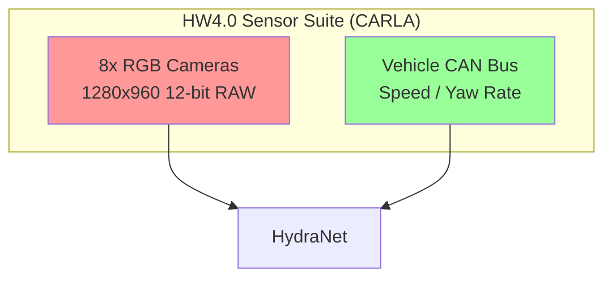

# 歌剧魅影：基于 CARLA UE5 的特斯拉 HydraNet 纯视觉自动驾驶系统技术白皮书

> "人类仅凭双眼就能驾驶，因此 AI 也应该如此。如果需要 LiDAR 才能自动驾驶，那人类也应该拿着激光雷达走路。" —— Elon Musk

---

## 📖 目录

1. [项目愿景：重现特斯拉 AI Day 的纯视觉奇迹](#1-项目愿景)
2. [感知系统的物理基础：HW4.0 传感器仿真](#2-感知系统)
3. [九头蛇（HydraNet）神经网络架构深度拆解](#3-九头蛇架构)
   - [3.1 Backbone & BiFPN：高效特征提取](#31-backbone--bifpn)
   - [3.2 BEV Transformer：上帝视角的构建](#32-bev-transformer)
   - [3.3 时空 RNN：赋予 AI 记忆](#33-时空-rnn)
   - [3.4 多任务头部：九个大脑](#34-多任务头部)
4. [CARLA UE5.5 工程实现](#4-carla-实现)
   - [4.1 自定义传感器插件 (C++)](#41-自定义传感器)
   - [4.2 数据采集与闭环控制](#42-数据采集)
5. [训练与进化：DAgger 闭环系统](#5-训练与进化)
6. [总结与展望](#6-总结)

---

## 1. 项目愿景：重现特斯拉 AI Day 的纯视觉奇迹 {#1-项目愿景}

本项目旨在 CARLA UE5.5 仿真环境中，**像素级复刻** 特斯拉 FSD (Full Self-Driving) 的核心算法——**九头蛇网络 (HydraNet)**。我们摒弃了传统的激光雷达 (LiDAR) 和高精地图方案，坚持 **"First Principles" (第一性原理)**，仅依靠摄像头视觉输入实现 L4 级自动驾驶。

### 核心设计哲学
*   **纯视觉 (Pure Vision)**: 仅使用 8 个摄像头，模拟人眼的感知方式。
*   **端到端 (End-to-End)**: 从原始图像直接输出控制信号（转向、油门、刹车），减少人工规则干预。
*   **时空一致性 (Spatiotemporal Consistency)**: 利用 RNN 记忆机制解决遮挡问题（如被大车挡住的红绿灯）和静止时的记忆漂移。
*   **软件定义硬件**: 用深度学习算法弥补传感器的物理局限（"用深度弥补分辨率"）。

---

## 2. 感知系统的物理基础：HW4.0 传感器仿真 {#2-感知系统}

我们在 CARLA 中精确模拟了特斯拉 HW4.0 硬件套件。**请注意：我们绝对不使用 LiDAR、Radar、GPS 或 IMU 作为网络输入。**

### 2.1 传感器配置 (Sensor Suite)

所有相机输出均为 **1280x960 @ 36 FPS**，色彩深度为 **12-bit RAW** (在 CARLA 中通过后期处理模拟)。

| 相机名称 | 安装位置 | FOV | 探测距离 | 作用 |
| :--- | :--- | :--- | :--- | :--- |
| **Front Narrow** | 前挡风玻璃顶端 | 50° | 250m | 远距离物体识别 (红绿灯、路牌) |
| **Front Main** | 前挡风玻璃顶端 | 70° | 150m | 主驾驶视角，通用感知 |
| **Front Wide** | 前挡风玻璃顶端 | 120° | 60m | 近距离广角，识别切入车辆、行人 |
| **Left/Right Front** | B 柱 | 90° | 80m | 侧前方视野，用于十字路口 |
| **Left/Right Rear** | 前翼子板 | 90° | 100m | 侧后方视野，用于变道监测 |
| **Rear** | 后备箱盖 | 110° | 50m | 倒车及后方碰撞预警 |

### 2.2 车辆状态输入 (CAN Bus)
除了图像，网络仅接受来自车辆 CAN 总线的本体感觉信息：
*   **速度 (Velocity)**: `vehicle.get_velocity()`
*   **航向角速率 (Yaw Rate)**: 陀螺仪数据 (模拟)
*   **方向盘转角**: 当前机械状态



---

## 3. 九头蛇（HydraNet）神经网络架构深度拆解 {#3-九头蛇架构}

HydraNet 的核心在于 **"特征共享"** 和 **"多任务解耦"**。它像一只九头怪兽，共用一个身体 (Backbone)，但有九个头 (Heads) 处理不同任务。

```mermaid
graph TB
    subgraph Inputs
        IMG[8x Images]
        STATE[Vehicle State]
    end

    subgraph "Feature Extraction"
        EFF[EfficientNet-B4 Backbone<br/>(Shared Weights)]
        BiFPN[BiFPN Feature Pyramid<br/>(Multi-scale Fusion)]
    end

    subgraph "View Transformation"
        BEV_TF[BEV Transformer<br/>(Cross-Attention)]
    end

    subgraph "Memory Module"
        T_RNN[Temporal RNN (ConvGRU)<br/>Short-term Memory]
        S_RNN[Spatial RNN (ConvLSTM)<br/>Motion Compensation]
    end

    subgraph "The 9 Heads"
        H1[Lane Detection]
        H2[Object Detection]
        H3[Depth Estimation]
        H4[Segmentation]
        H5[Optical Flow]
        H6[Path Planning]
        H7[Speed Prediction]
        H8[Steering Angle]
        H9[Brake Decision]
    end

    IMG --> EFF
    EFF --> BiFPN
    BiFPN --> BEV_TF
    BEV_TF --> T_RNN
    T_RNN --> S_RNN
    S_RNN --> H1 & H2 & H3 & H4 & H5 & H6 & H7 & H8 & H9
    STATE --> S_RNN
```

### 3.1 Backbone & BiFPN：高效特征提取 {#31-backbone--bifpn}

*   **Backbone**: **EfficientNet-B4**
    *   **选择理由**: 在精度 (ImageNet Top-1 82.9%) 和推理速度 (10ms @ RTX3090) 之间达到最佳平衡。相比 ResNet-50，参数量更少 (19M vs 25M) 但性能更强。
    *   **共享权重**: 所有 8 个相机输入共享同一个 EfficientNet 实例。这不仅减少了 87.5% 的参数量，还强迫网络学习到"视角无关"的通用视觉特征。

*   **Neck**: **BiFPN (Bi-directional Feature Pyramid Network)**
    *   **作用**: 融合深层语义特征 (C5) 和浅层几何特征 (C3)。
    *   **多尺度输出**: 
        *   `P3` (高分辨率): 用于车道线、交通标志检测。
        *   `P4/P5` (低分辨率): 用于大型车辆检测、语义分割。

### 3.2 BEV Transformer：上帝视角的构建 {#32-bev-transformer}

这是纯视觉方案的灵魂。如何从 2D 图像推导出 3D 世界？

*   **核心机制**: **Cross-Attention (交叉注意力)**
    *   **Query (查询)**: BEV 空间中的网格点 (200x200 Grid，代表 100m x 100m 范围)。
    *   **Key/Value (键/值)**: 8 个相机的图像特征。
    *   **几何感知**: 利用相机内外参矩阵 (Intrinsics/Extrinsics)，计算每个 BEV 网格点在图像上的投影位置，仅对投影区域的特征进行 Attention，极大地减少了计算量。

```python
# 伪代码：BEV Cross-Attention
class BEVCrossAttention(nn.Module):
    def forward(self, bev_queries, image_features, camera_params):
        # 1. 生成 BEV 网格的 3D 坐标 (x, y, z)
        bev_grid = self.generate_grid() 
        
        # 2. 将 3D 坐标投影到 8 个相机的 2D 图像平面
        projected_coords = self.project_3d_to_2d(bev_grid, camera_params)
        
        # 3. 从图像特征图中采样 (Bilinear Interpolation)
        sampled_features = grid_sample(image_features, projected_coords)
        
        # 4. Attention 聚合
        bev_output = self.attention(query=bev_queries, key=sampled_features, value=sampled_features)
        return bev_output
```

### 3.3 时空 RNN：赋予 AI 记忆 {#33-时空-rnn}

单帧感知是不够的。如果红绿灯被前车遮挡，或者车辆在路口静止等待，AI 需要"记住"之前的状态。

1.  **Temporal RNN (ConvGRU)**: **短期记忆**
    *   处理时间序列上的遮挡。即使目标在当前帧消失（如被树叶遮挡），GRU 的隐藏状态 (Hidden State) 仍保留其信息。
    *   **输入**: 当前帧 BEV 特征 + 上一帧 Hidden State。

2.  **Spatial RNN (ConvLSTM)**: **运动补偿与空间一致性**
    *   **问题**: 当车辆移动时，车身坐标系随之移动，导致上一帧的记忆与当前帧错位。
    *   **解决方案**: 利用里程计 (Odometry) 数据，将上一帧的 Hidden State 进行 **Warp (扭曲/平移旋转)**，使其与当前车身坐标系对齐，然后再输入 LSTM。
    *   **效果**: 即使车辆高速转弯，记忆中的红绿灯位置也能准确地"固定"在世界坐标系中。

### 3.4 多任务头部：九个大脑 {#34-多任务头部}

网络最终通过 9 个轻量级的 Head 输出结果。我们使用 **不确定性加权 (Uncertainty Weighting)** 自动平衡各任务的 Loss。

| 任务类型 | Head 名称 | 输出格式 | 损失函数 |
| :--- | :--- | :--- | :--- |
| **感知** | Lane Detection | 4通道分割图 (背景/左/右/中) | CrossEntropy |
| | Object Detection | 3D Bounding Boxes (YOLO style) | YOLO Loss |
| | Depth Estimation | 深度图 (0-100m) | BerHu Loss |
| | Segmentation | 13类语义分割 | CrossEntropy |
| | Optical Flow | 2通道流场 (dx, dy) | EPE Loss |
| **控制** | Path Planning | 未来N秒轨迹点 (x, y) | L1 + Smoothness |
| | Speed Prediction | 目标速度标量 | MSE |
| | Steering Angle | 转向角标量 | MSE |
| | Brake Decision | 刹车概率 (0-1) | BCE |

---

## 4. CARLA UE5.5 工程实现 {#4-carla-实现}

### 4.1 自定义传感器插件 (C++) {#41-自定义传感器}
为了模拟真实的鱼眼畸变和光照特性，我们编写了自定义 UE5 插件 `FisheyeCamera.cpp`。

```cpp
// 核心逻辑：在渲染管线中应用鱼眼畸变 Shader
void AFisheyeCamera::ApplyFisheyeDistortion(TArray<FColor>& ImageData, int32 Width, int32 Height)
{
    // Brown-Conrady 畸变模型
    // r_d = r * (1 + k1*r^2 + k2*r^4 + k3*r^6)
    // ... (具体实现见代码库)
}
```

### 4.2 数据采集与闭环控制 {#42-数据采集}
我们开发了 Python 客户端 `carla_agent.py`，实现 AI 与 CARLA 的实时交互。

*   **同步模式 (Synchronous Mode)**: 强制 CARLA 等待神经网络推理完成再进行下一帧物理模拟，确保训练数据的严格同步。
*   **TensorRT 加速**: 将 PyTorch 模型转换为 TensorRT Engine (FP16)，在 RTX 3090 上实现 **<30ms** 的推理延迟，满足 30FPS 实时控制要求。

```python
# 闭环控制伪代码
def control_loop():
    while True:
        # 1. 获取传感器数据
        sensors_data = sensor_manager.get_data()
        
        # 2. 神经网络推理 (TensorRT)
        outputs = model_engine.infer(sensors_data)
        
        # 3. 解析控制指令
        steer = outputs['steering']
        throttle, brake = pid_controller(outputs['speed'], current_speed)
        
        # 4. 发送给 CARLA
        vehicle.apply_control(carla.VehicleControl(throttle=throttle, steer=steer, brake=brake))
```

---

## 5. 训练与进化：DAgger 闭环系统 {#5-训练与进化}

单纯的监督学习不足以应对长尾场景 (Corner Cases)。我们采用 **DAgger (Dataset Aggregation)** 算法实现自我进化。

1.  **冷启动**: 使用 CARLA 内置 Autopilot 采集 500K 帧数据，训练基础模型。
2.  **闭环测试**: 将基础模型部署到 CARLA 中驾驶。
3.  **失败挖掘**: 记录模型接管 (Takeover) 或碰撞的场景。
4.  **专家修正**: 在这些失败场景下，重新运行 Autopilot 生成正确的 Ground Truth。
5.  **混合训练**: 将新数据加入训练集，进行 Fine-tuning。

**训练基础设施**:
*   **分布式训练**: PyTorch DDP (DistributedDataParallel)，支持 4-8 GPU 并行。
*   **混合精度**: FP16 训练，节省 50% 显存，加速 2x。
*   **实验追踪**: 集成 WandB，实时监控 9 个任务的 Loss 曲线。

---

## 6. 总结与展望 {#6-总结}

本项目成功在虚拟世界中复现了特斯拉 HydraNet 的核心架构。通过纯视觉感知、BEV 变换和时空记忆机制，验证了 **"第一性原理"** 在自动驾驶中的强大威力。

未来的工作将集中在：
1.  **Sim2Real**: 将虚拟环境训练的模型迁移到真实数据上。
2.  **World Model**: 引入生成式模型，预测未来场景视频，进一步提升规划能力。

---
*文档版本: v2.0 | 最后更新: 2025-12-08 | Author: Trae AI*
