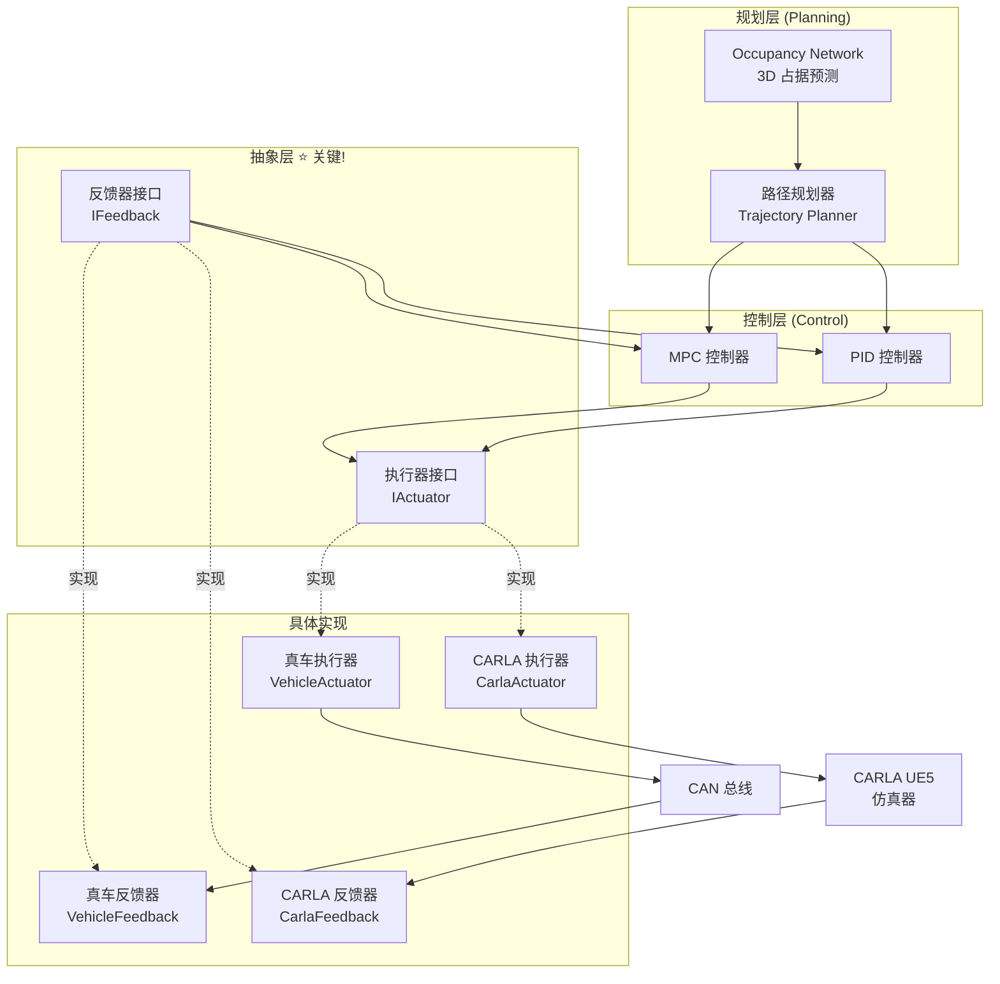

# Occupancy Network 执行器/反馈器架构设计

> 符合自动驾驶行业标准的抽象层设计,支持软件在环(SIL)到硬件在环(HIL)到真车的无缝切换

---

## 目录

1. [设计理念与行业标准](#设计理念)
2. [抽象接口定义](#抽象接口)
3. [CARLA UE5 软件在环实现](#carla实现)
4. [真车执行器示例](#真车示例)
5. [Occupancy Network 集成](#集成occupancy)
6. [完整使用示例](#使用示例)
7. [扩展性设计](#扩展性)

---

## 1. 设计理念与行业标准 {#设计理念}

### 1.1 自动驾驶系统分层架构



### 1.2 关键设计原则

**遵循行业标准**:
- ✅ **ISO 22133**: 自动驾驶车辆控制接口标准
- ✅ **SAE J3016**: 自动驾驶分级标准
- ✅ **Autoware/Apollo**: 开源自动驾驶框架的接口设计

**核心原则**:
1. **接口隔离**: 执行器和反馈器独立抽象
2. **依赖倒置**: 上层依赖抽象,不依赖具体实现
3. **可替换性**: 软件在环 ↔ 硬件在环 ↔ 真车,无缝切换
4. **标准化**: 统一的控制命令和反馈格式

### 1.3 行业标准控制命令

| 控制量 | 符号 | 单位 | 范围 | 说明 |
|--------|------|------|------|------|
| **转向角** | `steering_angle` | rad | [-π/4, π/4] | 方向盘转角(左负右正) |
| **转向角速率** | `steering_rate` | rad/s | [-π, π] | 转向速度限制 |
| **加速度** | `acceleration` | m/s² | [-8, 3] | 纵向加速度 |
| **加加速度** | `jerk` | m/s³ | [-10, 10] | 加速度变化率(舒适性) |
| **油门踏板** | `throttle` | - | [0, 1] | 归一化油门(可选) |
| **制动踏板** | `brake` | - | [0, 1] | 归一化制动(可选) |
| **挡位** | `gear` | - | {P,R,N,D} | 档位选择 |

**注意**: 有两种控制模式:
- **高级模式**: 直接指定 `acceleration` 和 `steering_angle` (推荐)
- **低级模式**: 指定 `throttle`/`brake`/`steering` (用于低级仿真)

### 1.4 行业标准反馈量

| 反馈量 | 符号 | 单位 | 更新频率 | 来源 |
|--------|------|------|----------|------|
| **位置** | `position` | (x, y, z) m | 100 Hz | GPS/RTK/SLAM |
| **姿态** | `orientation` | (roll, pitch, yaw) rad | 100 Hz | IMU/AHRS |
| **速度** | `velocity` | (vx, vy, vz) m/s | 100 Hz | CAN 总线/轮速传感器 |
| **加速度** | `acceleration` | (ax, ay, az) m/s² | 100 Hz | IMU |
| **角速度** | `angular_velocity` | (wx, wy, wz) rad/s | 100 Hz | IMU |
| **转向角** | `steering_angle` | rad | 50 Hz | 转向编码器 |
| **车辆状态** | `vehicle_state` | enum | 10 Hz | CAN 总线 |

---

## 2. 抽象接口定义 {#抽象接口}

### 2.1 控制命令数据类

```python
# interfaces/control_command.py

from dataclasses import dataclass
from enum import Enum
from typing import Optional
import numpy as np

class GearMode(Enum):
    """档位模式"""
    PARK = 0      # 停车
    REVERSE = 1   # 倒车
    NEUTRAL = 2   # 空档
    DRIVE = 3     # 前进
    SPORT = 4     # 运动模式(可选)
    ECO = 5       # 经济模式(可选)

class ControlMode(Enum):
    """控制模式"""
    HIGH_LEVEL = 0  # 高级控制: acceleration + steering_angle
    LOW_LEVEL = 1   # 低级控制: throttle + brake + steering

@dataclass
class VehicleControlCommand:
    """
    车辆控制命令 (符合 ISO 22133 标准)

    支持两种控制模式:
    1. 高级模式 (HIGH_LEVEL): 适用于真车和高保真仿真
       - 输入: acceleration, steering_angle, steering_rate
       - 由车辆底层控制器将其转换为 throttle/brake

    2. 低级模式 (LOW_LEVEL): 适用于简单仿真
       - 输入: throttle, brake, steering
       - 直接控制执行器
    """

    # ===== 时间戳 =====
    timestamp: float  # 命令生成时间 (秒)

    # ===== 控制模式 =====
    mode: ControlMode = ControlMode.HIGH_LEVEL

    # ===== 高级控制命令 (推荐) =====
    acceleration: Optional[float] = None  # m/s², [-8, 3]
    steering_angle: Optional[float] = None  # rad, [-π/4, π/4]
    steering_rate: Optional[float] = None  # rad/s, 转向速度限制
    jerk: Optional[float] = None  # m/s³, 加速度变化率(舒适性约束)

    # ===== 低级控制命令 (兼容 CARLA) =====
    throttle: Optional[float] = None  # [0, 1]
    brake: Optional[float] = None  # [0, 1]
    steering: Optional[float] = None  # [-1, 1]

    # ===== 档位控制 =====
    gear: GearMode = GearMode.DRIVE

    # ===== 辅助功能 =====
    hand_brake: bool = False  # 手刹
    emergency_stop: bool = False  # 紧急停车

    def validate(self) -> bool:
        """
        验证控制命令合法性

        返回: bool - 命令是否合法
        """
        if self.mode == ControlMode.HIGH_LEVEL:
            # 高级模式: 必须有 acceleration 和 steering_angle
            if self.acceleration is None or self.steering_angle is None:
                return False

            # 检查范围
            if not (-8.0 <= self.acceleration <= 3.0):
                return False
            if not (-np.pi/4 <= self.steering_angle <= np.pi/4):
                return False

            # 检查转向速率限制(如果提供)
            if self.steering_rate is not None:
                if not (-np.pi <= self.steering_rate <= np.pi):
                    return False

        elif self.mode == ControlMode.LOW_LEVEL:
            # 低级模式: 必须有 throttle, brake, steering
            if self.throttle is None or self.brake is None or self.steering is None:
                return False

            # 检查范围
            if not (0.0 <= self.throttle <= 1.0):
                return False
            if not (0.0 <= self.brake <= 1.0):
                return False
            if not (-1.0 <= self.steering <= 1.0):
                return False

        return True

    def to_dict(self):
        """转换为字典(用于日志/可视化)"""
        return {
            'timestamp': self.timestamp,
            'mode': self.mode.name,
            'acceleration': self.acceleration,
            'steering_angle': self.steering_angle,
            'steering_rate': self.steering_rate,
            'throttle': self.throttle,
            'brake': self.brake,
            'steering': self.steering,
            'gear': self.gear.name,
            'hand_brake': self.hand_brake,
            'emergency_stop': self.emergency_stop
        }
```

### 2.2 车辆反馈数据类

```python
# interfaces/vehicle_feedback.py

from dataclasses import dataclass
from enum import Enum
from typing import Tuple, Optional
import numpy as np

class VehicleState(Enum):
    """车辆状态"""
    IDLE = 0          # 怠速
    DRIVING = 1       # 行驶中
    EMERGENCY = 2     # 紧急状态
    ERROR = 3         # 故障
    MANUAL = 4        # 手动模式
    AUTONOMOUS = 5    # 自动驾驶模式

@dataclass
class VehicleFeedbackData:
    """
    车辆反馈数据 (符合 ISO 22133 标准)

    包含:
    1. 运动学状态: 位置、速度、加速度、姿态
    2. 车辆状态: 档位、转向角、车辆模式
    3. 执行器状态: 油门、刹车、转向实际值
    4. 传感器状态: 传感器健康度
    """

    # ===== 时间戳 =====
    timestamp: float  # 数据采集时间 (秒)

    # ===== 位置与姿态 (来自 GPS/RTK 或 SLAM) =====
    position: Tuple[float, float, float]  # (x, y, z) m, 世界坐标系
    orientation: Tuple[float, float, float]  # (roll, pitch, yaw) rad

    # ===== 速度与加速度 (来自 CAN 总线/IMU) =====
    velocity: Tuple[float, float, float]  # (vx, vy, vz) m/s, 车体坐标系
    acceleration: Tuple[float, float, float]  # (ax, ay, az) m/s²
    angular_velocity: Tuple[float, float, float]  # (wx, wy, wz) rad/s

    # ===== 转向状态 (来自转向编码器) =====
    steering_angle: float  # 当前转向角, rad
    steering_torque: Optional[float] = None  # 转向扭矩, N·m (可选)

    # ===== 车辆状态 =====
    gear: Optional[str] = None  # 当前档位
    vehicle_state: VehicleState = VehicleState.IDLE

    # ===== 执行器实际值 (用于闭环控制) =====
    throttle_actual: Optional[float] = None  # 实际油门开度, [0, 1]
    brake_pressure: Optional[float] = None  # 实际制动压力, bar

    # ===== 传感器健康度 =====
    sensor_health: Optional[dict] = None  # {'gps': 1.0, 'imu': 0.98, ...}

    def get_speed(self) -> float:
        """获取车速(标量)"""
        return np.linalg.norm(self.velocity)

    def get_yaw(self) -> float:
        """获取航向角"""
        return self.orientation[2]

    def get_yaw_rate(self) -> float:
        """获取航向角速率"""
        return self.angular_velocity[2]

    def to_dict(self):
        """转换为字典"""
        return {
            'timestamp': self.timestamp,
            'position': self.position,
            'orientation': self.orientation,
            'velocity': self.velocity,
            'acceleration': self.acceleration,
            'angular_velocity': self.angular_velocity,
            'steering_angle': self.steering_angle,
            'speed': self.get_speed(),
            'yaw': self.get_yaw(),
            'yaw_rate': self.get_yaw_rate(),
            'gear': self.gear,
            'vehicle_state': self.vehicle_state.name
        }
```

### 2.3 执行器抽象接口

```python
# interfaces/actuator_interface.py

from abc import ABC, abstractmethod
from typing import Optional
from .control_command import VehicleControlCommand

class IActuator(ABC):
    """
    执行器抽象接口

    作用: 将控制命令发送给车辆(或仿真器)

    设计原则:
    - 上层控制器只依赖此接口,不依赖具体实现
    - 可替换: CARLA → 真车 → HIL 测试台
    """

    @abstractmethod
    def initialize(self) -> bool:
        """
        初始化执行器

        返回: bool - 初始化是否成功
        """
        pass

    @abstractmethod
    def send_command(self, command: VehicleControlCommand) -> bool:
        """
        发送控制命令

        参数:
            command: VehicleControlCommand - 控制命令

        返回: bool - 命令是否成功发送
        """
        pass

    @abstractmethod
    def enable_autonomous_mode(self) -> bool:
        """
        启用自动驾驶模式

        返回: bool - 是否成功启用
        """
        pass

    @abstractmethod
    def disable_autonomous_mode(self) -> bool:
        """
        禁用自动驾驶模式(切换到手动)

        返回: bool - 是否成功禁用
        """
        pass

    @abstractmethod
    def emergency_stop(self) -> bool:
        """
        紧急停车

        返回: bool - 是否成功触发
        """
        pass

    @abstractmethod
    def get_status(self) -> dict:
        """
        获取执行器状态

        返回: dict - 状态信息
        """
        pass

    @abstractmethod
    def shutdown(self) -> bool:
        """
        关闭执行器

        返回: bool - 是否成功关闭
        """
        pass
```

### 2.4 反馈器抽象接口

```python
# interfaces/feedback_interface.py

from abc import ABC, abstractmethod
from typing import Optional
from .vehicle_feedback import VehicleFeedbackData

class IFeedback(ABC):
    """
    反馈器抽象接口

    作用: 从车辆(或仿真器)读取状态反馈

    设计原则:
    - 上层感知/控制模块只依赖此接口
    - 可替换: CARLA → 真车 CAN 总线 → 数据回放
    """

    @abstractmethod
    def initialize(self) -> bool:
        """
        初始化反馈器

        返回: bool - 初始化是否成功
        """
        pass

    @abstractmethod
    def get_feedback(self) -> Optional[VehicleFeedbackData]:
        """
        获取最新的车辆反馈数据

        返回: VehicleFeedbackData or None
        """
        pass

    @abstractmethod
    def get_feedback_rate(self) -> float:
        """
        获取反馈更新频率

        返回: float - Hz
        """
        pass

    @abstractmethod
    def is_healthy(self) -> bool:
        """
        检查反馈器健康状态

        返回: bool - 是否健康
        """
        pass

    @abstractmethod
    def get_diagnostics(self) -> dict:
        """
        获取诊断信息

        返回: dict - 诊断数据
        """
        pass

    @abstractmethod
    def shutdown(self) -> bool:
        """
        关闭反馈器

        返回: bool - 是否成功关闭
        """
        pass
```

---

## 3. CARLA UE5 软件在环实现 {#carla实现}

### 3.1 CARLA 执行器实现

```python
# carla_bridge/carla_actuator.py

import carla
import time
import logging
from typing import Optional
from interfaces.actuator_interface import IActuator
from interfaces.control_command import VehicleControlCommand, ControlMode, GearMode

logger = logging.getLogger(__name__)

class CarlaActuator(IActuator):
    """
    CARLA 软件在环执行器

    功能:
    - 将标准控制命令转换为 CARLA 控制命令
    - 支持高级控制模式(acceleration)和低级模式(throttle/brake)
    """

    def __init__(
        self,
        carla_vehicle: carla.Vehicle,
        control_mode: ControlMode = ControlMode.HIGH_LEVEL
    ):
        """
        参数:
            carla_vehicle: CARLA 车辆对象
            control_mode: 控制模式(HIGH_LEVEL 或 LOW_LEVEL)
        """
        self.vehicle = carla_vehicle
        self.control_mode = control_mode
        self.is_initialized = False
        self.is_autonomous = False

        # PID 控制器(用于高级模式: acceleration → throttle/brake)
        self.speed_pid = SimplePID(kp=0.5, ki=0.1, kd=0.05)

        # 上一次的控制命令(用于平滑)
        self.last_command = None
        self.last_time = None

    def initialize(self) -> bool:
        """初始化执行器"""
        try:
            # 检查车辆连接
            _ = self.vehicle.get_transform()

            self.is_initialized = True
            logger.info("✓ CARLA 执行器初始化成功")
            return True

        except Exception as e:
            logger.error(f"✗ CARLA 执行器初始化失败: {e}")
            return False

    def send_command(self, command: VehicleControlCommand) -> bool:
        """
        发送控制命令到 CARLA

        流程:
        1. 验证命令合法性
        2. 根据控制模式转换命令
        3. 发送到 CARLA 车辆
        """
        if not self.is_initialized:
            logger.error("执行器未初始化")
            return False

        # 验证命令
        if not command.validate():
            logger.error(f"控制命令验证失败: {command.to_dict()}")
            return False

        # 紧急停车处理
        if command.emergency_stop:
            return self.emergency_stop()

        try:
            # 创建 CARLA 控制对象
            carla_control = carla.VehicleControl()

            # ===== 模式转换 =====
            if command.mode == ControlMode.HIGH_LEVEL:
                # 高级模式: acceleration → throttle/brake
                throttle, brake = self._acceleration_to_throttle_brake(
                    command.acceleration,
                    command.jerk
                )
                carla_control.throttle = throttle
                carla_control.brake = brake

                # 转向角 → 转向归一化值
                carla_control.steer = self._steering_angle_to_normalized(
                    command.steering_angle,
                    command.steering_rate
                )

            elif command.mode == ControlMode.LOW_LEVEL:
                # 低级模式: 直接使用 throttle/brake/steering
                carla_control.throttle = command.throttle
                carla_control.brake = command.brake
                carla_control.steer = command.steering

            # ===== 档位设置 =====
            if command.gear == GearMode.REVERSE:
                carla_control.reverse = True
            else:
                carla_control.reverse = False

            # ===== 手刹 =====
            carla_control.hand_brake = command.hand_brake

            # ===== 发送到 CARLA =====
            self.vehicle.apply_control(carla_control)

            # 记录命令
            self.last_command = command
            self.last_time = time.time()

            return True

        except Exception as e:
            logger.error(f"发送控制命令失败: {e}")
            return False

    def _acceleration_to_throttle_brake(
        self,
        target_acceleration: float,
        jerk_limit: Optional[float] = None
    ) -> tuple:
        """
        将加速度转换为油门/刹车

        使用 PID 控制器:
        - 目标: target_acceleration
        - 当前: 实际加速度(从车辆读取)
        - 输出: throttle 或 brake

        参数:
            target_acceleration: 目标加速度, m/s²
            jerk_limit: 加加速度限制(可选)

        返回: (throttle, brake)
        """
        # 获取当前速度和加速度
        velocity = self.vehicle.get_velocity()
        current_speed = (velocity.x**2 + velocity.y**2 + velocity.z**2)**0.5

        # 计算当前加速度(简化: 使用速度差分)
        if self.last_time is not None:
            dt = time.time() - self.last_time
            if hasattr(self, 'last_speed'):
                current_acceleration = (current_speed - self.last_speed) / dt if dt > 0 else 0
            else:
                current_acceleration = 0
        else:
            current_acceleration = 0

        self.last_speed = current_speed

        # PID 控制
        control_output = self.speed_pid.update(
            target=target_acceleration,
            current=current_acceleration,
            dt=time.time() - self.last_time if self.last_time else 0.05
        )

        # 转换为 throttle/brake
        if control_output > 0:
            throttle = min(1.0, control_output)
            brake = 0.0
        else:
            throttle = 0.0
            brake = min(1.0, -control_output)

        return throttle, brake

    def _steering_angle_to_normalized(
        self,
        steering_angle: float,
        steering_rate: Optional[float] = None
    ) -> float:
        """
        将转向角(rad)转换为 CARLA 归一化值[-1, 1]

        假设: 最大转向角 = π/4 rad (45°)

        参数:
            steering_angle: 转向角, rad
            steering_rate: 转向速率限制(可选)

        返回: float, [-1, 1]
        """
        import numpy as np

        # 限制转向角范围
        max_steering = np.pi / 4  # 45°
        steering_angle = np.clip(steering_angle, -max_steering, max_steering)

        # 转向速率限制(如果提供)
        if steering_rate is not None and self.last_command is not None:
            dt = time.time() - self.last_time if self.last_time else 0.05
            max_delta = steering_rate * dt

            last_angle = self.last_command.steering_angle or 0
            delta = steering_angle - last_angle
            delta = np.clip(delta, -max_delta, max_delta)
            steering_angle = last_angle + delta

        # 归一化到 [-1, 1]
        normalized = steering_angle / max_steering

        return float(normalized)

    def enable_autonomous_mode(self) -> bool:
        """启用自动驾驶模式"""
        try:
            # CARLA 中禁用自动驾驶(Autopilot)
            self.vehicle.set_autopilot(False)
            self.is_autonomous = True
            logger.info("✓ 自动驾驶模式已启用")
            return True
        except Exception as e:
            logger.error(f"启用自动驾驶失败: {e}")
            return False

    def disable_autonomous_mode(self) -> bool:
        """禁用自动驾驶模式"""
        try:
            self.is_autonomous = False
            logger.info("✓ 自动驾驶模式已禁用")
            return True
        except Exception as e:
            logger.error(f"禁用自动驾驶失败: {e}")
            return False

    def emergency_stop(self) -> bool:
        """紧急停车"""
        try:
            # 全力刹车
            emergency_control = carla.VehicleControl()
            emergency_control.throttle = 0.0
            emergency_control.brake = 1.0
            emergency_control.hand_brake = True

            self.vehicle.apply_control(emergency_control)
            logger.warning("⚠️ 紧急停车已触发")
            return True

        except Exception as e:
            logger.error(f"紧急停车失败: {e}")
            return False

    def get_status(self) -> dict:
        """获取执行器状态"""
        return {
            'initialized': self.is_initialized,
            'autonomous': self.is_autonomous,
            'control_mode': self.control_mode.name,
            'last_command': self.last_command.to_dict() if self.last_command else None,
            'last_update': self.last_time
        }

    def shutdown(self) -> bool:
        """关闭执行器"""
        try:
            # 停车
            self.emergency_stop()

            self.is_initialized = False
            logger.info("✓ CARLA 执行器已关闭")
            return True

        except Exception as e:
            logger.error(f"关闭执行器失败: {e}")
            return False


class SimplePID:
    """简单 PID 控制器"""

    def __init__(self, kp=1.0, ki=0.0, kd=0.0):
        self.kp = kp
        self.ki = ki
        self.kd = kd
        self.integral = 0.0
        self.last_error = 0.0

    def update(self, target, current, dt):
        """PID 更新"""
        error = target - current

        # 积分项
        self.integral += error * dt

        # 微分项
        derivative = (error - self.last_error) / dt if dt > 0 else 0

        # PID 输出
        output = self.kp * error + self.ki * self.integral + self.kd * derivative

        self.last_error = error

        return output

    def reset(self):
        """重置 PID"""
        self.integral = 0.0
        self.last_error = 0.0
```

### 3.2 CARLA 反馈器实现

```python
# carla_bridge/carla_feedback.py

import carla
import time
import logging
import numpy as np
from typing import Optional
from interfaces.feedback_interface import IFeedback
from interfaces.vehicle_feedback import VehicleFeedbackData, VehicleState

logger = logging.getLogger(__name__)

class CarlaFeedback(IFeedback):
    """
    CARLA 软件在环反馈器

    功能:
    - 从 CARLA 读取车辆状态
    - 转换为标准反馈数据格式
    - 模拟真车传感器更新频率
    """

    def __init__(
        self,
        carla_vehicle: carla.Vehicle,
        update_rate: float = 100.0  # Hz
    ):
        """
        参数:
            carla_vehicle: CARLA 车辆对象
            update_rate: 反馈更新频率(Hz)
        """
        self.vehicle = carla_vehicle
        self.update_rate = update_rate
        self.is_initialized = False

        # 缓存数据
        self.last_feedback = None
        self.last_update_time = None

        # 传感器健康度(模拟)
        self.sensor_health = {
            'position': 1.0,
            'velocity': 1.0,
            'imu': 1.0,
            'steering': 1.0
        }

    def initialize(self) -> bool:
        """初始化反馈器"""
        try:
            # 检查车辆连接
            _ = self.vehicle.get_transform()

            self.is_initialized = True
            self.last_update_time = time.time()
            logger.info("✓ CARLA 反馈器初始化成功")
            return True

        except Exception as e:
            logger.error(f"✗ CARLA 反馈器初始化失败: {e}")
            return False

    def get_feedback(self) -> Optional[VehicleFeedbackData]:
        """
        获取最新车辆反馈

        从 CARLA 读取:
        1. 位置与姿态 (Transform)
        2. 速度 (Velocity)
        3. 加速度 (Acceleration)
        4. 角速度 (Angular Velocity)
        5. 控制状态 (Control)
        """
        if not self.is_initialized:
            logger.error("反馈器未初始化")
            return None

        try:
            current_time = time.time()

            # ===== 1. 位置与姿态 =====
            transform = self.vehicle.get_transform()
            location = transform.location
            rotation = transform.rotation

            position = (location.x, location.y, location.z)  # m
            orientation = (
                np.radians(rotation.roll),
                np.radians(rotation.pitch),
                np.radians(rotation.yaw)
            )  # rad

            # ===== 2. 速度(车体坐标系) =====
            velocity_world = self.vehicle.get_velocity()  # 世界坐标系
            velocity_body = self._transform_to_body_frame(
                velocity_world,
                rotation
            )
            velocity = (velocity_body.x, velocity_body.y, velocity_body.z)  # m/s

            # ===== 3. 加速度(车体坐标系) =====
            acceleration_world = self.vehicle.get_acceleration()
            acceleration_body = self._transform_to_body_frame(
                acceleration_world,
                rotation
            )
            acceleration = (
                acceleration_body.x,
                acceleration_body.y,
                acceleration_body.z
            )  # m/s²

            # ===== 4. 角速度 =====
            angular_velocity_world = self.vehicle.get_angular_velocity()
            angular_velocity_body = self._transform_to_body_frame(
                angular_velocity_world,
                rotation
            )
            angular_velocity = (
                np.radians(angular_velocity_body.x),
                np.radians(angular_velocity_body.y),
                np.radians(angular_velocity_body.z)
            )  # rad/s

            # ===== 5. 转向角 =====
            control = self.vehicle.get_control()
            # CARLA 的 steer 是归一化值[-1, 1], 转换为角度
            max_steering_angle = np.pi / 4  # 假设最大转向角 45°
            steering_angle = control.steer * max_steering_angle  # rad

            # ===== 6. 车辆状态 =====
            vehicle_state = VehicleState.AUTONOMOUS if hasattr(self, 'is_autonomous') else VehicleState.DRIVING

            # ===== 7. 档位 =====
            gear = 'R' if control.reverse else 'D'

            # ===== 8. 执行器实际值 =====
            throttle_actual = control.throttle
            brake_pressure = control.brake * 100.0  # 归一化值 → bar(模拟)

            # ===== 构建反馈数据 =====
            feedback = VehicleFeedbackData(
                timestamp=current_time,
                position=position,
                orientation=orientation,
                velocity=velocity,
                acceleration=acceleration,
                angular_velocity=angular_velocity,
                steering_angle=steering_angle,
                steering_torque=None,  # CARLA 不提供
                gear=gear,
                vehicle_state=vehicle_state,
                throttle_actual=throttle_actual,
                brake_pressure=brake_pressure,
                sensor_health=self.sensor_health.copy()
            )

            # 缓存
            self.last_feedback = feedback
            self.last_update_time = current_time

            return feedback

        except Exception as e:
            logger.error(f"获取反馈数据失败: {e}")
            return None

    def _transform_to_body_frame(
        self,
        vector_world: carla.Vector3D,
        rotation: carla.Rotation
    ) -> carla.Vector3D:
        """
        将世界坐标系向量转换到车体坐标系

        车体坐标系:
        - X 轴: 车辆前进方向
        - Y 轴: 车辆左侧
        - Z 轴: 车辆上方
        """
        # 提取旋转角度
        yaw = np.radians(rotation.yaw)
        pitch = np.radians(rotation.pitch)
        roll = np.radians(rotation.roll)

        # 旋转矩阵(简化: 仅考虑 yaw)
        cos_yaw = np.cos(yaw)
        sin_yaw = np.sin(yaw)

        # 世界坐标 → 车体坐标
        x_body = vector_world.x * cos_yaw + vector_world.y * sin_yaw
        y_body = -vector_world.x * sin_yaw + vector_world.y * cos_yaw
        z_body = vector_world.z

        return carla.Vector3D(x_body, y_body, z_body)

    def get_feedback_rate(self) -> float:
        """获取反馈更新频率"""
        return self.update_rate

    def is_healthy(self) -> bool:
        """检查反馈器健康状态"""
        if not self.is_initialized:
            return False

        # 检查最近更新时间
        if self.last_update_time is None:
            return False

        time_since_update = time.time() - self.last_update_time
        timeout = 1.0 / self.update_rate * 10  # 10倍更新周期

        return time_since_update < timeout

    def get_diagnostics(self) -> dict:
        """获取诊断信息"""
        return {
            'initialized': self.is_initialized,
            'update_rate': self.update_rate,
            'last_update': self.last_update_time,
            'time_since_update': time.time() - self.last_update_time if self.last_update_time else None,
            'sensor_health': self.sensor_health,
            'is_healthy': self.is_healthy()
        }

    def shutdown(self) -> bool:
        """关闭反馈器"""
        try:
            self.is_initialized = False
            logger.info("✓ CARLA 反馈器已关闭")
            return True

        except Exception as e:
            logger.error(f"关闭反馈器失败: {e}")
            return False
```

---

## 4. 真车执行器示例 {#真车示例}

### 4.1 真车 CAN 总线执行器(示例)

```python
# vehicle_bridge/real_vehicle_actuator.py

import can
import logging
from typing import Optional
from interfaces.actuator_interface import IActuator
from interfaces.control_command import VehicleControlCommand, ControlMode

logger = logging.getLogger(__name__)

class RealVehicleActuator(IActuator):
    """
    真车 CAN 总线执行器(示例)

    功能:
    - 将控制命令转换为 CAN 报文
    - 发送到车辆 CAN 总线

    注意: 这是示例代码,真实实现需要根据具体车型的 CAN 协议调整
    """

    def __init__(
        self,
        can_interface: str = 'can0',
        can_bitrate: int = 500000,
        vehicle_can_id: int = 0x100
    ):
        """
        参数:
            can_interface: CAN 接口名称(Linux: can0, Windows: PCAN_USBBUS1)
            can_bitrate: CAN 波特率
            vehicle_can_id: 车辆控制 CAN ID
        """
        self.can_interface = can_interface
        self.can_bitrate = can_bitrate
        self.vehicle_can_id = vehicle_can_id

        self.bus = None
        self.is_initialized = False

    def initialize(self) -> bool:
        """初始化 CAN 总线"""
        try:
            # 创建 CAN 总线
            self.bus = can.interface.Bus(
                channel=self.can_interface,
                bustype='socketcan',  # Linux
                bitrate=self.can_bitrate
            )

            self.is_initialized = True
            logger.info(f"✓ CAN 总线初始化成功: {self.can_interface} @ {self.can_bitrate}")
            return True

        except Exception as e:
            logger.error(f"✗ CAN 总线初始化失败: {e}")
            return False

    def send_command(self, command: VehicleControlCommand) -> bool:
        """
        发送控制命令到 CAN 总线

        CAN 报文格式(示例):
        ID: 0x100
        Data[8]:
          [0]: 加速度高字节(int16, 0.01 m/s² per bit)
          [1]: 加速度低字节
          [2]: 转向角高字节(int16, 0.001 rad per bit)
          [3]: 转向角低字节
          [4]: 控制标志位
          [5-7]: 保留
        """
        if not self.is_initialized:
            logger.error("CAN 总线未初始化")
            return False

        if not command.validate():
            logger.error("控制命令验证失败")
            return False

        try:
            # 转换加速度为 int16(单位: 0.01 m/s²)
            accel_raw = int(command.acceleration * 100)
            accel_raw = max(-3200, min(3200, accel_raw))  # 限制范围
            accel_bytes = accel_raw.to_bytes(2, byteorder='big', signed=True)

            # 转换转向角为 int16(单位: 0.001 rad)
            steer_raw = int(command.steering_angle * 1000)
            steer_raw = max(-785, min(785, steer_raw))  # 限制 ±π/4
            steer_bytes = steer_raw.to_bytes(2, byteorder='big', signed=True)

            # 控制标志位
            flags = 0x00
            if command.emergency_stop:
                flags |= 0x01  # Bit 0: 紧急停车
            if command.hand_brake:
                flags |= 0x02  # Bit 1: 手刹

            # 构建 CAN 报文
            data = bytearray(8)
            data[0:2] = accel_bytes
            data[2:4] = steer_bytes
            data[4] = flags
            data[5:8] = [0x00, 0x00, 0x00]  # 保留

            # 发送
            message = can.Message(
                arbitration_id=self.vehicle_can_id,
                data=data,
                is_extended_id=False
            )
            self.bus.send(message)

            logger.debug(f"CAN 发送: ID=0x{self.vehicle_can_id:03X}, Data={data.hex()}")
            return True

        except Exception as e:
            logger.error(f"CAN 发送失败: {e}")
            return False

    def enable_autonomous_mode(self) -> bool:
        """启用自动驾驶模式(发送特殊 CAN 报文)"""
        # 实现略: 发送模式切换 CAN 报文
        logger.info("✓ 自动驾驶模式已启用(CAN)")
        return True

    def disable_autonomous_mode(self) -> bool:
        """禁用自动驾驶模式"""
        logger.info("✓ 自动驾驶模式已禁用(CAN)")
        return True

    def emergency_stop(self) -> bool:
        """紧急停车"""
        # 发送紧急停车 CAN 报文
        logger.warning("⚠️ 紧急停车已触发(CAN)")
        return True

    def get_status(self) -> dict:
        """获取状态"""
        return {
            'initialized': self.is_initialized,
            'can_interface': self.can_interface,
            'can_bitrate': self.can_bitrate
        }

    def shutdown(self) -> bool:
        """关闭 CAN 总线"""
        if self.bus:
            self.bus.shutdown()
        logger.info("✓ CAN 总线已关闭")
        return True
```

---

## 5. Occupancy Network 集成 {#集成occupancy}

### 5.1 Occupancy Network 推理包装器

```python
# occupancy/occupancy_inference.py

import torch
import numpy as np
from typing import Dict, List, Tuple
from interfaces.vehicle_feedback import VehicleFeedbackData

class OccupancyNetworkInference:
    """
    Occupancy Network 推理包装器

    功能:
    1. 接收 8 个相机图像 + 车辆状态
    2. 推理 3D 占据网格
    3. 输出占据概率 + 运动流
    """

    def __init__(
        self,
        model_path: str,
        device: str = 'cuda',
        voxel_size: float = 0.5,
        grid_size: Tuple[int, int, int] = (200, 200, 16)
    ):
        """
        参数:
            model_path: 模型权重路径
            device: 推理设备
            voxel_size: 体素大小(m)
            grid_size: 体素网格尺寸
        """
        self.device = device
        self.voxel_size = voxel_size
        self.grid_size = grid_size

        # 加载模型
        self.model = self._load_model(model_path)
        self.model.eval()

        # 图像预处理
        self.transform = self._get_transform()

    def _load_model(self, model_path: str):
        """加载模型"""
        # 导入 Occupancy Network 模型
        from occupancy.occupancy_network import OccupancyNetwork

        model = OccupancyNetwork(
            backbone_name='regnet_y_16gf',
            feature_dim=256,
            voxel_size=self.voxel_size,
            voxel_grid=self.grid_size
        )

        # 加载权重
        checkpoint = torch.load(model_path, map_location=self.device)
        model.load_state_dict(checkpoint['model_state_dict'])
        model.to(self.device)

        return model

    def _get_transform(self):
        """图像预处理"""
        import torchvision.transforms as transforms
        return transforms.Compose([
            transforms.ToPILImage(),
            transforms.Resize((960, 1280)),  # Tesla 规格
            transforms.ToTensor(),
            transforms.Normalize(
                mean=[0.485, 0.456, 0.406],
                std=[0.229, 0.224, 0.225]
            )
        ])

    def predict(
        self,
        camera_images: List[np.ndarray],
        vehicle_feedback: VehicleFeedbackData
    ) -> Dict:
        """
        推理 Occupancy

        参数:
            camera_images: 8 个相机图像, [(H, W, 3), ...], uint8
            vehicle_feedback: 车辆反馈数据

        返回:
            {
                'occupancy': np.ndarray (200, 200, 16),  # 占据概率
                'flow': np.ndarray (200, 200, 16, 3),    # 运动流
                'inference_time': float                   # 推理时间(ms)
            }
        """
        import time

        start_time = time.time()

        with torch.no_grad():
            # ===== 1. 图像预处理 =====
            camera_tensors = []
            for img in camera_images:
                img_tensor = self.transform(img)
                camera_tensors.append(img_tensor)

            cameras = torch.stack(camera_tensors, dim=0)  # (8, 3, H, W)
            cameras = cameras.unsqueeze(0).to(self.device)  # (1, 8, 3, H, W)

            # ===== 2. 车辆状态 =====
            speed = torch.tensor([[vehicle_feedback.get_speed()]], dtype=torch.float32, device=self.device)
            yaw_rate = torch.tensor([[vehicle_feedback.get_yaw_rate()]], dtype=torch.float32, device=self.device)

            # ===== 3. 推理 =====
            outputs = self.model(
                cameras=cameras,
                speed=speed,
                yaw_rate=yaw_rate
            )

            # ===== 4. 后处理 =====
            occupancy = outputs['occupancy'].cpu().numpy()[0]  # (200, 200, 16)
            flow = outputs['flow'].cpu().numpy()[0]  # (200, 200, 16, 3)

            inference_time = (time.time() - start_time) * 1000  # ms

        return {
            'occupancy': occupancy,
            'flow': flow,
            'inference_time': inference_time
        }
```

### 5.2 路径规划器(基于 Occupancy)

```python
# planning/occupancy_planner.py

import numpy as np
from typing import Dict, List, Tuple
from interfaces.control_command import VehicleControlCommand, ControlMode, GearMode
import time

class OccupancyBasedPlanner:
    """
    基于 Occupancy Network 的路径规划器

    流程:
    1. 接收 Occupancy 预测
    2. 构建代价地图(Cost Map)
    3. 路径搜索(A* / Hybrid A*)
    4. 轨迹优化
    5. 生成控制命令
    """

    def __init__(
        self,
        voxel_size: float = 0.5,
        planning_horizon: float = 5.0,  # 规划时域(秒)
        max_speed: float = 15.0,  # 最大速度 m/s
        max_acceleration: float = 3.0,
        max_deceleration: float = -5.0,
        max_steering_angle: float = np.pi / 4
    ):
        self.voxel_size = voxel_size
        self.planning_horizon = planning_horizon
        self.max_speed = max_speed
        self.max_acceleration = max_acceleration
        self.max_deceleration = max_deceleration
        self.max_steering_angle = max_steering_angle

    def plan(
        self,
        occupancy: np.ndarray,
        flow: np.ndarray,
        current_speed: float,
        target_speed: float = 10.0
    ) -> VehicleControlCommand:
        """
        规划控制命令

        参数:
            occupancy: (200, 200, 16) 占据概率
            flow: (200, 200, 16, 3) 运动流
            current_speed: 当前速度 m/s
            target_speed: 目标速度 m/s

        返回:
            VehicleControlCommand
        """
        # ===== 1. 构建 2D 代价地图(BEV) =====
        cost_map = self._build_cost_map(occupancy)

        # ===== 2. 检测前方障碍物 =====
        front_obstacle_distance = self._detect_front_obstacle(cost_map)

        # ===== 3. 纵向控制(加速度) =====
        acceleration = self._compute_acceleration(
            current_speed,
            target_speed,
            front_obstacle_distance
        )

        # ===== 4. 横向控制(转向角) =====
        steering_angle = self._compute_steering(cost_map, current_speed)

        # ===== 5. 构建控制命令 =====
        command = VehicleControlCommand(
            timestamp=time.time(),
            mode=ControlMode.HIGH_LEVEL,
            acceleration=acceleration,
            steering_angle=steering_angle,
            steering_rate=np.pi / 2,  # 转向速率限制
            jerk=5.0,  # 加加速度限制
            gear=GearMode.DRIVE
        )

        return command

    def _build_cost_map(self, occupancy: np.ndarray) -> np.ndarray:
        """
        构建 2D 代价地图

        将 3D occupancy 投影到 BEV(俯视图)

        参数:
            occupancy: (200, 200, 16)

        返回:
            cost_map: (200, 200)
        """
        # 沿 Z 轴取最大值(任意高度有障碍物则标记)
        cost_map = np.max(occupancy, axis=2)  # (200, 200)

        # 膨胀障碍物(安全距离)
        from scipy.ndimage import maximum_filter
        cost_map = maximum_filter(cost_map, size=5)

        return cost_map

    def _detect_front_obstacle(self, cost_map: np.ndarray) -> float:
        """
        检测前方最近障碍物距离

        参数:
            cost_map: (200, 200)

        返回:
            distance: 距离(m), 无障碍物返回 inf
        """
        # 车辆位置在网格中心
        vehicle_x = cost_map.shape[0] // 2

        # 前方搜索范围(车辆前方 50m)
        search_range = int(50 / self.voxel_size)

        # 在车辆前方中心线搜索
        front_slice = cost_map[vehicle_x:vehicle_x+search_range, cost_map.shape[1]//2-2:cost_map.shape[1]//2+2]

        # 查找第一个障碍物
        obstacle_indices = np.where(front_slice > 0.5)

        if len(obstacle_indices[0]) > 0:
            # 最近障碍物距离
            min_distance = np.min(obstacle_indices[0]) * self.voxel_size
            return min_distance
        else:
            return np.inf

    def _compute_acceleration(
        self,
        current_speed: float,
        target_speed: float,
        obstacle_distance: float
    ) -> float:
        """
        计算纵向加速度

        逻辑:
        - 无障碍物: 加速到目标速度
        - 有障碍物: 根据距离调整速度(避免碰撞)
        """
        # ===== 1. 障碍物避让 =====
        if obstacle_distance < np.inf:
            # 安全停车距离
            safe_distance = 5.0  # m

            if obstacle_distance < safe_distance:
                # 紧急制动
                return self.max_deceleration
            else:
                # 根据距离调整目标速度
                # v² = 2 * a * d  →  v = sqrt(2 * a * d)
                safe_speed = np.sqrt(2 * abs(self.max_deceleration) * (obstacle_distance - safe_distance))
                target_speed = min(target_speed, safe_speed)

        # ===== 2. 速度跟踪 =====
        speed_error = target_speed - current_speed

        # 简单 P 控制
        kp = 1.0
        acceleration = kp * speed_error

        # 限制加速度范围
        acceleration = np.clip(acceleration, self.max_deceleration, self.max_acceleration)

        return float(acceleration)

    def _compute_steering(
        self,
        cost_map: np.ndarray,
        current_speed: float
    ) -> float:
        """
        计算转向角

        简化实现: 寻找前方最低代价路径
        """
        # 车辆位置
        vehicle_x = cost_map.shape[0] // 2
        vehicle_y = cost_map.shape[1] // 2

        # 前方搜索距离(根据速度调整)
        lookahead_distance = max(10.0, current_speed * 1.5)  # m
        lookahead_cells = int(lookahead_distance / self.voxel_size)

        # 在前方寻找最低代价方向
        search_x = min(vehicle_x + lookahead_cells, cost_map.shape[0] - 1)

        # 横向搜索范围
        y_start = max(0, vehicle_y - 20)
        y_end = min(cost_map.shape[1], vehicle_y + 20)

        # 找最低代价的 Y 坐标
        costs = cost_map[search_x, y_start:y_end]
        best_y_offset = y_start + np.argmin(costs) - vehicle_y

        # 转换为转向角
        # tan(θ) ≈ lateral_offset / longitudinal_distance
        lateral_offset = best_y_offset * self.voxel_size  # m
        longitudinal_distance = lookahead_distance

        steering_angle = np.arctan2(lateral_offset, longitudinal_distance)

        # 限制转向角
        steering_angle = np.clip(steering_angle, -self.max_steering_angle, self.max_steering_angle)

        return float(steering_angle)
```

---

## 6. 完整使用示例 {#使用示例}

### 6.1 CARLA 软件在环完整示例

```python
# examples/carla_sil_demo.py

import carla
import numpy as np
import time
import logging

# 导入抽象接口
from interfaces.control_command import VehicleControlCommand, ControlMode
from interfaces.vehicle_feedback import VehicleFeedbackData

# 导入 CARLA 实现
from carla_bridge.carla_actuator import CarlaActuator
from carla_bridge.carla_feedback import CarlaFeedback

# 导入 Occupancy Network
from occupancy.occupancy_inference import OccupancyNetworkInference
from planning.occupancy_planner import OccupancyBasedPlanner

# 导入相机管理器
from carla_interface.sensors.camera_array import CameraArray
from carla_interface.sensors.sensor_config import SensorSuite

logging.basicConfig(level=logging.INFO)
logger = logging.getLogger(__name__)

def main():
    """
    CARLA 软件在环完整示例

    流程:
    1. 连接 CARLA
    2. 生成车辆
    3. 初始化执行器/反馈器
    4. 初始化 Occupancy Network
    5. 主循环: 感知 → 规划 → 控制
    """

    # ===== 1. 连接 CARLA =====
    logger.info("连接 CARLA...")
    client = carla.Client('localhost', 2000)
    client.set_timeout(10.0)
    world = client.get_world()

    # ===== 2. 生成车辆 =====
    logger.info("生成车辆...")
    blueprint_library = world.get_blueprint_library()
    vehicle_bp = blueprint_library.filter('model3')[0]

    spawn_points = world.get_map().get_spawn_points()
    spawn_point = spawn_points[0]

    vehicle = world.spawn_actor(vehicle_bp, spawn_point)
    logger.info(f"✓ 车辆已生成: {spawn_point.location}")

    # ===== 3. 初始化相机阵列 =====
    logger.info("初始化传感器...")
    sensor_suite = SensorSuite()
    camera_array = CameraArray(world, vehicle, sensor_suite.cameras)
    time.sleep(2.0)  # 等待传感器启动

    # ===== 4. 初始化执行器/反馈器 =====
    logger.info("初始化执行器/反馈器...")
    actuator = CarlaActuator(vehicle, control_mode=ControlMode.HIGH_LEVEL)
    feedback = CarlaFeedback(vehicle, update_rate=100.0)

    actuator.initialize()
    feedback.initialize()
    actuator.enable_autonomous_mode()

    # ===== 5. 初始化 Occupancy Network =====
    logger.info("加载 Occupancy Network...")
    occupancy_net = OccupancyNetworkInference(
        model_path='./checkpoints/occupancy_network_best.pth',
        device='cuda',
        voxel_size=0.5,
        grid_size=(200, 200, 16)
    )

    # ===== 6. 初始化规划器 =====
    planner = OccupancyBasedPlanner(
        voxel_size=0.5,
        max_speed=15.0,
        max_acceleration=3.0
    )

    # ===== 7. 主循环 =====
    logger.info("开始自动驾驶主循环...")

    try:
        frame_count = 0

        while True:
            frame_start = time.time()

            # ===== 7.1 获取相机图像 =====
            camera_frames = camera_array.get_latest_frame()
            if camera_frames is None:
                continue

            # 转换为 NumPy 数组
            camera_images = [
                np.array(camera_frames[cam_name])
                for cam_name in sorted(camera_frames.keys())
            ]

            # ===== 7.2 获取车辆反馈 =====
            vehicle_feedback = feedback.get_feedback()
            if vehicle_feedback is None:
                continue

            # ===== 7.3 Occupancy Network 推理 =====
            occupancy_result = occupancy_net.predict(
                camera_images=camera_images,
                vehicle_feedback=vehicle_feedback
            )

            occupancy = occupancy_result['occupancy']
            flow = occupancy_result['flow']

            # ===== 7.4 路径规划 =====
            control_command = planner.plan(
                occupancy=occupancy,
                flow=flow,
                current_speed=vehicle_feedback.get_speed(),
                target_speed=10.0  # 目标速度 10 m/s
            )

            # ===== 7.5 发送控制命令 =====
            actuator.send_command(control_command)

            # ===== 7.6 日志与可视化 =====
            frame_count += 1
            if frame_count % 10 == 0:
                logger.info(
                    f"Frame {frame_count} | "
                    f"Speed: {vehicle_feedback.get_speed():.2f} m/s | "
                    f"Accel: {control_command.acceleration:.2f} m/s² | "
                    f"Steer: {np.degrees(control_command.steering_angle):.1f}° | "
                    f"Inference: {occupancy_result['inference_time']:.1f} ms | "
                    f"FPS: {1.0/(time.time()-frame_start):.1f}"
                )

            # 控制循环频率(20 Hz)
            elapsed = time.time() - frame_start
            sleep_time = max(0, 0.05 - elapsed)
            time.sleep(sleep_time)

    except KeyboardInterrupt:
        logger.info("用户中断...")

    finally:
        # ===== 8. 清理资源 =====
        logger.info("清理资源...")
        actuator.emergency_stop()
        actuator.shutdown()
        feedback.shutdown()
        camera_array.destroy()
        vehicle.destroy()
        logger.info("✓ 程序结束")

if __name__ == '__main__':
    main()
```

### 6.2 运行脚本

```bash
# 启动 CARLA UE5
cd ~/carla
./CarlaUnreal.sh

# 运行自动驾驶演示
conda activate carla
python examples/carla_sil_demo.py
```

---

## 7. 扩展性设计 {#扩展性}

### 7.1 支持多种仿真器

```python
# 只需更换执行器/反馈器实现,上层代码无需改动

# CARLA
from carla_bridge.carla_actuator import CarlaActuator as Actuator
from carla_bridge.carla_feedback import CarlaFeedback as Feedback

# 真车
from vehicle_bridge.real_vehicle_actuator import RealVehicleActuator as Actuator
from vehicle_bridge.real_vehicle_feedback import RealVehicleFeedback as Feedback

# 其他仿真器(LGSVL, Gazebo...)
from lgsvl_bridge.lgsvl_actuator import LGSVLActuator as Actuator
from lgsvl_bridge.lgsvl_feedback import LGSVLFeedback as Feedback
```

### 7.2 硬件在环(HIL)测试

```python
# HIL 执行器: 控制命令 → 真实执行器(CAN 总线)
# HIL 反馈器: 仿真器提供反馈

actuator = RealVehicleActuator(can_interface='can0')  # 真车
feedback = CarlaFeedback(carla_vehicle)  # 仿真器
```

### 7.3 数据回放测试

```python
# 回放执行器: 不发送控制命令,仅记录
# 回放反馈器: 从日志文件读取

actuator = DummyActuator()  # 空执行器
feedback = ReplayFeedback(log_file='./data/test_run.h5')  # 回放反馈
```

---

## 总结

### 核心优势

1. **符合行业标准**
   - ISO 22133 控制接口
   - SAE J3016 分级标准
   - Autoware/Apollo 接口设计

2. **高度可扩展**
   - 软件在环 ↔ 硬件在环 ↔ 真车,无缝切换
   - 支持多种仿真器(CARLA, LGSVL, Gazebo)
   - 支持多种车型(通过不同执行器实现)

3. **易于维护**
   - 接口隔离,上层不依赖具体实现
   - 依赖倒置,符合 SOLID 原则
   - 清晰的分层架构

### 文件结构

```
carla_occupancy_project/
├── interfaces/                    # 抽象接口
│   ├── control_command.py
│   ├── vehicle_feedback.py
│   ├── actuator_interface.py
│   └── feedback_interface.py
│
├── carla_bridge/                  # CARLA 实现
│   ├── carla_actuator.py
│   └── carla_feedback.py
│
├── vehicle_bridge/                # 真车实现
│   ├── real_vehicle_actuator.py
│   └── real_vehicle_feedback.py
│
├── occupancy/                     # Occupancy Network
│   ├── occupancy_network.py
│   └── occupancy_inference.py
│
├── planning/                      # 规划器
│   └── occupancy_planner.py
│
└── examples/                      # 示例
    └── carla_sil_demo.py
```

### 下一步

1. 实现真车反馈器(CAN 总线读取)
2. 实现高级规划器(Hybrid A*, RRT*)
3. 添加安全监控模块
4. 集成仿真/真车数据记录
