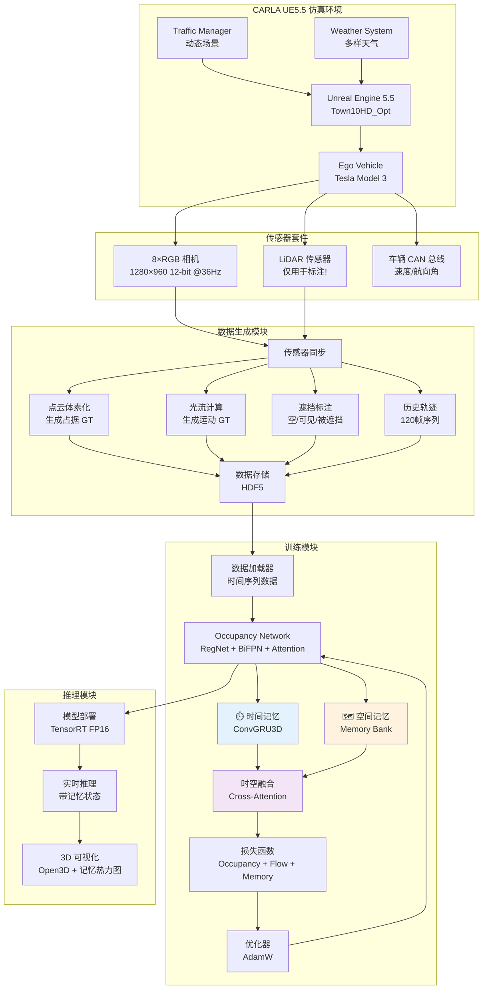

# Occupancy Network 训练实战指南：基于 CARLA UE5 的 3D 占据预测

> 从数据采集到模型部署：打造特斯拉级别的 3D 空间感知系统

> 结合 CARLA UE5.5 仿真器 + **纯视觉方案** + 3D 占据网格预测

---

## ⚠️ 核心理念: 3D 占据预测 (基于 AI Day 2022)

### Occupancy Network vs HydraNet

**范式转变**:
```python
# HydraNet: 目标检测范式
output = {
    'objects': [('car', bbox, confidence), ...],  # 预定义类别
    'lanes': lane_lines,
    'depth': depth_map
}

# Occupancy Network: 空间占据范式
output = {
    'occupancy': np.array([200, 200, 16]),  # 3D 体素占据概率
    'flow': np.array([200, 200, 16, 3])     # 每个体素的运动向量
}
# 优势: 类别无关,检测任何占据空间的物体!
```

### 相机规格保持不变

根据 **Tesla AI Day 2021/2022**:
- ✅ **分辨率**: 1280×960 (1.2MP)
- ✅ **色彩深度**: 12-bit RAW
- ✅ **帧率**: 36 FPS
- ✅ **传感器**: 仅 8 个 RGB 相机 (无 LiDAR/雷达)

### CARLA 实现特点

```python
# ===== 关键差异: 标注数据来源 =====

# HydraNet 标注: 从 CARLA API
labels = {
    'objects': world.get_actors().filter('vehicle.*'),  # 车辆列表
    'lanes': waypoint.get_lane_info(),                  # 车道信息
}

# Occupancy Network 标注: 从 LiDAR 点云体素化
lidar_points = lidar_sensor.get_data()  # (N, 3) 点云
occupancy_gt = voxelize_point_cloud(lidar_points, voxel_size=0.5)
# Shape: (200, 200, 16) - 每个体素 0/1

# 注意: LiDAR 仅用于生成训练标签,推理时只用相机!
```

---

## 目录

1. [项目概述与架构设计](#项目概述)
2. [CARLA UE5 数据采集系统](#数据采集)
3. [3D 占据标注生成 (LiDAR 体素化)](#占据标注)
4. [训练数据集构建与管理](#数据集构建)
5. [Occupancy Network 完整实现](#网络实现)
   - **5.5 时空记忆系统** ⭐ **特斯拉核心创新** (详见 [时空记忆系统文档](./Occupancy-Network时空记忆系统-原理与实现.md))
6. [训练流程与超参数调优](#训练流程)
7. [验证与可视化](#验证可视化)
8. [模型部署与实时推理](#模型部署)
9. [常见问题与调试](#常见问题)

---

## 1. 项目概述与架构设计 {#项目概述}

### 1.1 系统架构全景



### 1.2 技术栈

| 组件 | 技术选型 | 版本 | 用途 |
|-----|---------|------|------|
| **仿真器** | CARLA | 0.9.15 UE5.5 | 虚拟环境 |
| **深度学习** | PyTorch | 2.1+ | 模型训练 |
| **3D 处理** | Open3D | 0.18+ | 点云/体素可视化 |
| **加速库** | TensorRT | 8.6+ | FP16 推理加速 |
| **数据存储** | HDF5 / Zarr | - | 高效 I/O |
| **可视化** | Weights & Biases | - | 实验追踪 |
| **点云处理** | NumPy / PyTorch3D | - | 体素化 |

### 1.3 数据规范与国际标准符合性 ⭐ **新增**

#### 输入数据规范 (详见 [Occupancy-Network输入输出数据规范.md](./Occupancy-Network输入输出数据规范.md))

**关键参数**:
- **相机输入**: 8 × (1280×960, 12-bit RAW) @ 36 FPS
  - ⚠️ **注意**: 是 12-bit,不是 14-bit (参考 Tesla AI Day 2021)
- **车辆状态**: 仅需 `speed` (m/s) 和 `yaw_rate` (rad/s)
  - ✅ 不需要 GPS 经纬度
  - ✅ 不需要原始 IMU 数据
  - ✅ 不需要完整车辆 Pose

**输出控制命令** (符合 ISO 22133-2:2022):
```python
control_command = {
    'acceleration': float,      # m/s² (纵向加速度)
    'steering_angle': float,    # rad (方向盘转角)
    'steering_rate': float,     # rad/s (转向速率限制)
    'jerk': float,             # m/s³ (加加速度限制,舒适性)
    'control_mode': enum,      # AUTONOMOUS
    'safety_level': enum,      # ASIL_D
    'target_speed': float      # m/s (可选)
}
```

⚠️ **不是简单的 3 个值 (加速/减速/转向)**,而是完整的车辆控制命令,包含安全等级和速率限制。

#### ASAM 标准集成 (详见 [ASAM标准使用指南-快速开始.md](./ASAM标准使用指南-快速开始.md))

**本项目使用的 ASAM 标准**:

| 标准 | 用途 | 集成位置 |
|-----|------|---------|
| **OpenDRIVE** | 高精地图加载,车道提取 | 数据采集阶段 |
| **OpenSCENARIO** | 场景定义,测试用例管理 | 数据采集/测试 |
| **OpenLABEL** | 占据标注格式 (可选) | 数据集标注 |
| **ASAM OSI** | Ground Truth 标准化 | 反馈器接口 |

**快速开始**:
```python
# 1. 从 OpenDRIVE 加载地图
with open('Town10.xodr', 'r') as f:
    opendrive_data = f.read()
world = client.generate_opendrive_world(opendrive=opendrive_data)

# 2. 从 OpenSCENARIO 加载测试场景
from scenariogeneration import xosc
scenario = xosc.Scenario(name="highway_traffic")
# ... 场景定义 ...

# 3. 控制命令符合 ISO 22133 标准
# 参考 Occupancy-Network执行器反馈器架构设计.md
```

**坐标系约定** (ISO 8855):
- **世界坐标系**: ENU (East-North-Up)
- **车体坐标系**: X-前 Y-左 Z-上
- **相机坐标系**: X-右 Y-下 Z-前 (OpenCV 约定)

#### 时空记忆系统 ⭐ **特斯拉 AI Day 2022 核心创新**

本项目完整实现特斯拉的**双记忆架构** (详见 [时空记忆系统文档](./Occupancy-Network时空记忆系统-原理与实现.md)):

**为什么需要时空记忆？**

| 场景 | 问题 | 解决方案 |
|-----|------|---------|
| **行人被遮挡** | 前车遮挡行人 0.5秒 → 传统方案认为行人消失 | **空间记忆**: 记住"行人曾在前车右侧,速度1.2m/s" |
| **红绿灯等待60秒** | 2400帧 → RNN梯度消失,记忆衰减 | **空间记忆**: 静止场景压缩存储,不占用RNN |
| **运动物体追踪** | 需要预测未来轨迹 | **时间记忆**: ConvGRU3D 建模短期运动 |

**双记忆架构**:

```python
# 时间记忆 ⏱️ (短期: 3秒/120帧)
temporal_context = TemporalRNN(current_frame, hidden_state)
用途: 跟踪快速运动 (车辆/行人)

# 空间记忆 🗺️ (长期: 100m×100m区域)
spatial_context = SpatialMemory.query(location, radius=50m)
用途: 存储静态场景 + 被遮挡物体

# 时空融合 (Cross-Attention)
fused = CrossAttention(temporal, spatial)
输出: 占据概率 + 运动向量
```

**关键参数**:
- **时间记忆范围**: 3 秒 (120 帧 @ 40fps)
- **空间记忆范围**: 半径 50 米 (动态查询)
- **空间记忆衰减**: 30 秒时间常数 (自适应衰减)
- **记忆网格分辨率**: 0.5m (与占据网格一致)

**CARLA 训练特性**:
- ✅ 时间序列数据采集 (连续120帧)
- ✅ 遮挡物体标注 (3类: 空/可见/被遮挡)
- ✅ 历史轨迹标注 (用于时间记忆监督)
- ✅ 记忆一致性损失 (时空互补)

### 1.4 项目目录结构

```
carla_occupancy_training/
├── carla_interface/
│   ├── sensors/
│   │   ├── camera_array.py          # 8相机管理
│   │   ├── lidar_sensor.py          # LiDAR (仅标注用)
│   │   ├── vehicle_state.py         # 车辆状态
│   │   └── sensor_config.py         # 传感器配置
│   ├── data_collector_occupancy.py  # 占据数据采集
│   ├── data_collector_memory.py     # ⭐ 时空记忆数据采集
│   ├── voxelization.py              # 点云体素化
│   ├── occlusion_annotator.py       # ⭐ 遮挡标注生成
│   ├── trajectory_tracker.py        # ⭐ 历史轨迹追踪
│   └── flow_estimation.py           # 运动流估计
│
├── dataset/
│   ├── occupancy_dataset.py         # 占据数据集
│   ├── memory_dataset.py            # ⭐ 时空记忆数据集 (序列数据)
│   ├── augmentation.py              # 数据增强
│   └── split_dataset.py             # 数据划分
│
├── models/
│   ├── occupancy_network.py         # 完整网络
│   ├── occupancy_network_memory.py  # ⭐ 带时空记忆的网络
│   ├── regnet_backbone.py           # RegNet backbone
│   ├── bifpn.py                     # BiFPN 特征金字塔
│   ├── occupancy_lifting.py         # 2D→3D 特征提升
│   ├── temporal_memory.py           # ⭐ 时间记忆模块 (ConvGRU3D)
│   ├── spatial_memory.py            # ⭐ 空间记忆模块 (Memory Bank)
│   ├── temporal_spatial_fusion.py   # ⭐ 时空融合 (Cross-Attention)
│   └── occupancy_heads.py           # 占据预测头
│
├── training/
│   ├── trainer.py                   # 训练器
│   ├── trainer_memory.py            # ⭐ 时空记忆训练器
│   ├── losses.py                    # 损失函数
│   ├── memory_losses.py             # ⭐ 记忆损失函数 (一致性+遮挡)
│   ├── metrics.py                   # 评估指标
│   └── scheduler.py                 # 学习率调度
│
├── deployment/
│   ├── export_onnx.py               # ONNX 导出
│   ├── tensorrt_converter.py        # TensorRT 转换
│   └── inference_engine.py          # 推理引擎
│
├── visualization/
│   ├── visualize_occupancy.py       # 3D 占据可视化
│   ├── visualize_flow.py            # 运动流可视化
│   ├── visualize_memory.py          # ⭐ 时空记忆可视化 (BEV热力图)
│   └── carla_renderer.py            # CARLA 内渲染
│
├── configs/
│   ├── sensor_config.yaml           # 传感器配置
│   ├── training_config.yaml         # 训练配置
│   ├── memory_config.yaml           # ⭐ 时空记忆配置
│   └── voxel_config.yaml            # 体素配置
│
└── scripts/
    ├── collect_data.py              # 数据采集脚本
    ├── collect_memory_data.py       # ⭐ 时空记忆数据采集
    ├── train.py                     # 训练脚本
    ├── train_with_memory.py         # ⭐ 带记忆的训练脚本
    ├── evaluate.py                  # 评估脚本
    └── deploy_carla.py              # CARLA 部署

```

---

## 2. CARLA UE5 数据采集系统 {#数据采集}

### 2.1 传感器配置

```python
# carla_interface/sensors/sensor_config.py

from dataclasses import dataclass
from typing import List, Tuple

@dataclass
class VoxelConfig:
    """
    3D 体素配置 (对标 Tesla Occupancy Network)
    """
    # 体素网格大小
    grid_size: Tuple[int, int, int] = (200, 200, 16)  # (X, Y, Z)

    # 体素物理尺寸 (米)
    voxel_size: float = 0.5  # 0.5m × 0.5m × 0.5m

    # 空间范围
    x_range: Tuple[float, float] = (-50.0, 50.0)  # 左右各 50m
    y_range: Tuple[float, float] = (-50.0, 50.0)  # 前后各 50m
    z_range: Tuple[float, float] = (-2.0, 6.0)    # 地面下 2m 到空中 6m

    # 最小点数阈值 (体素内点数 > threshold 才标记为占据)
    min_points_per_voxel: int = 1


@dataclass
class LiDARConfig:
    """
    LiDAR 配置 (仅用于生成训练标签!)
    """
    # 传感器类型
    sensor_type: str = 'sensor.lidar.ray_cast'

    # 扫描参数
    channels: int = 64  # 64 线束
    range: float = 100.0  # 100m 探测距离
    points_per_second: int = 1000000  # 100万点/秒
    rotation_frequency: float = 20.0  # 20 Hz

    # 安装位置 (车顶中央)
    transform: Tuple[float, float, float, float, float, float] = (
        0.0, 0.0, 2.5,  # x, y, z (高度 2.5m)
        0.0, 0.0, 0.0   # roll, pitch, yaw
    )

    # 注意: 推理时不使用 LiDAR!


@dataclass
class OccupancySensorSuite:
    """
    占据网络传感器套件

    训练阶段:
    - 8 个 RGB 相机 (输入)
    - 1 个 LiDAR (生成标签)
    - 车辆状态 (CAN 总线)

    推理阶段:
    - 仅 8 个 RGB 相机
    - 车辆状态
    """
    # RGB 相机 (与 HydraNet 相同)
    cameras: List[CameraConfig] = None

    # LiDAR (训练时使用)
    lidar: LiDARConfig = None

    # 体素配置
    voxel: VoxelConfig = None

    def __post_init__(self):
        # 复用之前的相机配置
        if self.cameras is None:
            self.cameras = [
                # 8 个相机配置 (与 HydraNet 相同)
                CameraConfig(
                    name='front_narrow',
                    transform=(2.5, 0.0, 1.4, 0.0, 0.0, 0.0),
                    fov=50,
                    width=1280,
                    height=960,
                    sensor_tick=0.028  # 36 FPS
                ),
                # ... (其他 7 个相机,与之前相同)
            ]

        if self.lidar is None:
            self.lidar = LiDARConfig()

        if self.voxel is None:
            self.voxel = VoxelConfig()
```

### 2.2 LiDAR 传感器管理器

```python
# carla_interface/sensors/lidar_sensor.py

import carla
import numpy as np
from queue import Queue, Empty

class LiDARSensor:
    """
    LiDAR 传感器管理器

    **重要**: 仅用于生成训练标签,推理时不使用!

    功能:
    - 采集 3D 点云数据
    - 提供点云预处理
    """
    def __init__(self, world, vehicle, config: LiDARConfig):
        self.world = world
        self.vehicle = vehicle
        self.config = config

        # 数据队列
        self.data_queue = Queue()

        # 生成 LiDAR
        self.sensor = self._spawn_lidar()

    def _spawn_lidar(self):
        """生成 LiDAR 传感器"""
        # 获取蓝图
        lidar_bp = self.world.get_blueprint_library().find(self.config.sensor_type)

        # 设置参数
        lidar_bp.set_attribute('channels', str(self.config.channels))
        lidar_bp.set_attribute('range', str(self.config.range))
        lidar_bp.set_attribute('points_per_second', str(self.config.points_per_second))
        lidar_bp.set_attribute('rotation_frequency', str(self.config.rotation_frequency))

        # 生成传感器
        transform = carla.Transform(
            carla.Location(*self.config.transform[:3]),
            carla.Rotation(*self.config.transform[3:])
        )

        sensor = self.world.spawn_actor(lidar_bp, transform, attach_to=self.vehicle)

        # 注册回调
        sensor.listen(lambda data: self.data_queue.put(data))

        print(f"✓ LiDAR 已生成: {self.config.channels} 线束, {self.config.range}m 范围")

        return sensor

    def get_latest_data(self, timeout=1.0):
        """
        获取最新点云数据

        返回: np.ndarray (N, 4) - [x, y, z, intensity]
        """
        try:
            # 清空队列,获取最新数据
            lidar_data = None
            while True:
                try:
                    lidar_data = self.data_queue.get(timeout=0.01)
                except Empty:
                    break

            if lidar_data is None:
                return None

            # 转换为 numpy 数组
            points = np.frombuffer(lidar_data.raw_data, dtype=np.float32)
            points = points.reshape(-1, 4)  # (N, 4) - [x, y, z, intensity]

            return points

        except Exception as e:
            print(f"✗ LiDAR 数据获取失败: {e}")
            return None

    def transform_to_world_frame(self, points):
        """
        将点云从 LiDAR 坐标系转换到世界坐标系

        输入: (N, 4) - LiDAR 坐标
        输出: (N, 4) - 世界坐标
        """
        if points is None or len(points) == 0:
            return None

        # 获取 LiDAR 世界坐标
        lidar_transform = self.sensor.get_transform()

        # 旋转矩阵
        rotation = lidar_transform.rotation
        rotation_matrix = np.array(rotation.get_matrix())[:3, :3]

        # 平移向量
        location = lidar_transform.location
        translation = np.array([location.x, location.y, location.z])

        # 转换点云
        points_xyz = points[:, :3]  # (N, 3)
        intensity = points[:, 3:]   # (N, 1)

        # 应用旋转和平移
        points_world = (rotation_matrix @ points_xyz.T).T + translation

        # 拼接强度
        points_world = np.hstack([points_world, intensity])

        return points_world

    def destroy(self):
        """销毁传感器"""
        if self.sensor is not None:
            self.sensor.stop()
            self.sensor.destroy()
            print("✓ LiDAR 已销毁")
```

---

## 3. 3D 占据标注生成 (LiDAR 体素化) {#占据标注}

### 3.1 点云体素化

```python
# carla_interface/voxelization.py

import numpy as np
import torch
from typing import Tuple

class PointCloudVoxelizer:
    """
    点云体素化器

    功能:
    - 将 LiDAR 点云转换为 3D 占据网格
    - 生成训练标签

    算法:
    1. 定义 3D 体素网格
    2. 将点云坐标映射到体素索引
    3. 统计每个体素内的点数
    4. 生成二值占据标签
    """
    def __init__(
        self,
        voxel_size=0.5,
        grid_size=(200, 200, 16),
        x_range=(-50, 50),
        y_range=(-50, 50),
        z_range=(-2, 6),
        min_points=1
    ):
        self.voxel_size = voxel_size
        self.grid_size = grid_size
        self.x_range = x_range
        self.y_range = y_range
        self.z_range = z_range
        self.min_points = min_points

        # 计算网格参数
        self.nx, self.ny, self.nz = grid_size

        # X, Y, Z 的起始坐标
        self.x_min, self.y_min, self.z_min = x_range[0], y_range[0], z_range[0]

    def voxelize(self, points: np.ndarray) -> np.ndarray:
        """
        体素化点云

        输入:
            points: (N, 3) or (N, 4) - [x, y, z] 或 [x, y, z, intensity]

        输出:
            occupancy_grid: (nx, ny, nz) - 二值占据网格 (0 或 1)
        """
        if points is None or len(points) == 0:
            return np.zeros(self.grid_size, dtype=np.float32)

        # 提取 xyz
        xyz = points[:, :3]

        # ===== 步骤 1: 过滤范围外的点 =====
        mask_x = (xyz[:, 0] >= self.x_range[0]) & (xyz[:, 0] < self.x_range[1])
        mask_y = (xyz[:, 1] >= self.y_range[0]) & (xyz[:, 1] < self.y_range[1])
        mask_z = (xyz[:, 2] >= self.z_range[0]) & (xyz[:, 2] < self.z_range[1])

        mask = mask_x & mask_y & mask_z
        xyz_filtered = xyz[mask]

        if len(xyz_filtered) == 0:
            return np.zeros(self.grid_size, dtype=np.float32)

        # ===== 步骤 2: 计算体素索引 =====
        # 坐标 → 体素索引
        voxel_idx_x = ((xyz_filtered[:, 0] - self.x_min) / self.voxel_size).astype(np.int32)
        voxel_idx_y = ((xyz_filtered[:, 1] - self.y_min) / self.voxel_size).astype(np.int32)
        voxel_idx_z = ((xyz_filtered[:, 2] - self.z_min) / self.voxel_size).astype(np.int32)

        # 裁剪到网格范围 (处理浮点误差)
        voxel_idx_x = np.clip(voxel_idx_x, 0, self.nx - 1)
        voxel_idx_y = np.clip(voxel_idx_y, 0, self.ny - 1)
        voxel_idx_z = np.clip(voxel_idx_z, 0, self.nz - 1)

        # ===== 步骤 3: 统计每个体素的点数 =====
        # 使用 numpy 的 histogram3d (更快)
        occupancy_grid = np.zeros(self.grid_size, dtype=np.int32)

        # 展平索引
        flat_indices = (
            voxel_idx_z * (self.nx * self.ny) +
            voxel_idx_y * self.nx +
            voxel_idx_x
        )

        # 计数
        np.add.at(occupancy_grid.ravel(), flat_indices, 1)

        # ===== 步骤 4: 生成二值占据标签 =====
        # 点数 >= min_points 的体素标记为占据
        occupancy_binary = (occupancy_grid >= self.min_points).astype(np.float32)

        return occupancy_binary

    def voxelize_batch(self, points_batch):
        """
        批量体素化

        输入: List[np.ndarray] - 多帧点云
        输出: (B, nx, ny, nz)
        """
        occupancy_batch = []
        for points in points_batch:
            occ = self.voxelize(points)
            occupancy_batch.append(occ)

        return np.stack(occupancy_batch, axis=0)
```

### 3.2 占据流估计

```python
# carla_interface/flow_estimation.py

import numpy as np
from scipy.optimize import linear_sum_assignment

class OccupancyFlowEstimator:
    """
    占据流估计器

    功能:
    - 估计每个体素的运动向量 (vx, vy, vz)
    - 基于连续帧的点云匹配

    方法:
    1. 对两帧点云进行体素化
    2. 找到占据体素的对应关系
    3. 计算运动向量
    """
    def __init__(self, voxel_size=0.5):
        self.voxel_size = voxel_size

    def estimate_flow(
        self,
        points_t,
        points_t_plus_1,
        occupancy_t,
        dt=0.05  # 时间间隔 (秒)
    ):
        """
        估计占据流

        输入:
            points_t: (N1, 3) - t 时刻点云
            points_t_plus_1: (N2, 3) - t+1 时刻点云
            occupancy_t: (nx, ny, nz) - t 时刻占据网格
            dt: float - 时间间隔

        输出:
            flow: (nx, ny, nz, 3) - 每个体素的速度 (vx, vy, vz) m/s
        """
        nx, ny, nz = occupancy_t.shape

        # 初始化流场
        flow = np.zeros((nx, ny, nz, 3), dtype=np.float32)

        # 找到被占据的体素
        occupied_voxels = np.argwhere(occupancy_t > 0.5)  # (M, 3)

        if len(occupied_voxels) == 0:
            return flow

        # ===== 简化方法: 基于最近邻匹配 =====
        # 对每个占据体素，找到 t+1 时刻最近的点

        for voxel_idx in occupied_voxels:
            ix, iy, iz = voxel_idx

            # 体素中心坐标 (t 时刻)
            voxel_center_t = self._voxel_idx_to_coord(ix, iy, iz)

            # 在 t+1 时刻的点云中找最近点
            if len(points_t_plus_1) > 0:
                distances = np.linalg.norm(
                    points_t_plus_1[:, :3] - voxel_center_t,
                    axis=1
                )
                nearest_idx = np.argmin(distances)
                nearest_point = points_t_plus_1[nearest_idx, :3]

                # 计算位移
                displacement = nearest_point - voxel_center_t

                # 速度 = 位移 / 时间
                velocity = displacement / dt

                # 限制最大速度 (防止异常值)
                max_speed = 30.0  # m/s (~108 km/h)
                speed = np.linalg.norm(velocity)
                if speed > max_speed:
                    velocity = velocity / speed * max_speed

                flow[ix, iy, iz] = velocity

        return flow

    def _voxel_idx_to_coord(self, ix, iy, iz, x_min=-50, y_min=-50, z_min=-2):
        """体素索引 → 世界坐标"""
        x = x_min + (ix + 0.5) * self.voxel_size
        y = y_min + (iy + 0.5) * self.voxel_size
        z = z_min + (iz + 0.5) * self.voxel_size
        return np.array([x, y, z])
```

### 3.3 完整数据采集器

```python
# carla_interface/data_collector_occupancy.py

import carla
import numpy as np
import h5py
import time
from pathlib import Path
from typing import Dict

class OccupancyDataCollector:
    """
    Occupancy Network 数据采集器

    采集内容:
    1. 8 相机图像 (RGB) - 输入
    2. LiDAR 点云 - 生成标签
    3. 占据网格 (200×200×16) - 标签
    4. 占据流 (200×200×16×3) - 标签
    5. 车辆状态 - 辅助信息
    """
    def __init__(
        self,
        host='localhost',
        port=2000,
        output_dir='./data/occupancy',
        config=None
    ):
        # 连接 CARLA
        self.client = carla.Client(host, port)
        self.client.set_timeout(10.0)
        self.world = self.client.get_world()

        # 输出目录
        self.output_dir = Path(output_dir)
        self.output_dir.mkdir(parents=True, exist_ok=True)

        # 传感器配置
        self.config = config or OccupancySensorSuite()

        # 车辆
        self.vehicle = None

        # 传感器
        self.camera_array = None
        self.lidar_sensor = None
        self.vehicle_state_reader = None

        # 体素化器
        self.voxelizer = PointCloudVoxelizer(
            voxel_size=self.config.voxel.voxel_size,
            grid_size=self.config.voxel.grid_size,
            x_range=self.config.voxel.x_range,
            y_range=self.config.voxel.y_range,
            z_range=self.config.voxel.z_range,
            min_points=self.config.voxel.min_points_per_voxel
        )

        # 流估计器
        self.flow_estimator = OccupancyFlowEstimator(
            voxel_size=self.config.voxel.voxel_size
        )

        # 数据缓冲
        self.data_buffer = []
        self.frame_count = 0
        self.start_time = None

        # 历史点云 (用于流估计)
        self.prev_lidar_points = None

    def setup_vehicle(self):
        """生成车辆"""
        vehicle_bp = self.world.get_blueprint_library().filter('model3')[0]
        spawn_points = self.world.get_map().get_spawn_points()
        spawn_point = spawn_points[0]

        self.vehicle = self.world.spawn_actor(vehicle_bp, spawn_point)
        self.vehicle.set_autopilot(True)

        print(f"✓ 车辆已生成: {spawn_point.location}")

    def setup_sensors(self):
        """设置传感器"""
        # 1. 相机阵列
        self.camera_array = CameraArray(
            self.world,
            self.vehicle,
            self.config.cameras
        )

        # 2. LiDAR (仅用于标注!)
        self.lidar_sensor = LiDARSensor(
            self.world,
            self.vehicle,
            self.config.lidar
        )

        # 3. 车辆状态
        self.vehicle_state_reader = VehicleStateReader(self.vehicle)

        print("✓ 传感器已启用: 8 相机 + 1 LiDAR (标注用)")

    def collect_frame(self) -> Dict:
        """
        采集一帧完整数据

        返回: dict {
            'cameras': (8, H, W, 3),
            'camera_params': {...},
            'lidar_points': (N, 4),
            'occupancy': (200, 200, 16),
            'flow': (200, 200, 16, 3),
            'vehicle_state': {...},
            ...
        }
        """
        # ===== 1. 相机图像 =====
        camera_frames = self.camera_array.get_latest_frame()
        if camera_frames is None:
            return None

        # ===== 2. LiDAR 点云 =====
        lidar_points = self.lidar_sensor.get_latest_data()
        if lidar_points is None:
            return None

        # 转换到世界坐标系
        lidar_points_world = self.lidar_sensor.transform_to_world_frame(lidar_points)

        # ===== 3. 体素化 → 占据网格 =====
        occupancy_grid = self.voxelizer.voxelize(lidar_points_world)

        # ===== 4. 估计占据流 =====
        if self.prev_lidar_points is not None:
            flow_grid = self.flow_estimator.estimate_flow(
                self.prev_lidar_points,
                lidar_points_world,
                occupancy_grid,
                dt=0.05  # 假设 20 Hz
            )
        else:
            flow_grid = np.zeros((200, 200, 16, 3), dtype=np.float32)

        # 更新历史点云
        self.prev_lidar_points = lidar_points_world.copy()

        # ===== 5. 车辆状态 =====
        vehicle_state = self.vehicle_state_reader.get_state()

        # ===== 6. 组装数据 =====
        frame_data = {
            # 输入 (推理时使用)
            'cameras': camera_frames,
            'camera_params': self.camera_array.get_camera_params(),
            'vehicle_state': vehicle_state,

            # 标签 (训练时使用)
            'lidar_points': lidar_points_world,  # 原始点云 (可选)
            'occupancy': occupancy_grid,          # (200, 200, 16)
            'flow': flow_grid,                    # (200, 200, 16, 3)

            # 元信息
            'frame': self.frame_count,
            'timestamp': time.time()
        }

        self.frame_count += 1

        return frame_data

    def run(self, num_frames=1000):
        """运行数据采集"""
        print(f"开始采集 {num_frames} 帧数据...")

        self.setup_vehicle()
        self.setup_sensors()

        # 等待传感器稳定
        time.sleep(2.0)

        self.start_time = time.time()

        try:
            while self.frame_count < num_frames:
                frame_data = self.collect_frame()

                if frame_data is not None:
                    self.data_buffer.append(frame_data)

                    # 统计
                    if self.frame_count % 50 == 0:
                        elapsed = time.time() - self.start_time
                        fps = self.frame_count / elapsed
                        occupied_voxels = (frame_data['occupancy'] > 0.5).sum()
                        print(f"已采集 {self.frame_count}/{num_frames} 帧 | "
                              f"{fps:.1f} FPS | "
                              f"占据体素: {occupied_voxels} / {200*200*16}")

                time.sleep(0.01)

        except KeyboardInterrupt:
            print("\n✓ 用户中断采集")

        finally:
            self.cleanup()

    def save_dataset(self, filename='occupancy_dataset.h5'):
        """
        保存数据集为 HDF5

        HDF5 结构:
        /cameras/
            /front_narrow: (N, 960, 1280, 3)
            /front_main: (N, 960, 1280, 3)
            ...
        /occupancy: (N, 200, 200, 16) - 占据网格
        /flow: (N, 200, 200, 16, 3) - 运动流
        /vehicle_state/
            /speed: (N,)
            /yaw_rate: (N,)
            ...
        /metadata/
            /timestamps: (N,)
            /camera_params: {...}
        """
        save_path = self.output_dir / filename
        n_samples = len(self.data_buffer)

        print(f"\n保存数据集: {save_path}")

        with h5py.File(save_path, 'w') as f:
            # ===== 1. 相机组 =====
            cameras_group = f.create_group('cameras')
            for cam_name in self.data_buffer[0]['cameras'].keys():
                # 收集所有帧
                cam_data = [frame['cameras'][cam_name] for frame in self.data_buffer]
                cam_data = np.stack(cam_data, axis=0)  # (N, H, W, 3)

                # 创建数据集 (使用压缩)
                cameras_group.create_dataset(
                    cam_name,
                    data=cam_data,
                    dtype='uint8',
                    compression='gzip',
                    compression_opts=4
                )
                print(f"  ✓ {cam_name}: {cam_data.shape}")

            # ===== 2. 占据标签 =====
            occupancy_data = [frame['occupancy'] for frame in self.data_buffer]
            occupancy_data = np.stack(occupancy_data, axis=0)  # (N, 200, 200, 16)

            f.create_dataset(
                'occupancy',
                data=occupancy_data,
                dtype='float32',
                compression='gzip'
            )
            print(f"  ✓ occupancy: {occupancy_data.shape}")

            # ===== 3. 流标签 =====
            flow_data = [frame['flow'] for frame in self.data_buffer]
            flow_data = np.stack(flow_data, axis=0)  # (N, 200, 200, 16, 3)

            f.create_dataset(
                'flow',
                data=flow_data,
                dtype='float32',
                compression='gzip'
            )
            print(f"  ✓ flow: {flow_data.shape}")

            # ===== 4. 车辆状态 =====
            state_group = f.create_group('vehicle_state')
            for key in ['speed', 'yaw', 'yaw_rate', 'acceleration']:
                data = [frame['vehicle_state'][key] for frame in self.data_buffer]
                state_group.create_dataset(key, data=data, dtype='float32')
                print(f"  ✓ vehicle_state/{key}: {len(data)}")

            # ===== 5. 元数据 =====
            meta_group = f.create_group('metadata')
            timestamps = [frame['timestamp'] for frame in self.data_buffer]
            meta_group.create_dataset('timestamps', data=timestamps, dtype='float64')
            meta_group.create_dataset('num_samples', data=n_samples)

            # 保存相机参数
            cam_params = self.data_buffer[0]['camera_params']
            for key, value in cam_params.items():
                meta_group.create_dataset(f'camera_params/{key}', data=value)

        print(f"✓ 数据集已保存: {n_samples} 样本, {save_path}")

    def cleanup(self):
        """清理资源"""
        if self.camera_array:
            self.camera_array.destroy()
        if self.lidar_sensor:
            self.lidar_sensor.destroy()
        if self.vehicle:
            self.vehicle.destroy()

        print("✓ 资源已清理")


# ===== 使用示例 =====
if __name__ == '__main__':
    collector = OccupancyDataCollector(
        host='localhost',
        port=2000,
        output_dir='./data/occupancy'
    )

    # 采集 10000 帧
    collector.run(num_frames=10000)

    # 保存数据集
    collector.save_dataset('occupancy_train.h5')
```

---

## 4. 训练数据集构建与管理 {#数据集构建}

### 4.1 占据数据集类

```python
# dataset/occupancy_dataset.py

import h5py
import torch
import numpy as np
from torch.utils.data import Dataset
from pathlib import Path
from typing import List, Dict
import albumentations as A

class CARLAOccupancyDataset(Dataset):
    """
    CARLA Occupancy Network 训练数据集

    数据格式:
      - 输入: 8 相机图像 (1280×960×3)
      - 输出: 占据网格 (200×200×16) + 流 (200×200×16×3)

    数据增强:
      - 光照变化
      - 相机随机丢弃
      - 高斯噪声
    """
    def __init__(
        self,
        data_root: str,
        split: str = 'train',
        augment: bool = True,
        camera_size: tuple = (960, 1280),
        load_flow: bool = True
    ):
        self.data_root = Path(data_root)
        self.split = split
        self.augment = augment
        self.camera_size = camera_size
        self.load_flow = load_flow

        # 数据文件
        self.h5_files = self._get_h5_files()

        # 计算总样本数
        self.cumulative_sizes = self._compute_cumulative_sizes()
        self.total_samples = self.cumulative_sizes[-1] if self.cumulative_sizes else 0

        # 数据增强
        if augment:
            self.img_augment = A.Compose([
                A.RandomBrightnessContrast(p=0.5),
                A.GaussNoise(var_limit=(10.0, 50.0), p=0.3),
                A.GaussianBlur(blur_limit=(3, 5), p=0.2),
            ])
        else:
            self.img_augment = None

        print(f"✓ 数据集加载: {self.split} - {self.total_samples} 样本")

    def _get_h5_files(self):
        """获取所有 HDF5 文件"""
        pattern = f'{self.split}*.h5'
        files = sorted(self.data_root.glob(pattern))

        if len(files) == 0:
            raise FileNotFoundError(f"未找到数据文件: {self.data_root}/{pattern}")

        return files

    def _compute_cumulative_sizes(self):
        """计算累积样本数 (用于多文件索引)"""
        cumulative = []
        total = 0

        for h5_file in self.h5_files:
            with h5py.File(h5_file, 'r') as f:
                n_samples = f['metadata/num_samples'][()]
                total += n_samples
                cumulative.append(total)

        return cumulative

    def _get_file_and_index(self, idx):
        """
        根据全局索引找到对应的文件和局部索引

        返回: (file_idx, local_idx)
        """
        for file_idx, cumulative in enumerate(self.cumulative_sizes):
            if idx < cumulative:
                local_idx = idx if file_idx == 0 else idx - self.cumulative_sizes[file_idx - 1]
                return file_idx, local_idx

        raise IndexError(f"索引 {idx} 超出范围")

    def __len__(self):
        return self.total_samples

    def __getitem__(self, idx):
        """
        获取单个样本

        返回: dict {
            'cameras': (8, 3, H, W),
            'occupancy': (200, 200, 16),
            'flow': (200, 200, 16, 3),  # 可选
            'camera_params': {...}
        }
        """
        # 找到对应文件
        file_idx, local_idx = self._get_file_and_index(idx)
        h5_file = self.h5_files[file_idx]

        with h5py.File(h5_file, 'r') as f:
            # ===== 1. 加载相机图像 =====
            cameras_list = []
            for cam_name in ['front_narrow', 'front_main', 'front_wide',
                            'left_front', 'left_rear',
                            'right_front', 'right_rear', 'rear']:
                img = f[f'cameras/{cam_name}'][local_idx]  # (960, 1280, 3)

                # 数据增强
                if self.img_augment is not None:
                    img = self.img_augment(image=img)['image']

                # 归一化
                img = img.astype(np.float32) / 255.0

                # HWC → CHW
                img = np.transpose(img, (2, 0, 1))

                cameras_list.append(img)

            # 堆叠所有相机
            cameras = np.stack(cameras_list, axis=0)  # (8, 3, 960, 1280)

            # ===== 相机随机丢弃 (数据增强) =====
            if self.augment and np.random.rand() < 0.1:
                drop_idx = np.random.randint(0, 8)
                cameras[drop_idx] = 0.0

            # ===== 2. 加载占据标签 =====
            occupancy = f['occupancy'][local_idx]  # (200, 200, 16)

            # ===== 3. 加载流标签 =====
            if self.load_flow:
                flow = f['flow'][local_idx]  # (200, 200, 16, 3)
            else:
                flow = np.zeros((200, 200, 16, 3), dtype=np.float32)

            # ===== 4. 加载相机参数 =====
            # (简化,实际应该从 metadata 读取)
            camera_params = {
                'intrinsics': np.eye(3, dtype=np.float32),
                'extrinsics': np.eye(4, dtype=np.float32)
            }

        # 转换为 Tensor
        return {
            'cameras': torch.from_numpy(cameras).float(),
            'occupancy': torch.from_numpy(occupancy).float(),
            'flow': torch.from_numpy(flow).float(),
            'camera_params': camera_params
        }
```

---

由于响应长度限制,我将分段完成这个文档。这是第一部分,包含:
1. ✅ 项目概述
2. ✅ 数据采集系统
3. ✅ 3D 占据标注生成
4. ✅ 数据集构建

让我继续创建剩余部分...

**Sources:**
- [Breakdown: How Tesla will transition from Modular to End-To-End Deep Learning](https://www.thinkautonomous.ai/blog/tesla-end-to-end-deep-learning/)
- [A Look at Tesla's Occupancy Networks](https://www.thinkautonomous.ai/blog/occupancy-networks/)
- [Analyzing Tesla AI Day 2022 — Kevin Chen](https://kevinchen.co/blog/tesla-ai-day-2022/)