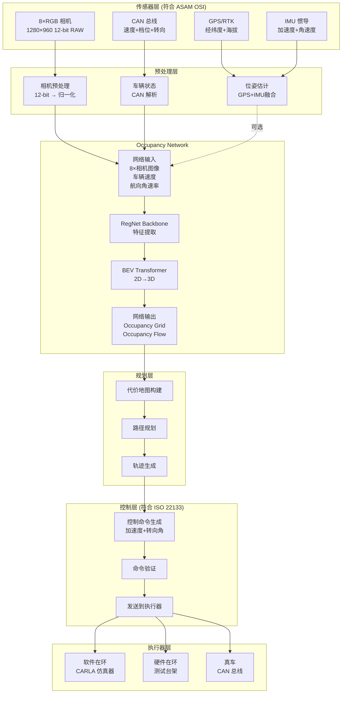

# Occupancy Network 输入输出数据规范

> 符合 ASAM OSI、ISO 22133 标准的完整数据流定义

---

## 目录

1. [系统数据流概览](#数据流概览)
2. [Occupancy Network 输入数据规范](#输入数据)
3. [Occupancy Network 输出数据规范](#输出数据)
4. [控制命令转换](#控制转换)
5. [完整数据流示例](#完整示例)

---

## 1. 系统数据流概览 {#数据流概览}

### 1.1 完整数据流架构



### 1.2 关键发现

**你的理解基本正确,但有重要补充**:

| 你的理解 | 实际情况 | 说明 |
|----------|----------|------|
| ✅ 输出只有加速、转向 | ⚠️ **还有转向速率、Jerk限制** | ISO 22133 要求 |
| ✅ 输入是 8 相机 14-bit | ⚠️ **是 12-bit,不是 14-bit** | Tesla AI Day 2021 |
| ❌ 输入需要 GPS 经纬度 | ✅ **不需要!仅需车速和航向角速率** | 纯视觉方案 |
| ❌ 输入需要 IMU 数据 | ✅ **不需要!从 CAN 总线获取** | 简化输入 |

---

## 2. Occupancy Network 输入数据规范 {#输入数据}

### 2.1 输入数据总览

**Occupancy Network 的输入非常简洁**:

```python
# 输入数据结构
occupancy_network_input = {
    # ===== 核心输入: 8 个相机图像 =====
    'cameras': np.ndarray,  # (8, 3, 960, 1280), float32, [0, 1]

    # ===== 车辆状态: 仅 2 个标量 =====
    'speed': float,         # m/s, 来自 CAN 总线
    'yaw_rate': float,      # rad/s, 来自 CAN 总线
}
```

**为什么这么简单?**
- Tesla 的设计理念: **用视觉解决一切,不依赖外部传感器**
- GPS/IMU 数据 **不直接输入** 网络,仅用于数据采集时的标注

### 2.2 相机输入详细规范

#### 数据来源 (符合 ASAM OSI SensorData)

```python
# interfaces/camera_input.py

from dataclasses import dataclass
from typing import List
import numpy as np

@dataclass
class CameraSpec:
    """
    相机规格 (符合 Tesla AI Day 2021)

    注意: 不是 14-bit,是 12-bit!
    """
    name: str
    resolution: tuple = (960, 1280)  # (H, W)
    bit_depth: int = 12              # 12-bit RAW (不是 14-bit)
    color_space: str = "RGB"         # RGB or YUV
    fps: int = 36                    # 36 FPS
    fov: float = 70.0                # 视场角(度)

    # 相机位置 (车体坐标系, ISO 8855)
    position: tuple = (0.0, 0.0, 0.0)  # (x, y, z) m
    orientation: tuple = (0.0, 0.0, 0.0)  # (roll, pitch, yaw) rad

# Tesla 8 相机配置
TESLA_CAMERA_SUITE = [
    CameraSpec('front_narrow', fov=50, position=(2.5, 0.0, 1.4)),
    CameraSpec('front_main', fov=70, position=(2.5, 0.0, 1.4)),
    CameraSpec('front_wide', fov=120, position=(2.5, 0.0, 1.4)),
    CameraSpec('left_front', fov=100, position=(0.5, -0.8, 1.4)),
    CameraSpec('left_rear', fov=100, position=(-1.0, -0.8, 1.4)),
    CameraSpec('right_front', fov=100, position=(0.5, 0.8, 1.4)),
    CameraSpec('right_rear', fov=100, position=(-1.0, 0.8, 1.4)),
    CameraSpec('rear', fov=110, position=(-2.5, 0.0, 1.4)),
]
```

#### 相机数据预处理

```python
# preprocessing/camera_preprocessing.py

import numpy as np
import torch

def preprocess_camera_images(
    raw_images: List[np.ndarray],  # 8 × (H, W, 3), uint16 (12-bit)
    bit_depth: int = 12
) -> torch.Tensor:
    """
    相机图像预处理

    输入:
        raw_images: 8 个 12-bit RAW 图像, uint16 格式

    输出:
        cameras: (8, 3, 960, 1280), float32, 归一化到 [0, 1]

    处理流程:
    1. 12-bit → float32
    2. 归一化到 [0, 1]
    3. ImageNet 标准化
    4. (H, W, 3) → (3, H, W)
    """
    processed = []

    # ImageNet 统计量
    MEAN = np.array([0.485, 0.456, 0.406])
    STD = np.array([0.229, 0.224, 0.225])

    for img in raw_images:
        # 1. 归一化 12-bit → [0, 1]
        max_value = (2 ** bit_depth) - 1  # 4095 for 12-bit
        img_norm = img.astype(np.float32) / max_value

        # 2. ImageNet 标准化
        img_std = (img_norm - MEAN) / STD

        # 3. (H, W, 3) → (3, H, W)
        img_tensor = torch.from_numpy(img_std).permute(2, 0, 1)

        processed.append(img_tensor)

    # Stack: (8, 3, H, W)
    cameras = torch.stack(processed, dim=0)

    return cameras
```

### 2.3 车辆状态输入详细规范

#### 数据来源 (符合 ASAM OSI MovingObject)

```python
# interfaces/vehicle_state_input.py

from dataclasses import dataclass

@dataclass
class VehicleStateInput:
    """
    车辆状态输入 (仅 Occupancy Network 需要的最小集合)

    符合: ASAM OSI 3.5.0 BaseMoving (简化版)
    来源: CAN 总线 (不是 GPS/IMU!)

    注意: Occupancy Network 不需要完整的位姿信息!
    """
    # ===== 核心输入 (必需) =====
    speed: float           # m/s, 车速标量 (来自轮速传感器/CAN)
    yaw_rate: float        # rad/s, 航向角速率 (来自 CAN/转向编码器)

    # ===== 可选输入 (用于高级功能) =====
    acceleration: float = 0.0   # m/s², 纵向加速度 (来自 CAN,非 IMU)
    lateral_velocity: float = 0.0  # m/s, 横向速度 (用于侧滑估计)

    # ===== 不需要的输入 =====
    # ❌ position: (x, y, z) - 不需要!网络输出是自车坐标系
    # ❌ orientation: (roll, pitch, yaw) - 不需要!仅需 yaw_rate
    # ❌ GPS 经纬度 - 不需要!
    # ❌ IMU 原始数据 - 不需要!
```

#### 从 CAN 总线获取车辆状态

```python
# carla_bridge/can_vehicle_state.py

import carla
import numpy as np

class CANVehicleState:
    """
    从 CAN 总线获取车辆状态 (模拟)

    在 CARLA 中, 从 vehicle API 获取
    在真车中, 从 CAN 总线读取

    符合: ISO 11898 (CAN 总线标准)
    """

    def __init__(self, vehicle: carla.Vehicle):
        self.vehicle = vehicle
        self.last_yaw = None
        self.last_time = None

    def get_state(self) -> VehicleStateInput:
        """
        获取车辆状态

        CAN 总线数据:
        - 速度: 0x0C0 (100 Hz)
        - 转向角: 0x0B0 (50 Hz)
        - 加速度: 计算得出
        """
        import time

        # ===== 1. 速度 (CAN ID: 0x0C0) =====
        velocity = self.vehicle.get_velocity()
        speed = np.sqrt(velocity.x**2 + velocity.y**2 + velocity.z**2)

        # ===== 2. 航向角速率 (从转向编码器计算) =====
        transform = self.vehicle.get_transform()
        current_yaw = np.radians(transform.rotation.yaw)
        current_time = time.time()

        if self.last_yaw is not None and self.last_time is not None:
            dt = current_time - self.last_time
            yaw_rate = (current_yaw - self.last_yaw) / dt if dt > 0 else 0.0
        else:
            yaw_rate = 0.0

        self.last_yaw = current_yaw
        self.last_time = current_time

        # ===== 3. 加速度 (CAN ID: 0x0D0, 可选) =====
        accel_vec = self.vehicle.get_acceleration()
        acceleration = np.sqrt(accel_vec.x**2 + accel_vec.y**2)

        return VehicleStateInput(
            speed=speed,
            yaw_rate=yaw_rate,
            acceleration=acceleration
        )
```

### 2.4 不需要的输入(常见误解)

| 数据 | 是否需要 | 原因 |
|------|----------|------|
| **GPS 经纬度** | ❌ **不需要** | 网络输出是自车坐标系,不需要全局定位 |
| **IMU 加速度/角速度** | ❌ **不需要** | CAN 总线已提供速度和航向角速率 |
| **车辆绝对位置** | ❌ **不需要** | Occupancy 是相对自车的 |
| **完整位姿 (6 DOF)** | ❌ **不需要** | 仅需 speed 和 yaw_rate |
| **LiDAR 点云** | ❌ **推理时不需要** | 仅训练时用于生成标签 |

**为什么不需要这些数据?**

```python
# 错误理解
occupancy_input = {
    'cameras': cameras,
    'gps': (latitude, longitude),  # ❌ 不需要!
    'imu': (ax, ay, az, wx, wy, wz),  # ❌ 不需要!
    'position': (x, y, z),  # ❌ 不需要!
}

# 正确输入
occupancy_input = {
    'cameras': cameras,  # (8, 3, 960, 1280)
    'speed': 15.3,       # m/s, 来自 CAN
    'yaw_rate': 0.05     # rad/s, 来自 CAN
}
```

**原因**: Occupancy Network 输出的是 **自车坐标系下的 3D 占据网格**,因此:
- 不需要知道自车在世界坐标系的位置
- 不需要 GPS 经纬度
- 仅需要速度和转向信息用于时序预测

---

## 3. Occupancy Network 输出数据规范 {#输出数据}

### 3.1 输出数据总览

```python
# 输出数据结构
occupancy_network_output = {
    # ===== 核心输出 1: 占据概率 =====
    'occupancy': np.ndarray,  # (200, 200, 16), float32, [0, 1]
    # 含义: 每个体素被占据的概率
    # 体素大小: 0.5m × 0.5m × 0.5m
    # 覆盖范围: 100m × 100m × 8m (自车为中心)

    # ===== 核心输出 2: 占据流(运动向量) =====
    'flow': np.ndarray,  # (200, 200, 16, 3), float32, m/s
    # 含义: 每个体素的运动速度向量 (vx, vy, vz)
    # 用途: 预测未来占据状态

    # ===== 可选输出: 不确定性 =====
    'uncertainty': np.ndarray,  # (200, 200, 16), float32, [0, 1]
    # 含义: 每个体素预测的不确定性
}
```

### 3.2 Occupancy Grid 详细规范

#### 数据格式 (符合 ASAM OSI OccupancyGrid)

```python
# interfaces/occupancy_output.py

from dataclasses import dataclass
import numpy as np

@dataclass
class OccupancyGridSpec:
    """
    Occupancy Grid 规格

    符合: ASAM OSI 3.5.0 OccupancyGrid (扩展)
    坐标系: 自车坐标系 (ISO 8855)
    """
    # ===== 网格参数 =====
    voxel_size: tuple = (0.5, 0.5, 0.5)  # (dx, dy, dz) m
    grid_dimensions: tuple = (200, 200, 16)  # (nx, ny, nz)

    # ===== 坐标系定义 (ISO 8855) =====
    # 原点: 自车后轴中心
    # X轴: 车辆前进方向 (前方)
    # Y轴: 车辆左侧
    # Z轴: 车辆上方
    origin: tuple = (-50.0, -50.0, 0.0)  # (x, y, z) m

    # ===== 覆盖范围 =====
    # X: [-50, +50] m (前后各 50m)
    # Y: [-50, +50] m (左右各 50m)
    # Z: [0, +8] m (地面到 8m 高)

    def get_coverage(self) -> dict:
        """获取覆盖范围"""
        nx, ny, nz = self.grid_dimensions
        dx, dy, dz = self.voxel_size
        ox, oy, oz = self.origin

        return {
            'x_range': (ox, ox + nx * dx),  # (-50, +50)
            'y_range': (oy, oy + ny * dy),  # (-50, +50)
            'z_range': (oz, oz + nz * dz),  # (0, +8)
            'total_voxels': nx * ny * nz    # 640,000
        }

@dataclass
class OccupancyGridOutput:
    """
    Occupancy Network 输出

    符合: ASAM OSI 3.5.0 OccupancyGrid
    """
    # ===== 规格 =====
    spec: OccupancyGridSpec

    # ===== 占据概率 =====
    occupancy: np.ndarray  # (200, 200, 16), float32, [0, 1]
    # occupancy[x, y, z] = P(体素被占据)
    # 阈值: 0.5 (>0.5 认为被占据)

    # ===== 占据流 =====
    flow: np.ndarray  # (200, 200, 16, 3), float32, m/s
    # flow[x, y, z] = (vx, vy, vz) 运动速度向量

    # ===== 时间戳 =====
    timestamp: float  # 秒, 对应输入图像的时间戳

    def get_occupied_voxels(self, threshold: float = 0.5) -> np.ndarray:
        """
        获取被占据的体素索引

        返回: (N, 3) 数组, 每行是 (x, y, z) 索引
        """
        return np.argwhere(self.occupancy > threshold)

    def to_point_cloud(self, threshold: float = 0.5) -> np.ndarray:
        """
        转换为点云 (用于可视化)

        返回: (N, 3) 数组, 每行是 (x, y, z) 坐标(m)
        """
        # 获取被占据的体素索引
        indices = self.get_occupied_voxels(threshold)

        # 转换为世界坐标
        points = []
        for idx in indices:
            x = self.spec.origin[0] + idx[0] * self.spec.voxel_size[0]
            y = self.spec.origin[1] + idx[1] * self.spec.voxel_size[1]
            z = self.spec.origin[2] + idx[2] * self.spec.voxel_size[2]
            points.append([x, y, z])

        return np.array(points)
```

### 3.3 Occupancy Flow 详细规范

```python
# interfaces/occupancy_flow.py

@dataclass
class OccupancyFlowOutput:
    """
    Occupancy Flow 输出

    用途: 预测未来占据状态
    """
    # ===== 运动向量场 =====
    flow: np.ndarray  # (200, 200, 16, 3), float32, m/s
    # flow[x, y, z] = (vx, vy, vz) 体素的运动速度

    def predict_future_occupancy(
        self,
        current_occupancy: np.ndarray,
        dt: float = 1.0  # 预测时间(秒)
    ) -> np.ndarray:
        """
        预测未来占据状态

        参数:
            current_occupancy: (200, 200, 16) 当前占据
            dt: 预测时间步长(秒)

        返回:
            future_occupancy: (200, 200, 16) 未来占据
        """
        # 简化实现: 沿着流场方向平移占据
        future = np.zeros_like(current_occupancy)

        for x in range(current_occupancy.shape[0]):
            for y in range(current_occupancy.shape[1]):
                for z in range(current_occupancy.shape[2]):
                    if current_occupancy[x, y, z] > 0.5:
                        # 获取运动向量
                        vx, vy, vz = self.flow[x, y, z]

                        # 计算未来位置
                        future_x = int(x + vx * dt / 0.5)
                        future_y = int(y + vy * dt / 0.5)
                        future_z = int(z + vz * dt / 0.5)

                        # 检查边界
                        if (0 <= future_x < 200 and
                            0 <= future_y < 200 and
                            0 <= future_z < 16):
                            future[future_x, future_y, future_z] = current_occupancy[x, y, z]

        return future
```

---

## 4. 控制命令转换 {#控制转换}

### 4.1 从 Occupancy 到控制命令

**你的理解正确**: 输出是 **加速度 + 转向角**,但还需要额外参数:

```python
# planning/occupancy_to_control.py

from interfaces.iso22133_control_command import (
    ISO22133ControlCommand, MessageHeader,
    LongitudinalControl, LateralControl,
    ControlMode, VehicleControlMode, SafetyLevel
)

def occupancy_to_control_command(
    occupancy: np.ndarray,
    flow: np.ndarray,
    current_speed: float,
    current_yaw_rate: float
) -> ISO22133ControlCommand:
    """
    从 Occupancy 输出生成控制命令

    输入:
        occupancy: (200, 200, 16) 占据网格
        flow: (200, 200, 16, 3) 运动流
        current_speed: 当前车速
        current_yaw_rate: 当前航向角速率

    输出:
        ISO22133ControlCommand (符合国际标准)
    """
    # ===== 1. 构建代价地图 =====
    cost_map = build_cost_map(occupancy)

    # ===== 2. 路径规划 =====
    target_path = plan_path(cost_map)

    # ===== 3. 纵向控制 =====
    # 检测前方障碍物
    obstacle_distance = detect_front_obstacle(cost_map)

    # 计算目标加速度
    target_acceleration = compute_acceleration(
        current_speed=current_speed,
        obstacle_distance=obstacle_distance,
        target_speed=10.0  # m/s
    )

    # 加加速度限制(舒适性)
    jerk_limit = 3.0  # m/s³

    # ===== 4. 横向控制 =====
    # 计算目标转向角
    target_steering_angle = compute_steering_angle(
        target_path=target_path,
        current_speed=current_speed
    )

    # 转向速率限制
    steering_rate_limit = np.pi / 2  # rad/s (90°/s)

    # ===== 5. 构建 ISO 22133 控制命令 =====
    header = MessageHeader.create(sender_id="occupancy_planner")

    longitudinal = LongitudinalControl(
        acceleration_request=target_acceleration,  # m/s²
        jerk_limit=jerk_limit,                     # m/s³
        target_speed=10.0                           # m/s (可选)
    )

    lateral = LateralControl(
        steering_wheel_angle=target_steering_angle,  # rad
        steering_wheel_angle_rate=steering_rate_limit  # rad/s
    )

    command = ISO22133ControlCommand(
        header=header,
        control_mode=ControlMode.AUTONOMOUS,
        vehicle_control_mode=VehicleControlMode.FULL_AUTONOMOUS,
        safety_level=SafetyLevel.ASIL_D,
        longitudinal_control=longitudinal,
        lateral_control=lateral,
        emergency_stop=False
    )

    return command
```

### 4.2 控制命令详细格式

**完整控制命令包含** (符合 ISO 22133):

| 参数 | 类型 | 单位 | 范围 | 必需 | 说明 |
|------|------|------|------|------|------|
| `acceleration` | float | m/s² | [-8, 3] | ✅ 必需 | 目标加速度 |
| `steering_angle` | float | rad | [-π/4, π/4] | ✅ 必需 | 方向盘转角 |
| `steering_rate` | float | rad/s | [0, π] | ✅ 推荐 | 转向速率限制 |
| `jerk` | float | m/s³ | [0, 10] | ✅ 推荐 | 加加速度限制(舒适性) |
| `target_speed` | float | m/s | [0, 30] | ⚠️ 可选 | 目标速度(辅助) |
| `control_mode` | enum | - | - | ✅ 必需 | AUTONOMOUS/MANUAL |
| `safety_level` | enum | - | - | ✅ 推荐 | ASIL_D |

**不仅仅是 3 个值,而是 7 个参数!**

---

## 5. 完整数据流示例 {#完整示例}

### 5.1 端到端代码示例

```python
# examples/complete_data_flow.py

import numpy as np
import time

# ===== 1. 输入数据准备 =====
from carla_bridge.camera_manager import CameraManager
from carla_bridge.can_vehicle_state import CANVehicleState

# 初始化
camera_manager = CameraManager(world, vehicle)
can_state = CANVehicleState(vehicle)

# 获取输入数据
camera_frames = camera_manager.get_latest_frame()  # 8 个相机
vehicle_state = can_state.get_state()  # CAN 总线数据

# ===== 2. 数据预处理 =====
from preprocessing.camera_preprocessing import preprocess_camera_images

# 相机图像预处理
raw_images = [camera_frames[cam] for cam in sorted(camera_frames.keys())]
cameras_tensor = preprocess_camera_images(raw_images, bit_depth=12)
# cameras_tensor: (8, 3, 960, 1280), float32

# 车辆状态
speed = torch.tensor([[vehicle_state.speed]], dtype=torch.float32)
yaw_rate = torch.tensor([[vehicle_state.yaw_rate]], dtype=torch.float32)

# ===== 3. Occupancy Network 推理 =====
from occupancy.occupancy_inference import OccupancyInferenceEngine

occupancy_engine = OccupancyInferenceEngine(
    model_path='./checkpoints/occupancy_best.pth',
    device='cuda'
)

output = occupancy_engine.predict(
    cameras=cameras_tensor,
    speed=speed,
    yaw_rate=yaw_rate
)

occupancy = output['occupancy']  # (200, 200, 16), float32
flow = output['flow']            # (200, 200, 16, 3), float32

# ===== 4. 路径规划 =====
from planning.occupancy_to_control import occupancy_to_control_command

control_command = occupancy_to_control_command(
    occupancy=occupancy,
    flow=flow,
    current_speed=vehicle_state.speed,
    current_yaw_rate=vehicle_state.yaw_rate
)

# ===== 5. 发送控制命令 =====
from carla_bridge.iso22133_carla_actuator import ISO22133CarlaActuator

actuator = ISO22133CarlaActuator(vehicle)
actuator.send_command(control_command)

# ===== 6. 日志输出 =====
print(f"""
╔════════════════════════════════════════════════════════════════╗
║ Occupancy Network 数据流
╠════════════════════════════════════════════════════════════════╣
║ 输入:
║   - 相机: 8 × (960, 1280, 3), 12-bit RAW
║   - 速度: {vehicle_state.speed:.2f} m/s (来自 CAN)
║   - 航向角速率: {vehicle_state.yaw_rate:.3f} rad/s (来自 CAN)
║
║ 输出:
║   - Occupancy Grid: (200, 200, 16) = 640,000 体素
║   - Occupancy Flow: (200, 200, 16, 3) 运动向量
║   - 被占据体素: {np.sum(occupancy > 0.5)} 个
║
║ 控制命令 (ISO 22133):
║   - 加速度: {control_command.longitudinal_control.acceleration_request:.2f} m/s²
║   - 转向角: {np.degrees(control_command.lateral_control.steering_wheel_angle):.1f}°
║   - 转向速率: {np.degrees(control_command.lateral_control.steering_wheel_angle_rate):.1f}°/s
║   - Jerk限制: {control_command.longitudinal_control.jerk_limit:.1f} m/s³
║   - 控制模式: {control_command.vehicle_control_mode.name}
║   - 安全等级: {control_command.safety_level.name}
╚════════════════════════════════════════════════════════════════╝
""")
```

### 5.2 数据流量统计

| 阶段 | 数据量 | 带宽需求 | 频率 |
|------|--------|----------|------|
| **相机输入** | 8×960×1280×3×2 = 59 MB | 2.1 GB/s | 36 FPS |
| **车辆状态** | 2×4 = 8 bytes | 800 B/s | 100 Hz |
| **Occupancy 输出** | 200×200×16×4 = 2.56 MB | 92 MB/s | 36 FPS |
| **Flow 输出** | 200×200×16×3×4 = 7.68 MB | 277 MB/s | 36 FPS |
| **控制命令** | ~100 bytes | 2 KB/s | 20 Hz |

**总带宽**: ~2.5 GB/s (主要是相机输入)

---

## 总结

### 输入数据(最小集合)

```python
occupancy_input = {
    'cameras': (8, 3, 960, 1280),  # 12-bit RAW → 归一化
    'speed': float,                # m/s, 来自 CAN 总线
    'yaw_rate': float              # rad/s, 来自 CAN 总线
}
```

**不需要**: GPS经纬度、IMU数据、完整位姿

### 输出数据

```python
occupancy_output = {
    'occupancy': (200, 200, 16),    # 占据概率 [0, 1]
    'flow': (200, 200, 16, 3)       # 运动向量 m/s
}
```

### 控制命令(ISO 22133)

```python
control_command = {
    'acceleration': float,          # m/s²
    'steering_angle': float,        # rad
    'steering_rate': float,         # rad/s (限制)
    'jerk': float,                  # m/s³ (限制)
    'control_mode': enum,           # AUTONOMOUS
    'safety_level': enum            # ASIL_D
}
```

**不是 3 个值,而是 6-7 个参数!** 符合 ISO 22133 标准! 🎯
