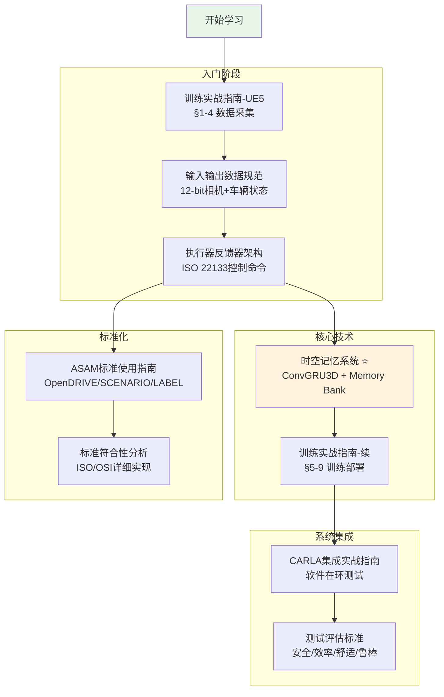

# Occupancy Network 完整文档索引

> 基于 CARLA UE5 的特斯拉 Occupancy Network 完整实现

---

## 📚 文档结构

### 核心训练指南 (按阅读顺序)

| 序号 | 文档 | 内容概要 | 适用场景 |
|-----|------|---------|---------|
| 1️⃣ | [Occupancy-Network训练实战指南-CARLA-UE5.md](./Occupancy-Network训练实战指南-CARLA-UE5.md) | **项目概述、数据采集、标注生成** (§1-4) - 系统架构全景 - 数据规范与国际标准 - CARLA 传感器配置 - LiDAR 体素化 | ⭐ **入门必读** |
| 2️⃣ | [Occupancy-Network训练实战指南-CARLA-UE5-续.md](./Occupancy-Network训练实战指南-CARLA-UE5-续.md) | **网络实现、训练、部署** (§5-9) - 完整网络架构 - 训练流程与超参数 - 验证与可视化 - TensorRT 部署 | 训练与部署 |
| 3️⃣ | [Occupancy-Network-CARLA集成实战指南.md](./Occupancy-Network-CARLA集成实战指南.md) | **软件在环 + 真车集成** - 完整项目结构 - 执行器/反馈器接口 - 实时推理演示 | 系统集成 |

### 专题深度文档

#### 🧠 时空记忆系统 ⭐ **特斯拉核心创新**

| 文档 | 内容 | 关键技术 |
|-----|------|---------|
| [Occupancy-Network时空记忆系统-原理与实现.md](./Occupancy-Network时空记忆系统-原理与实现.md) | **完整的时空记忆实现** - 问题背景 (遮挡/红绿灯等待) - 特斯拉 AI Day 2022 架构 - ConvGRU3D 时间记忆 - Memory Bank 空间记忆 - Cross-Attention 融合 - CARLA 数据采集与训练 | • 时间记忆: 3秒/120帧 • 空间记忆: 50米半径 • 遮挡补全 • 场景持久化 |

#### 🎛️ 控制接口与标准

| 文档 | 内容 | 标准符合性 |
|-----|------|-----------|
| [Occupancy-Network执行器反馈器架构设计.md](./Occupancy-Network执行器反馈器架构设计.md) | **控制命令与车辆反馈接口** - ISO 22133-2:2022 控制命令 - ASAM OSI 3.5.0 反馈数据 - 抽象接口设计 - CARLA/真车双实现 | ✅ ISO 22133 ✅ ASAM OSI ✅ ISO 8855 |
| [Occupancy-Network输入输出数据规范.md](./Occupancy-Network输入输出数据规范.md) | **完整的 I/O 规范** - 输入: 8相机12-bit + 车辆状态 - 输出: 占据网格 + 运动流 - 控制命令: 7参数 (非3个!) - 数据流全链路 | ⚠️ 12-bit (非14-bit) ✅ 不需要GPS/IMU |

#### 🏁 ASAM 仿真标准

| 文档 | 内容 | 应用场景 |
|-----|------|---------|
| [ASAM标准使用指南-快速开始.md](./ASAM标准使用指南-快速开始.md) | **ASAM 标准快速入门** - OpenDRIVE 地图加载 - OpenSCENARIO 场景定义 - OpenLABEL 标注格式 - 对比传统方案 | 标准化测试 |
| [Occupancy-Network-ASAM标准整合方案.md](./Occupancy-Network-ASAM标准整合方案.md) | **ASAM 标准详细整合** - 每个标准的详细实现 - 代码示例 - 迁移指南 | 标准化开发 |
| [执行器反馈器国际标准符合性分析.md](./执行器反馈器国际标准符合性分析.md) | **标准符合性详细分析** - ISO/ASAM 标准对比 - 完整实现示例 - 适配器模式 | 标准迁移 |

#### 📊 测试评估系统

| 文档 | 内容 | 评估维度 |
|-----|------|---------|
| [无人驾驶测试评估标准与CARLA实时监控系统.md](./无人驾驶测试评估标准与CARLA实时监控系统.md) | **完整的评估体系** - 国际标准 (ISO/SAE/NHTSA) - 4大指标: 安全/效率/舒适/鲁棒 - CARLA 传感器检测 - 实时 HUD 可视化 - JSON/HTML 报告生成 | • 碰撞/压线/闯红灯 • 速度利用率/MPD • 加加速度/急操作 • 接管次数 |

#### 📖 理论与背景

| 文档 | 内容 | 用途 |
|-----|------|-----|
| [特斯拉自动驾驶的致命缺陷与救赎-从HydraNet到Occupancy Network.md](./特斯拉自动驾驶的致命缺陷与救赎-从HydraNet到Occupancy Network.md) | **范式演进历史** - HydraNet 的局限性 - Occupancy 的优势 - 技术演进路径 | 理解动机 |
| [拆解特斯拉占位网络Occupancy-Network架构.md](./拆解特斯拉占位网络Occupancy-Network架构.md) | **架构详细拆解** - 网络层级分析 - 关键模块解析 | 深入理解 |
| [Tesla_OccupancyNetwork_Technical_Design.md](./Tesla_OccupancyNetwork_Technical_Design.md) | **技术设计文档** - 传感器配置 - 数据流设计 | 工程实现 |

---

## 🗺️ 文档关联图

---

## 📋 快速查找指南

### 我想了解...

| 问题 | 查阅文档 | 章节 |
|-----|---------|------|
| **项目如何开始？** | 训练实战指南-UE5 | §1 项目概述 |
| **如何配置 CARLA 传感器？** | 训练实战指南-UE5 | §2 数据采集 |
| **输入是几个相机？多少bit？** | 输入输出数据规范 | §2 输入数据 |
| **输出是3个值还是7个值？** | 输入输出数据规范 | §3 输出控制命令 |
| **如何处理遮挡问题？** | 时空记忆系统 | §1 问题背景 |
| **如何处理红绿灯等待？** | 时空记忆系统 | §1 问题背景 |
| **什么是时间记忆？** | 时空记忆系统 | §2.2 时间记忆 |
| **什么是空间记忆？** | 时空记忆系统 | §2.3 空间记忆 |
| **如何训练模型？** | 训练实战指南-续 | §6 训练流程 |
| **如何部署到 TensorRT？** | 训练实战指南-续 | §8 模型部署 |
| **如何集成到自动驾驶程序？** | CARLA集成实战指南 | §3 完整集成 |
| **如何评估性能？** | 测试评估标准 | §2 评估指标 |
| **如何检测碰撞/压线？** | 测试评估标准 | §3 CARLA实现 |
| **什么是 ISO 22133？** | 执行器反馈器架构 | §1.2 国际标准 |
| **如何使用 OpenDRIVE？** | ASAM标准使用指南 | §2 OpenDRIVE |

---

## 🎯 学习路径推荐

### 路径 1: 快速上手 (2-3天)

1. ✅ **训练实战指南-UE5** §1-2 (了解架构和数据采集)
2. ✅ **输入输出数据规范** (搞清楚输入输出格式)
3. ✅ **训练实战指南-续** §5-6 (网络实现和训练)
4. ✅ **CARLA集成实战指南** §3 (完整集成示例)

### 路径 2: 深入理解 (1周)

1. ✅ **特斯拉自动驾驶演进** (理解为什么需要 Occupancy)
2. ✅ **训练实战指南-UE5** 完整 (数据采集全流程)
3. ✅ **时空记忆系统** ⭐ (核心创新技术)
4. ✅ **训练实战指南-续** 完整 (训练到部署)
5. ✅ **测试评估标准** (性能评估体系)

### 路径 3: 工程实践 (2周)

1. ✅ **所有核心训练指南** (完整实现)
2. ✅ **时空记忆系统** (遮挡/长时记忆)
3. ✅ **执行器反馈器架构** (标准化接口)
4. ✅ **ASAM标准整合** (标准化测试)
5. ✅ **测试评估标准** (完整评估体系)

### 路径 4: 标准化开发 (1周)

1. ✅ **ASAM标准使用指南** (快速入门)
2. ✅ **标准符合性分析** (详细实现)
3. ✅ **执行器反馈器架构** (ISO/OSI标准)
4. ✅ **输入输出数据规范** (数据标准)

---

## 🔑 关键概念速查

### 时空记忆系统

| 概念 | 定义 | 范围 | 实现 |
|-----|------|------|-----|
| **时间记忆** | 短期运动追踪 | 3秒/120帧 | ConvGRU3D |
| **空间记忆** | 场景持久化存储 | 50米半径 | Memory Bank Grid |
| **时空融合** | 记忆互补 | - | Cross-Attention |

### 输入输出规范

| 项目 | 规格 | 标准 |
|-----|------|-----|
| **输入相机** | 8 × (1280×960, **12-bit** RAW) | ⚠️ 非14-bit |
| **输入状态** | speed (m/s) + yaw_rate (rad/s) | 不需GPS/IMU |
| **输出控制** | **7参数** (非3个) | ISO 22133 |
| **输出网格** | 200×200×16 (0.5m分辨率) | - |

### 评估指标

| 维度 | 关键指标 | 阈值 |
|-----|---------|-----|
| **安全性** | 碰撞/压线/闯红灯 | 0次 |
| **效率性** | 速度利用率/MPD | >85% |
| **舒适性** | 加加速度/急操作 | <2 m/s³ |
| **鲁棒性** | 接管次数/系统故障 | 最少 |

---

## ⚠️ 常见误区

| 误区 | 正确理解 | 参考文档 |
|-----|---------|---------|
| ❌ 输入是14-bit | ✅ **12-bit RAW** | 输入输出数据规范 §2.1 |
| ❌ 需要GPS经纬度 | ✅ 只需 speed + yaw_rate | 输入输出数据规范 §2.2 |
| ❌ 需要原始IMU数据 | ✅ 不需要 | 输入输出数据规范 §2.2 |
| ❌ 输出是3个值 | ✅ **7个参数** (ISO 22133) | 输入输出数据规范 §3 |
| ❌ 只有时间记忆 | ✅ 时间+空间双记忆 | 时空记忆系统 §2 |
| ❌ 遮挡后物体消失 | ✅ 空间记忆补全 | 时空记忆系统 §1.1 |

---

## 📞 联系与反馈

- **GitHub Issues**: 报告文档问题
- **CARLA 官方论坛**: CARLA 相关问题
- **特斯拉 AI Day**: [2021](https://www.youtube.com/watch?v=j0z4FweCy4M) / [2022](https://www.youtube.com/watch?v=ODSJsviD_SU)

---

## 📝 版本历史

| 版本 | 日期 | 更新内容 |
|-----|------|---------|
| v1.0 | 2024-12 | 初始版本,完整文档体系 |
| - | - | • 核心训练指南 (3篇) |
| - | - | • 时空记忆系统 ⭐ |
| - | - | • 标准化文档 (4篇) |
| - | - | • 测试评估系统 |

---

## 🎓 推荐学习资源

### 视频资源
- [Tesla AI Day 2021](https://www.youtube.com/watch?v=j0z4FweCy4M) - HydraNet 架构
- [Tesla AI Day 2022](https://www.youtube.com/watch?v=ODSJsviD_SU) - Occupancy Network + 时空记忆
- [CARLA Tutorials](https://carla.readthedocs.io/en/latest/tutorials/)

### 论文资源
- Tesla Autopilot Architecture (AI Day)
- BEVFormer (CVPR 2022)
- TPVFormer (CVPR 2023)

### 标准文档
- [ISO 22133-2:2022](https://www.iso.org/standard/79962.html) - 车辆控制接口
- [ASAM OpenDRIVE](https://www.asam.net/standards/detail/opendrive/)
- [ASAM OSI](https://www.asam.net/standards/detail/osi/)

---

**祝学习顺利！🚀**
