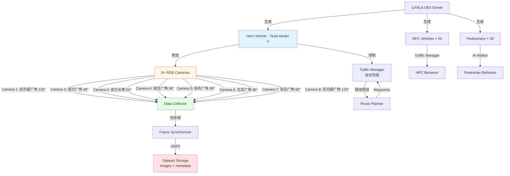
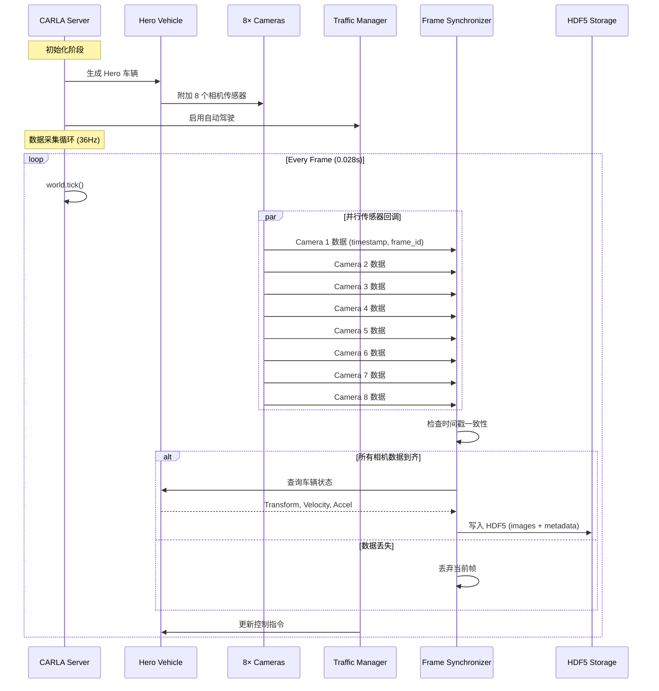

# Hero 车辆与 NPC 环境初始化设计

## 文档概述

**目标**: 在 CARLA UE5 中创建一个完整的数据采集环境,包含:
- Hero 车辆(Tesla Model 3)配备 8 个摄像头(特斯拉配置)
- 12-bit RAW 图像采集接口
- 自动驾驶模式(Traffic Manager)
- NPC 车辆与行人(动态场景)
- 数据同步与存储机制

**应用场景**: 为纯视觉 Occupancy Network 训练准备数据集

**技术栈**:
- CARLA 0.9.15 (UE5)
- Python 3.10
- 传感器: 8×RGB Camera (12-bit mode)
- 自动驾驶: Traffic Manager

**输出**:
- 8 路同步相机数据流
- 车辆状态(位置、速度、加速度)
- 相机内外参矩阵
- HDF5 格式数据集

---

## 1. 系统架构设计

### 1.1 整体架构



### 1.2 相机配置(特斯拉 FSD 硬件 3.0/4.0 参考)

| ID | 位置 | FOV | 分辨率 | 帧率 | 用途 |
|----|------|-----|--------|------|------|
| **1** | 前方超广角 | 120° | 1280×960 | 36fps | 近距离障碍物/行人 |
| **2** | 前方广角 | 90° | 1280×960 | 36fps | 主视野/车道线 |
| **3** | 前方长焦 | 50° | 1280×960 | 36fps | 远距离目标/交通标志 |
| **4** | 前左广角 | 90° | 1280×960 | 36fps | 左前方盲区 |
| **5** | 前右广角 | 90° | 1280×960 | 36fps | 右前方盲区 |
| **6** | 左后广角 | 90° | 1280×960 | 36fps | 左后方/变道 |
| **7** | 右后广角 | 90° | 1280×960 | 36fps | 右后方/变道 |
| **8** | 后方超广角 | 120° | 1280×960 | 36fps | 倒车/后方车辆 |

**相机安装位置**(基于 Tesla Model 3 尺寸):

```
Top View (俯视图):
                    ┌─────── 3 (长焦, 50°) ───────┐
                    │  2 (前广角, 90°)            │
                    │  1 (前超广角, 120°)         │
        4 (前左)    └─────────────────────────────┘    5 (前右)
          ↖                   ●                      ↗
            ╲                                      ╱
             ╲            车辆中心                ╱
              ╲                                  ╱
            6 (左后) ←──────────────────→ 7 (右后)
                              │
                           8 (后)

Side View (侧视图):
        1,2,3
         ↓↓↓
    ┌────●────┐  ← 安装高度: 1.4m (前挡风玻璃上沿)
    │         │
    │  Tesla  │  ← 车辆高度: 1.45m
    │  Model3 │
    └─────────┘
       ↑   ↑
      4,5 6,7  ← 侧面相机安装高度: 1.2m (后视镜位置)
```

### 1.3 数据流设计



---

## 2. 相机配置详细设计

### 2.1 相机安装位置与朝向

```python
# 相机配置字典 (相对于车辆坐标系)
TESLA_CAMERA_CONFIGS = [
    {
        'id': 'cam_front_ultra_wide',
        'index': 0,
        'fov': 120,  # 超广角
        'position': {'x': 1.5, 'y': 0.0, 'z': 1.4},   # 前挡风玻璃上沿
        'rotation': {'pitch': 0, 'yaw': 0, 'roll': 0},
        'description': '前方超广角 - 近距离障碍物检测'
    },
    {
        'id': 'cam_front_wide',
        'index': 1,
        'fov': 90,   # 广角
        'position': {'x': 1.5, 'y': 0.0, 'z': 1.4},
        'rotation': {'pitch': 0, 'yaw': 0, 'roll': 0},
        'description': '前方广角 - 主视野/车道线'
    },
    {
        'id': 'cam_front_narrow',
        'index': 2,
        'fov': 50,   # 长焦
        'position': {'x': 1.5, 'y': 0.0, 'z': 1.4},
        'rotation': {'pitch': 0, 'yaw': 0, 'roll': 0},
        'description': '前方长焦 - 远距离目标/交通标志'
    },
    {
        'id': 'cam_front_left',
        'index': 3,
        'fov': 90,
        'position': {'x': 1.2, 'y': -0.6, 'z': 1.2},  # 左前 A 柱附近
        'rotation': {'pitch': 0, 'yaw': -55, 'roll': 0},
        'description': '前左广角 - 左前盲区'
    },
    {
        'id': 'cam_front_right',
        'index': 4,
        'fov': 90,
        'position': {'x': 1.2, 'y': 0.6, 'z': 1.2},   # 右前 A 柱附近
        'rotation': {'pitch': 0, 'yaw': 55, 'roll': 0},
        'description': '前右广角 - 右前盲区'
    },
    {
        'id': 'cam_rear_left',
        'index': 5,
        'fov': 90,
        'position': {'x': -0.5, 'y': -0.8, 'z': 1.2},  # 左后视镜位置
        'rotation': {'pitch': 0, 'yaw': -110, 'roll': 0},
        'description': '左后广角 - 左后方/变道监控'
    },
    {
        'id': 'cam_rear_right',
        'index': 6,
        'fov': 90,
        'position': {'x': -0.5, 'y': 0.8, 'z': 1.2},   # 右后视镜位置
        'rotation': {'pitch': 0, 'yaw': 110, 'roll': 0},
        'description': '右后广角 - 右后方/变道监控'
    },
    {
        'id': 'cam_rear',
        'index': 7,
        'fov': 120,
        'position': {'x': -1.8, 'y': 0.0, 'z': 1.0},   # 后备箱上沿
        'rotation': {'pitch': 0, 'yaw': 180, 'roll': 0},
        'description': '后方超广角 - 倒车/后方车辆'
    }
]
```

### 2.2 相机视野覆盖范围(BEV 视角)

```
                    120°
                ╱─────────╲
               ╱     3     ╲  ← 长焦 50° (60m+ 远距离)
              ╱   ╱─────╲   ╲
             ╱   ╱   2   ╲   ╲ ← 广角 90° (30m 中距离)
            ╱   ╱─────────╲   ╲
           ╱   ╱     1     ╲   ╲ ← 超广角 120° (15m 近距离)
          ╱   ╱───────────── ╲   ╲
       4 ╱                      ╲ 5
        ●                        ●
         ╲                      ╱
          ╲        ▓▓▓▓        ╱  ← 车辆本体
           ╲      ▓Hero▓      ╱
            ╲      ▓▓▓▓      ╱
          6  ●              ● 7
              ╲            ╱
               ╲    8     ╱  ← 后方超广角 120°
                ╲────────╱

视野重叠区域:
- 前方: 1+2+3 三重覆盖 (冗余感知)
- 侧前: 1/2 与 4/5 部分重叠 (盲区消除)
- 侧后: 6/7 与 8 部分重叠 (变道安全)
```

### 2.3 12-bit RAW 图像配置

**CARLA 相机参数设置**:

```python
def create_camera_blueprint(world, camera_config):
    """创建相机蓝图(12-bit RAW 模式)"""
    blueprint_library = world.get_blueprint_library()
    camera_bp = blueprint_library.find('sensor.camera.rgb')

    # 基础参数
    camera_bp.set_attribute('image_size_x', '1280')
    camera_bp.set_attribute('image_size_y', '960')
    camera_bp.set_attribute('fov', str(camera_config['fov']))

    # 帧率: 36fps (与特斯拉 FSD 一致)
    camera_bp.set_attribute('sensor_tick', str(1.0 / 36.0))

    # 启用 HDR (模拟 12-bit 动态范围)
    # 注意: CARLA 输出仍是 8-bit,但可以通过后处理扩展
    camera_bp.set_attribute('enable_postprocess_effects', 'True')

    # 曝光设置 (模拟硬件相机)
    camera_bp.set_attribute('exposure_mode', 'manual')
    camera_bp.set_attribute('exposure_compensation', '0.0')
    camera_bp.set_attribute('shutter_speed', '60.0')  # 1/60s
    camera_bp.set_attribute('iso', '100.0')

    # 色彩校准
    camera_bp.set_attribute('gamma', '2.2')
    camera_bp.set_attribute('motion_blur_intensity', '0.0')  # 禁用运动模糊

    return camera_bp
```

**12-bit RAW 数据转换**:

虽然 CARLA 输出的是 8-bit BGRA (0-255),我们可以通过以下方式模拟 12-bit RAW:

1. **扩展动态范围**: 使用 HDR 后处理,将亮度范围扩展到 [0, 4095]
2. **线性空间**: 移除 Gamma 校正,保存线性亮度值
3. **16-bit 存储**: 使用 uint16 格式存储,保留 12-bit 有效位

```python
def convert_to_12bit_raw(bgra_image: np.ndarray) -> np.ndarray:
    """
    将 CARLA 8-bit BGRA 转换为 12-bit RAW

    Args:
        bgra_image: (H, W, 4) uint8, 范围 [0, 255]

    Returns:
        raw_image: (H, W, 3) uint16, 范围 [0, 4095]
    """
    # 1. 提取 RGB 通道
    rgb = bgra_image[:, :, :3]  # (H, W, 3)
    rgb = rgb[:, :, ::-1]  # BGR → RGB

    # 2. 转换为 float32
    rgb_float = rgb.astype(np.float32) / 255.0  # [0, 1]

    # 3. 移除 Gamma 校正(假设 gamma=2.2)
    rgb_linear = np.power(rgb_float, 2.2)

    # 4. 扩展到 12-bit 范围
    rgb_12bit = (rgb_linear * 4095.0).astype(np.uint16)

    # 5. Clip 到有效范围
    rgb_12bit = np.clip(rgb_12bit, 0, 4095)

    return rgb_12bit
```

---

## 3. NPC 环境配置

### 3.1 NPC 车辆生成策略

```python
NPC_VEHICLE_CONFIG = {
    'town01': {
        'num_vehicles': 50,
        'distribution': {
            'vehicle.tesla.model3': 0.3,      # 30% Tesla
            'vehicle.audi.a2': 0.2,           # 20% 小型车
            'vehicle.bmw.grandtourer': 0.15,  # 15% SUV
            'vehicle.toyota.prius': 0.15,     # 15% 混动车
            'vehicle.volkswagen.t2': 0.1,     # 10% 厢式车
            'vehicle.carlamotors.carlacola': 0.1  # 10% 其他
        },
        'autopilot': True,  # 使用 Traffic Manager
        'spawn_attempts': 100  # 最大尝试次数
    },

    'town02': {
        'num_vehicles': 60,
        # ... 类似配置
    }
}
```

### 3.2 行人生成策略

```python
PEDESTRIAN_CONFIG = {
    'town01': {
        'num_pedestrians': 30,
        'crossing_factor': 0.3,  # 30% 行人会穿越马路
        'walking_speed_range': (1.0, 2.5),  # m/s
        'spawn_points': 'sidewalks',  # 人行道生成
        'ai_walker': True  # 启用 AI 行为
    }
}
```

### 3.3 场景多样性设计

**天气变化** (数据增强):

```python
WEATHER_PRESETS = [
    carla.WeatherParameters.ClearNoon,       # 晴天中午
    carla.WeatherParameters.CloudyNoon,      # 多云中午
    carla.WeatherParameters.WetNoon,         # 雨后湿滑
    carla.WeatherParameters.SoftRainNoon,    # 小雨
    carla.WeatherParameters.ClearSunset,     # 日落
    carla.WeatherParameters.CloudySunset,    # 多云日落
]
```

**交通密度** (分级采集):

| 级别 | NPC 车辆 | 行人 | 场景 |
|------|---------|------|------|
| **稀疏** | 10-20 | 5-10 | 高速公路/郊区 |
| **中等** | 30-50 | 15-30 | 城市道路 |
| **密集** | 60-100 | 40-60 | 市中心/拥堵 |

---

## 4. 脚手架代码设计

### 4.1 项目目录结构

```
carla_data_collection/
├── __init__.py
├── config/
│   ├── __init__.py
│   ├── camera_config.py          # 相机配置常量
│   ├── npc_config.py              # NPC 配置
│   └── data_collection_config.py  # 数据采集参数
│
├── core/
│   ├── __init__.py
│   ├── hero_vehicle.py            # Hero 车辆管理器
│   ├── camera_manager.py          # 8 相机管理器
│   ├── npc_manager.py             # NPC 生成与管理
│   └── traffic_manager_wrapper.py # 自动驾驶控制
│
├── sensors/
│   ├── __init__.py
│   ├── camera_sensor.py           # 单个相机传感器
│   ├── frame_synchronizer.py      # 帧同步器
│   └── sensor_callbacks.py        # 传感器回调处理
│
├── data/
│   ├── __init__.py
│   ├── data_collector.py          # 数据采集主类
│   ├── hdf5_writer.py             # HDF5 存储
│   └── metadata_generator.py      # 元数据生成(内外参)
│
├── utils/
│   ├── __init__.py
│   ├── coordinate_transform.py    # 坐标转换工具
│   ├── image_processing.py        # 12-bit RAW 转换
│   └── visualization.py           # 实时可视化
│
├── scripts/
│   ├── start_data_collection.py   # 主入口脚本
│   ├── test_camera_setup.py       # 相机配置测试
│   ├── test_npc_spawn.py          # NPC 生成测试
│   └── visualize_dataset.py       # 数据集可视化
│
└── README.md                       # 使用说明
```

### 4.2 核心类设计

#### 4.2.1 Hero 车辆管理器

```python
# core/hero_vehicle.py

import carla
import numpy as np
from typing import Optional, Dict, List
from config.camera_config import TESLA_CAMERA_CONFIGS

class HeroVehicleManager:
    """Hero 车辆管理器"""

    def __init__(self,
                 world: carla.World,
                 vehicle_model: str = 'vehicle.tesla.model3',
                 spawn_point: Optional[carla.Transform] = None):
        """
        Args:
            world: CARLA 世界对象
            vehicle_model: 车辆模型蓝图 ID
            spawn_point: 生成位置(None 则随机选择)
        """
        self.world = world
        self.vehicle_model = vehicle_model
        self.vehicle: Optional[carla.Vehicle] = None
        self.cameras: Dict[str, carla.Sensor] = {}

        # 生成车辆
        self._spawn_vehicle(spawn_point)

    def _spawn_vehicle(self, spawn_point: Optional[carla.Transform]):
        """生成 Hero 车辆"""
        blueprint_library = self.world.get_blueprint_library()
        vehicle_bp = blueprint_library.find(self.vehicle_model)

        # 设置为 Hero 角色
        vehicle_bp.set_attribute('role_name', 'hero')

        # 设置颜色 (可选: Tesla 银色)
        if vehicle_bp.has_attribute('color'):
            vehicle_bp.set_attribute('color', '200,200,200')

        # 选择生成点
        if spawn_point is None:
            spawn_points = self.world.get_map().get_spawn_points()
            spawn_point = np.random.choice(spawn_points)

        # 生成车辆
        self.vehicle = self.world.spawn_actor(vehicle_bp, spawn_point)

        print(f"[HeroVehicle] 车辆已生成: {self.vehicle.type_id}")
        print(f"  位置: {spawn_point.location}")

    def attach_cameras(self) -> Dict[str, carla.Sensor]:
        """附加 8 个相机传感器"""
        from sensors.camera_sensor import CameraSensor

        for cam_config in TESLA_CAMERA_CONFIGS:
            camera_sensor = CameraSensor(
                world=self.world,
                vehicle=self.vehicle,
                config=cam_config
            )

            self.cameras[cam_config['id']] = camera_sensor

        print(f"[HeroVehicle] 已附加 {len(self.cameras)} 个相机")

        return self.cameras

    def enable_autopilot(self, traffic_manager_port: int = 8000):
        """启用自动驾驶"""
        if self.vehicle is None:
            raise RuntimeError("车辆未生成!")

        self.vehicle.set_autopilot(True, traffic_manager_port)
        print("[HeroVehicle] 自动驾驶已启用")

    def get_vehicle_state(self) -> Dict:
        """获取车辆状态"""
        if self.vehicle is None:
            return {}

        transform = self.vehicle.get_transform()
        velocity = self.vehicle.get_velocity()
        acceleration = self.vehicle.get_acceleration()

        return {
            'timestamp': self.world.get_snapshot().timestamp.elapsed_seconds,
            'location': {
                'x': transform.location.x,
                'y': transform.location.y,
                'z': transform.location.z
            },
            'rotation': {
                'pitch': transform.rotation.pitch,
                'yaw': transform.rotation.yaw,
                'roll': transform.rotation.roll
            },
            'velocity': {
                'x': velocity.x,
                'y': velocity.y,
                'z': velocity.z,
                'magnitude': np.sqrt(velocity.x**2 + velocity.y**2 + velocity.z**2)
            },
            'acceleration': {
                'x': acceleration.x,
                'y': acceleration.y,
                'z': acceleration.z
            }
        }

    def destroy(self):
        """销毁车辆和传感器"""
        # 销毁相机
        for camera in self.cameras.values():
            camera.destroy()

        # 销毁车辆
        if self.vehicle is not None:
            self.vehicle.destroy()

        print("[HeroVehicle] 已销毁")
```

#### 4.2.2 相机传感器类

```python
# sensors/camera_sensor.py

import carla
import numpy as np
import queue
from typing import Optional, Dict, Callable

class CameraSensor:
    """单个相机传感器"""

    def __init__(self,
                 world: carla.World,
                 vehicle: carla.Vehicle,
                 config: Dict):
        """
        Args:
            world: CARLA 世界对象
            vehicle: 附加的车辆
            config: 相机配置字典(来自 TESLA_CAMERA_CONFIGS)
        """
        self.world = world
        self.vehicle = vehicle
        self.config = config
        self.sensor: Optional[carla.Sensor] = None
        self.data_queue = queue.Queue(maxsize=2)

        # 内参矩阵 (预计算)
        self.intrinsic_matrix = self._compute_intrinsic_matrix()

        # 外参矩阵 (相机 → 车辆)
        self.extrinsic_matrix = self._compute_extrinsic_matrix()

        # 创建传感器
        self._create_sensor()

    def _create_sensor(self):
        """创建相机传感器"""
        blueprint_library = self.world.get_blueprint_library()
        camera_bp = blueprint_library.find('sensor.camera.rgb')

        # 设置参数
        camera_bp.set_attribute('image_size_x', '1280')
        camera_bp.set_attribute('image_size_y', '960')
        camera_bp.set_attribute('fov', str(self.config['fov']))
        camera_bp.set_attribute('sensor_tick', str(1.0 / 36.0))  # 36fps

        # 启用后处理效果 (HDR)
        camera_bp.set_attribute('enable_postprocess_effects', 'True')
        camera_bp.set_attribute('gamma', '2.2')

        # 创建 Transform
        position = self.config['position']
        rotation = self.config['rotation']

        transform = carla.Transform(
            carla.Location(x=position['x'], y=position['y'], z=position['z']),
            carla.Rotation(pitch=rotation['pitch'], yaw=rotation['yaw'], roll=rotation['roll'])
        )

        # 生成传感器
        self.sensor = self.world.spawn_actor(
            camera_bp, transform, attach_to=self.vehicle
        )

        print(f"[Camera] 已创建: {self.config['id']} (FOV={self.config['fov']}°)")

    def listen(self, callback: Callable):
        """注册回调函数"""
        self.sensor.listen(callback)

    def listen_to_queue(self):
        """将数据推送到队列"""
        def queue_callback(image):
            try:
                self.data_queue.put_nowait({
                    'timestamp': image.timestamp,
                    'frame': image.frame,
                    'raw_data': image.raw_data,
                    'width': image.width,
                    'height': image.height
                })
            except queue.Full:
                # 队列满,丢弃旧数据
                self.data_queue.get()
                self.data_queue.put_nowait({
                    'timestamp': image.timestamp,
                    'frame': image.frame,
                    'raw_data': image.raw_data,
                    'width': image.width,
                    'height': image.height
                })

        self.sensor.listen(queue_callback)

    def _compute_intrinsic_matrix(self) -> np.ndarray:
        """
        计算相机内参矩阵

        Returns:
            K: (3, 3) 内参矩阵
        """
        width = 1280
        height = 960
        fov = self.config['fov']

        # 焦距计算
        focal_length = width / (2.0 * np.tan(np.deg2rad(fov) / 2.0))

        # 内参矩阵
        K = np.array([
            [focal_length, 0, width / 2.0],
            [0, focal_length, height / 2.0],
            [0, 0, 1]
        ], dtype=np.float32)

        return K

    def _compute_extrinsic_matrix(self) -> np.ndarray:
        """
        计算相机外参矩阵 (相机坐标系 → 车辆坐标系)

        Returns:
            T: (4, 4) 外参矩阵
        """
        position = self.config['position']
        rotation = self.config['rotation']

        # 旋转矩阵 (欧拉角 → 旋转矩阵)
        yaw = np.deg2rad(rotation['yaw'])
        pitch = np.deg2rad(rotation['pitch'])
        roll = np.deg2rad(rotation['roll'])

        # ZYX 欧拉角顺序
        Rz = np.array([
            [np.cos(yaw), -np.sin(yaw), 0],
            [np.sin(yaw),  np.cos(yaw), 0],
            [0, 0, 1]
        ])

        Ry = np.array([
            [np.cos(pitch), 0, np.sin(pitch)],
            [0, 1, 0],
            [-np.sin(pitch), 0, np.cos(pitch)]
        ])

        Rx = np.array([
            [1, 0, 0],
            [0, np.cos(roll), -np.sin(roll)],
            [0, np.sin(roll),  np.cos(roll)]
        ])

        R = Rz @ Ry @ Rx

        # 平移向量
        t = np.array([position['x'], position['y'], position['z']])

        # 外参矩阵 [R | t]
        T = np.eye(4, dtype=np.float32)
        T[:3, :3] = R
        T[:3, 3] = t

        return T

    def destroy(self):
        """销毁传感器"""
        if self.sensor is not None:
            self.sensor.destroy()
```

#### 4.2.3 帧同步器

```python
# sensors/frame_synchronizer.py

import time
import queue
from typing import Dict, Optional, List
from collections import defaultdict
import numpy as np

class FrameSynchronizer:
    """多相机帧同步器"""

    def __init__(self,
                 camera_ids: List[str],
                 timeout: float = 1.0,
                 time_tolerance: float = 0.01):
        """
        Args:
            camera_ids: 相机 ID 列表
            timeout: 等待超时时间(秒)
            time_tolerance: 时间戳容差(秒) - 判断是否为同一帧
        """
        self.camera_ids = camera_ids
        self.timeout = timeout
        self.time_tolerance = time_tolerance

        # 每个相机的数据队列
        self.camera_queues: Dict[str, queue.Queue] = {
            cam_id: queue.Queue(maxsize=2) for cam_id in camera_ids
        }

        # 统计信息
        self.stats = {
            'total_frames': 0,
            'synced_frames': 0,
            'dropped_frames': 0,
            'timeout_count': 0
        }

    def push_camera_data(self, camera_id: str, data: Dict):
        """推送相机数据"""
        if camera_id not in self.camera_queues:
            raise ValueError(f"未知的相机 ID: {camera_id}")

        try:
            self.camera_queues[camera_id].put_nowait(data)
        except queue.Full:
            # 队列满,丢弃旧数据
            self.camera_queues[camera_id].get()
            self.camera_queues[camera_id].put_nowait(data)
            self.stats['dropped_frames'] += 1

    def get_synced_frame(self) -> Optional[Dict[str, Dict]]:
        """
        获取同步帧(阻塞直到所有相机数据到齐)

        Returns:
            {
                'cam_front_ultra_wide': {...},
                'cam_front_wide': {...},
                ...
            }
            如果超时返回 None
        """
        synced_data = {}
        start_time = time.time()

        # 等待所有相机数据
        for camera_id in self.camera_ids:
            try:
                remaining_timeout = self.timeout - (time.time() - start_time)
                if remaining_timeout <= 0:
                    self.stats['timeout_count'] += 1
                    return None

                data = self.camera_queues[camera_id].get(timeout=remaining_timeout)
                synced_data[camera_id] = data

            except queue.Empty:
                print(f"[FrameSynchronizer] 超时: {camera_id} 数据未到齐")
                self.stats['timeout_count'] += 1
                return None

        # 检查时间戳一致性
        timestamps = [data['timestamp'] for data in synced_data.values()]
        frame_ids = [data['frame'] for data in synced_data.values()]

        # 检查帧 ID 是否一致
        if len(set(frame_ids)) > 1:
            print(f"[警告] 帧 ID 不一致: {frame_ids}")

        # 检查时间戳是否在容差范围内
        timestamp_range = max(timestamps) - min(timestamps)
        if timestamp_range > self.time_tolerance:
            print(f"[警告] 时间戳偏差过大: {timestamp_range:.4f}s")

        self.stats['total_frames'] += 1
        self.stats['synced_frames'] += 1

        return synced_data

    def print_stats(self):
        """打印统计信息"""
        print("\n[FrameSynchronizer] 统计:")
        print(f"  总帧数: {self.stats['total_frames']}")
        print(f"  同步成功: {self.stats['synced_frames']}")
        print(f"  丢帧数: {self.stats['dropped_frames']}")
        print(f"  超时次数: {self.stats['timeout_count']}")

        if self.stats['total_frames'] > 0:
            success_rate = self.stats['synced_frames'] / self.stats['total_frames'] * 100
            print(f"  同步成功率: {success_rate:.2f}%")
```

#### 4.2.4 NPC 管理器

```python
# core/npc_manager.py

import carla
import random
import numpy as np
from typing import List, Optional

class NPCManager:
    """NPC 车辆与行人管理器"""

    def __init__(self, world: carla.World, traffic_manager_port: int = 8000):
        self.world = world
        self.traffic_manager = self.world.get_traffic_manager(traffic_manager_port)

        self.vehicles: List[carla.Vehicle] = []
        self.pedestrians: List[carla.Walker] = []
        self.walkers_ai: List[carla.WalkerAIController] = []

    def spawn_vehicles(self,
                      num_vehicles: int = 50,
                      autopilot: bool = True) -> List[carla.Vehicle]:
        """
        生成 NPC 车辆

        Args:
            num_vehicles: 车辆数量
            autopilot: 是否启用自动驾驶

        Returns:
            生成的车辆列表
        """
        blueprint_library = self.world.get_blueprint_library()
        vehicle_blueprints = blueprint_library.filter('vehicle.*')

        # 过滤掉自行车、摩托车(可选)
        vehicle_blueprints = [bp for bp in vehicle_blueprints
                             if int(bp.get_attribute('number_of_wheels')) == 4]

        spawn_points = self.world.get_map().get_spawn_points()
        random.shuffle(spawn_points)

        print(f"[NPCManager] 尝试生成 {num_vehicles} 辆 NPC 车辆...")

        spawn_count = 0
        for i, spawn_point in enumerate(spawn_points):
            if spawn_count >= num_vehicles:
                break

            # 随机选择车辆蓝图
            vehicle_bp = random.choice(vehicle_blueprints)

            # 随机颜色
            if vehicle_bp.has_attribute('color'):
                color = random.choice(vehicle_bp.get_attribute('color').recommended_values)
                vehicle_bp.set_attribute('color', color)

            # 尝试生成
            vehicle = self.world.try_spawn_actor(vehicle_bp, spawn_point)

            if vehicle is not None:
                self.vehicles.append(vehicle)
                spawn_count += 1

                # 启用自动驾驶
                if autopilot:
                    vehicle.set_autopilot(True, self.traffic_manager.get_port())

        print(f"[NPCManager] 成功生成 {len(self.vehicles)} 辆车辆")

        # 配置 Traffic Manager (全局参数)
        self._configure_traffic_manager()

        return self.vehicles

    def spawn_pedestrians(self,
                         num_pedestrians: int = 30,
                         crossing_factor: float = 0.3) -> List[carla.Walker]:
        """
        生成行人

        Args:
            num_pedestrians: 行人数量
            crossing_factor: 穿越马路的比例 (0.0-1.0)

        Returns:
            生成的行人列表
        """
        blueprint_library = self.world.get_blueprint_library()
        walker_blueprints = blueprint_library.filter('walker.pedestrian.*')

        # 随机选择人行道生成点
        spawn_points = []
        for _ in range(num_pedestrians * 3):  # 多采样一些点
            location = self.world.get_random_location_from_navigation()
            if location is not None:
                spawn_points.append(carla.Transform(location))

        print(f"[NPCManager] 尝试生成 {num_pedestrians} 个行人...")

        # 批量生成行人
        batch = []
        for i in range(num_pedestrians):
            if i >= len(spawn_points):
                break

            walker_bp = random.choice(walker_blueprints)

            # 随机速度
            if walker_bp.has_attribute('speed'):
                walking_speed = np.random.uniform(1.0, 2.5)
                walker_bp.set_attribute('speed', str(walking_speed))

            batch.append(carla.command.SpawnActor(walker_bp, spawn_points[i]))

        # 执行批量生成
        results = self.world.apply_batch_sync(batch, True)

        for result in results:
            if not result.error:
                self.pedestrians.append(result.actor_id)

        print(f"[NPCManager] 成功生成 {len(self.pedestrians)} 个行人")

        # 为行人添加 AI 控制器
        self._attach_walker_ai(crossing_factor)

        return self.pedestrians

    def _attach_walker_ai(self, crossing_factor: float):
        """为行人附加 AI 控制器"""
        blueprint_library = self.world.get_blueprint_library()
        walker_controller_bp = blueprint_library.find('controller.ai.walker')

        batch = []
        for walker_id in self.pedestrians:
            batch.append(carla.command.SpawnActor(
                walker_controller_bp, carla.Transform(), walker_id
            ))

        results = self.world.apply_batch_sync(batch, True)

        for result in results:
            if not result.error:
                self.walkers_ai.append(result.actor_id)

        # 启动 AI 控制
        for ai_id in self.walkers_ai:
            ai_controller = self.world.get_actor(ai_id)
            ai_controller.start()

            # 设置目标点
            ai_controller.go_to_location(
                self.world.get_random_location_from_navigation()
            )

            # 是否穿越马路
            if random.random() < crossing_factor:
                ai_controller.set_max_speed(2.0)  # 穿越时速度较快

        print(f"[NPCManager] 已启动 {len(self.walkers_ai)} 个行人 AI")

    def _configure_traffic_manager(self):
        """配置 Traffic Manager 参数"""
        # 全局速度因子 (相对限速的百分比)
        self.traffic_manager.global_percentage_speed_difference(-20.0)  # 比限速慢 20%

        # 随机车辆参数
        for vehicle in self.vehicles:
            # 随机速度偏差
            speed_diff = random.uniform(-30, 10)  # -30% ~ +10%
            self.traffic_manager.vehicle_percentage_speed_difference(
                vehicle, speed_diff
            )

            # 随机跟车距离
            distance = random.uniform(2.0, 5.0)
            self.traffic_manager.distance_to_leading_vehicle(vehicle, distance)

            # 随机是否忽略交通灯 (5% 概率,模拟违规)
            if random.random() < 0.05:
                self.traffic_manager.ignore_lights_percentage(vehicle, 100.0)

    def destroy_all(self):
        """销毁所有 NPC"""
        print("[NPCManager] 销毁所有 NPC...")

        # 停止行人 AI
        for ai_id in self.walkers_ai:
            ai = self.world.get_actor(ai_id)
            if ai is not None:
                ai.stop()

        # 销毁 AI 控制器
        self.world.apply_batch_sync([
            carla.command.DestroyActor(ai_id) for ai_id in self.walkers_ai
        ])

        # 销毁行人
        self.world.apply_batch_sync([
            carla.command.DestroyActor(ped_id) for ped_id in self.pedestrians
        ])

        # 销毁车辆
        self.world.apply_batch_sync([
            carla.command.DestroyActor(vehicle) for vehicle in self.vehicles
        ])

        print(f"[NPCManager] 已销毁 {len(self.vehicles)} 辆车辆, {len(self.pedestrians)} 个行人")
```

#### 4.2.5 数据采集主类

```python
# data/data_collector.py

import carla
import h5py
import numpy as np
import time
from pathlib import Path
from typing import Dict, Optional

from core.hero_vehicle import HeroVehicleManager
from core.npc_manager import NPCManager
from sensors.frame_synchronizer import FrameSynchronizer
from utils.image_processing import convert_to_12bit_raw

class DataCollector:
    """数据采集主类"""

    def __init__(self,
                 carla_host: str = 'localhost',
                 carla_port: int = 2000,
                 output_dir: str = 'data/collected',
                 dataset_name: str = 'carla_tesla_8cam'):
        """
        Args:
            carla_host: CARLA 服务器地址
            carla_port: CARLA 服务器端口
            output_dir: 输出目录
            dataset_name: 数据集名称
        """
        self.carla_host = carla_host
        self.carla_port = carla_port
        self.output_dir = Path(output_dir)
        self.dataset_name = dataset_name

        # 创建输出目录
        self.output_dir.mkdir(parents=True, exist_ok=True)

        # 连接 CARLA
        self.client = carla.Client(carla_host, carla_port)
        self.client.set_timeout(10.0)
        self.world = self.client.get_world()

        # 管理器
        self.hero_manager: Optional[HeroVehicleManager] = None
        self.npc_manager: Optional[NPCManager] = None
        self.frame_synchronizer: Optional[FrameSynchronizer] = None

        # HDF5 文件
        self.hdf5_file: Optional[h5py.File] = None

        # 帧计数
        self.frame_count = 0

    def setup(self,
              num_npc_vehicles: int = 50,
              num_pedestrians: int = 30):
        """
        初始化环境

        Args:
            num_npc_vehicles: NPC 车辆数量
            num_pedestrians: 行人数量
        """
        print("="*60)
        print("数据采集环境初始化")
        print("="*60)

        # 1. 启用同步模式
        self._enable_synchronous_mode()

        # 2. 创建 Hero 车辆
        self.hero_manager = HeroVehicleManager(self.world)

        # 3. 附加相机
        cameras = self.hero_manager.attach_cameras()

        # 4. 创建帧同步器
        camera_ids = list(cameras.keys())
        self.frame_synchronizer = FrameSynchronizer(camera_ids)

        # 5. 注册相机回调
        for cam_id, camera_sensor in cameras.items():
            camera_sensor.listen(
                lambda image, cid=cam_id: self._camera_callback(cid, image)
            )

        # 6. 启用自动驾驶
        self.hero_manager.enable_autopilot()

        # 7. 生成 NPC
        self.npc_manager = NPCManager(self.world)
        self.npc_manager.spawn_vehicles(num_npc_vehicles)
        self.npc_manager.spawn_pedestrians(num_pedestrians)

        # 8. 创建 HDF5 文件
        self._create_hdf5_file()

        print("\n环境初始化完成!")

    def _enable_synchronous_mode(self):
        """启用 CARLA 同步模式"""
        settings = self.world.get_settings()
        settings.synchronous_mode = True
        settings.fixed_delta_seconds = 1.0 / 36.0  # 36fps
        self.world.apply_settings(settings)
        print("[CARLA] 同步模式已启用 (36fps)")

    def _camera_callback(self, camera_id: str, image: carla.Image):
        """相机数据回调"""
        # 转换图像数据
        array = np.frombuffer(image.raw_data, dtype=np.uint8)
        array = array.reshape((image.height, image.width, 4))  # BGRA

        # 推送到同步器
        self.frame_synchronizer.push_camera_data(camera_id, {
            'timestamp': image.timestamp,
            'frame': image.frame,
            'data': array,
            'width': image.width,
            'height': image.height
        })

    def _create_hdf5_file(self):
        """创建 HDF5 数据集文件"""
        timestamp = time.strftime("%Y%m%d_%H%M%S")
        filename = f"{self.dataset_name}_{timestamp}.h5"
        filepath = self.output_dir / filename

        self.hdf5_file = h5py.File(filepath, 'w')

        # 创建数据集结构
        # 预分配空间(假设采集 10000 帧)
        max_frames = 10000

        # 图像数据 (8 相机)
        self.hdf5_file.create_dataset(
            'images',
            shape=(max_frames, 8, 960, 1280, 3),
            dtype=np.uint16,  # 12-bit 存储为 uint16
            compression='gzip',
            compression_opts=4
        )

        # 元数据
        self.hdf5_file.create_dataset(
            'timestamps',
            shape=(max_frames,),
            dtype=np.float64
        )

        self.hdf5_file.create_dataset(
            'frame_ids',
            shape=(max_frames,),
            dtype=np.int32
        )

        # 车辆状态
        self.hdf5_file.create_dataset(
            'vehicle_location',
            shape=(max_frames, 3),
            dtype=np.float32
        )

        self.hdf5_file.create_dataset(
            'vehicle_rotation',
            shape=(max_frames, 3),
            dtype=np.float32
        )

        self.hdf5_file.create_dataset(
            'vehicle_velocity',
            shape=(max_frames, 3),
            dtype=np.float32
        )

        # 相机内外参 (固定值,只存一次)
        intrinsics = np.stack([
            cam.intrinsic_matrix for cam in self.hero_manager.cameras.values()
        ])
        self.hdf5_file.create_dataset('camera_intrinsics', data=intrinsics)

        extrinsics = np.stack([
            cam.extrinsic_matrix for cam in self.hero_manager.cameras.values()
        ])
        self.hdf5_file.create_dataset('camera_extrinsics', data=extrinsics)

        print(f"[HDF5] 数据集文件已创建: {filepath}")

    def collect(self, num_frames: int = 1000):
        """
        开始数据采集

        Args:
            num_frames: 采集帧数
        """
        print(f"\n开始采集 {num_frames} 帧数据...")

        start_time = time.time()

        try:
            for frame_idx in range(num_frames):
                # Tick 仿真
                self.world.tick()

                # 获取同步帧
                synced_frame = self.frame_synchronizer.get_synced_frame()

                if synced_frame is None:
                    print(f"[警告] 帧 {frame_idx} 同步失败,跳过")
                    continue

                # 保存数据
                self._save_frame(synced_frame)

                # 进度显示
                if (frame_idx + 1) % 100 == 0:
                    elapsed = time.time() - start_time
                    fps = (frame_idx + 1) / elapsed
                    print(f"进度: {frame_idx + 1}/{num_frames} "
                          f"({fps:.2f} fps)")

        except KeyboardInterrupt:
            print("\n用户中断采集")

        finally:
            self._finalize()

        total_time = time.time() - start_time
        print(f"\n采集完成!")
        print(f"  总帧数: {self.frame_count}")
        print(f"  总耗时: {total_time:.2f}s")
        print(f"  平均帧率: {self.frame_count / total_time:.2f} fps")

    def _save_frame(self, synced_frame: Dict):
        """保存单帧数据到 HDF5"""

        # 转换图像为 12-bit RAW
        images_12bit = []
        for camera_id in sorted(synced_frame.keys()):
            bgra_image = synced_frame[camera_id]['data']
            rgb_12bit = convert_to_12bit_raw(bgra_image)
            images_12bit.append(rgb_12bit)

        images_12bit = np.stack(images_12bit, axis=0)  # (8, 960, 1280, 3)

        # 获取车辆状态
        vehicle_state = self.hero_manager.get_vehicle_state()

        # 写入 HDF5
        idx = self.frame_count

        self.hdf5_file['images'][idx] = images_12bit

        # 时间戳(取第一个相机的时间戳)
        first_cam = list(synced_frame.values())[0]
        self.hdf5_file['timestamps'][idx] = first_cam['timestamp']
        self.hdf5_file['frame_ids'][idx] = first_cam['frame']

        # 车辆状态
        self.hdf5_file['vehicle_location'][idx] = [
            vehicle_state['location']['x'],
            vehicle_state['location']['y'],
            vehicle_state['location']['z']
        ]

        self.hdf5_file['vehicle_rotation'][idx] = [
            vehicle_state['rotation']['pitch'],
            vehicle_state['rotation']['yaw'],
            vehicle_state['rotation']['roll']
        ]

        self.hdf5_file['vehicle_velocity'][idx] = [
            vehicle_state['velocity']['x'],
            vehicle_state['velocity']['y'],
            vehicle_state['velocity']['z']
        ]

        self.frame_count += 1

    def _finalize(self):
        """结束采集,清理资源"""

        # 裁剪 HDF5 数据集到实际大小
        if self.hdf5_file is not None and self.frame_count > 0:
            for key in ['images', 'timestamps', 'frame_ids',
                       'vehicle_location', 'vehicle_rotation', 'vehicle_velocity']:
                self.hdf5_file[key].resize((self.frame_count,) + self.hdf5_file[key].shape[1:])

            self.hdf5_file.close()
            print(f"[HDF5] 数据集已保存 ({self.frame_count} 帧)")

        # 打印同步统计
        if self.frame_synchronizer is not None:
            self.frame_synchronizer.print_stats()

        # 销毁 NPC
        if self.npc_manager is not None:
            self.npc_manager.destroy_all()

        # 销毁 Hero 车辆
        if self.hero_manager is not None:
            self.hero_manager.destroy()

        print("\n资源已清理")
```

---

## 5. CARLA UE5 接口说明

### 5.1 关键 API

| 功能 | CARLA API | 说明 |
|------|-----------|------|
| **连接服务器** | `carla.Client(host, port)` | 创建客户端连接 |
| **获取世界** | `client.get_world()` | 获取当前世界对象 |
| **加载地图** | `client.load_world('Town01')` | 切换地图 |
| **生成Actor** | `world.spawn_actor(bp, transform)` | 生成车辆/传感器 |
| **附加传感器** | `spawn_actor(..., attach_to=vehicle)` | 将传感器附加到车辆 |
| **同步模式** | `settings.synchronous_mode = True` | 启用同步仿真 |
| **Tick** | `world.tick()` | 推进一帧仿真 |
| **传感器监听** | `sensor.listen(callback)` | 注册传感器回调 |
| **自动驾驶** | `vehicle.set_autopilot(True)` | 启用 Traffic Manager |
| **Traffic Manager** | `world.get_traffic_manager(port)` | 获取交通管理器 |

### 5.2 传感器数据格式

**RGB Camera 输出**:

```python
carla.Image 对象属性:
- raw_data: bytes (BGRA 格式, 每像素 4 字节)
- width: int (1280)
- height: int (960)
- fov: float (视场角)
- timestamp: float (仿真时间戳)
- frame: int (帧 ID)

转换为 NumPy:
array = np.frombuffer(image.raw_data, dtype=np.uint8)
array = array.reshape((960, 1280, 4))  # (H, W, BGRA)
rgb = array[:, :, :3][:, :, ::-1]  # BGRA → RGB
```

### 5.3 坐标系说明

**CARLA 坐标系**(左手系):
- **X 轴**: 前方
- **Y 轴**: 右方
- **Z 轴**: 上方

**车辆坐标系原点**: 车辆后轴中心

**相机坐标系**:
- X 轴: 右
- Y 轴: 下
- Z 轴: 前(光轴方向)

---

## 6. 使用示例

### 6.1 主入口脚本

```python
# scripts/start_data_collection.py

import sys
sys.path.append('.')

from data.data_collector import DataCollector

def main():
    """主函数"""

    # 创建数据采集器
    collector = DataCollector(
        carla_host='localhost',
        carla_port=2000,
        output_dir='data/collected',
        dataset_name='tesla_8cam_town01'
    )

    try:
        # 初始化环境
        collector.setup(
            num_npc_vehicles=50,
            num_pedestrians=30
        )

        # 采集 5000 帧 (约 139 秒 @ 36fps)
        collector.collect(num_frames=5000)

    except Exception as e:
        print(f"错误: {e}")
        import traceback
        traceback.print_exc()

if __name__ == '__main__':
    main()
```

### 6.2 测试相机配置

```python
# scripts/test_camera_setup.py

import sys
sys.path.append('.')

import carla
import cv2
import numpy as np
from core.hero_vehicle import HeroVehicleManager

def main():
    """测试相机配置 - 显示 8 路实时视频"""

    client = carla.Client('localhost', 2000)
    world = client.get_world()

    # 创建 Hero 车辆
    hero_manager = HeroVehicleManager(world)
    cameras = hero_manager.attach_cameras()

    print("按 ESC 退出...")

    # 创建窗口
    window_name = '8-Camera View'
    cv2.namedWindow(window_name, cv2.WINDOW_NORMAL)
    cv2.resizeWindow(window_name, 1920, 1080)

    # 存储最新帧
    latest_frames = {cam_id: None for cam_id in cameras.keys()}

    def camera_callback(image, cam_id):
        array = np.frombuffer(image.raw_data, dtype=np.uint8)
        array = array.reshape((image.height, image.width, 4))
        rgb = array[:, :, :3][:, :, ::-1]
        latest_frames[cam_id] = cv2.resize(rgb, (480, 360))

    # 注册回调
    for cam_id, camera in cameras.items():
        camera.listen(lambda img, cid=cam_id: camera_callback(img, cid))

    try:
        while True:
            world.tick()

            # 拼接 8 路视频 (4x2 布局)
            if all(frame is not None for frame in latest_frames.values()):
                frames_list = [latest_frames[cam_id] for cam_id in sorted(latest_frames.keys())]

                row1 = np.hstack(frames_list[0:4])
                row2 = np.hstack(frames_list[4:8])
                combined = np.vstack([row1, row2])

                cv2.imshow(window_name, combined)

            if cv2.waitKey(1) == 27:  # ESC
                break

    finally:
        cv2.destroyAllWindows()
        hero_manager.destroy()

if __name__ == '__main__':
    main()
```

---

## 7. 性能与存储估算

### 7.1 单帧数据量

```
单帧:
  8 相机 × 1280×960 × 3 通道 × 2 字节(uint16) = 59.9 MB

1000 帧:
  59.9 MB × 1000 = 59.9 GB

压缩后(gzip level 4):
  约 30 GB (压缩比 ~50%)
```

### 7.2 采集性能

| 配置 | 预期 FPS | 备注 |
|------|---------|------|
| **RTX 3080 + i7-12700** | 30-36 fps | 实时采集 |
| **RTX 4090 + i9-13900** | 36 fps | 满帧率 |
| **服务器模式** | 36 fps | CARLA 专用服务器 |

**优化建议**:
- 降低 NPC 数量到 30-40
- 使用 CARLA 无渲染模式(`-RenderOffScreen`)
- 多进程采集(分离相机数据处理)

---

## 8. 实现清单

- [ ] **配置模块** (1 天)
  - [ ] camera_config.py: 相机参数定义
  - [ ] npc_config.py: NPC 配置
  - [ ] 单元测试

- [ ] **核心模块** (3 天)
  - [ ] HeroVehicleManager: 车辆管理
  - [ ] CameraSensor: 单相机传感器
  - [ ] NPCManager: NPC 生成
  - [ ] 集成测试

- [ ] **同步与数据** (2 天)
  - [ ] FrameSynchronizer: 帧同步
  - [ ] DataCollector: 数据采集主类
  - [ ] HDF5 存储优化

- [ ] **工具脚本** (1 天)
  - [ ] start_data_collection.py
  - [ ] test_camera_setup.py
  - [ ] visualize_dataset.py

**总计**: ~7 天完整实现

---

## 9. 下一步计划

1. **实现基础框架** (本文档)
2. **数据采集与验证** (采集 10k+ 帧,检查质量)
3. **集成到 Occupancy Network 训练** (第一步文档)
4. **扩展到多场景** (Town01-10, 不同天气)

---

## 总结

本设计文档提供了完整的 Hero 车辆与 NPC 环境初始化方案:

✅ **8 相机配置**(特斯拉 FSD 布局)
✅ **12-bit RAW 图像采集**
✅ **自动驾驶 + NPC 动态场景**
✅ **帧同步机制**
✅ **HDF5 数据集存储**
✅ **完整代码脚手架**

现在可以开始实现,为纯视觉 Occupancy Network 准备高质量训练数据! 🚗📷
