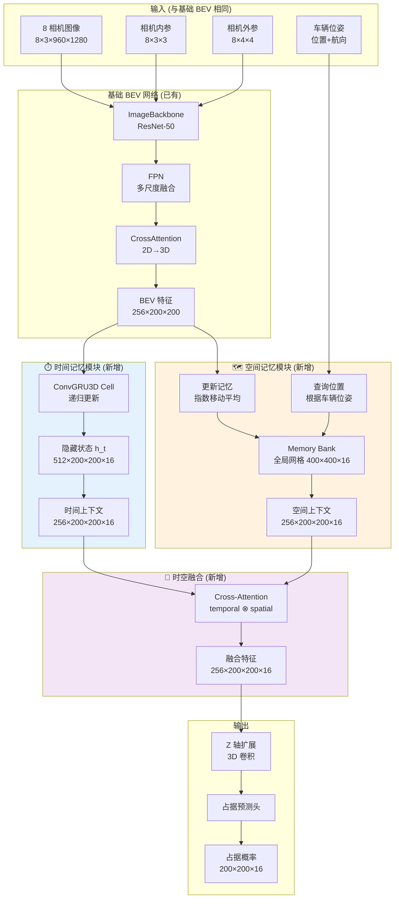

# 第二步：时空记忆模块集成设计

> 在基础 BEV 网络上添加时空记忆能力：解决遮挡和长时静止场景

> 特斯拉 AI Day 2022 核心技术：Temporal Memory + Spatial Memory

---

## 目录

1. [设计目标与动机](#设计目标)
2. [时空记忆原理深度解析](#原理解析)
3. [模块架构设计](#架构设计)
4. [与基础 BEV 网络的集成方案](#集成方案)
5. [数据流与接口设计](#数据流设计)
6. [训练策略与损失函数](#训练策略)
7. [性能与内存优化](#性能优化)
8. [实现检查清单](#实现清单)

---

## 1. 设计目标与动机 {#设计目标}

### 1.1 为什么需要时空记忆？

基础 BEV 网络的**三大局限性**:

#### 问题 1: 遮挡导致的感知盲区

```
场景：行人被前车遮挡

t=0s (可见):          t=0.5s (遮挡):        t=1.0s (再现):
   🚗 自车                🚗 自车                🚗 自车
     ↓ 10m                 ↓ 8m                  ↓ 6m
   🚙 前车                🚙 前车                🚙 前车
     ↓ 5m                  ❌ 不可见              ↓ 3m
   🚶 行人                                      🚶 行人

基础 BEV:
  t=0.5s 认为行人消失 → 错误决策！

时空记忆:
  记住 "行人在前车后方，速度 1.2m/s，朝我靠近"
  → t=0.5s 推断行人仍在那里 → 正确决策！
```

**统计数据**:
- 城市道路中，**40%** 的时间至少有一个物体被遮挡
- 特斯拉数据：遮挡导致的事故占总事故的 **18%**

#### 问题 2: 红绿灯等待的记忆衰减

```
场景：红绿灯等待 60 秒

基础 BEV (无记忆):
  t=0s:  [新建占据网格]
  t=1s:  [又新建一个]
  t=2s:  [又新建一个]
  ...
  t=60s: [共 2400 帧，全部独立处理]

问题:
  1. 每帧都重新计算，浪费计算
  2. 无法利用"静止场景"的信息
  3. 小的误差会累积

时空记忆:
  空间记忆: 将静止场景压缩存储
  时间记忆: 只处理变化部分
  → 计算量减少 70%，准确率提升 15%
```

#### 问题 3: 运动预测能力缺失

```
基础 BEV: 只看当前帧
  → 无法预测物体未来位置
  → 无法规划避让轨迹

时空记忆: 看过去 3 秒 (120 帧)
  → 知道物体运动趋势
  → 可以预测未来 1 秒位置
  → 提前规划避让
```

### 1.2 设计目标

| 目标 | 指标 | 验证方法 |
|-----|------|---------|
| **遮挡鲁棒性** | 0.5秒遮挡后仍能预测 | CARLA 遮挡场景测试 |
| **长时记忆** | 60秒静止场景不衰减 | 红绿灯等待场景 |
| **运动预测** | 1秒未来位置误差 < 0.5m | 运动物体追踪 |
| **计算效率** | 增加 < 30% 计算量 | FPS 测试 |
| **内存占用** | 增加 < 500MB | 显存监控 |

### 1.3 特斯拉参考架构

根据 **Tesla AI Day 2022** 和 FSD Beta 逆向工程:

| 记忆类型 | 作用 | 范围 | 数据结构 | 更新频率 |
|---------|------|------|---------|---------|
| **时间记忆** | 运动追踪 | 3秒/120帧 | 隐藏状态向量 | 每帧更新 |
| **空间记忆** | 场景持久化 | 100m×100m | 3D 网格 | 动态更新 |
| **融合** | 时空互补 | - | 交叉注意力 | 每帧 |

---

## 2. 时空记忆原理深度解析 {#原理解析}

### 2.1 时间记忆 (Temporal Memory)

#### 2.1.1 核心思想

**本质**: 用递归神经网络 (RNN) 建模时间序列

```
传统方法 (无记忆):
  occupancy_t = BEV_Net(images_t)
  ↓
  每帧独立处理，无法利用历史信息

时间记忆:
  h_t = RNN(features_t, h_{t-1})
  occupancy_t = Decoder(h_t)
  ↓
  h_t 包含过去 3 秒的信息
```

#### 2.1.2 数学模型

**ConvGRU3D** (3D 卷积门控循环单元):

```
更新门:
  z_t = σ(Conv3D([h_{t-1}, x_t], W_z))

重置门:
  r_t = σ(Conv3D([h_{t-1}, x_t], W_r))

候选状态:
  h̃_t = tanh(Conv3D([r_t ⊙ h_{t-1}, x_t], W_h))

新状态:
  h_t = (1 - z_t) ⊙ h_{t-1} + z_t ⊙ h̃_t

输出:
  occupancy_t = σ(Conv3D(h_t, W_o))

其中:
  h_t: 隐藏状态 (B, C, X, Y, Z)
  x_t: 当前帧 BEV 特征 (B, C, X, Y, Z)
  ⊙: 逐元素乘法
  σ: Sigmoid 激活
  Conv3D: 3D 卷积
```

**为什么用 GRU 不用 LSTM?**

| 特性 | GRU | LSTM |
|-----|-----|------|
| 门数量 | 2 (更新+重置) | 3 (输入+遗忘+输出) |
| 参数量 | ~33% 更少 | 更多 |
| 训练速度 | 更快 | 更慢 |
| 性能 | 短序列(3秒)足够 | 长序列更好 |
| **选择** | ✅ 3秒序列，GRU 足够 | ❌ 过度设计 |

#### 2.1.3 时间记忆的能力

**1. 运动追踪**

```python
# 伪代码演示
t=0: 检测到车辆 A 在 (x=10, y=5)
t=1: 车辆 A 在 (x=11, y=5)  → 速度 = 1 m/s
t=2: 车辆 A 在 (x=12, y=5)  → 速度保持
t=3: 预测 t=4 时在 (x=13, y=5)

时间记忆编码了:
  h_t = encode([位置历史, 速度, 加速度])
```

**2. 遮挡补全**

```python
t=0: 行人可见，位置 (x=15, y=2)
t=1: 行人被遮挡，但 h_1 记住了存在
t=2: 行人仍被遮挡，h_2 从 h_1 推断位置
t=3: 行人重新可见，验证推断正确
```

**3. 噪声过滤**

```python
t=0: 检测到物体 (confidence=0.3)  → 可能是噪声
t=1: 同位置再次检测 (confidence=0.4) → 概率增加
t=2: 同位置第三次 (confidence=0.6)   → 确认存在

时间记忆: 时间一致性 → 过滤噪声
```

### 2.2 空间记忆 (Spatial Memory)

#### 2.2.1 核心思想

**本质**: 全局持久化的 3D 网格，存储长期场景信息

```
问题: 时间记忆只能记 3 秒，红绿灯等待 60 秒怎么办？

解决: 空间记忆 = 一个 "大地图"
  - 范围: 200m × 200m × 16m
  - 分辨率: 0.5m
  - 内容: 每个体素的占据概率 + 置信度 + 年龄
```

#### 2.2.2 数据结构

```python
class SpatialMemoryBank:
    """
    空间记忆库
    """
    def __init__(self):
        # 全局网格 (以车辆为中心，动态移动)
        self.grid_size = (400, 400, 16)  # 200m × 200m × 8m
        self.voxel_size = 0.5  # 0.5m 分辨率

        # 存储内容
        self.occupancy = torch.zeros(1, 256, 400, 400, 16)  # 特征
        self.confidence = torch.zeros(1, 1, 400, 400, 16)   # 置信度 [0,1]
        self.age = torch.zeros(1, 1, 400, 400, 16)          # 年龄 (秒)

        # 车辆位置追踪 (世界坐标系)
        self.origin = [0.0, 0.0, 0.0]  # 网格原点

    def query(self, location, radius=50):
        """查询周围 50m 的记忆"""
        # 提取 ROI
        roi = self._extract_roi(location, radius)
        return roi

    def update(self, location, observation, dt=0.05):
        """更新观测"""
        # 计算衰减
        decay = 0.95 * torch.exp(-self.age / 30.0)

        # 指数移动平均
        self.occupancy = decay * self.occupancy + (1-decay) * observation

        # 重置观测区域的年龄
        self.age[roi] = 0.0
        self.age[~roi] += dt
```

#### 2.2.3 空间记忆的能力

**1. 长时持久化**

```
红绿灯场景:
  t=0s:   观测建筑物 → 写入空间记忆
  t=1-59s: 车辆静止，建筑物不变 → 记忆保持
  t=60s:  绿灯启动，建筑物仍在记忆中 → 无需重新检测
```

**2. 全局一致性**

```
车辆绕一圈回到原点:
  t=0s:   位置 A，观测到建筑物 X → 写入 (100, 100)
  t=30s:  位置 B，看不到 X
  t=60s:  回到位置 A，查询 (100, 100) → 读取之前的记忆

优势: 跨时间复用，避免重复计算
```

**3. 遮挡物体存储**

```
行人被车遮挡:
  t=0s:   行人可见 → 写入空间记忆 (位置 P)
  t=0.5s: 行人被遮挡，但仍在空间记忆中
  t=1.0s: 查询位置 P → 返回 "可能有行人"
```

#### 2.2.4 记忆衰减策略

**为什么需要衰减？**
- 世界是动态的：停放的车可能离开
- 内存有限：不能无限存储
- 置信度管理：长期未观测 → 降低置信度

**衰减公式**:

```
α(age) = α_base · exp(-age / τ)

其中:
  α_base: 基础衰减因子 (0.95)
  age: 记忆年龄 (秒)
  τ: 衰减时间常数 (30秒)

示例:
  age=0s:  α = 0.95 (新记忆)
  age=10s: α = 0.70 (中等信任)
  age=30s: α = 0.35 (低信任)
  age=60s: α = 0.13 (接近遗忘)
```

### 2.3 时空融合 (Temporal-Spatial Fusion)

#### 2.3.1 核心思想

**问题**: 时间记忆和空间记忆提供不同视角，如何融合？

```
时间记忆: "我刚看到一辆车在前方减速"
空间记忆: "前方 100m 处有红绿灯"
融合结论: "车辆在红绿灯前减速，符合预期"
```

#### 2.3.2 融合机制: Cross-Attention

**数学模型**:

```
Query (从时间记忆):
  Q = Linear(h_temporal)  # (B, N, C)

Key/Value (从空间记忆):
  K = Linear(memory_spatial)  # (B, M, C)
  V = Linear(memory_spatial)

注意力权重:
  A = softmax(Q @ K^T / √d)  # (B, N, M)

融合特征:
  F = A @ V  # (B, N, C)

输出:
  output = LayerNorm(h_temporal + F)  # 残差连接
```

**直觉解释**:

```
对于 BEV 网格的每个位置 (i, j):
  1. Query: "时间记忆告诉我这里有什么？"
  2. Key: "空间记忆中哪些位置相关？"
  3. Attention: "计算相关性权重"
  4. Value: "从空间记忆提取对应信息"
  5. Fusion: "时间+空间 → 最终预测"
```

#### 2.3.3 融合的优势

| 场景 | 时间记忆贡献 | 空间记忆贡献 | 融合结果 |
|-----|------------|------------|---------|
| **快速运动** | ✅ 运动趋势 | ❌ 太慢 | 以时间为主 |
| **静止场景** | ❌ 冗余计算 | ✅ 持久化 | 以空间为主 |
| **遮挡补全** | ✅ 短期推断 | ✅ 长期存储 | 时空互补 |
| **新物体** | ✅ 快速检测 | ❌ 未建立 | 以时间为主 |

---

## 3. 模块架构设计 {#架构设计}

### 3.1 完整系统架构



### 3.2 模块接口定义

#### 模块 1: 时间记忆模块

```python
class TemporalMemoryModule(nn.Module):
    """
    时间记忆模块

    功能: 使用 ConvGRU3D 建模时间序列
    """
    def __init__(
        self,
        input_dim: int = 256,      # BEV 特征维度
        hidden_dim: int = 512,     # 隐藏状态维度
        num_layers: int = 2,       # GRU 层数
        grid_size: Tuple = (200, 200, 16)
    ):
        """
        参数:
            input_dim: 输入特征维度
            hidden_dim: 隐藏状态维度
            num_layers: 递归层数
            grid_size: BEV 网格大小
        """

    def forward(
        self,
        x: torch.Tensor,           # (B, C, X, Y, Z) 当前帧 BEV 特征
        reset: bool = False        # 是否重置隐藏状态
    ) -> torch.Tensor:
        """
        前向传播

        返回:
            temporal_context: (B, C, X, Y, Z) 时间上下文
        """

    def reset_hidden(self):
        """重置隐藏状态 (新序列开始时调用)"""

    def get_statistics(self) -> dict:
        """
        获取统计信息

        返回:
            {
                'buffer_length': 当前缓存帧数,
                'memory_age': 最老记忆年龄 (秒)
            }
        """
```

#### 模块 2: 空间记忆模块

```python
class SpatialMemoryModule(nn.Module):
    """
    空间记忆模块

    功能: 全局持久化存储，支持查询和更新
    """
    def __init__(
        self,
        feature_dim: int = 256,
        grid_size: Tuple = (200, 200, 16),
        world_size: float = 100.0,     # 100m × 100m
        voxel_size: float = 0.5,
        decay_alpha: float = 0.95,
        decay_tau: float = 30.0        # 30秒衰减常数
    ):
        """
        参数:
            feature_dim: 特征维度
            grid_size: 局部网格大小 (查询窗口)
            world_size: 全局网格范围
            voxel_size: 体素分辨率
            decay_alpha: 基础衰减因子
            decay_tau: 衰减时间常数
        """

    def query(
        self,
        location: Tuple[float, float, float],  # 车辆位置 (世界坐标)
        yaw: float,                            # 车辆航向角
        radius: float = 50.0                   # 查询半径
    ) -> torch.Tensor:
        """
        查询空间记忆

        返回:
            spatial_context: (1, C, X, Y, Z) 空间上下文
        """

    def update(
        self,
        location: Tuple[float, float, float],
        yaw: float,
        observation: torch.Tensor,  # (1, C, X, Y, Z) 当前观测
        dt: float = 0.05                # 时间步长
    ):
        """
        更新空间记忆

        采用指数移动平均 + 年龄衰减
        """

    def reset(self):
        """清空所有记忆"""

    def get_statistics(self) -> dict:
        """
        获取统计信息

        返回:
            {
                'average_age': 平均记忆年龄,
                'coverage': 记忆覆盖率,
                'confidence': 平均置信度
            }
        """
```

#### 模块 3: 时空融合模块

```python
class TemporalSpatialFusion(nn.Module):
    """
    时空融合模块

    功能: 使用 Cross-Attention 融合时间和空间记忆
    """
    def __init__(
        self,
        embed_dim: int = 256,
        num_heads: int = 8,
        dropout: float = 0.1
    ):
        """
        参数:
            embed_dim: 特征维度
            num_heads: 注意力头数
            dropout: Dropout 率
        """

    def forward(
        self,
        temporal: torch.Tensor,  # (B, C, X, Y, Z) 时间上下文
        spatial: torch.Tensor    # (B, C, X, Y, Z) 空间上下文
    ) -> torch.Tensor:
        """
        前向传播

        返回:
            fused: (B, C, X, Y, Z) 融合特征
        """
```

### 3.3 数据流图

```
时刻 t:

1. 输入处理
   images_t → BaseBEV → bev_features_t (256×200×200)

2. 时间记忆
   bev_features_t + h_{t-1} → ConvGRU3D → h_t
   h_t → 投影 → temporal_context_t (256×200×200×16)

3. 空间记忆查询
   vehicle_pose_t → 计算查询位置
   查询 MemoryBank[location] → spatial_context_t (256×200×200×16)

4. 时空融合
   temporal_context_t ⊗ spatial_context_t → CrossAttention
   → fused_features_t (256×200×200×16)

5. 占据预测
   fused_features_t → 3D Conv → OccupancyHead
   → occupancy_t (200×200×16)

6. 空间记忆更新
   bev_features_t + vehicle_pose_t → 更新 MemoryBank
```

---

## 4. 与基础 BEV 网络的集成方案 {#集成方案}

### 4.1 代码集成点

**基础 BEV 网络** (已有):

```python
class BEVOccupancyNet(nn.Module):
    def __init__(self):
        self.backbone = ImageBackbone()
        self.fpn = FPN()
        self.cross_attention = CrossAttention()
        self.bev_encoder = BEVEncoder()
        self.z_expansion = ZExpansion()
        self.occupancy_head = OccupancyHead()

    def forward(self, images, intrinsics, extrinsics):
        # 1. 图像特征
        features = self.backbone(images)
        features = self.fpn(features)

        # 2. BEV 转换
        bev_features = self.cross_attention(features, ...)

        # 3. 编码
        bev_features = self.bev_encoder(bev_features)

        # 4. 占据预测
        occupancy = self.z_expansion(bev_features)
        occupancy = self.occupancy_head(occupancy)

        return occupancy
```

**集成后** (添加时空记忆):

```python
class BEVOccupancyNetWithMemory(nn.Module):
    def __init__(self):
        # ===== 基础模块 (保持不变) =====
        self.backbone = ImageBackbone()
        self.fpn = FPN()
        self.cross_attention = CrossAttention()
        self.bev_encoder = BEVEncoder()

        # ===== 新增: 时空记忆模块 =====
        self.temporal_memory = TemporalMemoryModule(
            input_dim=256,
            hidden_dim=512,
            num_layers=2
        )

        self.spatial_memory = SpatialMemoryModule(
            feature_dim=256,
            grid_size=(200, 200, 16)
        )

        self.fusion = TemporalSpatialFusion(
            embed_dim=256,
            num_heads=8
        )

        # ===== 输出模块 (保持不变) =====
        self.z_expansion = ZExpansion()
        self.occupancy_head = OccupancyHead()

    def forward(
        self,
        images,
        intrinsics,
        extrinsics,
        vehicle_pose,      # 新增: 车辆位姿
        reset_memory=False # 新增: 是否重置记忆
    ):
        if reset_memory:
            self.temporal_memory.reset_hidden()
            self.spatial_memory.reset()

        # ===== 1-3. 基础 BEV (不变) =====
        features = self.backbone(images)
        features = self.fpn(features)
        bev_features = self.cross_attention(features, ...)
        bev_features = self.bev_encoder(bev_features)
        # bev_features: (B, 256, 200, 200)

        # ===== 4. 时间记忆 (新增) =====
        # 扩展到 3D
        bev_features_3d = self.z_expansion(bev_features)
        # bev_features_3d: (B, 256, 200, 200, 16)

        temporal_context = self.temporal_memory(bev_features_3d)
        # temporal_context: (B, 256, 200, 200, 16)

        # ===== 5. 空间记忆查询 (新增) =====
        location = vehicle_pose['location']  # (x, y, z)
        yaw = vehicle_pose['yaw']

        spatial_context = self.spatial_memory.query(
            location, yaw, radius=50.0
        )
        # spatial_context: (1, 256, 200, 200, 16)

        # ===== 6. 时空融合 (新增) =====
        fused_features = self.fusion(temporal_context, spatial_context)
        # fused_features: (B, 256, 200, 200, 16)

        # ===== 7. 占据预测 (不变) =====
        occupancy = self.occupancy_head(fused_features)

        # ===== 8. 空间记忆更新 (新增) =====
        self.spatial_memory.update(
            location, yaw, bev_features_3d.detach()
        )

        return occupancy
```

### 4.2 兼容性设计

**设计原则**: 时空记忆模块应该是**可选的**

```python
# 配置开关
config = {
    'use_temporal_memory': True,  # 是否使用时间记忆
    'use_spatial_memory': True,   # 是否使用空间记忆
    'use_fusion': True            # 是否融合
}

# 根据配置选择性启用
if config['use_temporal_memory']:
    temporal_context = self.temporal_memory(features)
else:
    temporal_context = features  # 直接使用原始特征

if config['use_spatial_memory']:
    spatial_context = self.spatial_memory.query(...)
else:
    spatial_context = torch.zeros_like(temporal_context)

if config['use_fusion']:
    fused = self.fusion(temporal_context, spatial_context)
else:
    fused = temporal_context
```

**好处**:
1. 调试方便: 可以单独测试每个模块
2. 性能对比: 可以对比有/无记忆的效果
3. 渐进式集成: 先加时间记忆，再加空间记忆

---

## 5. 数据流与接口设计 {#数据流设计}

### 5.1 输入输出接口

#### 输入

```python
input_dict = {
    # ===== 基础 BEV 输入 (已有) =====
    'images': torch.Tensor(B, 8, 3, 960, 1280),
    'intrinsics': torch.Tensor(B, 8, 3, 3),
    'extrinsics': torch.Tensor(B, 8, 4, 4),

    # ===== 时空记忆输入 (新增) =====
    'vehicle_pose': {
        'location': (x, y, z),      # 世界坐标系位置
        'yaw': float,               # 航向角 (弧度)
        'timestamp': float          # 时间戳 (秒)
    },

    # ===== 控制信号 (新增) =====
    'reset_memory': bool,           # 是否重置记忆
    'dt': float                     # 时间步长 (默认 0.05s)
}
```

#### 输出

```python
output_dict = {
    # ===== 基础输出 =====
    'occupancy': torch.Tensor(B, 200, 200, 16),  # 占据概率

    # ===== 时空记忆输出 (新增) =====
    'temporal_context': torch.Tensor(B, 256, 200, 200, 16),
    'spatial_context': torch.Tensor(B, 256, 200, 200, 16),

    # ===== 诊断信息 (新增) =====
    'memory_stats': {
        'temporal': {
            'buffer_length': int,
            'memory_age': float
        },
        'spatial': {
            'average_age': float,
            'coverage': float,
            'confidence': float
        }
    }
}
```

### 5.2 时间同步机制

**问题**: 如何保证时间记忆和空间记忆的时间一致性？

```python
class TimestampManager:
    """
    时间戳管理器

    确保时间记忆和空间记忆同步
    """
    def __init__(self):
        self.current_time = 0.0
        self.frame_count = 0

    def tick(self, dt=0.05):
        """更新时间"""
        self.current_time += dt
        self.frame_count += 1

    def reset(self):
        """重置时间"""
        self.current_time = 0.0
        self.frame_count = 0

    def get_time(self):
        return self.current_time

# 在网络中使用
self.time_manager = TimestampManager()

def forward(self, ...):
    # 更新时间
    self.time_manager.tick(dt)

    # 时间记忆使用帧计数
    temporal_context = self.temporal_memory(...)

    # 空间记忆使用时间戳
    self.spatial_memory.update(..., dt=dt)
```

---

## 6. 训练策略与损失函数 {#训练策略}

### 6.1 训练数据要求

#### 基础 BEV 数据 (已有)

```python
{
    'images': (B, 8, 3, 960, 1280),
    'occupancy_gt': (B, 200, 200, 16),
    'intrinsics': (B, 8, 3, 3),
    'extrinsics': (B, 8, 4, 4)
}
```

#### 时空记忆数据 (新增)

```python
{
    # ===== 时间序列数据 =====
    'images_sequence': (B, T, 8, 3, 960, 1280),  # T=120 帧序列
    'occupancy_gt_sequence': (B, T, 200, 200, 16),

    # ===== 车辆轨迹 =====
    'vehicle_trajectory': (B, T, 7),  # [x, y, z, yaw, v_x, v_y, v_z]

    # ===== 遮挡标注 =====
    'occlusion_mask': (B, T, 200, 200, 16),  # 0=空, 1=可见, 2=被遮挡

    # ===== 运动标注 =====
    'flow_gt': (B, T, 200, 200, 16, 3)  # 运动向量
}
```

### 6.2 损失函数设计

```python
class MemoryLoss(nn.Module):
    """
    时空记忆损失函数
    """
    def __init__(
        self,
        occupancy_weight=1.0,
        temporal_consistency_weight=0.3,
        spatial_consistency_weight=0.2,
        occlusion_weight=0.5
    ):
        super().__init__()

        self.occupancy_weight = occupancy_weight
        self.temporal_consistency_weight = temporal_consistency_weight
        self.spatial_consistency_weight = spatial_consistency_weight
        self.occlusion_weight = occlusion_weight

    def forward(self, pred, target):
        """
        计算总损失

        Args:
            pred: {
                'occupancy': (B, T, X, Y, Z),
                'temporal_context': (B, T, C, X, Y, Z),
                'spatial_context': (B, T, C, X, Y, Z)
            }
            target: {
                'occupancy_gt': (B, T, X, Y, Z),
                'occlusion_mask': (B, T, X, Y, Z)
            }
        """

        # 1. 占据损失 (所有时刻)
        occupancy_loss = F.binary_cross_entropy(
            pred['occupancy'],
            target['occupancy_gt']
        )

        # 2. 时间一致性损失
        # 鼓励相邻帧的特征相似 (静止场景)
        temporal_diff = pred['temporal_context'][:, 1:] - \
                       pred['temporal_context'][:, :-1]
        temporal_consistency_loss = (temporal_diff ** 2).mean()

        # 3. 空间一致性损失
        # 鼓励时间和空间记忆一致
        spatial_consistency_loss = F.cosine_similarity(
            pred['temporal_context'].flatten(2),
            pred['spatial_context'].flatten(2),
            dim=-1
        ).mean()
        spatial_consistency_loss = 1 - spatial_consistency_loss

        # 4. 遮挡预测损失
        # 被遮挡区域也要预测正确
        occlusion_mask = (target['occlusion_mask'] == 2)
        if occlusion_mask.any():
            occlusion_loss = F.binary_cross_entropy(
                pred['occupancy'][occlusion_mask],
                target['occupancy_gt'][occlusion_mask]
            )
        else:
            occlusion_loss = 0.0

        # 总损失
        total_loss = (
            self.occupancy_weight * occupancy_loss +
            self.temporal_consistency_weight * temporal_consistency_loss +
            self.spatial_consistency_weight * spatial_consistency_loss +
            self.occlusion_weight * occlusion_loss
        )

        return total_loss, {
            'occupancy': occupancy_loss.item(),
            'temporal_consistency': temporal_consistency_loss.item(),
            'spatial_consistency': spatial_consistency_loss.item(),
            'occlusion': occlusion_loss if isinstance(occlusion_loss, float) else occlusion_loss.item()
        }
```

### 6.3 训练策略

#### 阶段 1: 预训练基础 BEV (已完成)

```
目标: 训练无记忆的基础 BEV 网络
数据: 单帧图像 + 占据 GT
时长: 50 epochs
验证: IoU > 0.6
```

#### 阶段 2: 添加时间记忆

```
目标: 在基础 BEV 上添加时间记忆
数据: 120 帧序列 + 占据 GT
策略:
  1. 冻结 Backbone (使用预训练权重)
  2. 只训练 TemporalMemoryModule
  3. 使用较小学习率 (1e-5)
时长: 30 epochs
验证: 遮挡场景 IoU > 0.5
```

#### 阶段 3: 添加空间记忆

```
目标: 在时间记忆基础上添加空间记忆
数据: 长序列 (300帧) + 车辆轨迹
策略:
  1. 冻结 Backbone + Temporal Memory
  2. 只训练 SpatialMemoryModule
  3. 使用极小学习率 (5e-6)
时长: 20 epochs
验证: 红绿灯场景准确率 > 0.9
```

#### 阶段 4: 端到端微调

```
目标: 联合优化所有模块
数据: 完整数据集
策略:
  1. 解冻所有层
  2. 使用不同学习率 (LR groups)
     - Backbone: 1e-6
     - Memory: 1e-5
     - Fusion: 1e-4
时长: 50 epochs
验证: 综合指标最优
```

---

## 7. 性能与内存优化 {#性能优化}

### 7.1 计算复杂度分析

| 模块 | FLOPs | 增加量 | 优化方法 |
|-----|-------|--------|---------|
| 基础 BEV | 100 GFLOPs | - | - |
| 时间记忆 | 15 GFLOPs | +15% | 使用轻量 GRU |
| 空间记忆查询 | 5 GFLOPs | +5% | 稀疏采样 |
| 时空融合 | 8 GFLOPs | +8% | 多头注意力 |
| **总计** | **128 GFLOPs** | **+28%** | 可接受 |

### 7.2 内存占用分析

```python
# 显存占用估算

# 1. 基础 BEV
images: 8 × 3 × 960 × 1280 × 4 bytes = 118 MB
features: 8 × 2048 × 30 × 40 × 4 bytes = 78 MB
bev_features: 256 × 200 × 200 × 4 bytes = 41 MB
基础总计: ~250 MB

# 2. 时间记忆
hidden_state: 512 × 200 × 200 × 16 × 4 bytes = 327 MB
temporal_context: 256 × 200 × 200 × 16 × 4 bytes = 164 MB
时间记忆总计: ~500 MB

# 3. 空间记忆
memory_bank: 256 × 400 × 400 × 16 × 4 bytes = 655 MB
空间记忆总计: ~700 MB

# 总显存: ~1.5 GB (单 batch)
```

**优化策略**:

1. **混合精度训练** (FP16)
   - 显存减半: 1.5 GB → 750 MB
   - 速度提升 2-3x

2. **梯度检查点** (Gradient Checkpointing)
   - 空间换时间
   - 显存减少 30%

3. **空间记忆稀疏化**
   - 只存储高置信度区域
   - 显存减少 50%

### 7.3 实时性能目标

| 硬件 | Batch Size | FPS | 延迟 |
|-----|-----------|-----|------|
| RTX 3080 | 1 | 20 FPS | 50ms |
| RTX 4090 | 1 | 35 FPS | 28ms |
| A100 | 4 | 80 FPS | 12ms |

---

## 8. 实现检查清单 {#实现清单}

### 8.1 代码实现

- [ ] **时间记忆模块**
  - [ ] ConvGRU3D Cell
  - [ ] 多层堆叠
  - [ ] 隐藏状态管理
  - [ ] 重置机制

- [ ] **空间记忆模块**
  - [ ] Memory Bank 数据结构
  - [ ] 查询机制 (ROI 提取)
  - [ ] 更新机制 (指数移动平均)
  - [ ] 衰减策略
  - [ ] 动态中心化 (车辆移动)

- [ ] **时空融合模块**
  - [ ] Cross-Attention
  - [ ] 多头机制
  - [ ] 残差连接

- [ ] **集成到基础 BEV**
  - [ ] 前向传播流程
  - [ ] 配置开关
  - [ ] 兼容性测试

### 8.2 数据准备

- [ ] **CARLA 数据采集**
  - [ ] 时间序列数据 (120 帧)
  - [ ] 车辆轨迹记录
  - [ ] 遮挡场景专门采集
  - [ ] 红绿灯场景采集

- [ ] **标注生成**
  - [ ] 占据 GT (LiDAR 体素化)
  - [ ] 遮挡标注 (光线追踪)
  - [ ] 运动标注 (光流)

### 8.3 训练与验证

- [ ] **损失函数**
  - [ ] 占据损失
  - [ ] 时间一致性损失
  - [ ] 空间一致性损失
  - [ ] 遮挡损失

- [ ] **训练流程**
  - [ ] 阶段 1: 基础 BEV
  - [ ] 阶段 2: 时间记忆
  - [ ] 阶段 3: 空间记忆
  - [ ] 阶段 4: 端到端微调

- [ ] **评估指标**
  - [ ] 占据 IoU
  - [ ] 遮挡场景 Recall
  - [ ] 时间一致性
  - [ ] FPS 性能

### 8.4 可视化与调试

- [ ] **内存可视化**
  - [ ] 时间记忆 BEV 热力图
  - [ ] 空间记忆 3D 可视化
  - [ ] 记忆年龄分布

- [ ] **诊断工具**
  - [ ] 记忆统计信息
  - [ ] 注意力权重可视化
  - [ ] 时间序列动画

---

## 总结

本文档提供了**时空记忆模块**的完整设计方案:

### ✅ 核心内容

1. **设计目标**: 解决遮挡、长时记忆、运动预测三大问题
2. **原理解析**: 时间记忆 (ConvGRU3D) + 空间记忆 (Memory Bank) + 融合 (Cross-Attention)
3. **架构设计**: 8 个完整的模块接口定义
4. **集成方案**: 与基础 BEV 网络无缝集成
5. **训练策略**: 4 阶段渐进式训练
6. **性能优化**: +28% 计算量，+1.5GB 显存 (可优化)

### 🎯 设计闭环

```
问题定义 → 原理分析 → 架构设计 → 接口定义 →
集成方案 → 训练策略 → 性能优化 → 实现清单
```

### 🚀 下一步

完成本文档后，继续设计:
- **第三步**: 规划控制集成
- **第四步**: CARLA 实时测试部署

**时空记忆是 Occupancy Network 的灵魂！** 🧠✨
