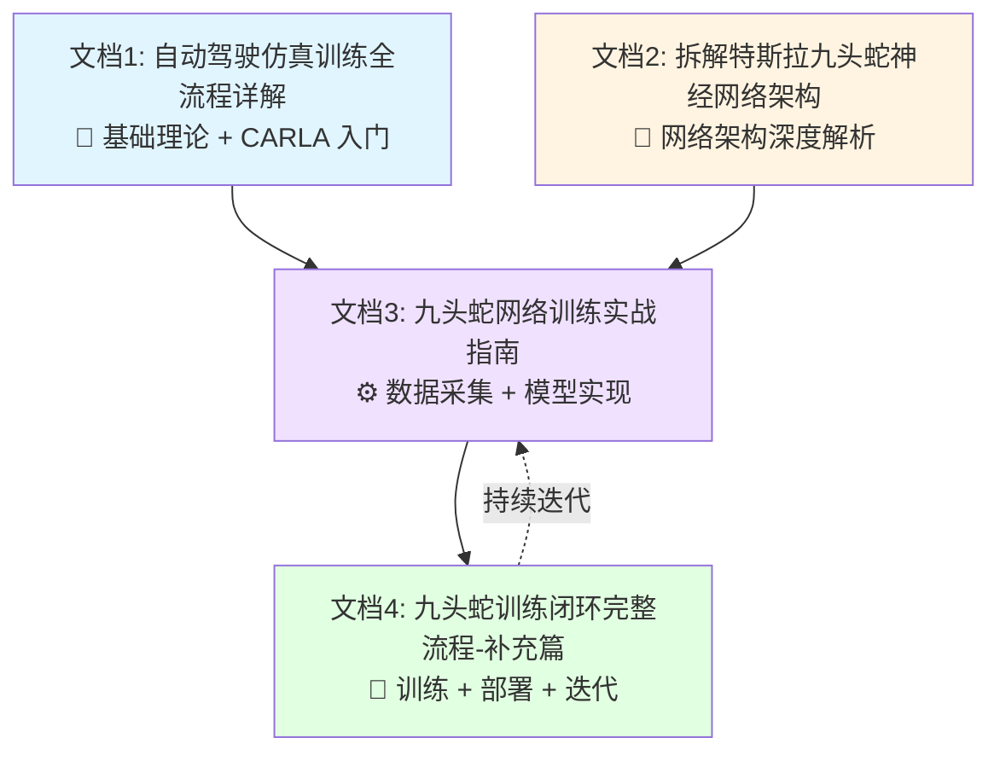

# 九头蛇自动驾驶虚拟训练闭环 - 文档导航

> 四个文档构成完整的虚拟环境 AI 进化闭环系统

---

## 📚 文档结构总览

本项目包含 **4 个核心文档**,共同构成从理论到实践的完整体系:



---

## 🎯 各文档职能划分

### 文档1: 《CARLA 自动驾驶仿真训练全流程详解》

**定位**: 基础理论和 CARLA 入门

**适合人群**: 自动驾驶新手,想了解仿真训练基本概念

**核心内容**:
- ✅ CARLA 仿真环境架构
- ✅ 传感器配置详解 (8相机 + LiDAR + IMU + GPS)
- ✅ 数据流从像素到控制指令
- ✅ ROS2 集成与行业标准
- ✅ 训练模式 vs 推理模式
- ✅ 端到端流程示例代码

**文件**: `自动驾驶仿真训练全流程详解.md`

**字数**: 约 2.0 万字

---

### 文档2: 《拆解特斯拉九头蛇神经网络架构》

**定位**: 深度技术解析

**适合人群**: 深度学习从业者,想理解 FSD 网络原理

**核心内容**:
- ✅ 九头蛇多任务学习架构
- ✅ EfficientNet-B4 Backbone 详解
- ✅ BEV Transformer (透视图→鸟瞰图)
- ✅ 时间 RNN (短期记忆,红绿灯追踪)
- ✅ 空间 RNN (等红灯时记忆保持)
- ✅ 9个任务头部完整实现
- ✅ 完整 PyTorch 代码 + 原理解释
- ✅ 损失函数设计

**文件**: `拆解特斯拉九头蛇神经网络架构.md`

**字数**: 约 3.5 万字

**亮点**: 每段代码都有详细的原理意图注释

---

### 文档3: 《九头蛇网络训练实战指南-CARLA-UE5》

**定位**: 实战操作手册

**适合人群**: 动手实践者,想构建完整训练系统

**核心内容**:
- ✅ 项目架构设计 (Mermaid 流程图)
- ✅ CARLA UE5 数据采集系统
  - 8相机阵列管理器
  - 多模态传感器融合 (GPS + IMU + 磁力计)
  - 卡尔曼滤波 + 互补滤波
- ✅ 自定义 UE5 传感器插件 (鱼眼相机 C++ 实现)
- ✅ 训练数据集构建
  - HDF5 高效存储
  - 数据增强
  - PyTorch DataLoader
- ✅ 多任务损失函数
  - 9个任务的完整损失定义
  - 不确定性加权
- ✅ 训练配置 (YAML)

**文件**: `九头蛇网络训练实战指南-CARLA-UE5.md`

**字数**: 约 2.0 万字 (1950+ 行代码)

**亮点**: 可直接运行的完整代码

---

### 文档4: 《九头蛇训练闭环完整流程-补充篇》 ⭐ 新增

**定位**: 闭环系统补全

**适合人群**: 所有人,这是让系统"活起来"的关键

**核心内容**:
- ✅ 完整训练脚本
  - 分布式训练 (DDP, 4-8 GPU)
  - 混合精度 (FP16)
  - 梯度累积
  - WandB 实验追踪
  - 早停和检查点管理
- ✅ 闭环测试完整实现
  - CARLA 自动驾驶 Agent
  - 实时推理 (<100ms)
  - 控制平滑和安全检查
- ✅ 持续学习迭代流程
  - 从训练模型收集新数据
  - 自动化迭代训练
- ✅ 快速开始脚本
  - 一键启动完整流程
  - 10分钟快速测试

**文件**: `九头蛇网络训练闭环完整流程-补充篇.md`

**字数**: 约 1.5 万字

**亮点**: 打通了虚拟环境 AI 持续进化的最后一环

---

## 🔄 完整闭环系统说明

### 虚拟环境闭环流程:

```
┌──────────────────────────────────────────────────────────────────┐
│                      虚拟环境 AI 进化闭环                           │
└──────────────────────────────────────────────────────────────────┘

第 0 次迭代 (冷启动):
  ┌─────────────────────────────────────────────────────────────┐
  │ 1. 使用 CARLA 自动驾驶 (Autopilot) 收集初始数据               │
  │    - 工具: carla_interface/data_collector.py                │
  │    - 输出: data/raw/*.h5                                    │
  │    - 参考: 文档3 第2章                                       │
  └─────────────────────────────────────────────────────────────┘
         ↓
  ┌─────────────────────────────────────────────────────────────┐
  │ 2. 训练九头蛇网络                                            │
  │    - 工具: training/trainer.py (分布式训练)                  │
  │    - 输出: checkpoints/best_model.pth                       │
  │    - 参考: 文档4 第1章                                       │
  └─────────────────────────────────────────────────────────────┘
         ↓
  ┌─────────────────────────────────────────────────────────────┐
  │ 3. 部署到 CARLA 进行闭环测试                                  │
  │    - 工具: deployment/carla_agent.py                        │
  │    - 输出: 性能指标 (成功率/碰撞率/平均速度)                   │
  │    - 参考: 文档4 第2章                                       │
  └─────────────────────────────────────────────────────────────┘
         ↓
  ┌─────────────────────────────────────────────────────────────┐
  │ 4. 识别失败案例 (碰撞/冲红灯/偏离车道)                         │
  └─────────────────────────────────────────────────────────────┘

第 N 次迭代 (N ≥ 1):
  ┌─────────────────────────────────────────────────────────────┐
  │ 1. 使用训练好的模型收集新数据                                  │
  │    - 重点采集失败场景                                         │
  │    - 使用 DAgger 算法 (专家纠正)                              │
  │    - 工具: data_collector.py --use_model best_model.pth     │
  └─────────────────────────────────────────────────────────────┘
         ↓
  ┌─────────────────────────────────────────────────────────────┐
  │ 2. 合并新旧数据,重新划分数据集                                │
  │    - 工具: dataset/split_dataset.py                         │
  └─────────────────────────────────────────────────────────────┘
         ↓
  ┌─────────────────────────────────────────────────────────────┐
  │ 3. 重新训练模型                                               │
  │    - 使用之前的检查点作为初始化 (Fine-tuning)                  │
  │    - 工具: training/trainer.py --resume best_model.pth      │
  └─────────────────────────────────────────────────────────────┘
         ↓
  ┌─────────────────────────────────────────────────────────────┐
  │ 4. 评估新模型性能                                             │
  │    - 工具: deployment/carla_agent.py                        │
  └─────────────────────────────────────────────────────────────┘
         ↓
  ┌─────────────────────────────────────────────────────────────┐
  │ 5. 性能提升? 是 → 更新 best_model | 否 → 回滚                 │
  └─────────────────────────────────────────────────────────────┘
         ↓
        重复迭代 N+1 ...
```

### 关键特性:

✅ **纯虚拟环境**: 不依赖真实车辆和 ROS2,全程在 CARLA 中完成

✅ **数据自洽**: 训练数据格式兼容 ROS2 标准,未来可无缝迁移真车

✅ **持续进化**: AI 在虚拟世界中不断学习,性能逐步提升

✅ **可观测性**: WandB 追踪每次迭代的性能变化

✅ **安全性**: 虚拟环境中可以放心测试极端场景 (碰撞/冲红灯)

---

## 🚀 快速开始

### 方式1: 一键启动完整流程

```bash
# 启动 CARLA 服务器
cd d:/code/carla
./CarlaUE5.exe -quality-level=Low &

# 运行完整流程 (数据采集 → 训练 → 测试)
bash scripts/quickstart.sh
```

**时长**: 约 2-4 小时 (取决于 GPU)

**参考**: 文档4 第4.1节

---

### 方式2: 分步执行

#### 步骤1: 数据采集 (30分钟)

```bash
python carla_interface/data_collector.py \
    --duration 1800 \
    --output_dir ./data/raw \
    --filename initial_data.h5 \
    --use_autopilot
```

**参考**: 文档3 第2.4节

---

#### 步骤2: 划分数据集

```bash
python dataset/split_dataset.py --data_root ./data
```

**参考**: 文档3 第4.2节

---

#### 步骤3: 训练模型 (2-4小时)

```bash
# 单 GPU
python training/trainer.py --config training/config.yaml

# 多 GPU (推荐)
bash scripts/train_distributed.sh
```

**参考**: 文档4 第1章

---

#### 步骤4: 闭环测试

```bash
python deployment/carla_agent.py \
    --model ./checkpoints/best_model.pth \
    --duration 600
```

**参考**: 文档4 第2章

---

### 方式3: 10分钟快速验证

```bash
bash scripts/quick_test.sh
```

**用途**: 验证环境配置是否正确

**参考**: 文档4 第4.2节

---

## 📊 性能指标

### 预期训练性能:

| 指标 | 目标值 | 说明 |
|-----|--------|------|
| **训练时长** | 2-4 小时 (100 epochs) | 4× RTX 3090 |
| **推理延迟** | < 100ms | FP16 TensorRT |
| **成功率** | > 90% | 闭环测试 10 公里 |
| **碰撞率** | < 0.5 次/公里 | 安全性指标 |
| **红灯违规率** | < 5% | 交通规则遵守 |

### 数据集规模:

- **初始数据**: 30 分钟 Autopilot → 约 36,000 帧 (20 FPS)
- **每次迭代新增**: 50 分钟 → 约 60,000 帧
- **10 次迭代后**: 约 600K 帧 (300 GB HDF5)

---

## 🛠️ 环境依赖

### 必需:
- CARLA 0.9.15 (UE5.5)
- Python 3.10+
- PyTorch 2.1+
- CUDA 11.8+
- 32GB+ RAM
- NVIDIA RTX 3070+ GPU

### 可选:
- TensorRT 8.6+ (推理加速)
- Weights & Biases (实验追踪)
- ROS2 Humble (真车部署)

**详细配置**: 参考主项目 `CLAUDE.md`

---

## 📖 阅读顺序建议

### 🔰 初学者路线:

```
文档1 (理论基础) → 文档3 (实战代码,跳过复杂部分) → 文档4 (快速开始)
```

### 🎓 进阶路线:

```
文档2 (网络架构) → 文档3 (完整实现) → 文档4 (闭环系统)
```

### ⚡ 快速上手路线:

```
文档4 (快速开始脚本) → 文档3 (数据采集部分) → 文档2 (理解网络)
```

---

## 🔍 关键技术亮点

### 1. 多模态传感器融合

- **卡尔曼滤波**: 融合 GPS (低频低精度) + IMU (高频高精度)
- **互补滤波**: 陀螺仪积分 + 加速度计重力估计
- **实现**: 文档3 第2.3节

### 2. BEV Transformer

- **几何感知 Cross-Attention**: 利用相机内外参计算注意力
- **8视角融合**: 透视图 → 统一鸟瞰图
- **实现**: 文档2 第4章

### 3. 时空 RNN

- **时间 RNN (ConvGRU)**: 记住被遮挡的红绿灯
- **空间 RNN (ConvLSTM)**: 等红灯时保持记忆而非清空
- **实现**: 文档2 第6-7章

### 4. 多任务学习

- **不确定性加权**: 自动平衡 9 个任务的重要性
- **共享 Backbone**: 参数减少 87.5% (152M → 19M)
- **实现**: 文档3 第5章

---

## ❓ 常见问题

### Q1: 为什么不用 ROS2?

**A**: 本项目专注于**虚拟环境闭环**,ROS2 是为真车部署准备的。但我们的数据格式兼容 ROS2 标准 (sensor_msgs, carla_msgs),未来可无缝迁移。

**参考**: 文档1 第7章

---

### Q2: 需要多大的 GPU?

**A**:
- **最低**: 单张 RTX 3070 (8GB) - 可训练,但 batch_size 需要减小
- **推荐**: 4× RTX 3090 (24GB) - 完整配置
- **最佳**: 8× A100 (40GB) - 最快训练速度

---

### Q3: 训练多久能看到效果?

**A**:
- **10 epochs (30 分钟)**: 模型开始学会转向
- **50 epochs (2 小时)**: 能在直线道路行驶
- **100 epochs (4 小时)**: 能处理转弯和红绿灯

---

### Q4: 为什么是"九头蛇"?

**A**: 特斯拉的命名,寓意多任务学习 (9个头部任务)。详细解释见文档2 第1章。

---

### Q5: 可以用真实数据训练吗?

**A**: 可以! 只需:
1. 真车采集 8 相机 + GPS + IMU 数据
2. 保存为 HDF5 格式 (参考文档3 第2.4节)
3. 运行相同的训练脚本

**迁移学习**: 可以用 CARLA 数据预训练,真实数据微调。

---

## 📝 文档维护

**最后更新**: 2025年

**更新内容**:
- ✅ 新增文档4 (闭环系统补全)
- ✅ 完善分布式训练脚本
- ✅ 添加持续学习迭代流程
- ✅ 一键启动脚本

**未来计划**:
- [ ] TensorRT 推理优化详解
- [ ] 更多场景测试 (雨天/夜间/极端天气)
- [ ] Sim2Real 迁移学习指南

---

## 🙏 致谢

感谢以下开源项目:
- CARLA 仿真器: https://github.com/carla-simulator/carla
- PyTorch 深度学习框架
- EfficientNet 轻量级 Backbone

---

## 📧 联系方式

如有问题或建议,欢迎在 GitHub Issue 中讨论!

---

**祝你在虚拟世界训练出强大的自动驾驶 AI! 🚗💨**
