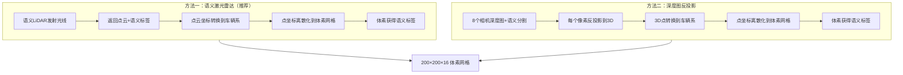
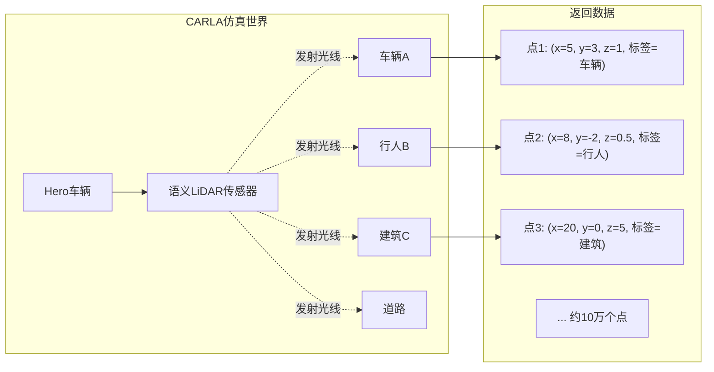
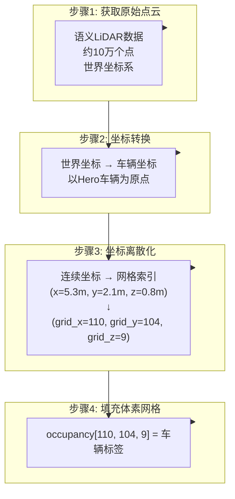
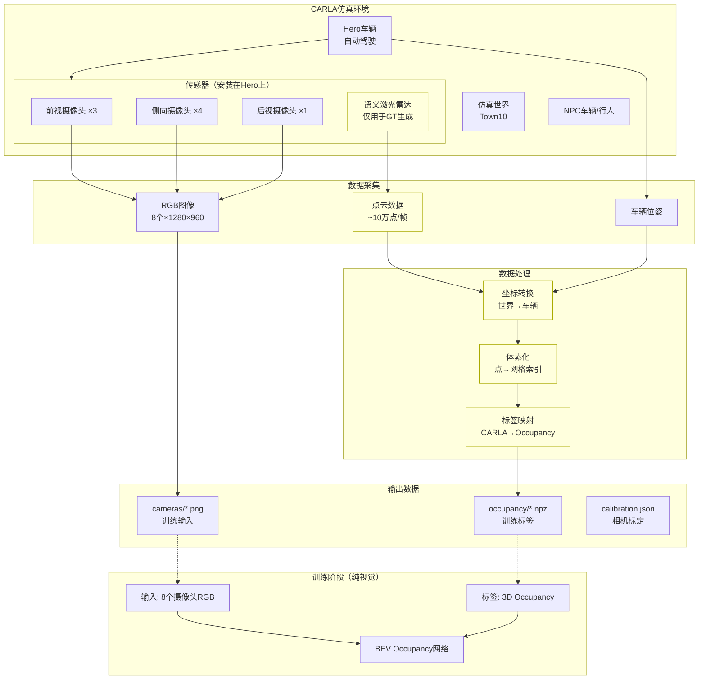

# CARLA 3D Occupancy 体素数据获取原理

> 解决核心问题：如何从CARLA获取以车辆为中心的3D体素空间标签？

---

## 一、您的卡点分析

### 1.1 您已经掌握的

```
✓ CARLA Python API 连接
✓ 生成NPC车辆和行人
✓ Hero车辆自动驾驶
✓ 安装摄像头并获取RGB图像
```

### 1.2 您的核心疑问

```
体素空间 200×200×16，以车辆为中心
         ↓
每个小立方体(体素)对应游戏世界中的一个位置
         ↓
❓ 如何知道每个位置有什么物体？
❓ 是遍历每个体素去查询CARLA吗？
```

### 1.3 答案预览

**不是遍历体素去查询，而是：**

```
CARLA传感器 → 告诉我们"哪些位置有什么物体" → 我们填充到体素网格
```

---

## 二、两种获取方法对比



| 对比项 | 语义激光雷达 | 深度图反投影 |
|--------|-------------|-------------|
| 精度 | 高（直接3D测量） | 中（受深度精度影响） |
| 遮挡处理 | 自动（光线被遮挡不返回） | 需要多视角融合 |
| 实现复杂度 | 简单 | 中等 |
| 计算量 | 低 | 高（8个相机×每像素） |
| **推荐度** | ⭐⭐⭐⭐⭐ | ⭐⭐⭐ |

---

## 三、方法一详解：语义激光雷达法

### 3.1 核心原理



**关键理解：**
- 语义LiDAR向四周发射大量光线（每秒约120万条）
- 每条光线碰到物体就返回：**碰撞点坐标 + 物体语义标签**
- 我们拿到的是一堆3D点，每个点都带有"这是什么"的标签

### 3.2 语义激光雷达数据格式

```python
# CARLA语义激光雷达返回的数据
# 每个点包含6个float32值：
point_data = [
    x,              # 世界坐标X
    y,              # 世界坐标Y  
    z,              # 世界坐标Z
    cos_angle,      # 入射角余弦（可忽略）
    object_idx,     # 物体实例ID
    semantic_tag,   # 语义标签（关键！）
]

# 语义标签对应关系（CARLA定义）
CARLA_SEMANTIC_TAGS = {
    0:  "Unlabeled",
    1:  "Building",
    4:  "Pedestrian",
    7:  "Road",
    8:  "Sidewalk",
    9:  "Vegetation",
    10: "Vehicles",
    12: "TrafficSign",
    # ... 共23种
}
```

### 3.3 从点云到体素的转换过程



### 3.4 具体计算公式

```python
# 体素空间配置
x_range = [-50, 50]    # 前后100米
y_range = [-50, 50]    # 左右100米  
z_range = [-4, 4]      # 上下8米
resolution = 0.5       # 每个体素0.5米

# 网格尺寸
grid_x = 200  # (50-(-50)) / 0.5 = 200
grid_y = 200
grid_z = 16   # (4-(-4)) / 0.5 = 16

# ========================================
# 核心转换公式
# ========================================

# 假设某个点在车辆坐标系下的坐标是 (px, py, pz)
# px = 5.3米（车辆右侧5.3米）
# py = 2.1米（车辆前方2.1米）
# pz = 0.8米（车辆上方0.8米）

# 转换为网格索引：
grid_idx_x = int((px - x_range[0]) / resolution)
           = int((5.3 - (-50)) / 0.5)
           = int(55.3 / 0.5)
           = 110

grid_idx_y = int((py - y_range[0]) / resolution)
           = int((2.1 - (-50)) / 0.5)
           = int(52.1 / 0.5)
           = 104

grid_idx_z = int((pz - z_range[0]) / resolution)
           = int((0.8 - (-4)) / 0.5)
           = int(4.8 / 0.5)
           = 9

# 该点的语义标签是"车辆"(标签10)，映射到Occupancy类别1
occupancy[110, 104, 9] = 1  # car
```

### 3.5 体素空间可视化理解

```
俯视图 (Z轴向上看)：

         前方 (+Y)
           ↑
     ┌─────────────────────┐
     │ · · · · · · · · · · │
     │ · · · ■ ■ · · · · · │  ← ■ 表示被车辆占据的体素
     │ · · · ■ ■ · · · · · │
     │ · · · · · · · · · · │
左 ←─│ · · · · ● · · · · · │─→ 右 (+X)
(-Y) │ · · · · · · · · · · │  ● = Hero车辆位置(原点)
     │ · · · · · · · · · · │
     │ · · · · · · · · · · │
     │ · · · · · · · · · · │
     └─────────────────────┘
           ↓
         后方 (-Y)

体素网格: 200×200 (俯视), 每格0.5米
总范围: 100米×100米

侧视图 (从右侧看)：

         上方 (+Z)
           ↑  ┌───┐
     ┌─────┼──┤建筑├──────┐
  4m │ · · · ·└───┘· · · · │
     │ · · ·┌─────┐· · · · │
     │ · · ·│ 车辆│· · · · │
  0m ├──────┼──●──┼────────┤ ← 地面
     │ · · ·└─────┘· · · · │
 -4m │ · · · · · · · · · · │
     └─────────────────────┘
           ↓
         下方 (-Z)

体素高度: 16层, 每层0.5米
总高度: 8米 (-4m 到 +4m)
```

---

## 四、完整代码实现

### 4.1 设置语义激光雷达

```python
import carla
import numpy as np

# 连接CARLA
client = carla.Client('localhost', 2000)
world = client.get_world()
bp_lib = world.get_blueprint_library()

# 获取Hero车辆（假设已生成）
hero_vehicle = ...

# ========================================
# 创建语义激光雷达
# ========================================
lidar_bp = bp_lib.find('sensor.lidar.ray_cast_semantic')

# 关键参数设置
lidar_bp.set_attribute('channels', '64')           # 64线
lidar_bp.set_attribute('points_per_second', '1200000')  # 每秒120万点
lidar_bp.set_attribute('rotation_frequency', '20')  # 20Hz旋转
lidar_bp.set_attribute('range', '100')              # 100米探测范围
lidar_bp.set_attribute('upper_fov', '15')           # 上视角15°
lidar_bp.set_attribute('lower_fov', '-25')          # 下视角-25°

# 安装位置：车顶中央
lidar_transform = carla.Transform(
    carla.Location(x=0, y=0, z=2.5)  # 车顶2.5米高
)

# 生成传感器
lidar_sensor = world.spawn_actor(
    lidar_bp, 
    lidar_transform, 
    attach_to=hero_vehicle
)

print("语义激光雷达已安装")
```

### 4.2 接收和解析点云数据

```python
import queue

# 创建数据队列
lidar_queue = queue.Queue()

# 设置回调函数
def lidar_callback(data):
    """接收激光雷达数据"""
    lidar_queue.put(data)

lidar_sensor.listen(lidar_callback)

# ========================================
# 获取一帧数据
# ========================================
world.tick()  # 同步模式下推进一帧

# 从队列获取数据
lidar_data = lidar_queue.get(timeout=2.0)

# ========================================
# 解析点云数据
# ========================================
# 原始数据是二进制格式，每个点6个float32
raw_data = np.frombuffer(lidar_data.raw_data, dtype=np.float32)
points = raw_data.reshape(-1, 6)

print(f"收到 {len(points)} 个点")
print(f"数据形状: {points.shape}")  # (N, 6)

# 分离各个字段
xyz_world = points[:, 0:3]      # 世界坐标 (N, 3)
cos_angle = points[:, 3]        # 入射角余弦
object_idx = points[:, 4]       # 物体实例ID
semantic_tag = points[:, 5].astype(np.int32)  # 语义标签

print(f"语义标签统计:")
unique, counts = np.unique(semantic_tag, return_counts=True)
for tag, count in zip(unique, counts):
    print(f"  标签{tag}: {count}个点")
```

### 4.3 坐标转换：世界坐标 → 车辆坐标

```python
def get_transform_matrix(transform):
    """
    将CARLA Transform转换为4×4变换矩阵
    """
    loc = transform.location
    rot = transform.rotation
    
    # 欧拉角转弧度
    pitch = np.radians(rot.pitch)
    yaw = np.radians(rot.yaw)
    roll = np.radians(rot.roll)
    
    # 计算旋转矩阵 (ZYX顺序)
    cy, sy = np.cos(yaw), np.sin(yaw)
    cp, sp = np.cos(pitch), np.sin(pitch)
    cr, sr = np.cos(roll), np.sin(roll)
    
    R = np.array([
        [cy*cp, cy*sp*sr - sy*cr, cy*sp*cr + sy*sr],
        [sy*cp, sy*sp*sr + cy*cr, sy*sp*cr - cy*sr],
        [-sp,   cp*sr,            cp*cr           ]
    ])
    
    # 组合为4×4矩阵
    T = np.eye(4)
    T[:3, :3] = R
    T[:3, 3] = [loc.x, loc.y, loc.z]
    
    return T

# ========================================
# 执行坐标转换
# ========================================

# 获取车辆当前位姿
ego_transform = hero_vehicle.get_transform()
ego_matrix = get_transform_matrix(ego_transform)
ego_matrix_inv = np.linalg.inv(ego_matrix)  # 逆矩阵

# 世界坐标转齐次坐标
N = xyz_world.shape[0]
xyz_homo = np.hstack([xyz_world, np.ones((N, 1))])  # (N, 4)

# 应用逆变换：世界坐标 → 车辆坐标
xyz_ego = (ego_matrix_inv @ xyz_homo.T).T[:, :3]  # (N, 3)

print(f"点云范围（车辆坐标系）:")
print(f"  X: {xyz_ego[:, 0].min():.1f} ~ {xyz_ego[:, 0].max():.1f} 米")
print(f"  Y: {xyz_ego[:, 1].min():.1f} ~ {xyz_ego[:, 1].max():.1f} 米")
print(f"  Z: {xyz_ego[:, 2].min():.1f} ~ {xyz_ego[:, 2].max():.1f} 米")
```

### 4.4 生成体素Occupancy网格

```python
class OccupancyGenerator:
    """
    将点云转换为3D Occupancy体素网格
    """
    
    def __init__(self):
        # 空间范围（米）
        self.x_range = [-50, 50]
        self.y_range = [-50, 50]
        self.z_range = [-4, 4]
        self.resolution = 0.5
        
        # 计算网格尺寸
        self.grid_size = [
            int((self.x_range[1] - self.x_range[0]) / self.resolution),  # 200
            int((self.y_range[1] - self.y_range[0]) / self.resolution),  # 200
            int((self.z_range[1] - self.z_range[0]) / self.resolution),  # 16
        ]
        
        # CARLA语义标签 → Occupancy类别 映射
        self.label_map = {
            0:  0,   # Unlabeled → empty
            1:  14,  # Building → building
            4:  6,   # Pedestrian → pedestrian
            7:  9,   # Road → road
            8:  10,  # Sidewalk → sidewalk
            9:  12,  # Vegetation → vegetation
            10: 1,   # Vehicles → car
            12: 16,  # TrafficSign → traffic_sign
            # ... 其他映射
        }
    
    def generate(self, xyz_ego, semantic_tags):
        """
        从车辆坐标系点云生成Occupancy网格
        
        参数:
            xyz_ego: (N, 3) 车辆坐标系下的点云
            semantic_tags: (N,) 每个点的CARLA语义标签
        
        返回:
            occupancy: (200, 200, 16) 体素标签
            mask: (200, 200, 16) 有效区域掩码
        """
        # 初始化空网格
        occupancy = np.zeros(self.grid_size, dtype=np.uint8)
        count = np.zeros(self.grid_size, dtype=np.int32)
        
        # ========================================
        # 核心：点坐标 → 网格索引
        # ========================================
        
        # 计算网格索引
        grid_x = ((xyz_ego[:, 0] - self.x_range[0]) / self.resolution).astype(np.int32)
        grid_y = ((xyz_ego[:, 1] - self.y_range[0]) / self.resolution).astype(np.int32)
        grid_z = ((xyz_ego[:, 2] - self.z_range[0]) / self.resolution).astype(np.int32)
        
        # 过滤超出范围的点
        valid = (
            (grid_x >= 0) & (grid_x < self.grid_size[0]) &
            (grid_y >= 0) & (grid_y < self.grid_size[1]) &
            (grid_z >= 0) & (grid_z < self.grid_size[2])
        )
        
        grid_x = grid_x[valid]
        grid_y = grid_y[valid]
        grid_z = grid_z[valid]
        tags = semantic_tags[valid]
        
        # 映射语义标签
        occ_labels = np.array([self.label_map.get(t, 0) for t in tags], dtype=np.uint8)
        
        # ========================================
        # 填充体素网格
        # ========================================
        for i in range(len(grid_x)):
            x, y, z = grid_x[i], grid_y[i], grid_z[i]
            label = occ_labels[i]
            
            # 非空标签优先
            if label != 0 or occupancy[x, y, z] == 0:
                occupancy[x, y, z] = label
                count[x, y, z] += 1
        
        # 生成有效掩码（有点云覆盖的区域）
        mask = count > 0
        
        return occupancy, mask


# ========================================
# 使用示例
# ========================================

generator = OccupancyGenerator()

# xyz_ego: 车辆坐标系下的点云 (N, 3)
# semantic_tag: CARLA语义标签 (N,)
occupancy, mask = generator.generate(xyz_ego, semantic_tag)

print(f"Occupancy网格形状: {occupancy.shape}")  # (200, 200, 16)
print(f"非空体素数量: {np.sum(occupancy > 0)}")
print(f"有效观测体素: {np.sum(mask)}")

# 统计各类别
for label in range(18):
    count = np.sum(occupancy == label)
    if count > 0:
        print(f"  类别{label}: {count}个体素")
```

---

## 五、完整数据流图



---

## 六、常见问题解答

### Q1: 为什么不直接遍历每个体素去查询CARLA？

```
❌ 遍历方法（不可行）:
   for x in range(200):
       for y in range(200):
           for z in range(16):
               world_pos = voxel_to_world(x, y, z)
               object = carla.query_object_at(world_pos)  # ← CARLA没有这个API！

✓ 正确方法:
   CARLA传感器主动告诉我们哪些位置有什么物体
   我们只需要把这些信息映射到体素网格
```

**原因：**
1. CARLA没有"查询某位置有什么物体"的API
2. 即使有，遍历200×200×16=640,000个体素会非常慢
3. 传感器方法更接近真实世界的数据采集方式

### Q2: 激光雷达点云是稀疏的，如何保证覆盖所有物体？

```
语义激光雷达配置:
- 64线，每秒120万点
- 以20Hz旋转，每帧约6万点
- 100米探测范围

这足以覆盖车辆周围100米×100米×8米的空间中的主要物体
```

### Q3: 为什么训练时不用激光雷达？

```
┌─────────────────────────────────────────────────────┐
│  数据采集阶段（仿真环境）                           │
│  ├── 输入: 语义激光雷达 → 生成精确的3D GT          │
│  └── 输出: RGB图像 + Occupancy标签                 │
├─────────────────────────────────────────────────────┤
│  训练阶段                                           │
│  ├── 输入: 8个摄像头RGB图像（仅此）                │
│  ├── 标签: 3D Occupancy体素                        │
│  └── 目标: 学习从图像预测3D占用                    │
├─────────────────────────────────────────────────────┤
│  部署阶段（真实车辆）                               │
│  ├── 输入: 8个摄像头RGB图像（仅此）                │
│  └── 输出: 预测的3D Occupancy                      │
│                                                     │
│  ★ 真实车辆可能没有激光雷达，所以模型必须纯视觉    │
└─────────────────────────────────────────────────────┘
```

---

## 七、封装成数据集

### 7.1 数据集目录结构

```
carla_occupancy_dataset/
├── sequences/
│   └── town10_clear_001/
│       ├── cameras/              # ← 训练输入（8个摄像头）
│       │   ├── front_narrow/000000.png
│       │   ├── front_main/000000.png
│       │   └── ... (8个文件夹)
│       │
│       ├── occupancy/            # ← 训练标签
│       │   └── 000000.npz        # occupancy(200,200,16) + mask
│       │
│       ├── calibration.json      # ← 相机内外参
│       └── ego_pose/             # ← 车辆位姿（可选）
│
└── splits/
    ├── train.txt
    ├── val.txt
    └── test.txt
```

### 7.2 PyTorch Dataset类

```python
from torch.utils.data import Dataset
import torch
import numpy as np
from PIL import Image

class CARLAOccupancyDataset(Dataset):
    """
    CARLA Occupancy数据集
    
    训练输入: 8个摄像头RGB图像
    训练标签: 3D Occupancy体素
    """
    
    def __init__(self, data_root, split='train'):
        self.data_root = data_root
        self.samples = self._load_split(split)
        self.camera_names = [
            'front_narrow', 'front_main', 'front_fisheye',
            'side_front_left', 'side_front_right',
            'side_rear_left', 'side_rear_right', 'rear'
        ]
    
    def __len__(self):
        return len(self.samples)
    
    def __getitem__(self, idx):
        sample_id = self.samples[idx]
        seq_name, frame_id = sample_id.split('/')
        seq_dir = f"{self.data_root}/sequences/{seq_name}"
        
        # 加载8个摄像头图像
        images = []
        for cam in self.camera_names:
            img = Image.open(f"{seq_dir}/cameras/{cam}/{frame_id}.png")
            img = torch.from_numpy(np.array(img)).permute(2,0,1).float() / 255.0
            images.append(img)
        images = torch.stack(images)  # [8, 3, H, W]
        
        # 加载Occupancy标签
        occ_data = np.load(f"{seq_dir}/occupancy/{frame_id}.npz")
        occupancy = torch.from_numpy(occ_data['occupancy'])  # [200, 200, 16]
        mask = torch.from_numpy(occ_data['mask'])
        
        return {
            'images': images,       # 训练输入
            'occupancy': occupancy, # 训练标签
            'mask': mask,
        }
```

### 7.3 训练循环示例

```python
from torch.utils.data import DataLoader

# 创建数据集
dataset = CARLAOccupancyDataset('./carla_occupancy_dataset', split='train')
dataloader = DataLoader(dataset, batch_size=4, shuffle=True)

# 训练循环
for batch in dataloader:
    # 获取数据
    images = batch['images']        # [B, 8, 3, H, W] ← 纯视觉输入
    occupancy_gt = batch['occupancy']  # [B, 200, 200, 16] ← 标签
    mask = batch['mask']
    
    # 前向传播
    occupancy_pred = model(images)  # 模型只看图像
    
    # 计算损失
    loss = criterion(occupancy_pred, occupancy_gt, mask)
    
    # 反向传播
    loss.backward()
    optimizer.step()
```

---

## 八、总结

```
核心理解：
┌───────────────────────────────────────────────────────────────┐
│  1. 不是遍历体素去查询CARLA                                   │
│     而是CARLA传感器告诉我们哪些位置有什么                      │
│                                                               │
│  2. 语义激光雷达返回：3D坐标 + 语义标签                        │
│     我们把这些点映射到体素网格中                               │
│                                                               │
│  3. 转换公式：                                                 │
│     grid_idx = (point_coord - range_min) / resolution         │
│                                                               │
│  4. 激光雷达仅用于生成GT，训练时纯视觉                         │
│     输入: 8个摄像头RGB → 输出: 预测3D Occupancy                │
└───────────────────────────────────────────────────────────────┘
```