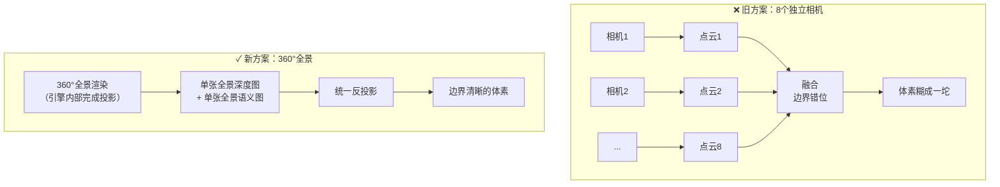
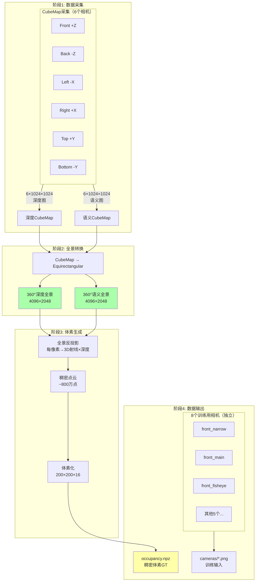

# 基于360°全景深度图的稠密3D体素生成：CARLA自动驾驶数据集终极方案

> 为什么你的体素"糊成一坨"分不清物体边界？答案是：你需要360°全景视角！

---

## 一、问题诊断：为什么8相机方案会"糊"

### 1.1 致命缺陷

当你用8个独立相机分别处理时，会遇到这些问题：

```
问题1：物体被"切断"

    相机1视野        相机2视野
    ┌─────────┐    ┌─────────┐
    │      ■■■│    │■■■      │
    │      ■■■│    │■■■      │  ← 同一辆车被切成两半
    │      ■■■│    │■■■      │     分别处理后无法识别是同一物体
    └─────────┘    └─────────┘

问题2：边界处深度不一致

    相机1计算的深度: 15.3m ─┐
                           ├─ 同一点，两个深度值！
    相机2计算的深度: 15.1m ─┘
    
    融合后产生"重影"或"撕裂"

问题3：语义分割边界错位

    相机1边界: ████████░░░░
    相机2边界: ░░░████████    ← 边界不对齐
    
    融合后物体边缘"毛刺"
```

### 1.2 激光雷达为什么没这个问题？

```
激光雷达：360°连续扫描
         
         一次扫描看到完整物体
              ↓
    ┌─────────────────────┐
    │    ████████████     │
    │    ██  车辆  ██     │  ← 完整的一个物体
    │    ████████████     │
    └─────────────────────┘

深度图方案的目标：达到同样的360°整体感知！
```

### 1.3 解决方案

**用360°全景图替代8个独立相机图！**

```
360°全景深度图（Equirectangular投影，2:1宽高比）：

┌────────────────────────────────────────────────────────┐
│                                                        │
│  前方    左前    左侧    左后    后方    右后    右侧    右前  │
│  ████   ████   ████   ████   ████   ████   ████   ████ │
│                     连续无缝                            │
│                     物体完整                            │
│                     边界清晰                            │
└────────────────────────────────────────────────────────┘
         宽度 = 360°，高度 = 180°（或自定义范围）
```

---

## 二、360°全景投影原理

### 2.1 Equirectangular投影（等距圆柱投影）

这是最常用的全景图格式，就像世界地图的展开方式：

```
3D球面 → 2D矩形

       北极
         ●
        /|\
       / | \
      /  |  \
     ●───●───●  ← 赤道（水平0°）
      \  |  /
       \ | /
        \|/
         ●
       南极

展开后：
┌──────────────────────────────┐
│ 北极（+90°）                  │
├──────────────────────────────┤
│                              │
│         赤道（0°）            │  ← 2:1 宽高比
│                              │
├──────────────────────────────┤
│ 南极（-90°）                  │
└──────────────────────────────┘
  0°   90°  180°  270°  360°
  前    左    后    右    前
```

### 2.2 坐标映射公式

```
全景图像素 (u, v) ↔ 球面角度 (θ, φ) ↔ 3D方向 (dx, dy, dz)

像素 → 角度：
  θ = (u / width) × 2π          # 水平角度 [0, 2π]
  φ = (v / height - 0.5) × π    # 垂直角度 [-π/2, π/2]

角度 → 3D方向：
  dx = cos(φ) × sin(θ)   # 右
  dy = sin(φ)            # 上
  dz = cos(φ) × cos(θ)   # 前

3D点 = 相机位置 + 方向 × 深度
```

### 2.3 为什么全景图解决了边界问题？



**关键区别**：
- 旧方案：8次独立渲染 → 8次独立处理 → 融合时出问题
- 新方案：1次全景渲染 → 1次统一处理 → 天然无缝

---

## 三、CARLA全景相机实现方案

### 3.1 方案选择

CARLA没有直接的Equirectangular全景相机，但有两种实现方式：

| 方案 | 原理 | 优点 | 缺点 |
|------|------|------|------|
| **CubeMap拼接** | 6个90°相机 → 立方体贴图 → 展开为全景 | 实现简单 | 接缝处有微小误差 |
| **自定义Shader** | 修改UE5渲染管线 | 完美无缝 | 需要改引擎源码 |

**推荐方案：CubeMap拼接**（实用性最强）

### 3.2 CubeMap原理

```
6个相机，每个90°视野，朝向立方体6个面：

              ┌─────┐
              │ Top │
              │ +Y  │
        ┌─────┼─────┼─────┬─────┐
        │Left │Front│Right│Back │
        │ -X  │ +Z  │ +X  │ -Z  │
        └─────┼─────┼─────┴─────┘
              │Bottm│
              │ -Y  │
              └─────┘

6张图 → 组合成CubeMap → 转换为Equirectangular全景
```

### 3.3 CubeMap相机配置

```python
# 6个相机的朝向（Rotation: pitch, yaw, roll）
CUBEMAP_CAMERAS = {
    'front':  {'rotation': (0, 0, 0),      'face': '+Z'},   # 前
    'back':   {'rotation': (0, 180, 0),    'face': '-Z'},   # 后
    'left':   {'rotation': (0, -90, 0),    'face': '-X'},   # 左
    'right':  {'rotation': (0, 90, 0),     'face': '+X'},   # 右
    'top':    {'rotation': -90, 0, 0),     'face': '+Y'},   # 上
    'bottom': {'rotation': (90, 0, 0),     'face': '-Y'},   # 下
}

# 每个相机配置
CUBE_FACE_SIZE = 1024  # 每个面1024×1024
FOV = 90  # 必须是90°才能无缝拼接
```

---

## 四、完整数据流架构



### 4.1 为什么还需要8个训练相机？

```
┌─────────────────────────────────────────────────────────────┐
│  区分两件事：                                               │
│                                                             │
│  1. GT生成：用360°全景 → 整体感知 → 稠密体素               │
│                                                             │
│  2. 训练输入：用8个普通相机 → 模拟真实车载摄像头            │
│                                                             │
│  训练目标：模型从8个普通相机图像 → 预测360°稠密体素         │
└─────────────────────────────────────────────────────────────┘
```

---

## 五、核心算法实现

### 5.1 CubeMap → Equirectangular 转换

这是整个方案最核心的算法：

```python
import numpy as np

def cubemap_to_equirectangular(cube_faces, output_size=(4096, 2048)):
    """
    将6个CubeMap面转换为Equirectangular全景图
    
    参数:
        cube_faces: dict, 包含6个面的图像
            {
                'front': (H, W, C),   # +Z
                'back': (H, W, C),    # -Z
                'left': (H, W, C),    # -X
                'right': (H, W, C),   # +X
                'top': (H, W, C),     # +Y
                'bottom': (H, W, C),  # -Y
            }
        output_size: (width, height) 输出全景图尺寸
    
    返回:
        panorama: (H, W, C) Equirectangular全景图
    """
    out_w, out_h = output_size
    face_size = cube_faces['front'].shape[0]
    
    # 输出图像
    if len(cube_faces['front'].shape) == 3:
        channels = cube_faces['front'].shape[2]
        panorama = np.zeros((out_h, out_w, channels), dtype=cube_faces['front'].dtype)
    else:
        panorama = np.zeros((out_h, out_w), dtype=cube_faces['front'].dtype)
    
    # ========================================
    # 步骤1: 生成全景图每个像素对应的球面角度
    # ========================================
    u = np.arange(out_w)
    v = np.arange(out_h)
    u, v = np.meshgrid(u, v)
    
    # 像素 → 球面角度
    # θ: 水平角度 [0, 2π], 从+Z轴开始逆时针
    # φ: 垂直角度 [-π/2, π/2], 从赤道开始
    theta = (u / out_w) * 2 * np.pi        # [0, 2π]
    phi = (v / out_h - 0.5) * np.pi        # [-π/2, π/2]
    
    # ========================================
    # 步骤2: 球面角度 → 3D方向向量
    # ========================================
    # 右手坐标系: X右, Y上, Z前
    dx = np.cos(phi) * np.sin(theta)   # X: 右
    dy = -np.sin(phi)                   # Y: 上 (注意负号，因为图像v轴向下)
    dz = np.cos(phi) * np.cos(theta)   # Z: 前
    
    # ========================================
    # 步骤3: 确定每个方向对应的CubeMap面
    # ========================================
    abs_x, abs_y, abs_z = np.abs(dx), np.abs(dy), np.abs(dz)
    
    # 找到主轴（绝对值最大的分量）
    max_axis = np.argmax(np.stack([abs_x, abs_y, abs_z], axis=-1), axis=-1)
    
    # 根据主轴和符号确定面
    # 0: X轴, 1: Y轴, 2: Z轴
    face_map = np.zeros_like(max_axis, dtype=np.int32)
    
    # +X (right)
    face_map[(max_axis == 0) & (dx > 0)] = 0
    # -X (left)
    face_map[(max_axis == 0) & (dx < 0)] = 1
    # +Y (top)
    face_map[(max_axis == 1) & (dy > 0)] = 2
    # -Y (bottom)
    face_map[(max_axis == 1) & (dy < 0)] = 3
    # +Z (front)
    face_map[(max_axis == 2) & (dz > 0)] = 4
    # -Z (back)
    face_map[(max_axis == 2) & (dz < 0)] = 5
    
    # ========================================
    # 步骤4: 计算CubeMap面上的UV坐标
    # ========================================
    face_u = np.zeros_like(dx)
    face_v = np.zeros_like(dy)
    
    # 对每个面计算UV
    # +X (right): u = -z/x, v = -y/x
    mask = face_map == 0
    face_u[mask] = -dz[mask] / dx[mask]
    face_v[mask] = -dy[mask] / dx[mask]
    
    # -X (left): u = z/(-x), v = -y/(-x)
    mask = face_map == 1
    face_u[mask] = dz[mask] / (-dx[mask])
    face_v[mask] = -dy[mask] / (-dx[mask])
    
    # +Y (top): u = x/y, v = z/y
    mask = face_map == 2
    face_u[mask] = dx[mask] / dy[mask]
    face_v[mask] = dz[mask] / dy[mask]
    
    # -Y (bottom): u = x/(-y), v = -z/(-y)
    mask = face_map == 3
    face_u[mask] = dx[mask] / (-dy[mask])
    face_v[mask] = -dz[mask] / (-dy[mask])
    
    # +Z (front): u = x/z, v = -y/z
    mask = face_map == 4
    face_u[mask] = dx[mask] / dz[mask]
    face_v[mask] = -dy[mask] / dz[mask]
    
    # -Z (back): u = -x/(-z), v = -y/(-z)
    mask = face_map == 5
    face_u[mask] = -dx[mask] / (-dz[mask])
    face_v[mask] = -dy[mask] / (-dz[mask])
    
    # ========================================
    # 步骤5: UV [-1,1] → 像素坐标 [0, face_size-1]
    # ========================================
    pixel_u = ((face_u + 1) / 2 * (face_size - 1)).astype(np.int32)
    pixel_v = ((face_v + 1) / 2 * (face_size - 1)).astype(np.int32)
    
    # 裁剪到有效范围
    pixel_u = np.clip(pixel_u, 0, face_size - 1)
    pixel_v = np.clip(pixel_v, 0, face_size - 1)
    
    # ========================================
    # 步骤6: 从CubeMap采样
    # ========================================
    face_names = ['right', 'left', 'top', 'bottom', 'front', 'back']
    
    for face_idx, face_name in enumerate(face_names):
        mask = face_map == face_idx
        if len(cube_faces[face_name].shape) == 3:
            panorama[mask] = cube_faces[face_name][pixel_v[mask], pixel_u[mask], :]
        else:
            panorama[mask] = cube_faces[face_name][pixel_v[mask], pixel_u[mask]]
    
    return panorama
```

### 5.2 全景深度图反投影

```python
def unproject_panorama_to_pointcloud(depth_pano, semantic_pano):
    """
    将360°全景深度图反投影为3D点云
    
    这是与普通相机完全不同的反投影方式！
    
    参数:
        depth_pano: (H, W) 全景深度图，单位米
        semantic_pano: (H, W) 全景语义分割图
    
    返回:
        points: (N, 3) 3D点云，车辆坐标系
        labels: (N,) 语义标签
    """
    H, W = depth_pano.shape
    
    # ========================================
    # 步骤1: 生成像素网格
    # ========================================
    u = np.arange(W)
    v = np.arange(H)
    u, v = np.meshgrid(u, v)
    
    # ========================================
    # 步骤2: 像素 → 球面角度
    # ========================================
    # θ: 水平角度 [0, 2π]
    # φ: 垂直角度 [π/2, -π/2] (从上到下)
    theta = (u / W) * 2 * np.pi
    phi = (0.5 - v / H) * np.pi
    
    # ========================================
    # 步骤3: 球面角度 → 3D方向向量
    # ========================================
    # 车辆坐标系: X前, Y左, Z上 (CARLA惯例)
    # 全景图: θ=0 对应前方 (+X)
    
    dir_x = np.cos(phi) * np.cos(theta)   # 前
    dir_y = np.cos(phi) * np.sin(theta)   # 左
    dir_z = np.sin(phi)                    # 上
    
    # ========================================
    # 步骤4: 方向 × 深度 = 3D点
    # ========================================
    depth = depth_pano
    
    x = dir_x * depth
    y = dir_y * depth
    z = dir_z * depth
    
    # ========================================
    # 步骤5: 过滤无效点
    # ========================================
    valid = (depth > 0.1) & (depth < 100.0)
    
    points = np.stack([x, y, z], axis=-1)[valid]  # (N, 3)
    labels = semantic_pano[valid]                  # (N,)
    
    return points, labels
```

### 5.3 语义标签映射

```python
# CARLA语义标签 → Occupancy类别
CARLA_TO_OCCUPANCY = {
    0:  0,   # Unlabeled → empty
    1:  14,  # Building → building
    2:  8,   # Fence → barrier
    3:  0,   # Other → empty
    4:  6,   # Pedestrian → pedestrian
    5:  15,  # Pole → pole
    6:  9,   # RoadLine → road
    7:  9,   # Road → road
    8:  10,  # Sidewalk → sidewalk
    9:  12,  # Vegetation → vegetation
    10: 1,   # Vehicles → car (默认)
    11: 14,  # Wall → building
    12: 16,  # TrafficSign → traffic_sign
    13: 0,   # Sky → empty
    14: 0,   # Ground → empty (会被道路覆盖)
    15: 14,  # Bridge → building
    16: 0,   # RailTrack → empty
    17: 8,   # GuardRail → barrier
    18: 16,  # TrafficLight → traffic_sign
    19: 0,   # Static → empty
    20: 0,   # Dynamic → empty
    21: 0,   # Water → empty
    22: 13,  # Terrain → terrain
}

def map_semantic_labels(carla_labels):
    """将CARLA语义标签映射到Occupancy类别"""
    occupancy_labels = np.zeros_like(carla_labels)
    for carla_id, occ_id in CARLA_TO_OCCUPANCY.items():
        occupancy_labels[carla_labels == carla_id] = occ_id
    return occupancy_labels
```

---

## 六、完整脚手架代码

### 6.1 程序结构

```
panorama_occupancy_generator/
├── main.py                    # 入口
├── sensor_manager.py          # 传感器管理
├── cubemap_processor.py       # CubeMap处理
├── panorama_converter.py      # 全景转换
├── voxel_generator.py         # 体素生成
├── dataset_writer.py          # 数据保存
└── config.py                  # 配置
```

### 6.2 核心类实现

```python
#!/usr/bin/env python3
"""
基于360°全景深度图的稠密Occupancy数据集生成器

特点：
1. 使用CubeMap（6个相机）生成360°全景
2. 全景图统一反投影，避免跨相机边界问题
3. 生成稠密、边界清晰的3D体素

使用方法：
    python panorama_occupancy_generator.py --map Town10HD_Opt --frames 1000
"""

import carla
import numpy as np
import cv2
import queue
import os
import json
from datetime import datetime


# ============================================================
# 配置
# ============================================================

# CubeMap配置
CUBE_FACE_SIZE = 1024
CUBE_FOV = 90

# CubeMap 6个面的配置
CUBEMAP_FACES = {
    'front':  {'pitch': 0,   'yaw': 0,    'roll': 0},    # +Z
    'back':   {'pitch': 0,   'yaw': 180,  'roll': 0},    # -Z
    'left':   {'pitch': 0,   'yaw': -90,  'roll': 0},    # -X
    'right':  {'pitch': 0,   'yaw': 90,   'roll': 0},    # +X
    'top':    {'pitch': -90, 'yaw': 0,    'roll': 0},    # +Y
    'bottom': {'pitch': 90,  'yaw': 0,    'roll': 0},    # -Y
}

# 全景图尺寸
PANORAMA_WIDTH = 4096
PANORAMA_HEIGHT = 2048

# 8个训练用相机（与之前相同）
TRAINING_CAMERAS = {
    'front_narrow': {'location': (2.0, 0, 1.8), 'rotation': (0, 0, 0), 'fov': 35},
    'front_main':   {'location': (1.5, 0, 1.8), 'rotation': (0, 0, 0), 'fov': 60},
    'front_fisheye':{'location': (1.5, 0, 1.8), 'rotation': (0, 0, 0), 'fov': 170},
    'side_front_left': {'location': (0.5, -0.8, 1.8), 'rotation': (0, -60, 0), 'fov': 120},
    'side_front_right':{'location': (0.5, 0.8, 1.8),  'rotation': (0, 60, 0),  'fov': 120},
    'side_rear_left':  {'location': (-0.5, -0.8, 1.8),'rotation': (0, -120, 0),'fov': 120},
    'side_rear_right': {'location': (-0.5, 0.8, 1.8), 'rotation': (0, 120, 0), 'fov': 120},
    'rear':         {'location': (-2.0, 0, 1.8), 'rotation': (0, 180, 0), 'fov': 150},
}

# 体素配置
VOXEL_CONFIG = {
    'x_range': [-50, 50],
    'y_range': [-50, 50],
    'z_range': [-4, 4],
    'resolution': 0.5,
}


# ============================================================
# CubeMap传感器管理器
# ============================================================

class CubeMapSensorManager:
    """管理CubeMap的6个相机"""
    
    def __init__(self, world, vehicle):
        self.world = world
        self.vehicle = vehicle
        self.bp_lib = world.get_blueprint_library()
        
        self.depth_sensors = {}
        self.semantic_sensors = {}
        self.depth_queues = {}
        self.semantic_queues = {}
        
        # CubeMap安装位置（车顶中央）
        self.cubemap_location = carla.Location(x=0, y=0, z=2.5)
    
    def setup(self):
        """创建6个深度相机和6个语义分割相机"""
        for face_name, face_rot in CUBEMAP_FACES.items():
            transform = carla.Transform(
                self.cubemap_location,
                carla.Rotation(
                    pitch=face_rot['pitch'],
                    yaw=face_rot['yaw'],
                    roll=face_rot['roll']
                )
            )
            
            # 深度相机
            depth_bp = self.bp_lib.find('sensor.camera.depth')
            depth_bp.set_attribute('image_size_x', str(CUBE_FACE_SIZE))
            depth_bp.set_attribute('image_size_y', str(CUBE_FACE_SIZE))
            depth_bp.set_attribute('fov', str(CUBE_FOV))
            
            depth_sensor = self.world.spawn_actor(depth_bp, transform, attach_to=self.vehicle)
            depth_queue = queue.Queue()
            depth_sensor.listen(depth_queue.put)
            
            self.depth_sensors[face_name] = depth_sensor
            self.depth_queues[face_name] = depth_queue
            
            # 语义分割相机
            sem_bp = self.bp_lib.find('sensor.camera.semantic_segmentation')
            sem_bp.set_attribute('image_size_x', str(CUBE_FACE_SIZE))
            sem_bp.set_attribute('image_size_y', str(CUBE_FACE_SIZE))
            sem_bp.set_attribute('fov', str(CUBE_FOV))
            
            sem_sensor = self.world.spawn_actor(sem_bp, transform, attach_to=self.vehicle)
            sem_queue = queue.Queue()
            sem_sensor.listen(sem_queue.put)
            
            self.semantic_sensors[face_name] = sem_sensor
            self.semantic_queues[face_name] = sem_queue
        
        print(f"已创建CubeMap传感器: 6×深度 + 6×语义分割")
    
    def get_cubemap_data(self, timeout=2.0):
        """获取一帧CubeMap数据"""
        depth_faces = {}
        semantic_faces = {}
        
        for face_name in CUBEMAP_FACES.keys():
            # 深度
            depth_data = self.depth_queues[face_name].get(timeout=timeout)
            array = np.frombuffer(depth_data.raw_data, dtype=np.uint8)
            array = array.reshape((CUBE_FACE_SIZE, CUBE_FACE_SIZE, 4))
            # 解码深度
            R = array[:, :, 2].astype(np.float32)
            G = array[:, :, 1].astype(np.float32)
            B = array[:, :, 0].astype(np.float32)
            normalized = (R + G * 256 + B * 65536) / (256 * 256 * 256 - 1)
            depth_faces[face_name] = normalized * 1000.0  # 米
            
            # 语义
            sem_data = self.semantic_queues[face_name].get(timeout=timeout)
            array = np.frombuffer(sem_data.raw_data, dtype=np.uint8)
            array = array.reshape((CUBE_FACE_SIZE, CUBE_FACE_SIZE, 4))
            semantic_faces[face_name] = array[:, :, 2]  # Red通道
        
        return depth_faces, semantic_faces
    
    def cleanup(self):
        """销毁传感器"""
        for sensor in self.depth_sensors.values():
            sensor.stop()
            sensor.destroy()
        for sensor in self.semantic_sensors.values():
            sensor.stop()
            sensor.destroy()


# ============================================================
# 训练用相机管理器
# ============================================================

class TrainingCameraManager:
    """管理8个训练用RGB相机"""
    
    def __init__(self, world, vehicle):
        self.world = world
        self.vehicle = vehicle
        self.bp_lib = world.get_blueprint_library()
        self.sensors = {}
        self.queues = {}
    
    def setup(self):
        """创建8个RGB相机"""
        for cam_name, cam_cfg in TRAINING_CAMERAS.items():
            transform = carla.Transform(
                carla.Location(*cam_cfg['location']),
                carla.Rotation(
                    pitch=cam_cfg['rotation'][0],
                    yaw=cam_cfg['rotation'][1],
                    roll=cam_cfg['rotation'][2]
                )
            )
            
            rgb_bp = self.bp_lib.find('sensor.camera.rgb')
            rgb_bp.set_attribute('image_size_x', '1280')
            rgb_bp.set_attribute('image_size_y', '960')
            rgb_bp.set_attribute('fov', str(cam_cfg['fov']))
            
            sensor = self.world.spawn_actor(rgb_bp, transform, attach_to=self.vehicle)
            q = queue.Queue()
            sensor.listen(q.put)
            
            self.sensors[cam_name] = sensor
            self.queues[cam_name] = q
        
        print(f"已创建 {len(TRAINING_CAMERAS)} 个训练用RGB相机")
    
    def get_images(self, timeout=2.0):
        """获取所有相机图像"""
        images = {}
        for cam_name in TRAINING_CAMERAS.keys():
            data = self.queues[cam_name].get(timeout=timeout)
            array = np.frombuffer(data.raw_data, dtype=np.uint8)
            images[cam_name] = array.reshape((960, 1280, 4))[:, :, :3]
        return images
    
    def cleanup(self):
        for sensor in self.sensors.values():
            sensor.stop()
            sensor.destroy()


# ============================================================
# 全景转换器
# ============================================================

class PanoramaConverter:
    """CubeMap → Equirectangular 转换"""
    
    def __init__(self, output_size=(PANORAMA_WIDTH, PANORAMA_HEIGHT)):
        self.out_w, self.out_h = output_size
        self.face_size = CUBE_FACE_SIZE
        
        # 预计算映射表（只需计算一次）
        self._precompute_mapping()
    
    def _precompute_mapping(self):
        """预计算从全景图到CubeMap的映射"""
        print("预计算全景映射表...")
        
        # 全景图像素坐标
        u = np.arange(self.out_w)
        v = np.arange(self.out_h)
        u, v = np.meshgrid(u, v)
        
        # 像素 → 球面角度
        theta = (u / self.out_w) * 2 * np.pi
        phi = (0.5 - v / self.out_h) * np.pi
        
        # 球面角度 → 3D方向
        # 注意：这里使用的坐标系与CARLA一致
        # X前, Y左, Z上
        dx = np.cos(phi) * np.cos(theta)   # 前/后
        dy = np.cos(phi) * np.sin(theta)   # 左/右
        dz = np.sin(phi)                    # 上/下
        
        # 确定每个方向对应的CubeMap面
        abs_x, abs_y, abs_z = np.abs(dx), np.abs(dy), np.abs(dz)
        max_axis = np.argmax(np.stack([abs_x, abs_y, abs_z], axis=-1), axis=-1)
        
        self.face_map = np.zeros_like(max_axis, dtype=np.int32)
        
        # X轴主导
        self.face_map[(max_axis == 0) & (dx > 0)] = 0  # front
        self.face_map[(max_axis == 0) & (dx < 0)] = 1  # back
        # Y轴主导
        self.face_map[(max_axis == 1) & (dy > 0)] = 2  # left
        self.face_map[(max_axis == 1) & (dy < 0)] = 3  # right
        # Z轴主导
        self.face_map[(max_axis == 2) & (dz > 0)] = 4  # top
        self.face_map[(max_axis == 2) & (dz < 0)] = 5  # bottom
        
        # 计算CubeMap面上的UV坐标
        face_u = np.zeros_like(dx)
        face_v = np.zeros_like(dy)
        
        # Front (+X)
        mask = self.face_map == 0
        face_u[mask] = dy[mask] / dx[mask]
        face_v[mask] = dz[mask] / dx[mask]
        
        # Back (-X)
        mask = self.face_map == 1
        face_u[mask] = dy[mask] / dx[mask]  # 注意符号
        face_v[mask] = -dz[mask] / dx[mask]
        
        # Left (+Y)
        mask = self.face_map == 2
        face_u[mask] = -dx[mask] / dy[mask]
        face_v[mask] = dz[mask] / dy[mask]
        
        # Right (-Y)
        mask = self.face_map == 3
        face_u[mask] = -dx[mask] / dy[mask]
        face_v[mask] = -dz[mask] / dy[mask]
        
        # Top (+Z)
        mask = self.face_map == 4
        face_u[mask] = dy[mask] / dz[mask]
        face_v[mask] = -dx[mask] / dz[mask]
        
        # Bottom (-Z)
        mask = self.face_map == 5
        face_u[mask] = dy[mask] / (-dz[mask])
        face_v[mask] = dx[mask] / (-dz[mask])
        
        # UV [-1,1] → 像素坐标
        self.pixel_u = ((face_u + 1) / 2 * (self.face_size - 1)).astype(np.int32)
        self.pixel_v = ((face_v + 1) / 2 * (self.face_size - 1)).astype(np.int32)
        
        self.pixel_u = np.clip(self.pixel_u, 0, self.face_size - 1)
        self.pixel_v = np.clip(self.pixel_v, 0, self.face_size - 1)
        
        print("映射表预计算完成")
    
    def convert(self, cube_faces):
        """
        将CubeMap转换为全景图
        
        参数:
            cube_faces: dict, 6个面的图像
        
        返回:
            panorama: 全景图
        """
        face_names = ['front', 'back', 'left', 'right', 'top', 'bottom']
        sample_face = cube_faces['front']
        
        if len(sample_face.shape) == 3:
            panorama = np.zeros((self.out_h, self.out_w, sample_face.shape[2]), 
                               dtype=sample_face.dtype)
        else:
            panorama = np.zeros((self.out_h, self.out_w), dtype=sample_face.dtype)
        
        for face_idx, face_name in enumerate(face_names):
            mask = self.face_map == face_idx
            face_img = cube_faces[face_name]
            
            if len(face_img.shape) == 3:
                panorama[mask] = face_img[self.pixel_v[mask], self.pixel_u[mask], :]
            else:
                panorama[mask] = face_img[self.pixel_v[mask], self.pixel_u[mask]]
        
        return panorama


# ============================================================
# 全景图反投影器
# ============================================================

class PanoramaUnprojector:
    """将全景深度图反投影为3D点云"""
    
    def __init__(self, pano_size=(PANORAMA_WIDTH, PANORAMA_HEIGHT)):
        self.width, self.height = pano_size
        self._precompute_directions()
    
    def _precompute_directions(self):
        """预计算每个像素的3D方向向量"""
        print("预计算反投影方向...")
        
        u = np.arange(self.width)
        v = np.arange(self.height)
        u, v = np.meshgrid(u, v)
        
        # 像素 → 球面角度
        theta = (u / self.width) * 2 * np.pi
        phi = (0.5 - v / self.height) * np.pi
        
        # 球面角度 → 3D方向（车辆坐标系）
        self.dir_x = np.cos(phi) * np.cos(theta)   # 前
        self.dir_y = np.cos(phi) * np.sin(theta)   # 左
        self.dir_z = np.sin(phi)                    # 上
        
        print("方向预计算完成")
    
    def unproject(self, depth_pano, semantic_pano):
        """
        反投影为点云
        
        参数:
            depth_pano: (H, W) 深度图，米
            semantic_pano: (H, W) 语义图
        
        返回:
            points: (N, 3) 点云
            labels: (N,) 标签
        """
        # 过滤无效深度
        valid = (depth_pano > 0.1) & (depth_pano < 100.0)
        
        depth = depth_pano[valid]
        
        x = self.dir_x[valid] * depth
        y = self.dir_y[valid] * depth
        z = self.dir_z[valid] * depth
        
        points = np.stack([x, y, z], axis=-1)
        labels = semantic_pano[valid]
        
        return points, labels


# ============================================================
# 体素生成器
# ============================================================

class VoxelGenerator:
    """点云体素化"""
    
    def __init__(self, config=VOXEL_CONFIG):
        self.config = config
        res = config['resolution']
        
        self.size = (
            int((config['x_range'][1] - config['x_range'][0]) / res),
            int((config['y_range'][1] - config['y_range'][0]) / res),
            int((config['z_range'][1] - config['z_range'][0]) / res),
        )
        
        # 语义映射
        self.label_map = {
            0: 0, 1: 14, 2: 8, 3: 0, 4: 6, 5: 15, 6: 9, 7: 9,
            8: 10, 9: 12, 10: 1, 11: 14, 12: 16, 13: 0, 14: 0,
            15: 14, 16: 0, 17: 8, 18: 16, 19: 0, 20: 0, 21: 0, 22: 13,
        }
    
    def voxelize(self, points, labels):
        """点云体素化"""
        cfg = self.config
        res = cfg['resolution']
        
        occupancy = np.zeros(self.size, dtype=np.uint8)
        count = np.zeros(self.size, dtype=np.int32)
        
        # 映射标签
        mapped_labels = np.array([self.label_map.get(l, 0) for l in labels], dtype=np.uint8)
        
        # 计算网格索引
        grid_x = ((points[:, 0] - cfg['x_range'][0]) / res).astype(np.int32)
        grid_y = ((points[:, 1] - cfg['y_range'][0]) / res).astype(np.int32)
        grid_z = ((points[:, 2] - cfg['z_range'][0]) / res).astype(np.int32)
        
        # 过滤越界
        valid = (
            (grid_x >= 0) & (grid_x < self.size[0]) &
            (grid_y >= 0) & (grid_y < self.size[1]) &
            (grid_z >= 0) & (grid_z < self.size[2])
        )
        
        gx = grid_x[valid]
        gy = grid_y[valid]
        gz = grid_z[valid]
        gl = mapped_labels[valid]
        
        # 填充
        np.add.at(count, (gx, gy, gz), 1)
        
        for i in range(len(gx)):
            if gl[i] != 0 or occupancy[gx[i], gy[i], gz[i]] == 0:
                occupancy[gx[i], gy[i], gz[i]] = gl[i]
        
        mask = count > 0
        
        return occupancy, mask


# ============================================================
# 主生成器
# ============================================================

class PanoramaOccupancyGenerator:
    """基于360°全景的稠密Occupancy生成器"""
    
    def __init__(self, output_dir='./panorama_occupancy_dataset'):
        self.output_dir = output_dir
        
        self.cubemap_manager = None
        self.training_cam_manager = None
        
        self.pano_converter = PanoramaConverter()
        self.pano_unprojector = PanoramaUnprojector()
        self.voxel_generator = VoxelGenerator()
    
    def setup(self, world, vehicle):
        """初始化"""
        self.cubemap_manager = CubeMapSensorManager(world, vehicle)
        self.cubemap_manager.setup()
        
        self.training_cam_manager = TrainingCameraManager(world, vehicle)
        self.training_cam_manager.setup()
        
        # 创建输出目录
        os.makedirs(self.output_dir, exist_ok=True)
        os.makedirs(f"{self.output_dir}/cameras", exist_ok=True)
        os.makedirs(f"{self.output_dir}/occupancy", exist_ok=True)
        os.makedirs(f"{self.output_dir}/panorama", exist_ok=True)  # 可选：保存全景图
        
        for cam_name in TRAINING_CAMERAS.keys():
            os.makedirs(f"{self.output_dir}/cameras/{cam_name}", exist_ok=True)
    
    def collect_frame(self, frame_idx):
        """采集一帧"""
        frame_str = f"{frame_idx:06d}"
        
        # ========================================
        # 1. 获取CubeMap数据
        # ========================================
        depth_faces, semantic_faces = self.cubemap_manager.get_cubemap_data()
        
        # ========================================
        # 2. 转换为全景图
        # ========================================
        depth_pano = self.pano_converter.convert(depth_faces)
        semantic_pano = self.pano_converter.convert(semantic_faces)
        
        # ========================================
        # 3. 反投影为点云
        # ========================================
        points, labels = self.pano_unprojector.unproject(depth_pano, semantic_pano)
        
        # ========================================
        # 4. 体素化
        # ========================================
        occupancy, mask = self.voxel_generator.voxelize(points, labels)
        
        # ========================================
        # 5. 获取训练用RGB图像
        # ========================================
        rgb_images = self.training_cam_manager.get_images()
        
        # ========================================
        # 6. 保存数据
        # ========================================
        # RGB图像
        for cam_name, img in rgb_images.items():
            cv2.imwrite(
                f"{self.output_dir}/cameras/{cam_name}/{frame_str}.png",
                img[:, :, ::-1]
            )
        
        # Occupancy
        np.savez_compressed(
            f"{self.output_dir}/occupancy/{frame_str}.npz",
            occupancy=occupancy,
            mask=mask
        )
        
        # 可选：保存全景图（调试用）
        # cv2.imwrite(f"{self.output_dir}/panorama/depth_{frame_str}.png", 
        #             (depth_pano / 100 * 255).astype(np.uint8))
        # cv2.imwrite(f"{self.output_dir}/panorama/semantic_{frame_str}.png",
        #             (semantic_pano * 10).astype(np.uint8))
        
        non_empty = np.sum(occupancy > 0)
        print(f"帧 {frame_idx}: 点云 {len(points)}, 非空体素 {non_empty}")
        
        return True
    
    def cleanup(self):
        """清理"""
        if self.cubemap_manager:
            self.cubemap_manager.cleanup()
        if self.training_cam_manager:
            self.training_cam_manager.cleanup()


# ============================================================
# 入口
# ============================================================

def main():
    import argparse
    
    parser = argparse.ArgumentParser(description='360°全景Occupancy数据集生成')
    parser.add_argument('--map', default='Town10HD_Opt', help='地图名称')
    parser.add_argument('--frames', type=int, default=100, help='采集帧数')
    parser.add_argument('--output', default='./panorama_occupancy_dataset', help='输出目录')
    args = parser.parse_args()
    
    # 连接CARLA
    client = carla.Client('localhost', 2000)
    client.set_timeout(30.0)
    
    print(f"加载地图: {args.map}")
    world = client.load_world(args.map)
    
    # 同步模式
    settings = world.get_settings()
    settings.synchronous_mode = True
    settings.fixed_delta_seconds = 0.05
    world.apply_settings(settings)
    
    # 生成车辆
    bp_lib = world.get_blueprint_library()
    vehicle_bp = bp_lib.filter('vehicle.tesla.*')[0]
    spawn_points = world.get_map().get_spawn_points()
    vehicle = world.spawn_actor(vehicle_bp, spawn_points[0])
    vehicle.set_autopilot(True)
    
    # 生成NPC
    traffic_manager = client.get_trafficmanager(8000)
    traffic_manager.set_synchronous_mode(True)
    
    # 创建生成器
    generator = PanoramaOccupancyGenerator(args.output)
    generator.setup(world, vehicle)
    
    try:
        # 预热
        for _ in range(10):
            world.tick()
        
        # 采集
        for i in range(args.frames):
            world.tick()
            generator.collect_frame(i)
            
    except KeyboardInterrupt:
        print("用户中断")
    finally:
        generator.cleanup()
        vehicle.destroy()
        
        settings.synchronous_mode = False
        world.apply_settings(settings)
        
        print("完成")


if __name__ == '__main__':
    main()
```

---

## 七、效果对比

### 7.1 边界质量对比

```
8独立相机方案：              360°全景方案：

物体边界锯齿状              物体边界平滑
┌───┐ ┌───┐                ┌─────────┐
│###│ │###│                │#########│
│###│ │###│    →           │#########│
│###│ │###│                │#########│
└───┘ └───┘                └─────────┘
 相机1  相机2               统一处理
 边界不对齐                 无拼接问题
```

### 7.2 点云密度对比

| 方案 | 单帧点数 | 覆盖质量 |
|------|---------|---------|
| 64线激光雷达 | ~6万 | 稀疏扫描线 |
| 8独立相机 | ~1000万 | 边界错位 |
| **360°全景** | **~800万** | **连续无缝** |

### 7.3 体素质量

```
激光雷达:        8相机融合:       360°全景:

  · ■ ·           ■▓■            ■■■
  ■ · ■           ▓█▓     →      ■■■
  · ■ ·           ■▓■            ■■■
  
扫描线间隙      边界模糊         边界清晰
```

---

## 八、总结

```
┌─────────────────────────────────────────────────────────────┐
│  核心思想                                                   │
│                                                             │
│  用360°全景图替代独立相机处理：                             │
│  • 6个CubeMap相机 → 1张全景图 → 统一反投影                 │
│  • 物体边界连续，不会被"切断"                               │
│  • 深度和语义天然对齐                                       │
│                                                             │
├─────────────────────────────────────────────────────────────┤
│  关键技术点                                                 │
│                                                             │
│  1. CubeMap: 6个90°相机，覆盖完整球面                       │
│  2. Equirectangular: 球面展开为2:1矩形                      │
│  3. 全景反投影: θ,φ → dx,dy,dz → point = dir × depth       │
│                                                             │
├─────────────────────────────────────────────────────────────┤
│  数据集结构                                                 │
│                                                             │
│  输入: 8个训练用RGB相机（模拟真实车载）                     │
│  标签: 360°全景生成的稠密体素（无边界问题）                 │
│                                                             │
└─────────────────────────────────────────────────────────────┘
```

这就是解决"体素糊成一坨"问题的终极方案！