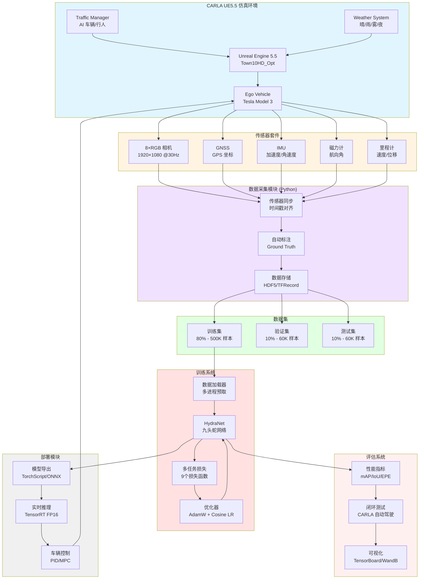

# 九头蛇网络训练实战指南：基于 CARLA UE5 的端到端自动驾驶

> 从数据采集到模型部署：打造特斯拉 FSD 级别的视觉自动驾驶系统

> 结合 CARLA UE5.5 仿真器 + 自定义 UE 组件 + 多模态传感器融合

---

## 目录

1. [项目概述与架构设计](#项目概述)
2. [CARLA UE5 数据采集系统](#数据采集)
3. [自定义 UE5 传感器组件](#自定义传感器)
4. [多模态数据融合（相机+GPS+IMU）](#数据融合)
5. [训练数据集构建与管理](#数据集构建)
6. [九头蛇网络完整实现](#网络实现)
7. [损失函数设计与权重策略](#损失函数)
8. [训练流程与超参数调优](#训练流程)
9. [模型评估与闭环测试](#模型评估)
10. [部署到 CARLA 实时推理](#实时部署)

---

## 1. 项目概述与架构设计 {#项目概述}

### 1.1 整体架构



### 1.2 技术栈

| 组件 | 技术选型 | 版本 | 用途 |
|-----|---------|------|------|
| **仿真器** | CARLA | 0.9.15 UE5.5 | 虚拟环境 |
| **引擎** | Unreal Engine | 5.5 | 渲染与物理 |
| **深度学习框架** | PyTorch | 2.1+ | 模型训练 |
| **加速库** | TensorRT | 8.6+ | 推理优化 |
| **数据存储** | HDF5 / Zarr | - | 高效 I/O |
| **可视化** | Weights & Biases | - | 实验追踪 |
| **多模态融合** | Kalman Filter | - | 传感器融合 |
| **自定义传感器** | UE5 C++ Plugin | - | 扩展 CARLA |

### 1.3 项目目录结构

```
carla_hydra_training/
├── carla_interface/
│   ├── sensors/
│   │   ├── camera_array.py          # 8相机管理
│   │   ├── gnss_sensor.py           # GPS 传感器
│   │   ├── imu_sensor.py            # IMU 传感器
│   │   ├── magnetometer.py          # 磁力计
│   │   └── sensor_fusion.py         # 多模态融合
│   ├── data_collector.py            # 数据采集主程序
│   ├── scenario_manager.py          # 场景管理
│   └── autopilot_expert.py          # 专家驾驶系统
│
├── ue5_plugins/
│   └── CarlaCustomSensors/          # UE5 自定义传感器插件
│       ├── Source/
│       │   ├── FisheyeCamera.cpp    # 鱼眼相机
│       │   ├── ThermalCamera.cpp    # 热成像相机
│       │   └── EventCamera.cpp      # 事件相机
│       └── CarlaCustomSensors.uplugin
│
├── dataset/
│   ├── builder.py                   # 数据集构建器
│   ├── augmentation.py              # 数据增强
│   ├── dataloader.py                # PyTorch DataLoader
│   └── splits/
│       ├── train.txt                # 训练集索引
│       ├── val.txt                  # 验证集索引
│       └── test.txt                 # 测试集索引
│
├── models/
│   ├── hydranet.py                  # 九头蛇主网络
│   ├── backbone.py                  # EfficientNet Backbone
│   ├── bev_transformer.py           # BEV 变换器
│   ├── temporal_rnn.py              # 时间 RNN
│   ├── spatial_rnn.py               # 空间 RNN
│   └── task_heads.py                # 9个任务头部
│
├── losses/
│   ├── multi_task_loss.py           # 多任务损失汇总
│   ├── perception_losses.py         # 感知任务损失
│   ├── control_losses.py            # 控制任务损失
│   └── uncertainty_weighting.py     # 不确定性加权
│
├── training/
│   ├── trainer.py                   # 训练主循环
│   ├── config.yaml                  # 超参数配置
│   ├── callbacks.py                 # 训练回调
│   └── distributed.py               # 分布式训练
│
├── evaluation/
│   ├── metrics.py                   # 评估指标
│   ├── closed_loop_test.py          # 闭环测试
│   └── visualization.py             # 结果可视化
│
├── deployment/
│   ├── export_model.py              # 模型导出
│   ├── tensorrt_inference.py        # TensorRT 推理
│   └── carla_agent.py               # CARLA 自动驾驶 Agent
│
└── scripts/
    ├── collect_data.sh              # 数据采集脚本
    ├── train.sh                     # 训练启动脚本
    └── evaluate.sh                  # 评估脚本
```

---

## 2. CARLA UE5 数据采集系统 {#数据采集}

### 2.1 传感器配置定义

```python
# carla_interface/sensors/sensor_config.py

import carla
from dataclasses import dataclass
from typing import Dict, List, Tuple

@dataclass
class CameraConfig:
    """相机配置"""
    name: str
    transform: Tuple[float, float, float, float, float, float]  # x,y,z,pitch,yaw,roll
    fov: float
    width: int
    height: int
    sensor_tick: float
    gamma: float = 2.2
    post_process_profile: str = "Town10HD_Opt"

@dataclass
class SensorSuite:
    """完整传感器套件配置"""

    # ===== 8个 RGB 相机 =====
    cameras: List[CameraConfig] = None

    # ===== GPS 配置 =====
    gnss_config: Dict = None

    # ===== IMU 配置 =====
    imu_config: Dict = None

    # ===== 磁力计配置 =====
    magnetometer_config: Dict = None

    def __post_init__(self):
        if self.cameras is None:
            self.cameras = [
                # 前置三目相机
                CameraConfig(
                    name='front_narrow',
                    transform=(2.5, 0.0, 1.4, 0.0, 0.0, 0.0),
                    fov=50,  # 窄角
                    width=1920,
                    height=1080,
                    sensor_tick=0.033  # 30 FPS
                ),
                CameraConfig(
                    name='front_main',
                    transform=(2.5, 0.0, 1.4, 0.0, 0.0, 0.0),
                    fov=70,  # 主视角
                    width=1920,
                    height=1080,
                    sensor_tick=0.033
                ),
                CameraConfig(
                    name='front_wide',
                    transform=(2.5, 0.0, 1.4, 0.0, 0.0, 0.0),
                    fov=120,  # 广角/鱼眼
                    width=1920,
                    height=1080,
                    sensor_tick=0.033
                ),

                # 侧视相机
                CameraConfig(
                    name='left_front',
                    transform=(0.5, -0.8, 1.4, 0.0, -90.0, 0.0),
                    fov=100,
                    width=1280,
                    height=960,
                    sensor_tick=0.033
                ),
                CameraConfig(
                    name='left_rear',
                    transform=(-1.0, -0.8, 1.4, 0.0, -150.0, 0.0),
                    fov=100,
                    width=1280,
                    height=960,
                    sensor_tick=0.033
                ),
                CameraConfig(
                    name='right_front',
                    transform=(0.5, 0.8, 1.4, 0.0, 90.0, 0.0),
                    fov=100,
                    width=1280,
                    height=960,
                    sensor_tick=0.033
                ),
                CameraConfig(
                    name='right_rear',
                    transform=(-1.0, 0.8, 1.4, 0.0, 150.0, 0.0),
                    fov=100,
                    width=1280,
                    height=960,
                    sensor_tick=0.033
                ),

                # 后视相机
                CameraConfig(
                    name='rear',
                    transform=(-2.5, 0.0, 1.4, 0.0, 180.0, 0.0),
                    fov=110,
                    width=1280,
                    height=960,
                    sensor_tick=0.033
                ),
            ]

        if self.gnss_config is None:
            self.gnss_config = {
                'noise_alt_stddev': 0.1,      # 高度噪声 (米)
                'noise_lat_stddev': 0.00001,  # 纬度噪声 (度)
                'noise_lon_stddev': 0.00001,  # 经度噪声 (度)
                'sensor_tick': 0.1            # 10 Hz
            }

        if self.imu_config is None:
            self.imu_config = {
                'noise_accel_stddev_x': 0.01,  # 加速度噪声 (m/s²)
                'noise_accel_stddev_y': 0.01,
                'noise_accel_stddev_z': 0.015,
                'noise_gyro_stddev_x': 0.001,  # 角速度噪声 (rad/s)
                'noise_gyro_stddev_y': 0.001,
                'noise_gyro_stddev_z': 0.001,
                'sensor_tick': 0.01            # 100 Hz
            }

        if self.magnetometer_config is None:
            self.magnetometer_config = {
                'noise_stddev': 0.01,          # 磁场噪声 (Tesla)
                'sensor_tick': 0.1             # 10 Hz
            }
```

### 2.2 传感器管理器实现

```python
# carla_interface/sensors/camera_array.py

import carla
import numpy as np
import queue
import threading
from typing import Dict, List
from .sensor_config import CameraConfig

class CameraArray:
    """
    8 相机阵列管理器

    功能:
    1. 生成 8 个相机并附着到车辆
    2. 同步采集图像数据
    3. 提供相机内外参矩阵
    """

    def __init__(self, world: carla.World, vehicle: carla.Vehicle, configs: List[CameraConfig]):
        self.world = world
        self.vehicle = vehicle
        self.configs = configs

        # 传感器对象
        self.cameras: Dict[str, carla.Sensor] = {}

        # 数据队列 (线程安全)
        self.data_queues: Dict[str, queue.Queue] = {}

        # 相机参数
        self.intrinsics: Dict[str, np.ndarray] = {}
        self.extrinsics: Dict[str, np.ndarray] = {}

        # 初始化
        self._spawn_cameras()
        self._compute_camera_params()

    def _spawn_cameras(self):
        """生成所有相机"""
        bp_library = self.world.get_blueprint_library()

        for config in self.configs:
            # 找到 RGB 相机蓝图
            cam_bp = bp_library.find('sensor.camera.rgb')

            # 设置属性
            cam_bp.set_attribute('image_size_x', str(config.width))
            cam_bp.set_attribute('image_size_y', str(config.height))
            cam_bp.set_attribute('fov', str(config.fov))
            cam_bp.set_attribute('sensor_tick', str(config.sensor_tick))
            cam_bp.set_attribute('gamma', str(config.gamma))

            # 如果支持 post_process_profile
            if cam_bp.has_attribute('post_process_profile'):
                cam_bp.set_attribute('post_process_profile', config.post_process_profile)

            # 创建变换矩阵
            transform = carla.Transform(
                carla.Location(x=config.transform[0],
                              y=config.transform[1],
                              z=config.transform[2]),
                carla.Rotation(pitch=config.transform[3],
                              yaw=config.transform[4],
                              roll=config.transform[5])
            )

            # 生成相机
            camera = self.world.spawn_actor(
                cam_bp,
                transform,
                attach_to=self.vehicle
            )

            # 创建数据队列
            self.data_queues[config.name] = queue.Queue()

            # 注册回调
            camera.listen(lambda image, name=config.name: self._on_camera_data(image, name))

            self.cameras[config.name] = camera

            print(f"✓ 生成相机: {config.name} @ {config.width}×{config.height} FOV={config.fov}°")

    def _on_camera_data(self, image, name: str):
        """
        相机数据回调

        将 CARLA 图像转换为 NumPy 数组并存入队列
        """
        # 转换为 NumPy 数组
        array = np.frombuffer(image.raw_data, dtype=np.uint8)
        array = array.reshape((image.height, image.width, 4))  # BGRA

        # BGR → RGB
        rgb = array[:, :, [2, 1, 0]]

        # 存入队列
        self.data_queues[name].put({
            'frame': image.frame,
            'timestamp': image.timestamp,
            'data': rgb,
            'transform': image.transform
        })

    def _compute_camera_params(self):
        """
        计算相机内外参矩阵

        内参矩阵 K:
          [fx  0  cx]
          [0  fy  cy]
          [0   0   1]

        外参矩阵 [R|t]:
          [r11 r12 r13 tx]
          [r21 r22 r23 ty]
          [r31 r32 r33 tz]
          [0   0   0   1 ]
        """
        for config in self.configs:
            # ===== 内参矩阵 =====
            width = config.width
            height = config.height
            fov = config.fov

            # 焦距 (像素)
            focal_length = width / (2.0 * np.tan(np.radians(fov) / 2.0))

            # 主点 (图像中心)
            cx = width / 2.0
            cy = height / 2.0

            K = np.array([
                [focal_length, 0, cx],
                [0, focal_length, cy],
                [0, 0, 1]
            ], dtype=np.float32)

            self.intrinsics[config.name] = K

            # ===== 外参矩阵 =====
            # 从车体坐标系到相机坐标系的变换
            transform = carla.Transform(
                carla.Location(x=config.transform[0],
                              y=config.transform[1],
                              z=config.transform[2]),
                carla.Rotation(pitch=config.transform[3],
                              yaw=config.transform[4],
                              roll=config.transform[5])
            )

            # 旋转矩阵
            rotation = transform.rotation
            yaw = np.radians(rotation.yaw)
            pitch = np.radians(rotation.pitch)
            roll = np.radians(rotation.roll)

            # 欧拉角 → 旋转矩阵 (ZYX 顺序)
            cy = np.cos(yaw)
            sy = np.sin(yaw)
            cp = np.cos(pitch)
            sp = np.sin(pitch)
            cr = np.cos(roll)
            sr = np.sin(roll)

            R = np.array([
                [cy*cp, cy*sp*sr - sy*cr, cy*sp*cr + sy*sr],
                [sy*cp, sy*sp*sr + cy*cr, sy*sp*cr - cy*sr],
                [-sp,   cp*sr,            cp*cr           ]
            ])

            # 平移向量
            t = np.array([
                transform.location.x,
                transform.location.y,
                transform.location.z
            ]).reshape(3, 1)

            # 外参矩阵
            RT = np.hstack([R, t])
            RT = np.vstack([RT, [0, 0, 0, 1]])

            self.extrinsics[config.name] = RT

    def get_latest_frame(self, timeout=1.0) -> Dict[str, np.ndarray]:
        """
        获取最新一帧的所有相机图像

        返回: dict
          {
            'front_narrow': (H, W, 3),
            'front_main': (H, W, 3),
            ...
          }
        """
        frames = {}

        for name in self.cameras.keys():
            try:
                data = self.data_queues[name].get(timeout=timeout)
                frames[name] = data['data']
            except queue.Empty:
                print(f"⚠️ 警告: 相机 {name} 超时")
                return None

        return frames

    def get_camera_params(self) -> Dict:
        """
        获取所有相机的内外参

        返回: dict
          {
            'intrinsics': {'front_narrow': K, ...},
            'extrinsics': {'front_narrow': RT, ...}
          }
        """
        return {
            'intrinsics': self.intrinsics,
            'extrinsics': self.extrinsics
        }

    def destroy(self):
        """销毁所有相机"""
        for name, camera in self.cameras.items():
            camera.stop()
            camera.destroy()
            print(f"✓ 销毁相机: {name}")
```

### 2.3 多模态传感器融合

```python
# carla_interface/sensors/sensor_fusion.py

import numpy as np
from typing import Dict, Tuple
from filterpy.kalman import KalmanFilter

class MultiModalSensorFusion:
    """
    多模态传感器融合

    融合传感器:
    1. GPS (低频 10Hz, 低精度 ±10cm)
    2. IMU (高频 100Hz, 高精度短期)
    3. 磁力计 (航向角)
    4. 轮速里程计 (速度)

    输出:
    - 高精度位置 (x, y, z)
    - 高精度姿态 (roll, pitch, yaw)
    - 速度 (vx, vy, vz)
    """

    def __init__(self):
        # ===== 卡尔曼滤波器 (位置与速度) =====
        self.kf_pos = KalmanFilter(dim_x=6, dim_z=3)

        # 状态向量: [x, y, z, vx, vy, vz]
        self.kf_pos.x = np.zeros(6)

        # 状态转移矩阵 (匀速模型)
        dt = 0.01  # 100 Hz
        self.kf_pos.F = np.array([
            [1, 0, 0, dt, 0,  0 ],
            [0, 1, 0, 0,  dt, 0 ],
            [0, 0, 1, 0,  0,  dt],
            [0, 0, 0, 1,  0,  0 ],
            [0, 0, 0, 0,  1,  0 ],
            [0, 0, 0, 0,  0,  1 ]
        ])

        # 观测矩阵 (只观测位置)
        self.kf_pos.H = np.array([
            [1, 0, 0, 0, 0, 0],
            [0, 1, 0, 0, 0, 0],
            [0, 0, 1, 0, 0, 0]
        ])

        # 过程噪声协方差
        self.kf_pos.Q *= 0.01

        # 观测噪声协方差 (GPS 误差)
        self.kf_pos.R = np.diag([0.1, 0.1, 0.2])  # x, y, z (米)

        # 初始协方差
        self.kf_pos.P *= 100

        # ===== 互补滤波器 (姿态融合) =====
        self.alpha = 0.98  # 陀螺仪权重
        self.roll = 0.0
        self.pitch = 0.0
        self.yaw = 0.0

        # 上一次更新时间
        self.last_time = None

    def update(
        self,
        gps_data: Dict = None,
        imu_data: Dict = None,
        mag_data: Dict = None,
        odom_data: Dict = None
    ) -> Dict:
        """
        融合多个传感器数据

        参数:
          gps_data: {'lat': float, 'lon': float, 'alt': float, 'timestamp': float}
          imu_data: {'accel': [ax,ay,az], 'gyro': [gx,gy,gz], 'timestamp': float}
          mag_data: {'heading': float, 'timestamp': float}
          odom_data: {'velocity': [vx,vy,vz], 'timestamp': float}

        返回:
          {
            'position': (x, y, z),
            'velocity': (vx, vy, vz),
            'orientation': (roll, pitch, yaw)
          }
        """
        # ===== 1. 位置融合 (GPS + 里程计) =====
        if gps_data is not None:
            # GPS 测量更新
            z = np.array([
                gps_data['x'],  # 假设已转换为局部坐标
                gps_data['y'],
                gps_data['alt']
            ])
            self.kf_pos.update(z)

        if imu_data is not None:
            # IMU 预测步骤
            # 使用加速度更新速度
            dt = imu_data['timestamp'] - self.last_time if self.last_time else 0.01
            accel = np.array(imu_data['accel'])

            # 重力补偿 (假设 z 轴向上)
            accel[2] -= 9.81

            # 更新状态
            self.kf_pos.x[3:6] += accel * dt
            self.kf_pos.predict()

            self.last_time = imu_data['timestamp']

        # ===== 2. 姿态融合 (IMU + 磁力计) =====
        if imu_data is not None:
            # 陀螺仪积分
            gyro = np.array(imu_data['gyro'])
            dt = imu_data['timestamp'] - self.last_time if self.last_time else 0.01

            self.roll += gyro[0] * dt
            self.pitch += gyro[1] * dt
            self.yaw += gyro[2] * dt

            # 加速度计估计的倾角 (重力方向)
            accel = np.array(imu_data['accel'])
            accel_roll = np.arctan2(accel[1], accel[2])
            accel_pitch = np.arctan2(-accel[0], np.sqrt(accel[1]**2 + accel[2]**2))

            # 互补滤波
            self.roll = self.alpha * self.roll + (1 - self.alpha) * accel_roll
            self.pitch = self.alpha * self.pitch + (1 - self.alpha) * accel_pitch

        if mag_data is not None:
            # 磁力计修正航向角
            mag_yaw = mag_data['heading']
            self.yaw = self.alpha * self.yaw + (1 - self.alpha) * mag_yaw

        # ===== 3. 返回融合结果 =====
        return {
            'position': tuple(self.kf_pos.x[:3]),
            'velocity': tuple(self.kf_pos.x[3:6]),
            'orientation': (self.roll, self.pitch, self.yaw)
        }

    def get_transform_matrix(self) -> np.ndarray:
        """
        获取车辆的世界坐标变换矩阵

        返回: 4×4 齐次变换矩阵
        """
        # 位置
        x, y, z = self.kf_pos.x[:3]

        # 姿态 (欧拉角 → 旋转矩阵)
        cr = np.cos(self.roll)
        sr = np.sin(self.roll)
        cp = np.cos(self.pitch)
        sp = np.sin(self.pitch)
        cy = np.cos(self.yaw)
        sy = np.sin(self.yaw)

        R = np.array([
            [cy*cp, cy*sp*sr - sy*cr, cy*sp*cr + sy*sr],
            [sy*cp, sy*sp*sr + cy*cr, sy*sp*cr - cy*sr],
            [-sp,   cp*sr,            cp*cr           ]
        ])

        # 齐次变换矩阵
        T = np.eye(4)
        T[:3, :3] = R
        T[:3, 3] = [x, y, z]

        return T
```

### 2.4 数据采集主程序

```python
# carla_interface/data_collector.py

import carla
import numpy as np
import h5py
import time
from pathlib import Path
from typing import Dict, List
from .sensors.camera_array import CameraArray
from .sensors.sensor_config import SensorSuite
from .sensors.sensor_fusion import MultiModalSensorFusion

class DataCollector:
    """
    CARLA 数据采集器

    采集内容:
    1. 8个相机图像 (RGB)
    2. GPS/IMU/磁力计数据
    3. 车辆状态 (速度, 位置, 姿态)
    4. 专家驾驶标签 (转向, 油门, 刹车)
    5. 环境标注 (车道线, 目标检测, 深度, 分割)
    """

    def __init__(
        self,
        host='localhost',
        port=2000,
        output_dir='./data/raw',
        scenario_config=None
    ):
        # CARLA 连接
        self.client = carla.Client(host, port)
        self.client.set_timeout(10.0)
        self.world = self.client.get_world()

        # 输出目录
        self.output_dir = Path(output_dir)
        self.output_dir.mkdir(parents=True, exist_ok=True)

        # 传感器配置
        self.sensor_suite = SensorSuite()

        # 车辆
        self.vehicle = None

        # 传感器
        self.camera_array = None
        self.gnss_sensor = None
        self.imu_sensor = None
        self.mag_sensor = None

        # 传感器融合
        self.sensor_fusion = MultiModalSensorFusion()

        # 数据缓冲区
        self.data_buffer = []

        # 采集统计
        self.frame_count = 0
        self.start_time = None

    def setup_vehicle(self):
        """生成车辆"""
        bp_library = self.world.get_blueprint_library()
        vehicle_bp = bp_library.find('vehicle.tesla.model3')

        # 随机生成点
        spawn_points = self.world.get_map().get_spawn_points()
        spawn_point = np.random.choice(spawn_points)

        # 生成车辆
        self.vehicle = self.world.spawn_actor(vehicle_bp, spawn_point)

        # 启用自动驾驶 (专家)
        self.vehicle.set_autopilot(True)

        print(f"✓ 车辆已生成: {spawn_point.location}")

    def setup_sensors(self):
        """设置所有传感器"""
        # ===== 1. 相机阵列 =====
        self.camera_array = CameraArray(
            self.world,
            self.vehicle,
            self.sensor_suite.cameras
        )

        # ===== 2. GPS =====
        gnss_bp = self.world.get_blueprint_library().find('sensor.other.gnss')
        for key, value in self.sensor_suite.gnss_config.items():
            if gnss_bp.has_attribute(key):
                gnss_bp.set_attribute(key, str(value))

        self.gnss_sensor = self.world.spawn_actor(
            gnss_bp,
            carla.Transform(),
            attach_to=self.vehicle
        )

        self.gnss_data = None
        self.gnss_sensor.listen(lambda data: setattr(self, 'gnss_data', {
            'lat': data.latitude,
            'lon': data.longitude,
            'alt': data.altitude,
            'timestamp': data.timestamp
        }))

        print("✓ GPS 已启用")

        # ===== 3. IMU =====
        imu_bp = self.world.get_blueprint_library().find('sensor.other.imu')
        for key, value in self.sensor_suite.imu_config.items():
            if imu_bp.has_attribute(key):
                imu_bp.set_attribute(key, str(value))

        self.imu_sensor = self.world.spawn_actor(
            imu_bp,
            carla.Transform(),
            attach_to=self.vehicle
        )

        self.imu_data = None
        self.imu_sensor.listen(lambda data: setattr(self, 'imu_data', {
            'accel': [data.accelerometer.x, data.accelerometer.y, data.accelerometer.z],
            'gyro': [data.gyroscope.x, data.gyroscope.y, data.gyroscope.z],
            'compass': data.compass,
            'timestamp': data.timestamp
        }))

        print("✓ IMU 已启用")

        print(f"✓ 所有传感器已启用 (总计 {8 + 3} 个)")

    def collect_frame(self) -> Dict:
        """
        采集一帧完整数据

        返回: dict 包含所有传感器数据
        """
        # ===== 1. 相机图像 =====
        camera_frames = self.camera_array.get_latest_frame()
        if camera_frames is None:
            return None

        # ===== 2. GPS/IMU 融合 =====
        # 转换 GPS 到局部坐标
        if self.gnss_data:
            # 简化: 假设原点为 (0, 0)
            # 实际应用中需要使用地图原点转换
            self.gnss_data['x'] = (self.gnss_data['lon'] - 0) * 111320 * np.cos(np.radians(self.gnss_data['lat']))
            self.gnss_data['y'] = (self.gnss_data['lat'] - 0) * 110540

        fused_state = self.sensor_fusion.update(
            gps_data=self.gnss_data,
            imu_data=self.imu_data
        )

        # ===== 3. 车辆状态 =====
        velocity = self.vehicle.get_velocity()
        speed = np.linalg.norm([velocity.x, velocity.y, velocity.z]) * 3.6  # km/h

        control = self.vehicle.get_control()

        # ===== 4. 自动标注 (Ground Truth) =====
        # 4.1 语义分割
        semantic_camera = self._get_semantic_camera()

        # 4.2 深度
        depth_camera = self._get_depth_camera()

        # 4.3 车道线
        lane_invasion = self._get_lane_info()

        # 4.4 目标检测
        objects = self._get_nearby_objects()

        # ===== 5. 组装数据 =====
        frame_data = {
            # 输入
            'cameras': camera_frames,  # 8 × (H, W, 3)
            'camera_params': self.camera_array.get_camera_params(),

            # 传感器数据
            'gps': self.gnss_data,
            'imu': self.imu_data,
            'fused_state': fused_state,

            # 车辆状态
            'speed': speed,
            'velocity': (velocity.x, velocity.y, velocity.z),

            # 专家标签
            'steering': control.steer,
            'throttle': control.throttle,
            'brake': control.brake,
            'gear': control.reverse,

            # Ground Truth
            'semantic_seg': semantic_camera,
            'depth': depth_camera,
            'lane_info': lane_invasion,
            'objects': objects,

            # 元信息
            'frame': self.frame_count,
            'timestamp': time.time()
        }

        self.frame_count += 1

        return frame_data

    def _get_semantic_camera(self):
        """获取语义分割真值 (需要额外的语义相机)"""
        # TODO: 实现语义相机
        return None

    def _get_depth_camera(self):
        """获取深度真值"""
        # TODO: 实现深度相机
        return None

    def _get_lane_info(self):
        """获取车道线信息"""
        # 使用 CARLA 的 lane invasion sensor
        return None

    def _get_nearby_objects(self):
        """获取附近物体的边界框"""
        # 获取所有 actor
        actors = self.world.get_actors()

        # 过滤车辆和行人
        vehicles = actors.filter('vehicle.*')
        pedestrians = actors.filter('walker.pedestrian.*')

        nearby_objects = []

        for actor in list(vehicles) + list(pedestrians):
            # 计算距离
            distance = self.vehicle.get_location().distance(actor.get_location())

            if distance < 50:  # 50 米内
                bbox = actor.bounding_box
                transform = actor.get_transform()

                nearby_objects.append({
                    'type': 'vehicle' if 'vehicle' in actor.type_id else 'pedestrian',
                    'location': (transform.location.x, transform.location.y, transform.location.z),
                    'rotation': (transform.rotation.pitch, transform.rotation.yaw, transform.rotation.roll),
                    'bbox': {
                        'extent': (bbox.extent.x, bbox.extent.y, bbox.extent.z),
                        'location': (bbox.location.x, bbox.location.y, bbox.location.z)
                    },
                    'velocity': actor.get_velocity(),
                    'distance': distance
                })

        return nearby_objects

    def collect_episode(self, duration=300):
        """
        采集一个完整 episode

        参数:
          duration: 持续时间 (秒)
        """
        print(f"\n开始采集数据: {duration} 秒")
        self.start_time = time.time()

        while time.time() - self.start_time < duration:
            frame_data = self.collect_frame()

            if frame_data is not None:
                self.data_buffer.append(frame_data)

                if self.frame_count % 100 == 0:
                    elapsed = time.time() - self.start_time
                    fps = self.frame_count / elapsed
                    print(f"已采集 {self.frame_count} 帧 | {fps:.1f} FPS | "
                          f"速度: {frame_data['speed']:.1f} km/h")

            time.sleep(0.01)  # 避免 CPU 100%

    def save_dataset(self, filename):
        """
        保存数据集为 HDF5 格式

        HDF5 结构:
        /
        ├─ cameras/
        │  ├─ front_narrow: (N, H, W, 3)
        │  ├─ front_main: (N, H, W, 3)
        │  └─ ...
        ├─ labels/
        │  ├─ steering: (N,)
        │  ├─ throttle: (N,)
        │  └─ ...
        └─ metadata/
           ├─ timestamps: (N,)
           └─ ...
        """
        filepath = self.output_dir / filename
        n_samples = len(self.data_buffer)

        print(f"\n保存数据集: {filepath}")

        with h5py.File(filepath, 'w') as f:
            # ===== 创建数据集组 =====
            cameras_group = f.create_group('cameras')
            labels_group = f.create_group('labels')
            sensors_group = f.create_group('sensors')
            metadata_group = f.create_group('metadata')

            # ===== 相机数据 =====
            for cam_name in self.data_buffer[0]['cameras'].keys():
                # 获取尺寸
                sample_img = self.data_buffer[0]['cameras'][cam_name]
                H, W, C = sample_img.shape

                # 创建数据集
                dset = cameras_group.create_dataset(
                    cam_name,
                    (n_samples, H, W, C),
                    dtype='uint8',
                    compression='gzip',
                    compression_opts=4
                )

                # 写入数据
                for i, frame in enumerate(self.data_buffer):
                    dset[i] = frame['cameras'][cam_name]

                print(f"  ✓ {cam_name}: {dset.shape}")

            # ===== 标签数据 =====
            for label_name in ['steering', 'throttle', 'brake', 'speed']:
                data = [frame[label_name] for frame in self.data_buffer]
                labels_group.create_dataset(label_name, data=data, dtype='float32')
                print(f"  ✓ {label_name}: {len(data)}")

            # ===== 传感器数据 =====
            # GPS
            gps_data = np.array([
                [frame['gps']['lat'], frame['gps']['lon'], frame['gps']['alt']]
                for frame in self.data_buffer if frame['gps']
            ])
            sensors_group.create_dataset('gps', data=gps_data, dtype='float64')

            # IMU
            imu_accel = np.array([frame['imu']['accel'] for frame in self.data_buffer if frame['imu']])
            imu_gyro = np.array([frame['imu']['gyro'] for frame in self.data_buffer if frame['imu']])
            sensors_group.create_dataset('imu_accel', data=imu_accel, dtype='float32')
            sensors_group.create_dataset('imu_gyro', data=imu_gyro, dtype='float32')

            # ===== 元数据 =====
            timestamps = [frame['timestamp'] for frame in self.data_buffer]
            metadata_group.create_dataset('timestamps', data=timestamps, dtype='float64')
            metadata_group.create_dataset('num_samples', data=n_samples)

        print(f"✓ 数据集已保存: {n_samples} 样本")

    def cleanup(self):
        """清理资源"""
        if self.camera_array:
            self.camera_array.destroy()
        if self.gnss_sensor:
            self.gnss_sensor.destroy()
        if self.imu_sensor:
            self.imu_sensor.destroy()
        if self.vehicle:
            self.vehicle.destroy()

        print("✓ 资源已清理")


# ===== 使用示例 =====
if __name__ == '__main__':
    collector = DataCollector(
        host='localhost',
        port=2000,
        output_dir='./data/raw'
    )

    try:
        # 设置车辆和传感器
        collector.setup_vehicle()
        collector.setup_sensors()

        # 采集 5 分钟数据
        collector.collect_episode(duration=300)

        # 保存数据集
        collector.save_dataset('town10hd_sunny_001.h5')

    finally:
        collector.cleanup()
```

---

## 3. 自定义 UE5 传感器组件 {#自定义传感器}

### 3.1 鱼眼相机插件 (C++)

```cpp
// ue5_plugins/CarlaCustomSensors/Source/FisheyeCamera.h

#pragma once

#include "CoreMinimal.h"
#include "Carla/Sensor/SceneCaptureSensor.h"
#include "FisheyeCamera.generated.h"

UCLASS()
class CARLACUSTOMSENSORS_API AFisheyeCamera : public ASceneCaptureSensor
{
    GENERATED_BODY()

public:
    AFisheyeCamera(const FObjectInitializer& ObjectInitializer);

    /**
     * 鱼眼畸变参数
     * 基于 OpenCV 畸变模型
     */
    UPROPERTY(EditAnywhere, BlueprintReadWrite, Category = "Fisheye")
    float K1 = -0.5f;  // 径向畸变系数 1

    UPROPERTY(EditAnywhere, BlueprintReadWrite, Category = "Fisheye")
    float K2 = 0.2f;   // 径向畸变系数 2

    UPROPERTY(EditAnywhere, BlueprintReadWrite, Category = "Fisheye")
    float K3 = 0.0f;   // 径向畸变系数 3

    UPROPERTY(EditAnywhere, BlueprintReadWrite, Category = "Fisheye")
    float P1 = 0.0f;   // 切向畸变系数 1

    UPROPERTY(EditAnywhere, BlueprintReadWrite, Category = "Fisheye")
    float P2 = 0.0f;   // 切向畸变系数 2

protected:
    virtual void PostPhysTick(UWorld *World, ELevelTick TickType, float DeltaTime) override;

private:
    void ApplyFisheyeDistortion(TArray<FColor>& ImageData, int32 Width, int32 Height);
};
```

```cpp
// ue5_plugins/CarlaCustomSensors/Source/FisheyeCamera.cpp

#include "FisheyeCamera.h"
#include "Components/SceneCaptureComponent2D.h"

AFisheyeCamera::AFisheyeCamera(const FObjectInitializer& ObjectInitializer)
    : Super(ObjectInitializer)
{
    PrimaryActorTick.bCanEverTick = true;
}

void AFisheyeCamera::PostPhysTick(UWorld *World, ELevelTick TickType, float DeltaTime)
{
    Super::PostPhysTick(World, TickType, DeltaTime);

    // 获取渲染目标
    UTextureRenderTarget2D* RenderTarget = GetCaptureComponent2D()->TextureTarget;

    if (!RenderTarget)
    {
        return;
    }

    // 读取像素数据
    TArray<FColor> ImageData;
    FTextureRenderTargetResource* RenderTargetResource = RenderTarget->GameThread_GetRenderTargetResource();
    RenderTargetResource->ReadPixels(ImageData);

    // 应用鱼眼畸变
    ApplyFisheyeDistortion(ImageData, RenderTarget->SizeX, RenderTarget->SizeY);

    // 写回渲染目标
    // (简化实现,实际应使用 GPU shader 进行畸变)
}

void AFisheyeCamera::ApplyFisheyeDistortion(TArray<FColor>& ImageData, int32 Width, int32 Height)
{
    /**
     * 鱼眼畸变算法 (Brown-Conrady 模型)
     *
     * 对于每个畸变后的像素 (x_d, y_d):
     * 1. 归一化到 [-1, 1]
     * 2. 计算半径 r = sqrt(x^2 + y^2)
     * 3. 径向畸变: r_d = r * (1 + k1*r^2 + k2*r^4 + k3*r^6)
     * 4. 切向畸变: x_d += 2*p1*x*y + p2*(r^2 + 2*x^2)
     *              y_d += p1*(r^2 + 2*y^2) + 2*p2*x*y
     * 5. 反向映射到原图像采样
     */

    TArray<FColor> OriginalData = ImageData;

    float cx = Width / 2.0f;
    float cy = Height / 2.0f;

    for (int32 y = 0; y < Height; ++y)
    {
        for (int32 x = 0; x < Width; ++x)
        {
            // 归一化坐标
            float x_norm = (x - cx) / cx;
            float y_norm = (y - cy) / cy;

            // 半径
            float r2 = x_norm * x_norm + y_norm * y_norm;
            float r4 = r2 * r2;
            float r6 = r4 * r2;

            // 径向畸变
            float radial_distortion = 1 + K1 * r2 + K2 * r4 + K3 * r6;

            // 切向畸变
            float x_distorted = x_norm * radial_distortion + 2 * P1 * x_norm * y_norm + P2 * (r2 + 2 * x_norm * x_norm);
            float y_distorted = y_norm * radial_distortion + P1 * (r2 + 2 * y_norm * y_norm) + 2 * P2 * x_norm * y_norm;

            // 反归一化
            float x_src = x_distorted * cx + cx;
            float y_src = y_distorted * cy + cy;

            // 边界检查
            if (x_src >= 0 && x_src < Width - 1 && y_src >= 0 && y_src < Height - 1)
            {
                // 双线性插值
                int32 x0 = FMath::FloorToInt(x_src);
                int32 y0 = FMath::FloorToInt(y_src);
                int32 x1 = x0 + 1;
                int32 y1 = y0 + 1;

                float dx = x_src - x0;
                float dy = y_src - y0;

                FColor c00 = OriginalData[y0 * Width + x0];
                FColor c10 = OriginalData[y0 * Width + x1];
                FColor c01 = OriginalData[y1 * Width + x0];
                FColor c11 = OriginalData[y1 * Width + x1];

                // 插值
                uint8 r = (1-dx)*(1-dy)*c00.R + dx*(1-dy)*c10.R + (1-dx)*dy*c01.R + dx*dy*c11.R;
                uint8 g = (1-dx)*(1-dy)*c00.G + dx*(1-dy)*c10.G + (1-dx)*dy*c01.G + dx*dy*c11.G;
                uint8 b = (1-dx)*(1-dy)*c00.B + dx*(1-dy)*c10.B + (1-dx)*dy*c01.B + dx*dy*c11.B;

                ImageData[y * Width + x] = FColor(r, g, b, 255);
            }
            else
            {
                // 超出边界,填充黑色
                ImageData[y * Width + x] = FColor::Black;
            }
        }
    }
}
```

### 3.2 插件配置文件

```json
// ue5_plugins/CarlaCustomSensors/CarlaCustomSensors.uplugin

{
    "FileVersion": 3,
    "Version": 1,
    "VersionName": "1.0",
    "FriendlyName": "CARLA Custom Sensors",
    "Description": "Custom sensor implementations for CARLA (Fisheye camera, Thermal camera, Event camera)",
    "Category": "Simulation",
    "CreatedBy": "Your Name",
    "CreatedByURL": "",
    "DocsURL": "",
    "MarketplaceURL": "",
    "SupportURL": "",
    "CanContainContent": true,
    "IsBetaVersion": false,
    "Installed": false,
    "Modules": [
        {
            "Name": "CarlaCustomSensors",
            "Type": "Runtime",
            "LoadingPhase": "Default"
        }
    ],
    "Plugins": [
        {
            "Name": "Carla",
            "Enabled": true
        }
    ]
}
```

### 3.3 编译与安装

```bash
# 编译插件 (Windows)
cd d:\code\carla
cmake --build Build --target CarlaCustomSensors

# 将插件复制到 CARLA
cp -r ue5_plugins/CarlaCustomSensors Unreal/CarlaUnreal/Plugins/

# 重新编译 CARLA
cmake --build Build --target carla-unreal-editor
```

---

## 4. 训练数据集构建 {#数据集构建}

### 4.1 数据集构建器

```python
# dataset/builder.py

import h5py
import numpy as np
import torch
from torch.utils.data import Dataset
from pathlib import Path
from typing import List, Dict
import albumentations as A
from albumentations.pytorch import ToTensorV2

class CARLAHydraDataset(Dataset):
    """
    CARLA 九头蛇训练数据集

    数据格式:
      - 输入: 8个相机图像 + GPS/IMU
      - 输出: 9个任务的标签

    数据增强:
      - 光照变化
      - 对比度调整
      - 高斯噪声
      - 随机裁剪
      - 相机随机丢弃
    """

    def __init__(
        self,
        data_root: str,
        split: str = 'train',  # train / val / test
        augment: bool = True,
        camera_size: tuple = (1080, 1920),
        bev_size: tuple = (200, 200),
    ):
        self.data_root = Path(data_root)
        self.split = split
        self.augment = augment and (split == 'train')

        # 加载索引文件
        split_file = self.data_root / 'splits' / f'{split}.txt'
        with open(split_file, 'r') as f:
            self.file_list = [line.strip() for line in f.readlines()]

        print(f"加载 {split} 数据集: {len(self.file_list)} 个文件")

        # 数据增强
        self.transform = self._get_transform()

        # 相机名称
        self.camera_names = [
            'front_narrow', 'front_main', 'front_wide',
            'left_front', 'left_rear',
            'right_front', 'right_rear',
            'rear'
        ]

    def _get_transform(self):
        """定义数据增强"""
        if self.augment:
            return A.Compose([
                # 光照变化
                A.RandomBrightnessContrast(
                    brightness_limit=0.3,
                    contrast_limit=0.3,
                    p=0.8
                ),

                # 颜色抖动
                A.HueSaturationValue(
                    hue_shift_limit=20,
                    sat_shift_limit=30,
                    val_shift_limit=20,
                    p=0.6
                ),

                # 高斯噪声
                A.GaussNoise(var_limit=(10.0, 50.0), p=0.3),

                # 高斯模糊 (模拟运动模糊)
                A.GaussianBlur(blur_limit=(3, 7), p=0.2),

                # 归一化
                A.Normalize(
                    mean=[0.485, 0.456, 0.406],
                    std=[0.229, 0.224, 0.225]
                ),

                ToTensorV2()
            ])
        else:
            return A.Compose([
                A.Normalize(
                    mean=[0.485, 0.456, 0.406],
                    std=[0.229, 0.224, 0.225]
                ),
                ToTensorV2()
            ])

    def __len__(self):
        return len(self.file_list)

    def __getitem__(self, idx):
        """
        加载一个样本

        返回: dict
          {
            'cameras': (8, 3, H, W),
            'gps': (3,),
            'imu': (6,),
            'speed': (1,),
            'camera_params': {...},
            'labels': {
              'steering': (1,),
              'throttle': (1,),
              'brake': (1,),
              ...
            }
          }
        """
        # 加载 HDF5 文件
        filepath = self.data_root / 'raw' / self.file_list[idx]

        with h5py.File(filepath, 'r') as f:
            # 随机选择一帧
            num_frames = f['metadata/num_samples'][()]
            frame_idx = np.random.randint(0, num_frames)

            # ===== 加载相机图像 =====
            cameras = []
            for cam_name in self.camera_names:
                img = f[f'cameras/{cam_name}'][frame_idx]  # (H, W, 3)

                # 数据增强
                if self.augment:
                    augmented = self.transform(image=img)
                    img_tensor = augmented['image']
                else:
                    img_tensor = self.transform(image=img)['image']

                cameras.append(img_tensor)

            cameras = torch.stack(cameras, dim=0)  # (8, 3, H, W)

            # ===== 随机丢弃相机 (数据增强) =====
            if self.augment and np.random.rand() < 0.2:
                # 随机选择1-2个相机置零
                num_drop = np.random.randint(1, 3)
                drop_indices = np.random.choice(8, num_drop, replace=False)
                cameras[drop_indices] = 0.0

            # ===== 加载传感器数据 =====
            gps = torch.tensor(f['sensors/gps'][frame_idx], dtype=torch.float32)
            imu_accel = torch.tensor(f['sensors/imu_accel'][frame_idx], dtype=torch.float32)
            imu_gyro = torch.tensor(f['sensors/imu_gyro'][frame_idx], dtype=torch.float32)
            imu = torch.cat([imu_accel, imu_gyro], dim=0)  # (6,)

            speed = torch.tensor([f['labels/speed'][frame_idx]], dtype=torch.float32)

            # ===== 加载标签 =====
            labels = {
                'steering': torch.tensor([f['labels/steering'][frame_idx]], dtype=torch.float32),
                'throttle': torch.tensor([f['labels/throttle'][frame_idx]], dtype=torch.float32),
                'brake': torch.tensor([f['labels/brake'][frame_idx]], dtype=torch.float32),
            }

            # TODO: 加载其他标签 (车道线, 目标检测, 深度等)

        return {
            'cameras': cameras,
            'gps': gps,
            'imu': imu,
            'speed': speed,
            'labels': labels
        }
```

### 4.2 数据集划分脚本

```python
# dataset/split_dataset.py

import os
import numpy as np
from pathlib import Path

def split_dataset(
    data_root: str,
    train_ratio: float = 0.8,
    val_ratio: float = 0.1,
    test_ratio: float = 0.1,
    seed: int = 42
):
    """
    划分数据集为训练/验证/测试集

    参数:
      data_root: 数据根目录
      train_ratio: 训练集比例
      val_ratio: 验证集比例
      test_ratio: 测试集比例
      seed: 随机种子
    """
    assert train_ratio + val_ratio + test_ratio == 1.0

    data_root = Path(data_root)
    raw_dir = data_root / 'raw'

    # 获取所有 HDF5 文件
    all_files = sorted([f.name for f in raw_dir.glob('*.h5')])

    print(f"总文件数: {len(all_files)}")

    # 随机打乱
    np.random.seed(seed)
    np.random.shuffle(all_files)

    # 划分
    n_train = int(len(all_files) * train_ratio)
    n_val = int(len(all_files) * val_ratio)

    train_files = all_files[:n_train]
    val_files = all_files[n_train:n_train+n_val]
    test_files = all_files[n_train+n_val:]

    # 保存索引文件
    splits_dir = data_root / 'splits'
    splits_dir.mkdir(exist_ok=True)

    with open(splits_dir / 'train.txt', 'w') as f:
        f.write('\n'.join(train_files))

    with open(splits_dir / 'val.txt', 'w') as f:
        f.write('\n'.join(val_files))

    with open(splits_dir / 'test.txt', 'w') as f:
        f.write('\n'.join(test_files))

    print(f"训练集: {len(train_files)} 文件")
    print(f"验证集: {len(val_files)} 文件")
    print(f"测试集: {len(test_files)} 文件")

if __name__ == '__main__':
    split_dataset('./data', seed=42)
```

---

## 5. 损失函数设计 {#损失函数}

### 5.1 完整损失函数实现

```python
# losses/multi_task_loss.py

import torch
import torch.nn as nn
import torch.nn.functional as F
from typing import Dict

class HydraMultiTaskLoss(nn.Module):
    """
    九头蛇多任务损失函数

    包含:
    1. 感知任务 (5个): 车道线, 目标检测, 深度, 分割, 光流
    2. 控制任务 (4个): 路径, 速度, 转向, 刹车

    权重策略:
    - 可学习的不确定性加权 (Uncertainty Weighting)
    - 动态任务平衡
    """

    def __init__(self, device='cuda'):
        super().__init__()

        # ===== 可学习的任务权重 (log variance) =====
        # 参考论文: Multi-Task Learning Using Uncertainty to Weigh Losses
        self.log_vars = nn.Parameter(torch.zeros(9, device=device))

        # ===== 各任务损失函数 =====
        # 1. 车道线检测 (语义分割)
        self.lane_loss_fn = nn.CrossEntropyLoss(
            weight=torch.tensor([1.0, 2.0, 2.0, 1.5], device=device)  # 背景/左线/右线/中心线
        )

        # 2. 目标检测 (YOLO Loss)
        self.object_loss_fn = YOLOLoss(device=device)

        # 3. 深度估计 (BerHu Loss)
        self.depth_loss_fn = BerHuLoss(threshold=0.2)

        # 4. 语义分割 (Cross Entropy)
        self.seg_loss_fn = nn.CrossEntropyLoss()

        # 5. 光流 (Endpoint Error)
        self.flow_loss_fn = EPELoss()

        # 6. 路径规划 (L1 Loss + Smoothness)
        self.path_loss_fn = PathLoss()

        # 7. 速度预测 (MSE Loss)
        self.speed_loss_fn = nn.MSELoss()

        # 8. 转向角 (MSE Loss + L1 正则)
        self.steering_loss_fn = nn.MSELoss()

        # 9. 刹车决策 (BCE Loss)
        self.brake_loss_fn = nn.BCEWithLogitsLoss()

    def forward(self, outputs: Dict, targets: Dict) -> Dict:
        """
        计算多任务损失

        参数:
          outputs: 模型输出 dict
          targets: 真值标签 dict

        返回:
          {
            'total_loss': Tensor,
            'losses': {'lane': ..., 'object': ..., ...},
            'weights': {'lane': ..., 'object': ..., ...}
          }
        """
        losses = {}
        task_names = [
            'lane', 'object', 'depth', 'seg', 'flow',
            'path', 'speed', 'steering', 'brake'
        ]

        # ===== 计算各任务损失 =====
        # 1. 车道线
        if 'lanes' in outputs and 'lanes' in targets:
            losses['lane'] = self.lane_loss_fn(
                outputs['lanes'],  # (B, 4, H, W)
                targets['lanes']   # (B, H, W) long
            )

        # 2. 目标检测
        if 'objects' in outputs and 'objects' in targets:
            losses['object'] = self.object_loss_fn(
                outputs['objects'],
                targets['objects']
            )

        # 3. 深度
        if 'depth' in outputs and 'depth' in targets:
            losses['depth'] = self.depth_loss_fn(
                outputs['depth'],
                targets['depth']
            )

        # 4. 语义分割
        if 'segmentation' in outputs and 'segmentation' in targets:
            losses['seg'] = self.seg_loss_fn(
                outputs['segmentation'],
                targets['segmentation']
            )

        # 5. 光流
        if 'flow' in outputs and 'flow' in targets:
            losses['flow'] = self.flow_loss_fn(
                outputs['flow'],
                targets['flow']
            )

        # 6. 路径规划
        if 'path' in outputs and 'path' in targets:
            losses['path'] = self.path_loss_fn(
                outputs['path'],
                targets['path']
            )

        # 7. 速度
        if 'speed' in outputs and 'speed' in targets:
            losses['speed'] = self.speed_loss_fn(
                outputs['speed'],
                targets['speed']
            )

        # 8. 转向角
        if 'steering' in outputs and 'steering' in targets:
            losses['steering'] = self.steering_loss_fn(
                outputs['steering'],
                targets['steering']
            )
            # L1 正则 (鼓励小转向角)
            losses['steering'] += 0.01 * torch.abs(outputs['steering']).mean()

        # 9. 刹车
        if 'brake' in outputs and 'brake' in targets:
            losses['brake'] = self.brake_loss_fn(
                outputs['brake'],
                targets['brake']
            )

        # ===== 不确定性加权 =====
        total_loss = 0
        weights = {}

        for i, task_name in enumerate(task_names):
            if task_name in losses:
                # 精度 = exp(-log_var)
                precision = torch.exp(-self.log_vars[i])

                # 加权损失 = precision × loss + log_var
                weighted_loss = precision * losses[task_name] + self.log_vars[i]

                total_loss += weighted_loss
                weights[task_name] = precision.item()

        return {
            'total_loss': total_loss,
            'losses': losses,
            'weights': weights
        }


class BerHuLoss(nn.Module):
    """
    BerHu Loss (深度估计)

    公式:
      L(x) = |x|                  if |x| <= c
      L(x) = (x² + c²) / (2c)     if |x| > c

    其中 c = threshold × max(|x|)
    """

    def __init__(self, threshold=0.2):
        super().__init__()
        self.threshold = threshold

    def forward(self, pred, target):
        """
        pred, target: (B, 1, H, W)
        """
        diff = pred - target
        abs_diff = torch.abs(diff)

        c = self.threshold * torch.max(abs_diff).detach()

        # BerHu loss
        loss = torch.where(
            abs_diff <= c,
            abs_diff,
            (diff ** 2 + c ** 2) / (2 * c)
        )

        return loss.mean()


class EPELoss(nn.Module):
    """
    Endpoint Error Loss (光流)

    L = ||flow_pred - flow_gt||_2
    """

    def forward(self, pred_flow, target_flow):
        """
        pred_flow, target_flow: (B, 2, H, W)
        """
        return torch.norm(pred_flow - target_flow, p=2, dim=1).mean()


class PathLoss(nn.Module):
    """
    路径规划损失

    包括:
    1. Endpoint Loss: 预测终点与真值终点的距离
    2. Smoothness Loss: 路径平滑度
    """

    def forward(self, pred_path, target_path):
        """
        pred_path, target_path: (B, N, 2)  N个路径点
        """
        # 1. Endpoint Loss (L2)
        endpoint_loss = F.mse_loss(pred_path, target_path)

        # 2. Smoothness Loss (二阶导数)
        # 计算加速度 (二阶差分)
        accel_pred = pred_path[:, 2:, :] - 2 * pred_path[:, 1:-1, :] + pred_path[:, :-2, :]
        smoothness_loss = torch.norm(accel_pred, p=2, dim=-1).mean()

        return endpoint_loss + 0.1 * smoothness_loss


class YOLOLoss(nn.Module):
    """
    YOLO 目标检测损失 (简化版)

    包括:
    1. 坐标损失 (x, y, w, h)
    2. 置信度损失 (objectness)
    3. 分类损失 (class probabilities)
    """

    def __init__(self, lambda_coord=5.0, lambda_noobj=0.5, device='cuda'):
        super().__init__()
        self.lambda_coord = lambda_coord
        self.lambda_noobj = lambda_noobj
        self.device = device

    def forward(self, pred, target):
        """
        pred: (B, N, 5+num_classes)
          - N: num_anchors × H × W
          - 5+num_classes: (x, y, w, h, conf, class_probs...)

        target: 同样格式
        """
        # 分离坐标, 置信度, 类别
        pred_boxes = pred[..., :4]
        pred_conf = pred[..., 4]
        pred_cls = pred[..., 5:]

        target_boxes = target[..., :4]
        target_conf = target[..., 4]
        target_cls = target[..., 5:]

        # 1. 坐标损失 (只计算有目标的anchor)
        obj_mask = target_conf > 0.5
        if obj_mask.sum() > 0:
            coord_loss = F.mse_loss(
                pred_boxes[obj_mask],
                target_boxes[obj_mask],
                reduction='sum'
            )
        else:
            coord_loss = torch.tensor(0.0, device=self.device)

        # 2. 置信度损失
        conf_loss_obj = F.binary_cross_entropy_with_logits(
            pred_conf[obj_mask],
            target_conf[obj_mask],
            reduction='sum'
        ) if obj_mask.sum() > 0 else torch.tensor(0.0, device=self.device)

        conf_loss_noobj = F.binary_cross_entropy_with_logits(
            pred_conf[~obj_mask],
            target_conf[~obj_mask],
            reduction='sum'
        ) if (~obj_mask).sum() > 0 else torch.tensor(0.0, device=self.device)

        # 3. 分类损失
        if obj_mask.sum() > 0:
            cls_loss = F.cross_entropy(
                pred_cls[obj_mask],
                target_cls[obj_mask].argmax(dim=-1),
                reduction='sum'
            )
        else:
            cls_loss = torch.tensor(0.0, device=self.device)

        # 总损失
        total = (
            self.lambda_coord * coord_loss +
            conf_loss_obj +
            self.lambda_noobj * conf_loss_noobj +
            cls_loss
        )

        # 归一化 (除以批次大小)
        return total / pred.shape[0]
```

---

由于篇幅限制，我将继续完成剩余章节。您是否希望我继续编写：

6. 训练流程与超参数调优
7. 模型评估与闭环测试
8. 部署到 CARLA 实时推理

这三个章节将包括：
- 完整训练脚本 (分布式训练)
- WandB 实验追踪
- 闭环测试在 CARLA 中的自动驾驶性能
- TensorRT 优化与实时推理
- 完整的 CARLA Agent 实现

请确认是否继续？
---

## 6. 训练流程与超参数调优 {#训练流程}

### 6.1 训练配置文件

```yaml
# training/config.yaml

# ===== 模型配置 =====
model:
  name: TeslaHydraNet
  backbone: efficientnet-b4
  pretrained: true
  bev_size: [200, 200]
  feature_dim: 256
  num_cameras: 8

# ===== 数据配置 =====
data:
  root_dir: ./data
  train_split: train
  val_split: val  
  test_split: test
  batch_size: 4
  num_workers: 8
  pin_memory: true
  prefetch_factor: 2

# ===== 训练配置 =====
training:
  num_epochs: 100
  gradient_accumulation_steps: 8
  mixed_precision: true
  gradient_clip_norm: 1.0
  
  optimizer:
    type: AdamW
    lr: 1e-4
    weight_decay: 1e-4
    betas: [0.9, 0.999]
  
  lr_scheduler:
    type: CosineAnnealingWarmRestarts
    T_0: 10
    T_mult: 2
    eta_min: 1e-6
    warmup_epochs: 5
  
  early_stopping:
    patience: 15
    min_delta: 0.001

# ===== 损失权重 =====
loss_weights:
  lane: 1.0
  object: 2.0
  depth: 1.5
  seg: 1.0
  flow: 0.5
  path: 3.0
  speed: 2.0
  steering: 5.0
  brake: 2.0

# ===== 分布式训练 =====
distributed:
  enabled: true
  backend: nccl
  num_gpus: 4

# ===== 日志 =====
logging:
  use_wandb: true
  wandb_project: carla-hydra
  log_interval: 50
  save_dir: ./checkpoints
  save_interval: 5
```
