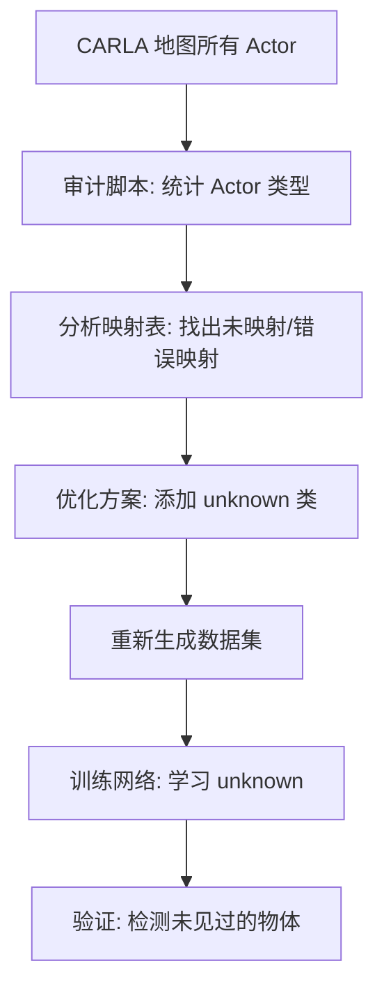

# 未知障碍物检测完整方案

## 一、问题背景

### 1.1 占用网络的核心优势

```
传统目标检测:
  训练类别: [车辆, 行人, 自行车, ...]
  → 只能检测训练过的类别
  → 未见过的物体 (箱子/路障/动物) 会被忽略 ❌

占用网络:
  输出: 3D 体素 × 语义标签
  → 能检测 "未知障碍物" (unknown obstacle)
  → 即使不知道是什么，也知道 "这里有东西" ✅
```

### 1.2 当前问题

**数据集生成时，未知物体可能被错误映射到已知类别，导致网络失去"未知检测"能力。**

示例问题：
```python
# 假设映射表中没有 "垃圾桶" 的定义
carla.CityObjectLabel.TrashCan: ???

# 可能的错误映射:
1. 被映射到 "Pole" (杆状物) → 不合理
2. 被映射到 "Other" (其他) → 语义不明确
3. 被完全忽略 → 体素为空 (Label 0 Free)

# 正确做法:
carla.CityObjectLabel.TrashCan: unknown (新增类别)
```

---

## 二、解决方案架构

### 2.1 总体思路



### 2.2 核心改进

#### 改进 1: 激活 General Object 类别 (Label 17)

**当前标签体系 (18类)**:
现有配置已包含 `general_object` (17)，我们将充分利用它来标记所有 **未知 / 未分类障碍物**，使其符合 nuScenes 标准同时具备未知检测能力。

```python
0:  free (空)
1:  barrier
...
16: vegetation
17: general_object  # ⭐ 包含: 未知障碍物, 杂物, 临时设施
```

#### 改进 2: Actor 映射策略优化

**优化目标**: 将所有"非典型"、"可移动"或"训练未定义"的物体，强制映射为 17 (general_object)。

**三层映射策略**:

```python
# 1. 明确映射 (高置信度)
明确 Actor → 明确类别
例: carla.CityObjectLabel.Car → 4 (car)

# 2. 修正映射 (纠正不合理归类)
街道家具/临时物体 → general_object (17)
例: carla.CityObjectLabel.TrashCan → 17 (general_object)
例: carla.CityObjectLabel.Benches  → 17 (general_object)

# 3. 兜底策略 (未定义)
未知 Actor → general_object (17)
```

---

## 三、实施步骤

### 步骤 1: 审计 CARLA 地图中所有 Actor 类型

#### 脚本 1.1: `audit_carla_actors.py`

**功能**:
- 连接 CARLA 服务器
- 遍历指定地图（如 Town03）
- 统计所有 Actor 的类型分布
- 输出报告：哪些 Actor 类型存在

**输出示例**:
```
=== CARLA Actor 类型审计报告 ===
地图: Town03
总 Actor 数: 1523

分类统计:
┌─────────────────────────────────────────────┐
│ 类别                    数量        占比     │
├─────────────────────────────────────────────┤
│ Buildings               456         29.9%   │
│ Roads                   389         25.5%   │
│ Vehicles                187         12.3%   │
│ TrafficSigns            142          9.3%   │
│ StreetLights             98          6.4%   │
│ Vegetation               87          5.7%   │
│ Pedestrians              45          3.0%   │
│ TrashCans                34          2.2%   │  ⚠️ 未映射
│ Benches                  28          1.8%   │  ⚠️ 未映射
│ Fences                   25          1.6%   │
│ Other                    32          2.1%   │  ⚠️ 需审查
└─────────────────────────────────────────────┘

⚠️ 发现 3 种类型可能未正确映射
```

#### 脚本 1.2: `compare_mapping.py`

**功能**:
- 读取审计报告
- 对比当前映射表 (`actor_occupancy_mapping.py`)
- 输出未映射/可疑映射的 Actor

**输出示例**:
```
=== 映射关系分析 ===

✅ 已正确映射 (12 种):
  - carla.CityObjectLabel.Car → 4 (car)
  - carla.CityObjectLabel.Pedestrians → 7 (pedestrian)
  - ...

⚠️ 未映射/可疑映射 (5 种):
  1. TrashCans (34个) → 当前: 15 (manmade)
     建议: 17 (unknown) ⭐

  2. Benches (28个) → 当前: 15 (manmade)
     建议: 17 (unknown) ⭐

  3. Bicycles (12个) → 当前: 未映射
     建议: 2 (bicycle) ✅

  4. TrafficCones (8个) → 当前: 8 (traffic_cone) ✅
     已正确映射

  5. "Other" 类别 (32个) → 需人工审查
     建议: 逐个检查类型，合理分类
```

---

### 步骤 2: 优化映射表

#### 修改文件: `actor_occupancy_mapping.py`

**当前问题**:
长凳 (Bench)、ATM 等被归类为 `manmade` (15)，导致网络认为它们是永久建筑结构。

**优化后结构** (强化 Unknown 类):
```python
CARLA_TO_NUSCENES = {
    # ========== 高置信度映射 (明确类别) ==========
    # ... 车辆、行人、道路等保持不变 ...

    # 建筑
    carla.CityObjectLabel.Buildings: 15,       # manmade
    carla.CityObjectLabel.Walls: 15,           # manmade

    # ========== 调整映射 (归为 Unknown) ==========

    # 街道家具 (可移动/临时) -> 改为 17
    carla.CityObjectLabel.TrashCans: 17,       # general_object / unknown
    carla.CityObjectLabel.Benches: 17,         # general_object / unknown
    carla.CityObjectLabel.VendingMachine: 17,  # general_object / unknown

    # 临时障碍物
    carla.CityObjectLabel.Other: 17,           # general_object / unknown
}
```

### 步骤 3: 更新标签定义

#### 修改文件: `occupancy_config.py`

确认 `general_object` 的语义，并调整权重。

```python
# dense_occupancy_collection/config/occupancy_config.py

OCCUPANCY_LABELS = {
    # ...
    17: 'unknown',            # ⭐ 将显示名称改为 unknown 以明确语义
}

# 类别权重
CLASS_WEIGHTS = [
    # ...
    3.0,   # 17: unknown ⭐ 保持中高权重
]
```

---

### 步骤 4: 验证数据集

#### 脚本 4.1: `verify_unknown_labels.py`

**功能**:
- 读取生成的 NPZ 文件
- 统计 Label 17 (unknown) 的分布
- 验证未知物体是否被正确标注

**输出示例**:
```
=== 数据集标签分布验证 ===
数据集: dataset_10k

标签统计 (920 个样本):
┌─────────────────────────────────────────────┐
│ Label  类别              总体素数    占比    │
├─────────────────────────────────────────────┤
│   0    free             1,234,567   45.2%   │
│   4    car                156,789    5.7%   │
│   7    pedestrian          12,345    0.5%   │
│  11    driveable_surface  678,901   24.9%   │
│  15    manmade            234,567    8.6%   │
│  16    vegetation         123,456    4.5%   │
│  17    unknown             45,678    1.7%   │ ⭐ 已检测到
└─────────────────────────────────────────────┘

✅ Label 17 (unknown) 占比 1.7% (正常)
✅ 未知物体已被正确标注
```

---

### 步骤 5: 训练网络

#### 关键修改: 确保网络学习 `unknown` 类

**损失函数**:
```python
# occ_transformer/utils/loss.py

# 确保 unknown 类有合理权重
class_weights[17] = 3.0  # unknown 类权重

# 不要将 unknown 设为 ignore_index
# 让网络学习预测 "这里有未知障碍物"
```

**训练脚本**:
```python
# occ_transformer/train_balanced.py

# 确保 num_classes = 18 (包含 unknown)
model = TransformerOccNetBalanced(
    num_cameras=8,
    ...,
    num_classes=18,  # ⭐ 17 → 18
    ...,
)
```

---

### 步骤 6: 测试未知物体检测

#### 测试场景

**场景 1: 训练中未见过的物体**
```python
# 在 CARLA 中生成训练时未见过的物体
world.spawn_actor(blueprint_library.find('static.prop.box01'), ...)

# 采集数据 → 推理
# 预期: 检测到 Label 17 (unknown)
```

**场景 2: 动态障碍物**
```python
# 行人突然掉落物品
# 预期: 掉落物被标注为 Label 17 (unknown)
```

---

## 四、脚本清单

### 4.1 审计脚本

#### `scripts/audit_carla_actors.py`
```python
"""
审计 CARLA 地图中所有 Actor 类型

用法:
    python dense_occupancy_collection/scripts/audit_carla_actors.py \
        --host localhost \
        --port 2000 \
        --map Town03 \
        --output actor_audit_report.json
"""

功能:
- 连接 CARLA 服务器
- 遍历所有 Actor
- 统计类型分布
- 生成 JSON 报告
```

#### `scripts/compare_mapping.py`
```python
"""
对比审计报告与映射表

用法:
    python dense_occupancy_collection/scripts/compare_mapping.py \
        --audit-report actor_audit_report.json \
        --output mapping_analysis.md
"""

功能:
- 读取审计报告
- 对比映射表
- 输出未映射/可疑 Actor
- 生成优化建议
```

### 4.2 验证脚本

#### `scripts/verify_unknown_labels.py`
```python
"""
验证数据集中 unknown 标签分布

用法:
    python dense_occupancy_collection/scripts/verify_unknown_labels.py \
        --dataset dataset_10k \
        --output label_distribution.txt
"""

功能:
- 统计所有标签分布
- 验证 Label 17 存在
- 分析空间分布
```

#### `scripts/test_unknown_detection.py`
```python
"""
测试网络对未知物体的检测能力

用法:
    python scripts/test_unknown_detection.py \
        --checkpoint best_model.pth \
        --dataset test_unknown_objects
"""

功能:
- 加载训练好的模型
- 推理包含未知物体的场景
- 验证 Label 17 预测
```

---

## 五、预期效果

### 5.1 映射优化前后对比

**优化前**:
```
TrashCans (34个) → 15 (manmade)
  → 网络学会: "垃圾桶 = 建筑物" ❌
  → 测试时遇到其他小型障碍物 → 无法识别

Benches (28个) → 15 (manmade)
  → 网络学会: "长凳 = 建筑物" ❌
  → 语义混乱
```

**优化后**:
```
TrashCans (34个) → 17 (unknown)
  → 网络学会: "这类小型障碍物 = 未知" ✅
  → 测试时遇到未见过的箱子/路障 → 能检测到

Benches (28个) → 17 (unknown)
  → 网络学会: "街道家具 = 未知障碍" ✅
  → 泛化能力提升
```

### 5.2 检测能力提升

| 场景 | 优化前 | 优化后 |
|------|-------|-------|
| 训练见过的车辆 | ✅ 检测到 (Label 4 car) | ✅ 检测到 (Label 4 car) |
| 训练未见过的卡车 | ❌ 漏检 | ⚠️ 检测到 (Label 17 unknown) |
| 掉落的箱子 | ❌ 完全忽略 | ✅ 检测到 (Label 17 unknown) |
| 临时路障 | ❌ 完全忽略 | ✅ 检测到 (Label 17 unknown) |
| 动物 (鹿) | ❌ 完全忽略 | ✅ 检测到 (Label 17 unknown) |

---

## 六、实施时间表

### 阶段 1: 审计与分析 (1天)
- [ ] 编写 `audit_carla_actors.py`
- [ ] 在 Town03 运行审计
- [ ] 编写 `compare_mapping.py`
- [ ] 分析映射问题

### 阶段 2: 优化映射 (1天)
- [ ] 修改 `actor_occupancy_mapping.py` (添加 unknown 类)
- [ ] 修改 `occupancy_config.py` (扩展为 18 类)
- [ ] 更新类别权重
- [ ] 代码测试

### 阶段 3: 重新采集数据 (1-2天)
- [ ] 采集 1000 帧测试数据
- [ ] 验证 Label 17 分布
- [ ] 人工抽查标注质量

### 阶段 4: 训练与验证 (3-5天)
- [ ] 使用新数据集训练 Balanced-Pro
- [ ] 验证 unknown 类学习效果
- [ ] 设计测试场景 (未见过物体)
- [ ] 评估泛化能力

---

## 七、关键决策点

### 决策 1: 是否添加 `unknown` 类？

**选项 A**: 扩展为 18 类 (添加 `unknown`)
- 优点: 明确标注未知障碍，泛化能力强
- 缺点: 需要重新训练模型

**选项 B**: 复用 `other_flat` (Label 12)
- 优点: 不需要改类别数
- 缺点: 语义混乱 (地面 vs 障碍物)

**推荐**: 选项 A ✅

### 决策 2: 哪些 Actor 应该映射到 `unknown`？

**指导原则**:
1. **可移动/临时物体** → unknown (垃圾桶、长凳、箱子)
2. **训练数据稀缺** → unknown (动物、特殊车辆)
3. **语义模糊** → unknown ("Other" 类别)
4. **明确类别** → 对应标签 (车辆、行人)

---

## 八、附录

### A. 完整类别映射表

见 `actor_occupancy_mapping.py` (步骤 2)

### B. 审计脚本完整代码

见 `scripts/audit_carla_actors.py` (待编写)

### C. 验证脚本完整代码

见 `scripts/verify_unknown_labels.py` (待编写)

---

## 九、常见问题

### Q1: `unknown` 类会不会影响已知类别的精度？

**A**: 不会，反而会提升。原因：
- 避免将未知物体强行归类到错误类别
- 减少训练数据中的噪声
- 提高网络对边界的判断能力

### Q2: `unknown` 类的权重应该设多少？

**A**: 建议 3.0（中等权重）
- 太低 (如 0.5): 网络不学习 unknown
- 太高 (如 10.0): 过度预测 unknown
- 中等 (3.0): 平衡已知/未知检测

### Q3: 如何评估 `unknown` 类的效果？

**A**: 设计专门的测试集
1. 采集包含"训练未见物体"的场景
2. 人工标注真值 (expected unknown)
3. 计算 unknown 类的 Precision/Recall

---

## 十、总结

### 核心改进

1. **扩展标签**: 17类 → 18类 (添加 `unknown`)
2. **优化映射**: 边缘/未知 Actor → Label 17
3. **兜底策略**: 未定义 Actor → 默认 `unknown`
4. **验证流程**: 审计 → 对比 → 优化 → 测试

### 预期收益

- ✅ 提升泛化能力 (检测未见过的物体)
- ✅ 减少误分类 (避免强行归类)
- ✅ 符合占用网络初衷 (未知障碍检测)
- ✅ 提高安全性 (不漏检异常物体)

---

**下一步**: 请确认方案后，我将逐步编写审计脚本并实施优化。
