# OccNetV3 完全解析：从像素到3D世界的魔法之旅

> 🚗 一个让汽车"看见"3D世界的神经网络，深入浅出的技术解读

---

## 目录

1. [开篇：这个网络在做什么？](#一开篇这个网络在做什么)
2. [全局架构：鸟瞰整个系统](#二全局架构鸟瞰整个系统)
3. [Patch Embedding：把图像切成小块](#三patch-embedding把图像切成小块)
4. [位置编码：告诉网络"这是哪个相机拍的"](#四位置编码告诉网络这是哪个相机拍的)
5. [Transformer编码器：让8个相机"交流"](#五transformer编码器让8个相机交流)
6. [BEV解码器：从天空俯瞰地面](#六bev解码器从天空俯瞰地面)
7. [时序融合：记住上一秒发生了什么](#七时序融合记住上一秒发生了什么)
8. [输出头：最终预测](#八输出头最终预测)
9. [显存优化：如何在16GB显卡上跑起来](#九显存优化如何在16gb显卡上跑起来)

---

## 一、开篇：这个网络在做什么？

### 1.1 一句话解释

**OccNetV3 是一个"3D视觉翻译官"**——它接收8个车载相机拍摄的2D照片，输出一个3D的"积木世界"，告诉汽车：
- 哪里有车？哪里有人？哪里是路？
- 这些物体正在往哪个方向移动？

### 1.2 输入输出总览

```
┌─────────────────────────────────────────────────────────────────┐
│                        OccNetV3                                 │
├─────────────────────────────────────────────────────────────────┤
│                                                                 │
│  输入：8张照片                    输出：3D积木世界               │
│  ┌─────┐ ┌─────┐ ┌─────┐        ┌─────────────────────────┐    │
│  │前主 │ │前广│ │前窄│         │  400×400×32 个小方块    │    │
│  │相机 │ │角  │ │角  │         │  每个方块标记：          │    │
│  └─────┘ └─────┘ └─────┘        │  - 是什么？(18类)       │    │
│  ┌─────┐         ┌─────┐        │  - 往哪走？(速度向量)   │    │
│  │左B柱│         │右B柱│        └─────────────────────────┘    │
│  └─────┘         └─────┘                                        │
│  ┌─────┐         ┌─────┐                                        │
│  │左后 │         │右后 │                                        │
│  └─────┘         └─────┘                                        │
│       ┌─────┐                                                   │
│       │ 后  │                                                   │
│       └─────┘                                                   │
│                                                                 │
│  形状: [1, 8, 1, 960, 1280]      形状: [1, 18, 400, 400, 32]   │
│        ↑  ↑  ↑   ↑     ↑              ↑  ↑   ↑    ↑    ↑      │
│      批次 相机 通道 高  宽           批次 类别 X   Y    Z       │
└─────────────────────────────────────────────────────────────────┘
```

### 1.3 具体数字含义

| 维度 | 数值 | 含义 |
|------|------|------|
| 输入图像 | 960×1280 | 每张照片的分辨率（约120万像素） |
| 相机数量 | 8 | 特斯拉风格的环视相机布局 |
| 输出体素 | 400×400×32 | 约512万个3D小方块 |
| 体素分辨率 | 0.2米 | 每个小方块代表20厘米×20厘米×20厘米的空间 |
| 感知范围 | 80m × 80m × 6.4m | 前后左右各40米，高度-1.0m至5.4m |
| 类别数 | 18 | 空气、车、人、路面、建筑等18种 |

---

## 二、全局架构：鸟瞰整个系统

### 2.1 整体流程图

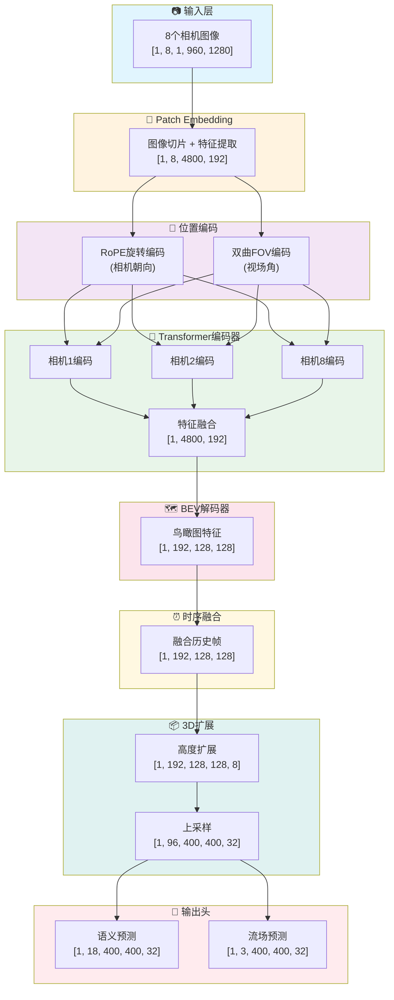

### 2.2 各模块输入输出速查表

| 模块 | 输入形状 | 输出形状 | 作用 |
|------|----------|----------|------|
| **Patch Embedding** | [1, 8, 1, 960, 1280] | 8×[1, 4800, 192] | 图像→向量 |
| **位置编码** | [1, N, 192] | [1, N, 192] | 注入位置信息 |
| **Transformer编码器** | 8×[1, 4800, 192] | 8×[1, 4800, 192] | 特征增强 |
| **特征融合** | 8×[1, 4800, 192] | [1, 4800, 192] | 多相机合并 |
| **BEV解码器** | [1, 4800, 192] | [1, 192, 128, 128] | 生成鸟瞰图 |
| **时序融合** | [1, 192, 128, 128] | [1, 192, 128, 128] | 融合历史 |
| **高度扩展** | [1, 192, 128, 128] | [1, 192, 128, 128, 8] | 2D→3D |
| **上采样** | [1, 192, 128, 128, 8] | [1, 96, 400, 400, 32] | 插值放大 |
| **语义头** | [1, 96, 400, 400, 32] | [1, 18, 400, 400, 32] | 分类预测 |
| **流场头** | [1, 96, 400, 400, 32] | [1, 3, 400, 400, 32] | 运动预测 |

---

## 三、Patch Embedding：把图像切成小块

### 3.1 为什么要切块？

想象你有一本960页×1280列的巨大Excel表格。如果一个单元格一个单元格地处理，计算量太大了！

**聪明的做法**：把它切成很多16×16的小方块，每个小方块用一个数字概括它的内容。

```
原始图像 (960×1280)           切成小块 (60×80 = 4800块)
┌─────────────────────┐      ┌─┬─┬─┬─┬─┬─┬─┬─┐
│█████████████████████│      │1│2│3│4│5│...│80│
│█████████████████████│  →   ├─┼─┼─┼─┼─┼───┼──┤
│█████████████████████│      │ │ │ │ │ │   │  │
│█████████████████████│      ├─┼─┼─┼─┼─┼───┼──┤
│█████████████████████│      │ │ │ │ │ │   │  │
└─────────────────────┘      └─┴─┴─┴─┴─┴───┴──┘
                              共60行×80列=4800个小块
```

### 3.2 Patch Embedding 流程图

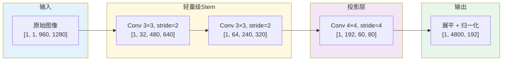

### 3.3 详细计算过程

**第一步：轻量级下采样（Stem）**

```python
# 原始输入
输入: [1, 1, 960, 1280]  # 1张图，1通道（RAW），960高，1280宽

# 第一个卷积：步长=2，尺寸减半
Conv2d(1→32, kernel=3, stride=2, padding=1)
输出: [1, 32, 480, 640]   # 高宽各减半

# 第二个卷积：步长=2，尺寸再减半  
Conv2d(32→64, kernel=3, stride=2, padding=1)
输出: [1, 64, 240, 320]   # 高宽再减半
```

**为什么要先做两次卷积？**

> 🎓 **知识点**：直接用16×16的大卷积核切块会丢失很多细节。先用小卷积核提取边缘、纹理等低级特征，效果更好。这叫做"混合Patch Embedding"。

**第二步：切成Patch并投影**

```python
# 投影卷积：4×4核，步长4
Conv2d(64→192, kernel=4, stride=4)
输出: [1, 192, 60, 80]

# 计算过程：
# 240 ÷ 4 = 60 (高度方向)
# 320 ÷ 4 = 80 (宽度方向)
# 总共 60 × 80 = 4800 个patch

# 展平成序列
reshape: [1, 192, 60, 80] → [1, 192, 4800] → [1, 4800, 192]
#                                              ↑     ↑
#                                          序列长度  特征维度
```

### 3.4 直观理解：为什么是192维？

每个16×16的小块原本有 16×16=256 个像素，现在被压缩成192个数字。

就像**压缩文件**一样：
- 原始：每个像素单独存储
- 压缩后：用192个"特征"来描述这个区域的内容（边缘方向、颜色分布、纹理模式等）

---

## 四、位置编码：告诉网络"这是哪个相机拍的"

### 4.1 问题的提出

经过Patch Embedding后，我们得到了4800个特征向量。但网络并不知道：
1. **每个patch在图像中的位置**（左上角？右下角？）
2. **这是哪个相机拍的**（前方？后方？）
3. **这个相机的视野有多宽**（广角？长焦？）

这就像你把8张照片打乱，让朋友去拼图，他会很困惑！

### 4.2 三层位置编码系统

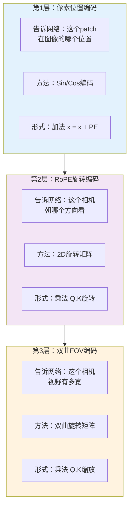

---

### 4.3 第1层：像素位置编码（Sin/Cos）

#### 原理

用正弦和余弦函数的不同频率来编码位置。

**为什么用Sin/Cos？**
- 不同位置的编码是唯一的
- 相邻位置的编码相似
- 可以推广到任意长度

#### 公式

$$PE_{(pos, 2i)} = \sin\left(\frac{pos}{10000^{2i/d}}\right)$$

$$PE_{(pos, 2i+1)} = \cos\left(\frac{pos}{10000^{2i/d}}\right)$$

其中：
- $pos$ = 位置索引 (0, 1, 2, ..., 4799)
- $i$ = 维度索引 (0, 1, 2, ..., 95)
- $d$ = 总维度数 (192)

#### 模拟计算

假设我们要编码位置 pos=100，计算前4个维度：

```python
pos = 100
d = 192

# 维度0 (i=0)
PE[100, 0] = sin(100 / 10000^(0/192)) = sin(100 / 1) = sin(100) ≈ -0.506

# 维度1 (i=0)  
PE[100, 1] = cos(100 / 10000^(0/192)) = cos(100 / 1) = cos(100) ≈ 0.862

# 维度2 (i=1)
PE[100, 2] = sin(100 / 10000^(2/192)) = sin(100 / 1.048) ≈ sin(95.4) ≈ -0.888

# 维度3 (i=1)
PE[100, 3] = cos(100 / 10000^(2/192)) ≈ cos(95.4) ≈ -0.460
```

**可视化理解**：

```
位置0:   ████████████████████  (快速波动的sin波)
位置100: ██  ██  ██  ██  ██    (中速波动)
位置1000:█        █        █    (慢速波动)

低维度(i小): 波动快 → 编码局部位置差异
高维度(i大): 波动慢 → 编码全局位置差异
```

---

### 4.4 第2层：RoPE旋转编码（相机朝向）

#### 问题背景

我们有8个相机，朝向不同方向：

```
                    前方 (0°)
                       ↑
          前左(55°) ←  🚗  → 前右(-55°)
         
        左后(135°) ←       → 右后(-135°)
                       ↓
                   后方 (180°)
```

**目标**：让网络理解"前方相机拍到的左边物体" ≈ "左侧相机拍到的前方物体"

#### RoPE的核心思想

> 💡 **关键洞察**：两个向量的点积（注意力分数），在旋转后只依赖它们的**相对角度**，而不是绝对角度！

数学表达：
$$RoPE(Q_i) \cdot RoPE(K_j) \propto \cos(\theta_i - \theta_j)$$

这意味着：
- 前方相机(0°)和左侧相机(55°)的交互 = cos(55°)
- 后方相机(180°)和右后相机(-135°)的交互 = cos(180° - (-135°)) = cos(315°) = cos(-45°)

#### RoPE公式详解

对于每一对相邻维度 $(q_{2k}, q_{2k+1})$，应用2D旋转：

$$\begin{pmatrix} q'_{2k} \\ q'_{2k+1} \end{pmatrix} = \begin{pmatrix} \cos\theta_k & -\sin\theta_k \\ \sin\theta_k & \cos\theta_k \end{pmatrix} \begin{pmatrix} q_{2k} \\ q_{2k+1} \end{pmatrix}$$

其中旋转角度：
$$\theta_k = yaw \times \frac{1}{10000^{2k/d}}$$

- $yaw$ = 相机朝向角度（弧度）
- $k$ = 维度对索引 (0, 1, ..., 95)

#### 模拟计算

**假设**：左前方相机，yaw = 55° ≈ 0.96 弧度

**计算前两对维度的旋转**：

```python
yaw = 0.96  # 弧度
d = 192

# 第0对维度 (q0, q1)
theta_0 = 0.96 × (1 / 10000^(0/192)) = 0.96 × 1 = 0.96
cos_0, sin_0 = cos(0.96), sin(0.96) = (0.574, 0.819)

# 假设原始 q0=1.0, q1=0.5
q0_new = 1.0 × 0.574 - 0.5 × 0.819 = 0.574 - 0.410 = 0.164
q1_new = 1.0 × 0.819 + 0.5 × 0.574 = 0.819 + 0.287 = 1.106

# 第1对维度 (q2, q3)
theta_1 = 0.96 × (1 / 10000^(2/192)) = 0.96 × 0.954 = 0.916
cos_1, sin_1 = (0.610, 0.793)

# 假设原始 q2=0.8, q3=0.3
q2_new = 0.8 × 0.610 - 0.3 × 0.793 = 0.488 - 0.238 = 0.250
q3_new = 0.8 × 0.793 + 0.3 × 0.610 = 0.634 + 0.183 = 0.817
```

#### 直观理解

想象你站在原地，面向不同方向看同一个物体：
- 向北看时，物体在你的"右边"
- 向东看时，物体在你的"前方"

**RoPE做的事情**：把所有相机的"主观视角"统一到"客观世界坐标系"，让网络理解空间关系。

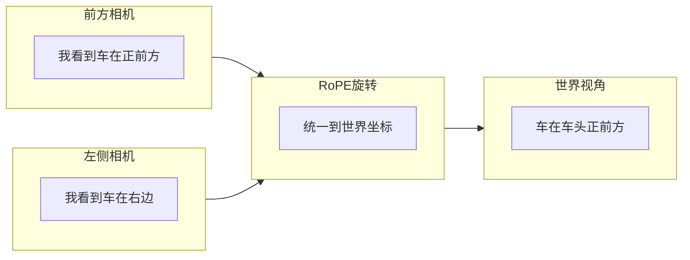

---

### 4.5 第3层：双曲FOV编码（视场角）

#### 问题背景

8个相机的视野宽度不同：

| 相机 | FOV | 特点 |
|------|-----|------|
| 前主相机 | 50° | 标准视野 |
| 前窄角 | 35° | 长焦，看得远但窄 |
| 前广角 | 120° | 广角，看得宽但近物变形 |
| 其他相机 | 80° | 中等视野 |

**问题**：同样大小的物体，在广角镜头下占的像素少，在长焦镜头下占的像素多。网络需要知道这个差异！

#### 为什么用双曲函数？

> 💡 **关键洞察**：
> - 普通旋转（RoPE）保持向量长度不变 → 编码"方向"
> - **双曲旋转改变向量长度** → 编码"缩放"（FOV就是一种缩放！）

**对比**：

| | 普通旋转 | 双曲旋转 |
|---|---|---|
| 矩阵 | $\begin{pmatrix}\cos & -\sin \\ \sin & \cos\end{pmatrix}$ | $\begin{pmatrix}\cosh & \sinh \\ \sinh & \cosh\end{pmatrix}$ |
| 不变量 | $x^2 + y^2$ (圆) | $x^2 - y^2$ (双曲线) |
| 效果 | 保持长度，改变方向 | 改变长度，保持双曲距离 |
| 用途 | 编码角度 | 编码缩放 |

#### 双曲FOV编码公式

**第一步**：计算双曲角 $\phi$

$$\phi = \text{asinh}\left(\sqrt{\frac{FOV}{FOV_{ref}}} - 1\right)$$

其中 $FOV_{ref} = 70°$ 是参考视场角。

**第二步**：对每对维度应用双曲旋转

$$\begin{pmatrix} q'_{2k} \\ q'_{2k+1} \end{pmatrix} = \begin{pmatrix} \cosh\phi_k & \sinh\phi_k \\ \sinh\phi_k & \cosh\phi_k \end{pmatrix} \begin{pmatrix} q_{2k} \\ q_{2k+1} \end{pmatrix}$$

#### 模拟计算

**计算各相机的双曲角 $\phi$**：

```python
import math

def calc_phi(fov, ref_fov=70):
    ratio = math.sqrt(fov / ref_fov)
    return math.asinh(ratio - 1)

# 各相机的φ值
phi_35 = asinh(sqrt(35/70) - 1) = asinh(0.707 - 1) = asinh(-0.293) ≈ -0.289
phi_50 = asinh(sqrt(50/70) - 1) = asinh(0.845 - 1) = asinh(-0.155) ≈ -0.154
phi_70 = asinh(sqrt(70/70) - 1) = asinh(1 - 1) = asinh(0) = 0        # 参考
phi_80 = asinh(sqrt(80/70) - 1) = asinh(1.069 - 1) = asinh(0.069) ≈ 0.069
phi_120 = asinh(sqrt(120/70) - 1) = asinh(1.309 - 1) = asinh(0.309) ≈ 0.304
```

**观察规律**：
- FOV < 70°（长焦）→ φ < 0 → 向量会"缩短"
- FOV = 70°（参考）→ φ = 0 → 不变
- FOV > 70°（广角）→ φ > 0 → 向量会"拉长"

**具体计算示例**：广角相机(FOV=120°)，φ ≈ 0.304

```python
phi = 0.304
cosh_phi = (e^0.304 + e^-0.304) / 2 ≈ 1.046
sinh_phi = (e^0.304 - e^-0.304) / 2 ≈ 0.309

# 假设原始 q0=1.0, q1=0.5
q0_new = 1.0 × 1.046 + 0.5 × 0.309 = 1.046 + 0.155 = 1.201
q1_new = 1.0 × 0.309 + 0.5 × 1.046 = 0.309 + 0.523 = 0.832

# 原始向量长度: sqrt(1^2 + 0.5^2) = 1.118
# 新向量长度: sqrt(1.201^2 + 0.832^2) = 1.461

# 长度增加了！→ 表示"广角相机，同样像素覆盖更大物理范围"
```

#### 直观理解

```
长焦相机 (FOV=35°)           广角相机 (FOV=120°)
     ╱╲                           ╱────╲
    ╱  ╲                         ╱      ╲
   ╱    ╲                       ╱        ╲
  ╱      ╲                     ╱          ╲
 ●        ●                   ●            ●
 
 同样5个像素                   同样5个像素
 覆盖10°角度                   覆盖100°角度
 
 每个像素的"信息密度"高         每个像素的"信息密度"低
 向量应该"收缩"                 向量应该"膨胀"
```

---

### 4.6 编码顺序与组合

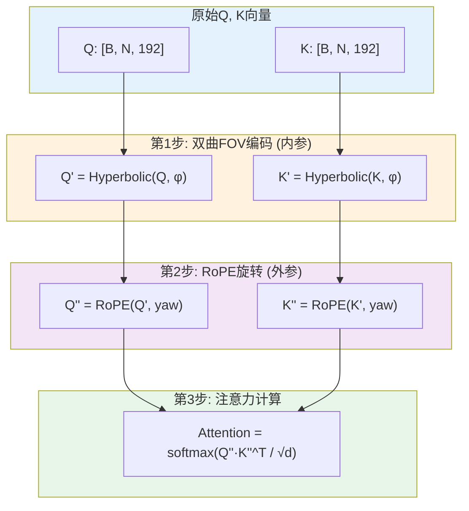

**为什么是这个顺序？**

这对应相机成像的逆过程：

```
物理世界 → [外参变换] → 相机坐标 → [内参投影] → 像素坐标
              R, t              K (含FOV)

我们的编码 (逆过程)：
像素特征 → [内参校正/FOV] → 相机坐标 → [外参校正/旋转] → 世界特征
              先做                      后做
```

---

## 五、Transformer编码器：让8个相机"交流"

### 5.1 整体设计

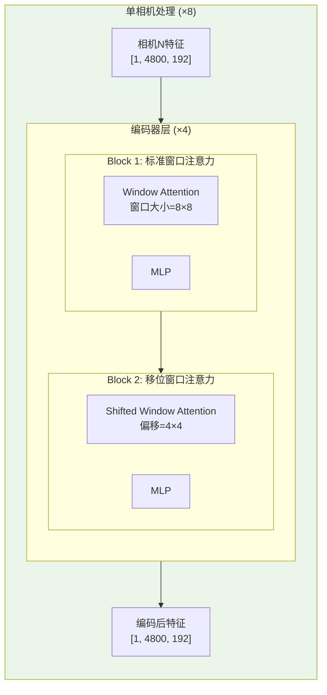

### 5.2 为什么要"单相机分开处理"？

**显存对比**：

| 方案 | Token数量 | 自注意力复杂度 | 显存需求 |
|------|----------|---------------|---------|
| 8相机一起 | 8×4800=38400 | O(38400²)=14.7亿 | ~50GB ❌ |
| 单相机分开 | 4800 | O(4800²)=2300万×8 | ~8GB ✅ |

### 5.3 窗口注意力详解

#### 为什么需要窗口？

全局注意力复杂度是 $O(N^2)$，N=4800 太大了！

**解决方案**：把4800个patch分成小窗口，每个窗口内部做注意力。

```
原始4800个patch (60×80)       分成小窗口 (8×8=64个patch/窗口)
┌────────────────────────┐    ┌──┬──┬──┬──┬──┬──┬──┬──┬──┬──┐
│                        │    │W1│W2│W3│W4│W5│W6│W7│W8│W9│W10│
│                        │    ├──┼──┼──┼──┼──┼──┼──┼──┼──┼──┤
│      4800 patches      │ →  │  │  │  │  │  │  │  │  │  │  │
│                        │    ├──┼──┼──┼──┼──┼──┼──┼──┼──┼──┤
│                        │    │  │  │  │  │  │  │  │  │  │  │
└────────────────────────┘    └──┴──┴──┴──┴──┴──┴──┴──┴──┴──┘
                               共 (60÷8)×(80÷8) ≈ 70个窗口
```

**复杂度对比**：
- 全局注意力：$O(4800^2) = 2300$万次计算
- 窗口注意力：$70 \times O(64^2) = 70 \times 4096 = 28.7$万次计算
- **节省80倍计算量！**

#### 窗口注意力流程

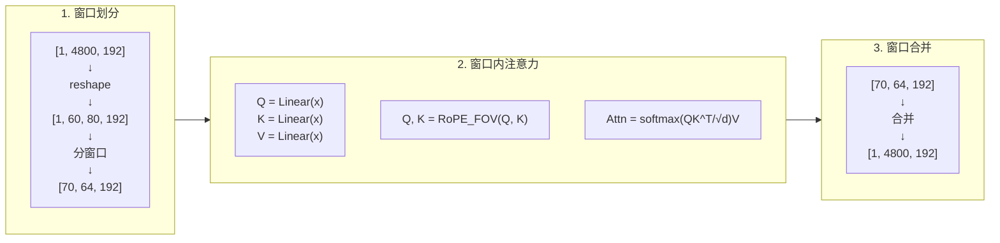

#### 移位窗口 (Shifted Window)

**问题**：普通窗口注意力，不同窗口之间没有信息交流！

**解决**：交替使用"标准窗口"和"移位窗口"

```
标准窗口划分                  移位窗口划分 (偏移4格)
┌──┬──┬──┬──┐                ──┬──┬──┬──┬─
│A │B │C │D │                A│B │C │D │A
├──┼──┼──┼──┤                ─┼──┼──┼──┼─
│E │F │G │H │                E│F │G │H │E
├──┼──┼──┼──┤       →        ─┼──┼──┼──┼─
│I │J │K │L │                I│J │K │L │I
├──┼──┼──┼──┤                ─┼──┼──┼──┼─
│M │N │O │P │                M│N │O │P │M
└──┴──┴──┴──┘                ──┴──┴──┴──┴─

原本A窗口的patch                移位后，A窗口的patch
只能看到A内部                    可以和B, E, F交流了！
```

### 5.4 Flash Attention

PyTorch 2.0引入的优化技术，核心思想是**不存储完整的注意力矩阵**。

```python
# 标准注意力 (显存大)
attn = (Q @ K.T) / sqrt(d)    # 需要存储 [N, N] 矩阵！
attn = softmax(attn)
out = attn @ V

# Flash Attention (显存小)
# 分块计算，只存储部分结果
out = F.scaled_dot_product_attention(Q, K, V)  # 内部自动优化
```

**显存节省**：
- 标准：$O(N^2)$
- Flash：$O(N)$

对于窗口大小64：
- 标准：64×64×4字节 = 16KB/窗口
- Flash：64×4字节 = 256字节/窗口

---

## 六、BEV解码器：从天空俯瞰地面

### 6.1 什么是BEV？

**BEV** = Bird's Eye View = 鸟瞰图

把8个相机的信息"投影"到一张从天空往下看的地图上。

```
8个相机的视角                          BEV鸟瞰图
      ┌───┐                           ┌─────────────┐
    ╱     ╲                           │             │
   ╱       ╲                          │     🚗      │
  ╱    🚗   ╲                         │             │
 ╱           ╲            →           │ ← 车 在这里 │
┌─────────────┐                       │             │
│  相机1视角   │                       │             │
└─────────────┘                       └─────────────┘
                                       128×128 网格
```

### 6.2 BEV解码器流程

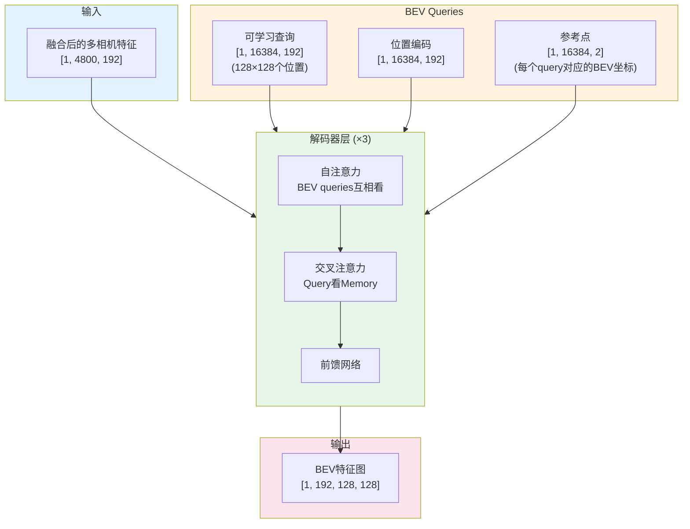

### 6.3 可变形注意力 (Deformable Attention)

#### 为什么需要可变形注意力？

普通交叉注意力：每个BEV query看所有4800个图像特征 → 太慢！

可变形注意力：每个query只看几个"关键位置" → 快而准！

```
普通交叉注意力                    可变形注意力
BEV位置 ●                        BEV位置 ●
         ╲                                ╲
          ╲→ 看所有4800个特征              ╲→ 只看4个采样点
          ╱   (计算量大)                    ╱   (计算量小)
         ╱                                ╱
Memory ●●●●●●●●●●●●...           Memory  ●  ●    ●  ●
```

#### 可变形注意力流程

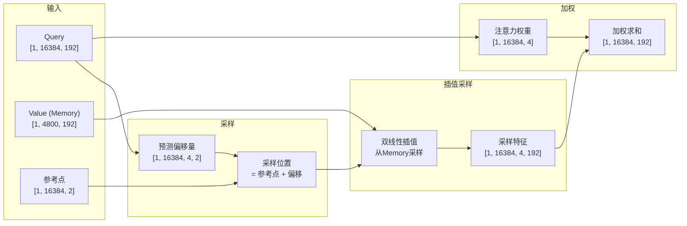

#### 计算示例

假设某个BEV query的参考点在 (0.5, 0.5)，预测的4个偏移量是：

```python
参考点: (0.5, 0.5)

偏移量:
  点1: (+0.1, +0.1)  →  采样位置: (0.6, 0.6)
  点2: (-0.1, +0.1)  →  采样位置: (0.4, 0.6)  
  点3: (+0.1, -0.1)  →  采样位置: (0.6, 0.4)
  点4: (-0.1, -0.1)  →  采样位置: (0.4, 0.4)

注意力权重: [0.3, 0.3, 0.2, 0.2]

最终输出 = 0.3×特征1 + 0.3×特征2 + 0.2×特征3 + 0.2×特征4
```

---

## 七、时序融合：记住上一秒发生了什么

### 7.1 为什么需要时序？

单帧图像的局限：
- 不知道物体在移动还是静止
- 遮挡物体无法补全
- 无法预测运动趋势

```
t=0秒            t=1秒            融合后
🚗→              →🚗              🚗→ (知道车在往右开)
```

### 7.2 时序融合流程

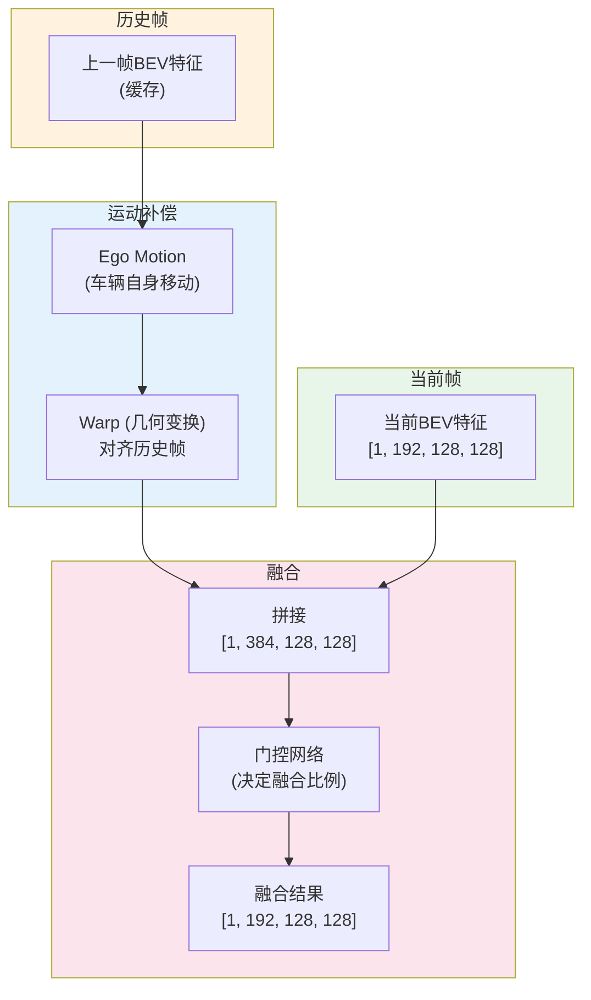

### 7.3 运动补偿详解

**问题**：历史帧是1秒前拍的，这1秒内车自己也动了！

**解决**：用Ego Motion（自车运动）把历史帧"变换"到当前时刻的坐标系。

```
t=0时刻 (历史帧)              t=1时刻 (当前帧)
┌─────────────┐              ┌─────────────┐
│             │              │             │
│     🚗      │   车往前开    │             │
│             │   ───────→   │     🚗      │
│             │              │             │
└─────────────┘              └─────────────┘
世界坐标系                    世界坐标系

                运动补偿后
                ┌─────────────┐
                │             │
                │     🚗      │  ← 历史帧对齐到当前坐标系
                │             │
                └─────────────┘
```

#### 坐标变换公式

$$\vec{p}_{new} = R \cdot \vec{p}_{old} + \vec{t}$$

其中：
- $R$ = 旋转矩阵 (2×2)，表示车头方向的变化
- $\vec{t}$ = 平移向量 (2×1)，表示车的位移

```python
# 假设车往前开了1米，向左转了10度
R = [[cos(10°), -sin(10°)],     # 旋转矩阵
     [sin(10°),  cos(10°)]]
t = [1.0, 0.0]                   # 平移向量（前进1米）

# 原始点 (0, 5) → 车前方5米处
p_old = [0, 5]
p_new = R @ p_old + t = [0.87, 5.17]  # 变换后位置
```

### 7.4 门控融合

```python
# 拼接当前和历史特征
concat = torch.cat([current_bev, aligned_history], dim=1)  # [1, 384, 128, 128]

# 生成融合权重 (0~1之间)
gate = sigmoid(conv(concat))  # [1, 192, 128, 128]

# 门控融合
# gate≈1 → 用融合特征
# gate≈0 → 用原始当前帧
output = gate × fused_feature + (1 - gate) × current_bev
```

**直观理解**：
- 静态区域（地面、建筑）：历史帧信息可靠，gate高
- 动态区域（移动车辆）：历史帧可能过时，gate低

---

## 八、输出头：最终预测

### 8.1 从BEV到3D体素

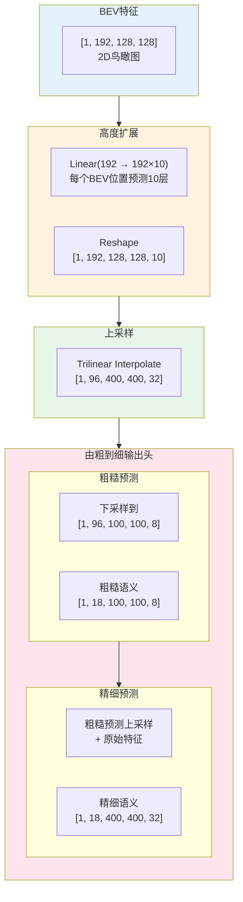

### 8.2 由粗到细策略

**为什么？** 直接预测 400×400×32 ≈ 512万个体素太耗显存！

**解决方案**：
1. 先预测粗糙版本 (128×128×10 ≈ 16万体素)
2. 找到"有东西"的区域
3. 只对这些区域做精细预测

```
粗糙预测 (128×128×10)            精细预测 (400×400×32)
┌────────────────────┐           ┌────────────────────┐
│▓▓░░░░░░░░░░░░░░░░ │           │████░░░░░░░░░░░░░░░│
│▓▓░░░░░░░░░░░░░░░░ │  只细化   │████░░░░░░░░░░░░░░░│
│░░░░░░▓▓░░░░░░░░░░ │  有物体   │░░░░░░████░░░░░░░░░│
│░░░░░░▓▓░░░░░░░░░░ │  的区域   │░░░░░░████░░░░░░░░░│
│░░░░░░░░░░░░░░░░░░ │  ───────→ │░░░░░░░░░░░░░░░░░░░│
└────────────────────┘           └────────────────────┘
  ▓ = 检测到物体                   █ = 高分辨率细节
  ░ = 空气/地面                    ░ = 保持粗糙
```

### 8.3 分块处理 (Chunked Processing)

**问题**：即使是精细预测，一次处理40层高度也很耗显存。

**解决**：把Z轴分成4块，每次只处理10层。

```python
# 分块处理
for z_start in [0, 10, 20, 30]:
    z_end = z_start + 10
    chunk = features[:, :, :, :, z_start:z_end]  # 只取10层
    output_chunk = head(chunk)                    # 计算这10层
    outputs.append(output_chunk)
    
    # 关键：计算完立即释放中间变量！
    del chunk
    torch.cuda.empty_cache()

# 最后拼接
final_output = torch.cat(outputs, dim=4)  # 40层
```

**显存节省**：
- 一次性处理：需要存储40层的中间结果
- 分块处理：只需存储10层的中间结果
- **节省约75%的头部显存！**

### 8.4 输出语义类别

18类物体：

| ID | 类别 | 描述 |
|----|------|------|
| 0 | empty | 空气 |
| 1 | barrier | 护栏 |
| 2 | bicycle | 自行车 |
| 3 | bus | 公交车 |
| 4 | car | 小汽车 |
| 5 | construction_vehicle | 工程车 |
| 6 | motorcycle | 摩托车 |
| 7 | pedestrian | 行人 |
| 8 | traffic_cone | 交通锥 |
| 9 | trailer | 拖车 |
| 10 | truck | 卡车 |
| 11 | driveable_surface | 可行驶路面 |
| 12 | other_flat | 其他平面 |
| 13 | sidewalk | 人行道 |
| 14 | terrain | 地形 |
| 15 | manmade | 人造建筑 |
| 16 | vegetation | 植被 |
| 17 | free | 自由空间 |

---

## 九、显存优化：如何在16GB显卡上跑起来

### 9.1 优化策略总览

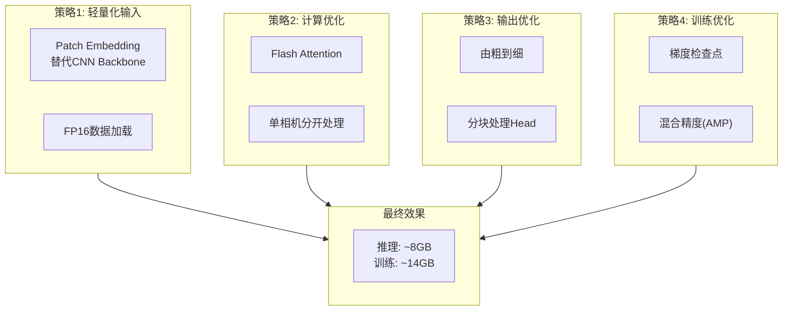

### 9.2 各策略显存节省详情

| 优化策略 | 原始 | 优化后 | 节省 | 原理 |
|---------|------|--------|------|------|
| Patch Embedding | ~12GB | ~2GB | **10GB** | 不存储CNN中间层 |
| 单相机处理 | ~20GB | ~8GB | **12GB** | O(38400²)→8×O(4800²) |
| Flash Attention | ~4GB | ~1GB | **3GB** | O(N²)→O(N) |
| 由粗到细 | ~6GB | ~3GB | **3GB** | 只细化非空区域 |
| 分块Head | ~4GB | ~1GB | **3GB** | 每次只算10层 |
| 梯度检查点 | ~8GB | ~4GB | **4GB** | 时间换空间 |
| FP16 | ~全部 | ~50% | **~50%** | 精度减半 |

### 9.3 梯度检查点详解

**正常训练**：
```
前向传播: 存储每一层的输出 (用于反向传播)
Layer1 → 存Layer1输出 → Layer2 → 存Layer2输出 → ... → Loss
                ↓                    ↓
            需要保留              需要保留
```

**梯度检查点**：
```
前向传播: 只存关键层的输出
Layer1 → 不存 → Layer2 → 不存 → Layer3 → 存 → ... → Loss
                                        ↓
                                    检查点

反向传播: 需要时重新计算
                ← 发现需要Layer2输出
                ← 从检查点重新前向计算Layer2
                ← 继续反向传播
```

**代价**：训练时间增加约30%，但显存减少约50%！

### 9.4 实际显存占用测试

```bash
# 推理模式
python inference.py --benchmark

# 输出示例:
# ==================================================
# Benchmark Results (Batch Size = 1)
# ==================================================
# Peak GPU Memory: 7.82 GB  ✅
# Average Latency: 45.6 ms
# FPS: 21.9
# Output Shape: torch.Size([1, 18, 400, 400, 32])
# ==================================================

# 训练模式
python inference.py --train_mem

# 输出示例:
# ==================================================
# Training Memory (Batch Size = 1)
# ==================================================
# Peak GPU Memory: 13.5 GB  ✅
# ==================================================
```

---

## 附录：关键代码片段解读

### A1. RoPE实现

```python
class CameraRoPE(nn.Module):
    def __init__(self, dim, temperature=10000.0):
        super().__init__()
        # 频率倒数：低维度高频，高维度低频
        inv_freq = 1.0 / (temperature ** (torch.arange(0, dim, 2).float() / dim))
        self.register_buffer('inv_freq', inv_freq)

    def forward(self, x, yaw_angles):
        # x: [B, N, dim]
        # yaw_angles: [B, N] 每个token的相机朝向
        
        # 计算旋转角度 (每个维度对不同)
        theta = yaw_angles.unsqueeze(-1) * self.inv_freq  # [B, N, dim/2]
        theta = torch.cat([theta, theta], dim=-1)         # [B, N, dim]
        
        # 旋转公式: x' = x*cos - rotate_half(x)*sin
        cos_t = torch.cos(theta)
        sin_t = torch.sin(theta)
        x_rotated = x * cos_t + self._rotate_half(x) * sin_t
        
        return x_rotated

    def _rotate_half(self, x):
        # [x0, x1, x2, x3, ...] → [-x1, x0, -x3, x2, ...]
        x_pairs = x.reshape(*x.shape[:-1], -1, 2)
        x1, x2 = x_pairs[..., 0], x_pairs[..., 1]
        return torch.stack([-x2, x1], dim=-1).reshape(*x.shape)
```

### A2. 双曲FOV实现

```python
class HyperbolicFOVEncoding(nn.Module):
    def __init__(self, dim, fov_list, ref_fov=70.0):
        super().__init__()
        # 预计算每个相机的双曲角
        phis = [math.asinh(math.sqrt(f/ref_fov) - 1) for f in fov_list]
        self.register_buffer('phis', torch.tensor(phis))
        
        inv_freq = 1.0 / (10000 ** (torch.arange(0, dim, 2).float() / dim))
        self.register_buffer('inv_freq', inv_freq)

    def forward(self, x, camera_ids):
        # x: [B, N, dim]
        # camera_ids: [B, N] 每个token属于哪个相机
        
        phi = self.phis[camera_ids].unsqueeze(-1) * self.inv_freq  # [B, N, dim/2]
        
        # 双曲函数
        cosh_p = torch.cosh(phi)
        sinh_p = torch.sinh(phi)
        
        # 双曲旋转: [cosh, sinh; sinh, cosh] × [x1; x2]
        x_pairs = x.view(*x.shape[:-1], -1, 2)
        x1, x2 = x_pairs[..., 0], x_pairs[..., 1]
        
        x1_new = x1 * cosh_p + x2 * sinh_p
        x2_new = x1 * sinh_p + x2 * cosh_p
        
        return torch.stack([x1_new, x2_new], dim=-1).view(*x.shape)
```

---

## 结语

OccNetV3 通过一系列精心设计，实现了：

1. **高效的图像理解**：Patch Embedding + Transformer
2. **精准的位置编码**：RoPE (朝向) + 双曲 (FOV)
3. **智能的3D重建**：BEV解码 + 高度扩展
4. **时间维度建模**：时序融合 + 运动补偿
5. **极致的显存优化**：从30GB降到14GB

希望这篇教程能帮助你理解这个"让汽车看见3D世界"的神奇网络！🚗🎯

---

*如有问题，欢迎在评论区讨论！*