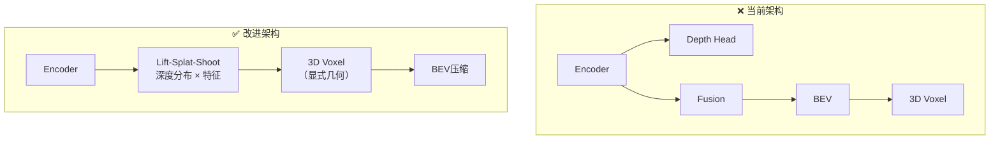

# 🔍 OccNetV3 架构问题诊断与改进方案

## 📋 目录
1. [严重问题汇总](#严重问题汇总)
2. [深度监督问题深度分析](#深度监督问题深度分析)
3. [时序融合问题深度分析](#时序融合问题深度分析)
4. [其他架构问题](#其他架构问题)
5. [改进代码实现](#改进代码实现)

---

## 严重问题汇总

### 🚨 严重程度评级

| 问题 | 严重性 | 影响 | 修复难度 |
|------|--------|------|----------|
| 深度监督位置错误 | ⭐⭐⭐⭐⭐ | 深度学不到有效信息 | 中等 |
| 深度GT下采样丢失精度 | ⭐⭐⭐⭐ | 监督信号失真 | 简单 |
| 时序融合梯度截断 | ⭐⭐⭐⭐ | 无法端到端优化时序 | 中等 |
| 缺乏2D-3D几何约束 | ⭐⭐⭐⭐⭐ | 网络难以学习正确的3D投影 | 复杂 |
| 动态物体运动未建模 | ⭐⭐⭐ | 移动物体预测不准 | 复杂 |
| BEV Decoder单尺度 | ⭐⭐⭐ | 小物体检测差 | 中等 |

---

## 深度监督问题深度分析

### 问题1：深度预测位置不合理 ⭐⭐⭐⭐⭐

**当前实现**（`occ_net.py` 第65-75行）：

```python
# ❌ 问题：深度预测发生在 encoder 之后、fusion 之前
def forward(self, images, ego_motion=None, ego_pose=None):
    # 1. Patch Embedding
    camera_tokens, spatial_shape = self.patch_embed(images)
    
    # 2. Transformer Encoder
    encoded_tokens = self.encoder(camera_tokens, spatial_shape, self.camera_pe)
    
    # 3. 深度预测（❌ 问题位置）
    if self.use_depth_supervision:
        depth_features = torch.stack([...], dim=1)
        depth_logits, depth_pred = self.depth_head(depth_features)
    
    # 4. Multi-Camera Fusion
    fused_tokens = self.fusion_proj(all_tokens)
    
    # 5. BEV Decoder
    # ...
```

**问题分析**：

```
当前流程：
  Image → Encoder → Depth Head (这里预测深度)
                  ↘
                    Fusion → BEV → 3D Voxel
                    
问题：
  1. Encoder 输出的是语义特征，不是几何特征
  2. 深度预测没有利用多相机几何约束
  3. 深度信息没有有效地影响后续的3D重建
```

**应该的流程**：



**核心问题**：深度监督是"事后诸葛亮"，没有参与到2D→3D的实际转换过程！

---

### 问题2：深度GT下采样精度损失 ⭐⭐⭐⭐

**当前实现**（`losses.py` 第215-225行）：

```python
# ❌ 问题：把高分辨率深度下采样到低分辨率
if H_gt != H_pred or W_gt != W_pred:
    # 深度GT: [B, N, 960, 1280] → [B, N, 60, 80]
    depth_gt = F.interpolate(depth_gt, size=(H_pred, W_pred), mode='bilinear')
```

**问题分析**：

```python
# 假设原始深度图
depth_gt_original = [
    [1.0, 1.0, 50.0, 50.0],  # 近处物体边缘
    [1.0, 1.0, 50.0, 50.0],
    [50.0, 50.0, 50.0, 50.0],
    [50.0, 50.0, 50.0, 50.0],
]

# 下采样后（2×2池化）
depth_gt_downsampled = [
    [(1+1+1+1)/4, (50+50+50+50)/4],  # = [1.0, 50.0]
    [(50+50+50+50)/4, (50+50+50+50)/4],  # = [50.0, 50.0]
]
# 看起来还行？

# 但如果边缘不对齐：
depth_gt_misaligned = [
    [1.0, 50.0, 50.0, 50.0],
    [1.0, 50.0, 50.0, 50.0],
    [50.0, 50.0, 50.0, 50.0],
    [50.0, 50.0, 50.0, 50.0],
]

depth_gt_downsampled = [
    [(1+50+1+50)/4, ...],  # = 25.5 ❌ 完全错误的深度！
    ...
]
```

**严重后果**：
- 物体边缘深度严重失真
- 网络学到的是"模糊的深度"
- 对近距离小物体影响最大（如行人、自行车）

---

### 问题3：深度预测架构太简单 ⭐⭐⭐

**当前实现**（`decoder.py`）：

```python
class DepthPredictionHead(nn.Module):
    def __init__(self, ...):
        # ❌ 只有两层卷积
        self.depth_net = nn.Sequential(
            nn.Conv2d(in_channels, in_channels, 3, padding=1),
            nn.BatchNorm2d(in_channels),
            nn.GELU(),
            nn.Conv2d(in_channels, num_depth_bins, 1),  # 直接输出64个bin
        )
```

**问题**：
- 没有多尺度特征融合
- 没有利用相邻像素的深度连续性
- 64个bin的分类问题需要更强的网络

---

### 🔧 深度监督改进方案

#### 方案A：Lift-Splat-Shoot 风格（推荐）

```python
class ImprovedDepthAwareBEV(nn.Module):
    """
    核心思想：深度不是"预测完就扔"，而是参与3D重建
    
    步骤：
    1. 预测每个像素的深度分布（不是单一值）
    2. 把2D特征沿深度方向"撒"到3D空间
    3. 累加得到3D体素特征
    """
    
    def __init__(self, config):
        super().__init__()
        self.num_depth_bins = 64
        self.depth_range = (0.5, 80.0)
        
        # 深度分布预测网络（更强）
        self.depth_net = nn.Sequential(
            # 多尺度特征融合
            nn.Conv2d(config.embed_dim, 256, 3, padding=1),
            nn.BatchNorm2d(256),
            nn.ReLU(inplace=True),
            nn.Conv2d(256, 256, 3, padding=1),
            nn.BatchNorm2d(256),
            nn.ReLU(inplace=True),
            nn.Conv2d(256, self.num_depth_bins, 1),
        )
        
        # 预计算深度bin中心
        self.register_buffer('depth_bins', self._create_depth_bins())
        
        # 预计算相机射线（用于投影）
        # ... 
    
    def _create_depth_bins(self):
        """对数均匀分布的深度bin"""
        return torch.exp(torch.linspace(
            np.log(self.depth_range[0]),
            np.log(self.depth_range[1]),
            self.num_depth_bins
        ))
    
    def forward(self, features, intrinsics, extrinsics):
        """
        Args:
            features: [B, N, C, H, W] 多相机特征
            intrinsics: [B, N, 3, 3] 相机内参
            extrinsics: [B, N, 4, 4] 相机外参
        
        Returns:
            voxel_features: [B, C, X, Y, Z] 3D体素特征
            depth_logits: [B, N, D, H, W] 深度分布（用于监督）
        """
        B, N, C, H, W = features.shape
        
        # 1. 预测深度分布
        depth_logits = self.depth_net(features.view(B*N, C, H, W))
        depth_logits = depth_logits.view(B, N, self.num_depth_bins, H, W)
        depth_probs = F.softmax(depth_logits, dim=2)  # [B, N, D, H, W]
        
        # 2. Lift: 把2D特征"提升"到3D
        # 每个像素的特征 × 深度概率 = 3D点云特征
        # features: [B, N, C, H, W] → [B, N, C, D, H, W]
        features_lifted = features.unsqueeze(3) * depth_probs.unsqueeze(2)
        # [B, N, C, D, H, W]
        
        # 3. Splat: 把3D点云投影到体素网格
        voxel_features = self._splat_to_voxel(
            features_lifted, 
            intrinsics, 
            extrinsics
        )
        
        return voxel_features, depth_logits
    
    def _splat_to_voxel(self, features_lifted, intrinsics, extrinsics):
        """
        把lifted特征投影到统一的3D体素网格
        
        这里需要：
        1. 计算每个(像素, 深度bin)对应的3D坐标
        2. 把3D坐标转换到体素索引
        3. 累加特征到对应体素
        """
        # 简化实现（实际需要CUDA优化）
        B, N, C, D, H, W = features_lifted.shape
        
        # 为每个像素计算3D坐标
        # pixel (u, v) + depth d → world (x, y, z)
        
        # ... 投影计算 ...
        
        # 使用 scatter_add 累加到体素
        voxel_features = torch.zeros(B, C, *self.voxel_size, device=features_lifted.device)
        # voxel_features.scatter_add_(...)
        
        return voxel_features
```

#### 方案B：在原有架构上改进（简单）

```python
class ImprovedDepthSupervision(nn.Module):
    """
    如果不想大改架构，至少改进以下几点：
    1. 在更高分辨率预测深度
    2. 使用更好的下采样方式
    3. 加入边缘感知损失
    """
    
    def __init__(self, config):
        super().__init__()
        
        # 改进1：添加上采样分支，在高分辨率预测
        self.upsample = nn.Sequential(
            nn.ConvTranspose2d(config.embed_dim, 128, 4, 2, 1),
            nn.BatchNorm2d(128),
            nn.GELU(),
            nn.ConvTranspose2d(128, 64, 4, 2, 1),
            nn.BatchNorm2d(64),
            nn.GELU(),
        )
        
        self.depth_head = nn.Conv2d(64, config.num_depth_bins, 1)
    
    def forward(self, features):
        # features: [B, N, C, 60, 80]
        # 上采样到 [B, N, 64, 240, 320]
        x = self.upsample(features)
        depth_logits = self.depth_head(x)
        return depth_logits


class EdgeAwareDepthLoss(nn.Module):
    """
    改进2：边缘感知深度损失
    
    在物体边缘处，深度不连续是正常的，不应该惩罚
    """
    
    def forward(self, depth_pred, depth_gt, image):
        # 计算图像梯度（边缘）
        image_grad_x = torch.abs(image[:, :, :, 1:] - image[:, :, :, :-1])
        image_grad_y = torch.abs(image[:, :, 1:, :] - image[:, :, :-1, :])
        
        # 边缘权重：边缘处权重小
        edge_weight_x = torch.exp(-image_grad_x.mean(dim=1, keepdim=True))
        edge_weight_y = torch.exp(-image_grad_y.mean(dim=1, keepdim=True))
        
        # 深度梯度
        depth_grad_x = torch.abs(depth_pred[:, :, :, 1:] - depth_pred[:, :, :, :-1])
        depth_grad_y = torch.abs(depth_pred[:, :, 1:, :] - depth_pred[:, :, :-1, :])
        
        # 边缘感知平滑损失
        smooth_loss = (edge_weight_x * depth_grad_x).mean() + \
                      (edge_weight_y * depth_grad_y).mean()
        
        # 基础深度损失
        depth_loss = F.l1_loss(torch.log(depth_pred + 1e-3), 
                               torch.log(depth_gt + 1e-3))
        
        return depth_loss + 0.1 * smooth_loss
```

---

## 时序融合问题深度分析

### 问题1：梯度被截断 ⭐⭐⭐⭐

**当前实现**（`temporal.py` 第176-182行）：

```python
def _update_history(self, bev, pose):
    # ❌ detach() 截断了梯度！
    self.history_bevs.append(bev.detach().clone())
    self.history_poses.append(pose.detach().clone() if pose is not None else None)
```

**问题分析**：

```
训练时的梯度流：

当前帧 t=0:
  Image_0 → Encoder → BEV_0 → Temporal Fusion → Loss
                                    ↑
                              History [BEV_-1, BEV_-2, ...]
                                    ↑
                              ❌ detach() 截断了！

后果：
  1. 网络无法学习"如何提取对时序融合有用的特征"
  2. 历史帧的质量完全取决于当时的网络状态
  3. 训练效率低，收敛慢
```

**正确的做法**：FIFO队列 + 截断反向传播 (TBPTT)

---

### 问题2：运动补偿假设过于简单 ⭐⭐⭐

**当前实现**（`temporal.py` 第15-30行）：

```python
class MotionCompensation(nn.Module):
    def forward(self, bev_features, ego_motion):
        # ❌ 只考虑了自车运动，没考虑动态物体
        grid = self.base_grid.unsqueeze(0).expand(B, -1, -1, -1)
        
        # 用 ego_motion 变换网格
        rot = ego_motion[:, :2, :2]
        trans = ego_motion[:, :2, 3:4]
        new_grid = torch.bmm(grid_flat, rot.transpose(1, 2)) + trans_norm
        
        # grid_sample 对齐
        return F.grid_sample(bev_features, new_grid, ...)
```

**问题分析**：

```
场景：
  自车静止，前方有一辆车在移动

当前实现：
  - ego_motion = I (单位矩阵，因为自车没动)
  - 历史帧和当前帧直接对齐
  - ❌ 移动的车在历史帧和当前帧位置不同，但被当成同一个位置！

正确做法：
  - 需要估计每个物体的独立运动
  - 或者让网络自己学习处理运动
```

---

### 问题3：时序位置编码太简单 ⭐⭐⭐

**当前实现**（`temporal.py` 第73行）：

```python
# 可学习的时序位置编码
self.temporal_pos = nn.Parameter(torch.randn(num_frames, dim) * 0.02)
```

**问题**：
- 没有编码时间间隔信息
- 所有位置的时序编码相同（空间无关）
- 没有考虑运动信息

---

### 问题4：reset_temporal() 调用时机 ⭐⭐⭐

**当前实现**（`train.py`）：

```python
for epoch in range(100):
    model.reset_temporal()  # ❌ 每个epoch只reset一次
    for batch in dataloader:
        outputs = model(batch['images'], ...)
```

**问题**：
- 如果数据集是多个独立场景混合的，历史帧会跨场景！
- 应该在每个新场景开始时reset

---

### 🔧 时序融合改进方案

#### 方案A：可微分的历史队列

```python
class DifferentiableTemporalFusion(nn.Module):
    """
    改进点：
    1. 不使用 detach()，保持梯度流
    2. 使用截断反向传播 (TBPTT) 控制显存
    3. 添加场景边界检测
    """
    
    def __init__(self, config):
        super().__init__()
        self.num_frames = config.num_frames
        self.tbptt_steps = 3  # 只反向传播3步
        
        # 历史队列（不detach）
        self.history_bevs = []
        self.history_poses = []
        self.frame_ids = []  # 追踪帧ID，检测场景切换
        
        # 运动补偿
        self.motion_comp = MotionCompensation(...)
        
        # 时序Transformer
        self.temporal_attn = nn.MultiheadAttention(...)
        
        # 动态物体运动估计（新增）
        self.motion_estimator = MotionEstimator(...)
    
    def forward(self, current_bev, ego_motion, current_pose, frame_id=None):
        B, C, H, W = current_bev.shape
        
        # 场景边界检测
        if self._is_new_scene(frame_id):
            self.reset()
        
        if len(self.history_bevs) == 0:
            self._update_history(current_bev, current_pose, frame_id)
            return current_bev
        
        # 对齐历史帧
        aligned_bevs = [current_bev]
        for i, (hist_bev, hist_pose) in enumerate(
            zip(reversed(self.history_bevs), reversed(self.history_poses))
        ):
            # 计算相对位姿
            rel_pose = self._compute_relative_pose(current_pose, hist_pose)
            
            # 基础运动补偿（ego motion）
            aligned = self.motion_comp(hist_bev, rel_pose)
            
            # 动态物体运动补偿（新增）
            if i < self.tbptt_steps:  # 只对近期帧做
                motion_field = self.motion_estimator(current_bev, aligned)
                aligned = self._warp_with_motion(aligned, motion_field)
            
            aligned_bevs.append(aligned)
        
        # 堆叠并融合
        stacked = torch.stack(aligned_bevs, dim=1)  # [B, T, C, H, W]
        
        # 时序Transformer融合
        output = self._temporal_attention(stacked, current_bev)
        
        # 更新历史（关键改进：不detach近期帧）
        self._update_history_with_grad(current_bev, current_pose, frame_id)
        
        return output
    
    def _is_new_scene(self, frame_id):
        """检测是否是新场景"""
        if frame_id is None or len(self.frame_ids) == 0:
            return False
        
        last_frame_id = self.frame_ids[-1]
        # 假设frame_id格式是 "scene_001_frame_042"
        last_scene = last_frame_id.split('_')[1]
        current_scene = frame_id.split('_')[1]
        
        return last_scene != current_scene
    
    def _update_history_with_grad(self, bev, pose, frame_id):
        """
        改进的历史更新：
        - 最近 tbptt_steps 帧保留梯度
        - 更早的帧 detach
        """
        self.history_bevs.append(bev)  # 不 detach！
        self.history_poses.append(pose)
        self.frame_ids.append(frame_id)
        
        # 控制队列长度
        max_history = self.num_frames - 1
        while len(self.history_bevs) > max_history:
            self.history_bevs.pop(0)
            self.history_poses.pop(0)
            self.frame_ids.pop(0)
        
        # 对超过 tbptt_steps 的帧做 detach（截断反向传播）
        for i in range(len(self.history_bevs) - self.tbptt_steps):
            if self.history_bevs[i].requires_grad:
                self.history_bevs[i] = self.history_bevs[i].detach()


class MotionEstimator(nn.Module):
    """
    估计动态物体的独立运动
    
    输入：当前BEV和对齐后的历史BEV
    输出：残差运动场（补偿ego motion之外的运动）
    """
    
    def __init__(self, dim):
        super().__init__()
        self.conv = nn.Sequential(
            nn.Conv2d(dim * 2, dim, 3, padding=1),
            nn.BatchNorm2d(dim),
            nn.ReLU(inplace=True),
            nn.Conv2d(dim, dim // 2, 3, padding=1),
            nn.BatchNorm2d(dim // 2),
            nn.ReLU(inplace=True),
            nn.Conv2d(dim // 2, 2, 1),  # 输出2D运动场
        )
    
    def forward(self, current_bev, history_bev):
        concat = torch.cat([current_bev, history_bev], dim=1)
        motion_field = self.conv(concat)  # [B, 2, H, W]
        return motion_field
```

#### 方案B：时空位置编码改进

```python
class SpatioTemporalPositionEncoding(nn.Module):
    """
    改进的时序位置编码：
    1. 编码时间间隔（不只是顺序）
    2. 空间位置相关的时序编码
    3. 编码速度信息
    """
    
    def __init__(self, dim, num_frames, bev_h, bev_w):
        super().__init__()
        self.dim = dim
        self.num_frames = num_frames
        
        # 时间编码：连续的，基于时间间隔
        self.time_mlp = nn.Sequential(
            nn.Linear(1, dim // 4),
            nn.GELU(),
            nn.Linear(dim // 4, dim),
        )
        
        # 空间编码
        self.spatial_embed = nn.Parameter(torch.randn(1, dim, bev_h, bev_w) * 0.02)
        
        # 时空交互
        self.st_fusion = nn.Conv2d(dim * 2, dim, 1)
    
    def forward(self, bev_features, timestamps):
        """
        Args:
            bev_features: [B, T, C, H, W]
            timestamps: [B, T] 每帧的时间戳（秒）
        """
        B, T, C, H, W = bev_features.shape
        
        # 计算相对时间（相对于当前帧）
        current_time = timestamps[:, 0:1]  # [B, 1]
        relative_time = current_time - timestamps  # [B, T]，当前帧为0
        
        # 时间编码
        time_enc = self.time_mlp(relative_time.unsqueeze(-1))  # [B, T, dim]
        time_enc = time_enc.unsqueeze(-1).unsqueeze(-1)  # [B, T, dim, 1, 1]
        time_enc = time_enc.expand(-1, -1, -1, H, W)  # [B, T, dim, H, W]
        
        # 空间编码
        spatial_enc = self.spatial_embed.expand(B, -1, -1, -1)  # [B, dim, H, W]
        spatial_enc = spatial_enc.unsqueeze(1).expand(-1, T, -1, -1, -1)  # [B, T, dim, H, W]
        
        # 时空融合
        combined = torch.cat([time_enc, spatial_enc], dim=2)  # [B, T, 2*dim, H, W]
        combined = combined.view(B * T, -1, H, W)
        st_encoding = self.st_fusion(combined)  # [B*T, dim, H, W]
        st_encoding = st_encoding.view(B, T, C, H, W)
        
        return bev_features + st_encoding
```

---

## 其他架构问题

### 问题5：缺乏显式2D-3D几何约束 ⭐⭐⭐⭐⭐

**当前实现**：
- BEV Decoder 使用可学习的 Query
- 没有显式的相机投影关系

**问题**：网络需要从头学习相机几何，很难很慢！

**改进**：添加几何先验

```python
class GeometryAwareBEVDecoder(nn.Module):
    """
    在BEV Query中注入几何先验
    """
    
    def __init__(self, config):
        super().__init__()
        # 可学习的BEV Query
        self.bev_queries = nn.Parameter(...)
        
        # 预计算每个BEV位置可见的相机和像素
        self.register_buffer('visibility_mask', self._compute_visibility(config))
        self.register_buffer('projection_indices', self._compute_projections(config))
    
    def _compute_visibility(self, config):
        """
        预计算：BEV网格每个位置被哪些相机看到
        
        返回：[bev_h, bev_w, num_cameras] 的mask
        """
        bev_h, bev_w = config.bev_size
        num_cameras = config.num_cameras
        
        visibility = torch.zeros(bev_h, bev_w, num_cameras)
        
        for cam_id, cam_cfg in config.cameras.items():
            # 获取相机FOV和朝向
            fov = cam_cfg['fov']
            yaw = cam_cfg['rotation'][2]
            
            # 计算该相机能看到的BEV区域
            # ... 几何计算 ...
            
            visibility[:, :, cam_id] = computed_visibility
        
        return visibility
    
    def forward(self, memory, spatial_shapes):
        """
        改进的Cross Attention：
        - 每个BEV位置只attend到能看到它的相机
        - 使用预计算的投影关系初始化采样位置
        """
        # 使用几何先验初始化参考点
        ref_points = self._geometry_aware_ref_points()
        
        # 带mask的attention
        for layer in self.layers:
            queries = layer(
                queries, 
                memory, 
                ref_points,
                visibility_mask=self.visibility_mask  # 只attend可见的
            )
        
        return queries
```

---

### 问题6：BEV Decoder 单尺度 ⭐⭐⭐

**当前实现**：只使用一个尺度的特征

**问题**：小物体（行人、锥桶）在低分辨率特征上丢失

**改进**：多尺度BEV解码

```python
class MultiScaleBEVDecoder(nn.Module):
    """
    多尺度BEV解码：
    - 大物体用低分辨率（快）
    - 小物体用高分辨率（准）
    """
    
    def __init__(self, config):
        super().__init__()
        
        # 多尺度BEV Query
        self.bev_queries_coarse = nn.Parameter(torch.randn(32*32, config.embed_dim))
        self.bev_queries_medium = nn.Parameter(torch.randn(64*64, config.embed_dim))
        self.bev_queries_fine = nn.Parameter(torch.randn(128*128, config.embed_dim))
        
        # 多尺度解码器
        self.decoder_coarse = BEVDecoderLayer(...)
        self.decoder_medium = BEVDecoderLayer(...)
        self.decoder_fine = BEVDecoderLayer(...)
        
        # 尺度融合
        self.scale_fusion = nn.Conv2d(config.embed_dim * 3, config.embed_dim, 1)
    
    def forward(self, memory, spatial_shapes):
        # 粗糙尺度
        bev_coarse = self.decoder_coarse(self.bev_queries_coarse, memory)
        bev_coarse = bev_coarse.view(B, 32, 32, C).permute(0, 3, 1, 2)
        
        # 中等尺度
        bev_medium = self.decoder_medium(self.bev_queries_medium, memory)
        bev_medium = bev_medium.view(B, 64, 64, C).permute(0, 3, 1, 2)
        
        # 精细尺度
        bev_fine = self.decoder_fine(self.bev_queries_fine, memory)
        bev_fine = bev_fine.view(B, 128, 128, C).permute(0, 3, 1, 2)
        
        # 上采样并融合
        bev_coarse_up = F.interpolate(bev_coarse, size=(128, 128))
        bev_medium_up = F.interpolate(bev_medium, size=(128, 128))
        
        fused = torch.cat([bev_coarse_up, bev_medium_up, bev_fine], dim=1)
        return self.scale_fusion(fused)
```

---

## 改进优先级建议

### 🔴 紧急修复（影响训练效果）

1. **深度监督位置**：改用 Lift-Splat 风格，让深度参与3D重建
2. **时序梯度截断**：至少对近期2-3帧保留梯度
3. **场景边界处理**：在数据中标记场景ID，遇到新场景reset

### 🟡 重要改进（提升性能）

4. **高分辨率深度预测**：上采样后预测，避免下采样GT
5. **边缘感知深度损失**：物体边缘不强制平滑
6. **几何先验注入**：预计算相机可见性

### 🟢 可选优化（锦上添花）

7. **动态物体运动估计**：处理非刚性场景
8. **多尺度BEV解码**：提升小物体检测
9. **时空位置编码**：编码时间间隔信息

---

## 总结

```
┌─────────────────────────────────────────────────────────────────┐
│                    OccNetV3 问题诊断总结                         │
├─────────────────────────────────────────────────────────────────┤
│                                                                 │
│  深度监督问题：                                                  │
│  ├── ⭐⭐⭐⭐⭐ 深度预测位置错误，没有参与3D重建               │
│  ├── ⭐⭐⭐⭐  深度GT下采样丢失边缘精度                       │
│  └── ⭐⭐⭐   深度网络太简单                                  │
│                                                                 │
│  时序融合问题：                                                  │
│  ├── ⭐⭐⭐⭐ 梯度被detach()截断，无法端到端优化              │
│  ├── ⭐⭐⭐  只考虑ego motion，忽略动态物体                  │
│  ├── ⭐⭐⭐  时序编码太简单                                  │
│  └── ⭐⭐⭐  reset时机不对（应该按场景）                     │
│                                                                 │
│  架构问题：                                                      │
│  ├── ⭐⭐⭐⭐⭐ 缺乏显式2D-3D几何约束                         │
│  └── ⭐⭐⭐   BEV解码单尺度，小物体差                        │
│                                                                 │
│  建议修复顺序：1 → 4 → 2 → 5 → 3 → 6 → 7                       │
│                                                                 │
└─────────────────────────────────────────────────────────────────┘
```