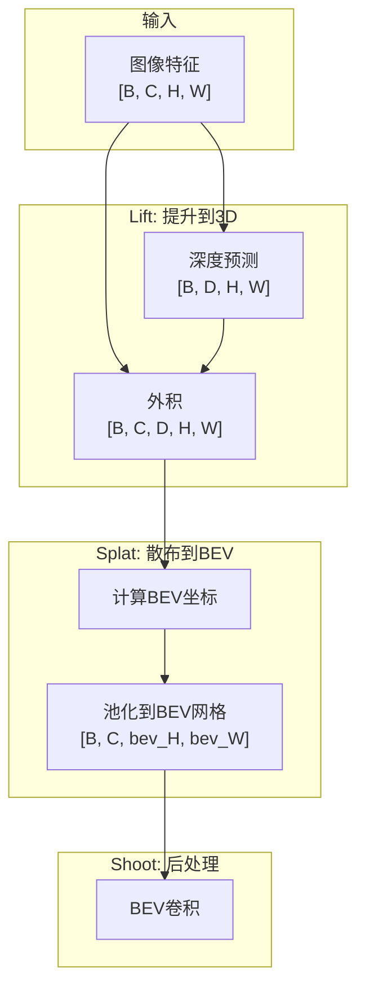
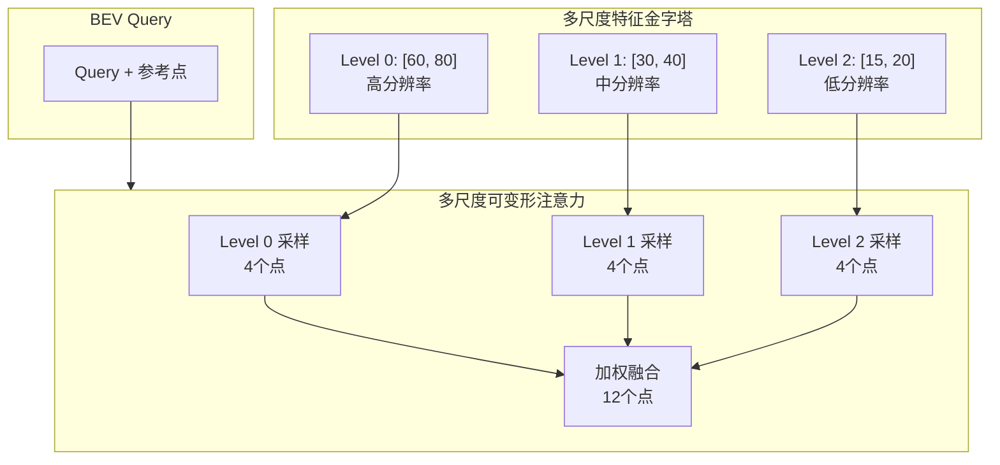
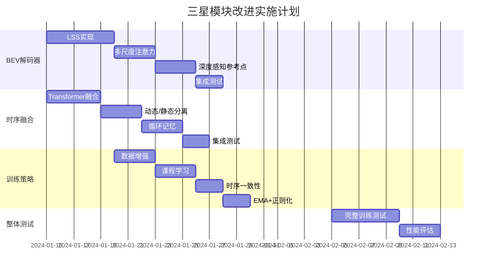

# OccNetV3 三星模块深度改进方案

> 🔧 BEV解码器、时序融合、训练策略的完整升级指南

---

## 目录

1. [改进总览](#一改进总览)
2. [BEV解码器改进：从3星到5星](#二bev解码器改进从3星到5星)
3. [时序融合改进：从3星到5星](#三时序融合改进从3星到5星)
4. [训练策略改进：从3星到5星](#四训练策略改进从3星到5星)
5. [完整代码实现](#五完整代码实现)
6. [实施路线图](#六实施路线图)

---

## 一、改进总览

### 1.1 三星模块问题诊断

```
┌─────────────────────────────────────────────────────────────────────────┐
│                    三星模块问题诊断                                      │
├─────────────────────────────────────────────────────────────────────────┤
│                                                                         │
│  模块            当前问题                     改进方向                   │
│  ────────────────────────────────────────────────────────────────       │
│  BEV解码器       • 参考点是2D均匀网格          • 深度感知的3D参考点       │
│  ⭐⭐⭐           • 缺少显式几何约束           • LSS风格的特征提升        │
│                  • 采样位置盲目学习           • 多尺度可变形注意力       │
│                                                                         │
│  时序融合        • 仅2帧历史                  • 5帧Transformer融合       │
│  ⭐⭐⭐           • 简单门控机制               • 动态/静态分离处理        │
│                  • 无长期记忆                 • 循环记忆机制             │
│                                                                         │
│  训练策略        • 无数据增强                 • 3D几何增强               │
│  ⭐⭐⭐           • 无课程学习                 • 由近到远课程学习         │
│                  • 缺少正则化                 • 时序一致性约束           │
│                                                                         │
└─────────────────────────────────────────────────────────────────────────┘
```

### 1.2 预期改进效果

| 模块 | 当前 | 改进后 | 预期提升 |
|------|------|--------|----------|
| BEV解码器 | ⭐⭐⭐ | ⭐⭐⭐⭐⭐ | +5-8% mIoU |
| 时序融合 | ⭐⭐⭐ | ⭐⭐⭐⭐⭐ | +3-5% mIoU |
| 训练策略 | ⭐⭐⭐ | ⭐⭐⭐⭐ | +2-4% mIoU |
| **总计** | - | - | **+10-17% mIoU** |

---

## 二、BEV解码器改进：从3星到5星

### 2.1 当前问题深度剖析

#### 问题1：参考点是2D均匀网格

```python
# 当前代码 (decoder.py - BEVQueries)
x = torch.linspace(0.5, bev_w - 0.5, bev_w) / bev_w  # [0, 1]归一化
y = torch.linspace(0.5, bev_h - 0.5, bev_h) / bev_h
yy, xx = torch.meshgrid(y, x, indexing='ij')
self.register_buffer('reference_points', torch.stack([xx.flatten(), yy.flatten()], dim=-1))
# 结果: [16384, 2] 的均匀2D网格
```

**问题在哪？**

```
当前的参考点:
┌────────────────────────────────┐
│  •  •  •  •  •  •  •  •  •  • │  ← 2D均匀网格
│  •  •  •  •  •  •  •  •  •  • │    没有深度信息！
│  •  •  •  •  •  •  •  •  •  • │
│  •  •  •  •  •  •  •  •  •  • │
│           🚗                   │  ← 车辆位置
└────────────────────────────────┘

问题: BEV Query想知道(10m, 5m)处有什么物体，
      但参考点只是[0.625, 0.531]这样的归一化2D坐标，
      网络不知道这对应图像的哪个位置！

可变形注意力需要自己"猜"采样偏移，
这个"猜"的过程需要大量数据才能学好。
```

#### 问题2：缺少显式几何约束

```
理想情况:
  BEV位置(10, 5, 0) → 投影到前相机像素(u, v) → 从(u, v)采样特征

当前情况:
  BEV位置(10, 5, 0) → ???神秘的采样偏移??? → 从某处采样特征
  
网络需要隐式学习相机几何，效率低下！
```

### 2.2 改进方案A：深度感知的LSS (Lift-Splat-Shoot)

#### 2.2.1 核心思想

**LSS的核心洞察**：与其让BEV Query去图像"采样"，不如让图像特征主动"投射"到BEV！

```
传统方法 (当前):
  BEV Query → 去图像采样 → 得到特征
  (Query主动，图像被动)

LSS方法:
  图像特征 → 预测深度 → 投射到3D → 落到BEV网格
  (图像主动，BEV被动)
```

#### 2.2.2 LSS算法详解



**Step 1: Lift (提升)**

对每个像素预测深度分布，然后创建3D特征体积：

$$F_{3D}(c, d, h, w) = F_{2D}(c, h, w) \times P_{depth}(d, h, w)$$

其中：
- $F_{2D}$ = 2D图像特征 [C, H, W]
- $P_{depth}$ = 深度概率分布 [D, H, W]，D是深度bin数量
- $F_{3D}$ = 3D特征体积 [C, D, H, W]

**公式解释**：
```
假设某像素的特征是 [0.5, 0.3, 0.8] (3维)
该像素的深度分布是 [0.1, 0.6, 0.2, 0.1] (4个bin)

外积后得到:
  深度bin 0: [0.05, 0.03, 0.08]  (特征 × 0.1)
  深度bin 1: [0.30, 0.18, 0.48]  (特征 × 0.6) ← 最可能的深度
  深度bin 2: [0.10, 0.06, 0.16]  (特征 × 0.2)
  深度bin 3: [0.05, 0.03, 0.08]  (特征 × 0.1)

这样，特征被"分散"到不同深度位置，
深度概率高的地方特征强，概率低的地方特征弱。
```

**Step 2: Splat (散布)**

将3D特征投射到BEV网格：

$$BEV(x, y) = \sum_{(u,v,d): \pi(u,v,d) \to (x,y)} F_{3D}(u, v, d)$$

其中 $\pi$ 是相机投影函数。

**模拟计算**：
```python
# 假设像素(640, 480)的3D特征体积
# 深度bin中心: [5m, 10m, 20m, 40m]

# 相机参数
fx, fy = 1373, 1373  # 焦距
cx, cy = 640, 480    # 光心

# 像素(640, 480)在不同深度的3D坐标:
# d=5m:  X = (640-640)/1373 * 5 = 0m,  Y = (480-480)/1373 * 5 = 0m
# d=10m: X = 0m, Y = 0m
# d=20m: X = 0m, Y = 0m
# d=40m: X = 0m, Y = 0m
# 中心像素在所有深度都投影到(0, 0)！

# 像素(800, 480)在不同深度的3D坐标:
# d=5m:  X = (800-640)/1373 * 5 = 0.58m,  Y = 0m
# d=10m: X = 1.17m, Y = 0m
# d=20m: X = 2.33m, Y = 0m
# d=40m: X = 4.66m, Y = 0m
# 偏移像素在不同深度投影到不同X位置！
```

#### 2.2.3 完整LSS实现

```python
class LiftSplatShoot(nn.Module):
    """
    LSS: 将2D图像特征提升到BEV
    
    论文: Lift, Splat, Shoot: Encoding Images from Arbitrary Camera Rigs
    """
    def __init__(
        self,
        in_channels: int,
        out_channels: int,
        image_size: Tuple[int, int],
        feature_size: Tuple[int, int],
        bev_size: Tuple[int, int],
        pc_range: List[float],
        num_depth_bins: int = 64,
        depth_range: Tuple[float, float] = (0.5, 80.0),
    ):
        super().__init__()
        self.in_channels = in_channels
        self.out_channels = out_channels
        self.image_size = image_size      # (960, 1280)
        self.feature_size = feature_size  # (60, 80)
        self.bev_size = bev_size          # (128, 128)
        self.pc_range = pc_range          # [-40, -40, -1, 40, 40, 5.4]
        self.num_depth_bins = num_depth_bins
        
        # 深度预测网络
        self.depth_net = nn.Sequential(
            nn.Conv2d(in_channels, in_channels, 3, padding=1),
            nn.BatchNorm2d(in_channels),
            nn.ReLU(inplace=True),
            nn.Conv2d(in_channels, num_depth_bins, 1),
        )
        
        # 特征压缩 (减少通道数以节省显存)
        self.feature_compress = nn.Conv2d(in_channels, out_channels, 1)
        
        # BEV卷积
        self.bev_conv = nn.Sequential(
            nn.Conv2d(out_channels, out_channels, 3, padding=1),
            nn.BatchNorm2d(out_channels),
            nn.ReLU(inplace=True),
        )
        
        # 预计算深度bin
        self.register_buffer('depth_bins', self._create_depth_bins(depth_range, num_depth_bins))
        
        # 预计算frustum (视锥体)
        self._create_frustum()
    
    def _create_depth_bins(self, depth_range, num_bins):
        """创建对数均匀的深度bin"""
        min_d, max_d = depth_range
        # 对数空间：近处bin更密集
        depth_bins = torch.exp(torch.linspace(
            math.log(min_d), math.log(max_d), num_bins
        ))
        return depth_bins
    
    def _create_frustum(self):
        """
        预计算视锥体：每个(u, v, d)对应的相机坐标(x, y, z)
        
        frustum[d, h, w, 3] = (x, y, z) 相机坐标
        """
        H, W = self.feature_size
        D = self.num_depth_bins
        
        # 特征图像素坐标
        us = torch.linspace(0.5, W - 0.5, W) * (self.image_size[1] / W)
        vs = torch.linspace(0.5, H - 0.5, H) * (self.image_size[0] / H)
        ds = self.depth_bins
        
        # 创建网格
        vv, uu, dd = torch.meshgrid(vs, us, ds, indexing='ij')  # [H, W, D]
        
        # 视锥体: [D, H, W, 3]
        frustum = torch.stack([uu, vv, dd], dim=-1).permute(2, 0, 1, 3)
        self.register_buffer('frustum', frustum)
    
    def get_geometry(self, intrinsics, extrinsics):
        """
        将视锥体从图像坐标转换到BEV坐标
        
        Args:
            intrinsics: [B, N, 3, 3] 相机内参
            extrinsics: [B, N, 4, 4] 相机外参 (camera to world)
        
        Returns:
            geom: [B, N, D, H, W, 3] 每个(d, h, w)对应的世界坐标(x, y, z)
        """
        B, N = intrinsics.shape[:2]
        D, H, W = self.frustum.shape[:3]
        
        # 扩展frustum: [B, N, D, H, W, 3]
        frustum = self.frustum.unsqueeze(0).unsqueeze(0).expand(B, N, -1, -1, -1, -1)
        
        # 像素坐标 + 深度 → 相机坐标
        # (u, v, d) → (x_cam, y_cam, z_cam)
        # x_cam = (u - cx) * d / fx
        # y_cam = (v - cy) * d / fy
        # z_cam = d
        
        fx = intrinsics[:, :, 0, 0].view(B, N, 1, 1, 1, 1)
        fy = intrinsics[:, :, 1, 1].view(B, N, 1, 1, 1, 1)
        cx = intrinsics[:, :, 0, 2].view(B, N, 1, 1, 1, 1)
        cy = intrinsics[:, :, 1, 2].view(B, N, 1, 1, 1, 1)
        
        u = frustum[..., 0:1]
        v = frustum[..., 1:2]
        d = frustum[..., 2:3]
        
        x_cam = (u - cx) * d / fx
        y_cam = (v - cy) * d / fy
        z_cam = d
        
        points_cam = torch.cat([x_cam, y_cam, z_cam, torch.ones_like(z_cam)], dim=-1)
        # [B, N, D, H, W, 4]
        
        # 相机坐标 → 世界坐标
        # points_world = extrinsics @ points_cam
        extrinsics = extrinsics.view(B, N, 1, 1, 1, 4, 4)
        points_world = torch.einsum('bndhwij,bndhwj->bndhwi', 
                                     extrinsics.expand(-1, -1, D, H, W, -1, -1),
                                     points_cam)
        
        return points_world[..., :3]  # [B, N, D, H, W, 3]
    
    def voxel_pooling(self, geom, features):
        """
        将3D特征散布到BEV网格
        
        Args:
            geom: [B, N, D, H, W, 3] 世界坐标
            features: [B, N, C, D, H, W] 3D特征
        
        Returns:
            bev: [B, C, bev_H, bev_W]
        """
        B, N, C, D, H, W = features.shape
        bev_H, bev_W = self.bev_size
        
        # 世界坐标 → BEV网格索引
        x = geom[..., 0]  # [B, N, D, H, W]
        y = geom[..., 1]
        
        # 归一化到[0, 1]
        x_norm = (x - self.pc_range[0]) / (self.pc_range[3] - self.pc_range[0])
        y_norm = (y - self.pc_range[1]) / (self.pc_range[4] - self.pc_range[1])
        
        # 转换为网格索引
        x_idx = (x_norm * bev_W).long()
        y_idx = (y_norm * bev_H).long()
        
        # 有效性掩码
        valid = (x_idx >= 0) & (x_idx < bev_W) & (y_idx >= 0) & (y_idx < bev_H)
        
        # 使用scatter_add进行池化
        bev = torch.zeros(B, C, bev_H, bev_W, device=features.device, dtype=features.dtype)
        
        for b in range(B):
            for n in range(N):
                mask = valid[b, n]  # [D, H, W]
                feat = features[b, n]  # [C, D, H, W]
                xi = x_idx[b, n][mask]  # [num_valid]
                yi = y_idx[b, n][mask]  # [num_valid]
                f = feat[:, mask]  # [C, num_valid]
                
                # 线性索引
                idx = yi * bev_W + xi  # [num_valid]
                
                # 散布累加
                bev_flat = bev[b].view(C, -1)  # [C, bev_H*bev_W]
                bev_flat.scatter_add_(1, idx.unsqueeze(0).expand(C, -1), f)
        
        return bev
    
    def forward(self, features, intrinsics, extrinsics):
        """
        Args:
            features: [B, N, C, H, W] 多相机图像特征
            intrinsics: [B, N, 3, 3] 相机内参
            extrinsics: [B, N, 4, 4] 相机外参
        
        Returns:
            bev: [B, out_C, bev_H, bev_W] BEV特征
            depth_logits: [B, N, D, H, W] 深度预测（用于监督）
        """
        B, N, C, H, W = features.shape
        
        # 1. 预测深度分布
        features_flat = features.view(B * N, C, H, W)
        depth_logits = self.depth_net(features_flat)  # [B*N, D, H, W]
        depth_logits = depth_logits.view(B, N, self.num_depth_bins, H, W)
        
        depth_probs = F.softmax(depth_logits, dim=2)  # [B, N, D, H, W]
        
        # 2. 压缩特征通道
        features_compressed = self.feature_compress(features_flat)
        features_compressed = features_compressed.view(B, N, self.out_channels, H, W)
        
        # 3. 创建3D特征体积 (Lift)
        # features_3d[b, n, c, d, h, w] = features[b, n, c, h, w] * depth_prob[b, n, d, h, w]
        features_3d = features_compressed.unsqueeze(3) * depth_probs.unsqueeze(2)
        # [B, N, C, D, H, W]
        
        # 4. 计算几何映射
        geom = self.get_geometry(intrinsics, extrinsics)  # [B, N, D, H, W, 3]
        
        # 5. 散布到BEV (Splat)
        bev = self.voxel_pooling(geom, features_3d)  # [B, C, bev_H, bev_W]
        
        # 6. BEV卷积 (Shoot)
        bev = self.bev_conv(bev)
        
        return bev, depth_logits
```

### 2.3 改进方案B：多尺度可变形注意力

#### 2.3.1 当前问题

```python
# 当前: 单尺度可变形注意力
self.cross_attn = DeformableAttention(dim, num_heads, num_levels=1, num_points=4)
#                                                      ↑ 只有1个尺度！
```

**问题**：
- 近处大物体需要粗尺度特征（大感受野）
- 远处小物体需要细尺度特征（高分辨率）
- 单尺度无法兼顾！

#### 2.3.2 多尺度可变形注意力



**公式**：

$$\text{MSDeformAttn}(q, p, \{F_l\}) = \sum_{l=1}^{L} \sum_{k=1}^{K} A_{lk} \cdot W_l \cdot F_l(\phi_l(p) + \Delta p_{lk})$$

其中：
- $q$ = Query特征
- $p$ = 参考点坐标
- $F_l$ = 第$l$层特征图
- $L$ = 尺度数量（改进后=3）
- $K$ = 每层采样点数（=4）
- $A_{lk}$ = 注意力权重，$\sum_{l,k} A_{lk} = 1$
- $\Delta p_{lk}$ = 采样偏移，由网络预测
- $\phi_l$ = 尺度变换函数（将参考点映射到第$l$层坐标）
- $W_l$ = 第$l$层的投影矩阵

**模拟计算**：

```python
# BEV Query想采样世界坐标(10, 5)处的特征
# 参考点 p = (0.625, 0.531)  (归一化BEV坐标)

# 假设网络预测的偏移和权重:
# Level 0 (60×80): 
#   offset_0 = [(-0.02, 0.01), (0.03, -0.01), (0.01, 0.02), (-0.01, -0.02)]
#   weights_0 = [0.12, 0.08, 0.05, 0.05]  # 总权重0.30
# Level 1 (30×40):
#   offset_1 = [(-0.03, 0.02), (0.02, -0.02), (0.04, 0.01), (-0.02, -0.01)]
#   weights_1 = [0.15, 0.12, 0.08, 0.05]  # 总权重0.40
# Level 2 (15×20):
#   offset_2 = [(-0.05, 0.03), (0.06, -0.04), (0.02, 0.05), (-0.03, -0.03)]
#   weights_2 = [0.10, 0.08, 0.07, 0.05]  # 总权重0.30

# 采样位置 (以Level 1为例):
# point_0: (0.625 - 0.03, 0.531 + 0.02) = (0.595, 0.551)
# point_1: (0.625 + 0.02, 0.531 - 0.02) = (0.645, 0.511)
# ...

# 使用grid_sample从各层采样，然后加权求和
# output = 0.12*F0_p0 + 0.08*F0_p1 + ... + 0.10*F2_p0 + ...
```

#### 2.3.3 实现代码

```python
class MultiScaleDeformableAttention(nn.Module):
    """
    多尺度可变形注意力
    
    改进点:
    1. 3个尺度的特征金字塔
    2. 每层4个采样点，共12个采样点
    3. 自适应权重学习
    """
    def __init__(
        self,
        dim: int,
        num_heads: int = 8,
        num_levels: int = 3,
        num_points: int = 4,
    ):
        super().__init__()
        self.dim = dim
        self.num_heads = num_heads
        self.num_levels = num_levels
        self.num_points = num_points
        self.head_dim = dim // num_heads
        
        # 采样偏移预测
        # 输出: [num_heads, num_levels, num_points, 2]
        self.sampling_offsets = nn.Linear(
            dim, 
            num_heads * num_levels * num_points * 2
        )
        
        # 注意力权重预测
        # 输出: [num_heads, num_levels, num_points]
        self.attention_weights = nn.Linear(
            dim,
            num_heads * num_levels * num_points
        )
        
        # Value投影
        self.value_proj = nn.Linear(dim, dim)
        
        # 输出投影
        self.output_proj = nn.Linear(dim, dim)
        
        self._reset_parameters()
    
    def _reset_parameters(self):
        """初始化参数"""
        # 偏移初始化为小值
        nn.init.constant_(self.sampling_offsets.weight, 0.)
        
        # 初始化偏移bias为均匀分布的角度
        thetas = torch.arange(self.num_heads).float() * (2 * math.pi / self.num_heads)
        grid_init = torch.stack([thetas.cos(), thetas.sin()], -1)
        grid_init = grid_init.view(self.num_heads, 1, 1, 2)
        grid_init = grid_init.repeat(1, self.num_levels, self.num_points, 1)
        
        for i in range(self.num_points):
            grid_init[:, :, i, :] *= (i + 1)
        
        with torch.no_grad():
            self.sampling_offsets.bias = nn.Parameter(grid_init.view(-1))
        
        # 权重初始化
        nn.init.constant_(self.attention_weights.weight, 0.)
        nn.init.constant_(self.attention_weights.bias, 0.)
        
        # 投影初始化
        nn.init.xavier_uniform_(self.value_proj.weight)
        nn.init.xavier_uniform_(self.output_proj.weight)
    
    def forward(
        self,
        query: torch.Tensor,
        reference_points: torch.Tensor,
        value: torch.Tensor,
        spatial_shapes: torch.Tensor,
        level_start_index: torch.Tensor,
    ):
        """
        Args:
            query: [B, Lq, C] Query特征
            reference_points: [B, Lq, 2] 参考点坐标 (归一化)
            value: [B, Lv, C] 多尺度特征拼接
            spatial_shapes: [num_levels, 2] 每层的空间尺寸
            level_start_index: [num_levels] 每层在value中的起始索引
        
        Returns:
            output: [B, Lq, C]
        """
        B, Lq, _ = query.shape
        B, Lv, _ = value.shape
        
        # 1. Value投影
        value = self.value_proj(value)
        value = value.view(B, Lv, self.num_heads, self.head_dim)
        
        # 2. 预测采样偏移
        sampling_offsets = self.sampling_offsets(query)
        sampling_offsets = sampling_offsets.view(
            B, Lq, self.num_heads, self.num_levels, self.num_points, 2
        )
        
        # 3. 预测注意力权重
        attention_weights = self.attention_weights(query)
        attention_weights = attention_weights.view(
            B, Lq, self.num_heads, self.num_levels * self.num_points
        )
        attention_weights = F.softmax(attention_weights, dim=-1)
        attention_weights = attention_weights.view(
            B, Lq, self.num_heads, self.num_levels, self.num_points
        )
        
        # 4. 计算采样位置
        # 偏移归一化
        offset_normalizer = torch.stack([
            spatial_shapes[..., 1],  # W
            spatial_shapes[..., 0],  # H
        ], -1)  # [num_levels, 2]
        
        sampling_locations = reference_points[:, :, None, None, None, :] + \
                            sampling_offsets / offset_normalizer[None, None, None, :, None, :]
        # [B, Lq, num_heads, num_levels, num_points, 2]
        
        # 5. 多尺度采样
        output = self._ms_deform_attn_core(
            value, spatial_shapes, level_start_index,
            sampling_locations, attention_weights
        )
        
        # 6. 输出投影
        output = self.output_proj(output)
        
        return output
    
    def _ms_deform_attn_core(
        self,
        value: torch.Tensor,
        spatial_shapes: torch.Tensor,
        level_start_index: torch.Tensor,
        sampling_locations: torch.Tensor,
        attention_weights: torch.Tensor,
    ):
        """多尺度可变形注意力核心计算"""
        B, Lv, num_heads, head_dim = value.shape
        B, Lq, num_heads, num_levels, num_points, _ = sampling_locations.shape
        
        # 按层切分value
        value_list = value.split(
            [H * W for H, W in spatial_shapes.tolist()], 
            dim=1
        )
        
        # 采样网格: 转换为[-1, 1]
        sampling_grids = 2 * sampling_locations - 1
        
        # 初始化输出
        output = torch.zeros(
            B, Lq, num_heads, head_dim,
            device=value.device, dtype=value.dtype
        )
        
        for level, (H, W) in enumerate(spatial_shapes.tolist()):
            # 获取该层的value: [B, H*W, num_heads, head_dim]
            value_l = value_list[level]
            
            # Reshape为图像形式: [B*num_heads, head_dim, H, W]
            value_l = value_l.view(B, H, W, num_heads, head_dim)
            value_l = value_l.permute(0, 3, 4, 1, 2).contiguous()
            value_l = value_l.view(B * num_heads, head_dim, H, W)
            
            # 该层的采样网格: [B, Lq, num_heads, num_points, 2]
            sampling_grid_l = sampling_grids[:, :, :, level]
            # Reshape: [B*num_heads, Lq, num_points, 2]
            sampling_grid_l = sampling_grid_l.permute(0, 2, 1, 3, 4).contiguous()
            sampling_grid_l = sampling_grid_l.view(B * num_heads, Lq, num_points, 2)
            
            # 双线性采样: [B*num_heads, head_dim, Lq, num_points]
            sampled_value = F.grid_sample(
                value_l,
                sampling_grid_l,
                mode='bilinear',
                padding_mode='zeros',
                align_corners=False,
            )
            
            # Reshape: [B, num_heads, head_dim, Lq, num_points]
            sampled_value = sampled_value.view(B, num_heads, head_dim, Lq, num_points)
            # 转置: [B, Lq, num_heads, num_points, head_dim]
            sampled_value = sampled_value.permute(0, 3, 1, 4, 2)
            
            # 该层的注意力权重: [B, Lq, num_heads, num_points]
            weights_l = attention_weights[:, :, :, level, :]
            
            # 加权求和
            # [B, Lq, num_heads, num_points, head_dim] × [B, Lq, num_heads, num_points, 1]
            output += (sampled_value * weights_l.unsqueeze(-1)).sum(dim=3)
        
        # Reshape: [B, Lq, num_heads * head_dim]
        output = output.view(B, Lq, num_heads * head_dim)
        
        return output
```

### 2.4 改进方案C：深度感知参考点

#### 2.4.1 核心思想

不再使用固定的2D参考点，而是根据深度预测动态生成3D参考点。

```
当前方法:
  参考点 = 固定的2D BEV网格 [(0,0), (0,1), ..., (127,127)]
  
改进方法:
  1. 预测每个BEV位置的深度分布
  2. 参考点 = BEV位置 + 多个深度采样点
  3. 将3D参考点投影到各相机，作为采样位置
```

#### 2.4.2 公式

**Step 1**: 为每个BEV Query预测深度分布

$$D(x, y) = \text{Softmax}(\text{DepthNet}(BEV\_Query(x, y)))$$

**Step 2**: 生成3D参考点

$$P_{3D}(x, y, k) = (x_{world}, y_{world}, z_k)$$

其中 $z_k$ 是第$k$个深度bin的中心值。

**Step 3**: 投影到图像

$$p_{img}(x, y, k, n) = K_n \cdot T_n^{-1} \cdot P_{3D}(x, y, k)$$

其中：
- $K_n$ = 第$n$个相机的内参
- $T_n$ = 第$n$个相机的外参

#### 2.4.3 实现代码

```python
class DepthAwareReferencePoints(nn.Module):
    """
    深度感知的参考点生成
    
    为每个BEV位置生成多个深度上的参考点，
    然后投影到各相机获得采样位置。
    """
    def __init__(
        self,
        bev_h: int,
        bev_w: int,
        num_depth_samples: int = 4,
        pc_range: List[float] = [-40, -40, -1, 40, 40, 5.4],
    ):
        super().__init__()
        self.bev_h = bev_h
        self.bev_w = bev_w
        self.num_depth_samples = num_depth_samples
        self.pc_range = pc_range
        
        # 预计算BEV网格的世界坐标
        x = torch.linspace(pc_range[0], pc_range[3], bev_w)
        y = torch.linspace(pc_range[1], pc_range[4], bev_h)
        yy, xx = torch.meshgrid(y, x, indexing='ij')
        self.register_buffer('bev_x', xx.flatten())  # [bev_h * bev_w]
        self.register_buffer('bev_y', yy.flatten())
        
        # 深度采样点
        z_min, z_max = pc_range[2], pc_range[5]
        z_samples = torch.linspace(z_min, z_max, num_depth_samples)
        self.register_buffer('z_samples', z_samples)
        
        # 深度权重预测网络
        self.depth_weight_net = nn.Sequential(
            nn.Linear(bev_h * bev_w, bev_h * bev_w),
            nn.ReLU(),
            nn.Linear(bev_h * bev_w, bev_h * bev_w * num_depth_samples),
        )
    
    def forward(self, bev_queries, intrinsics, extrinsics):
        """
        Args:
            bev_queries: [B, bev_h*bev_w, C] BEV Query特征
            intrinsics: [B, N, 3, 3] 相机内参
            extrinsics: [B, N, 4, 4] 相机外参
        
        Returns:
            reference_points: [B, bev_h*bev_w, N, num_depth, 2] 各相机的参考点
            depth_weights: [B, bev_h*bev_w, num_depth] 深度权重
        """
        B = bev_queries.shape[0]
        N = intrinsics.shape[1]
        L = self.bev_h * self.bev_w
        D = self.num_depth_samples
        
        # 1. 预测深度权重
        depth_weights = self.depth_weight_net(bev_queries.mean(dim=-1))
        depth_weights = depth_weights.view(B, L, D)
        depth_weights = F.softmax(depth_weights, dim=-1)
        
        # 2. 生成3D参考点
        # [L, D, 3]: 每个BEV位置在每个深度的3D坐标
        points_3d = torch.stack([
            self.bev_x.unsqueeze(1).expand(-1, D),
            self.bev_y.unsqueeze(1).expand(-1, D),
            self.z_samples.unsqueeze(0).expand(L, -1),
        ], dim=-1)  # [L, D, 3]
        
        # 扩展batch维度: [B, L, D, 3]
        points_3d = points_3d.unsqueeze(0).expand(B, -1, -1, -1)
        
        # 3. 投影到各相机
        # 需要将3D点转换为齐次坐标，然后投影
        points_homo = torch.cat([
            points_3d,
            torch.ones_like(points_3d[..., :1])
        ], dim=-1)  # [B, L, D, 4]
        
        reference_points = []
        for cam_idx in range(N):
            # 世界坐标 → 相机坐标
            T_inv = torch.linalg.inv(extrinsics[:, cam_idx])  # [B, 4, 4]
            points_cam = torch.einsum('bij,bldk->bldi', T_inv, points_homo)
            # [B, L, D, 4]
            
            # 相机坐标 → 像素坐标
            points_cam_3d = points_cam[..., :3]  # [B, L, D, 3]
            K = intrinsics[:, cam_idx]  # [B, 3, 3]
            
            # 投影: p = K @ (X/Z, Y/Z, 1)
            z = points_cam_3d[..., 2:3].clamp(min=1e-3)
            xy_norm = points_cam_3d[..., :2] / z
            xy_homo = torch.cat([xy_norm, torch.ones_like(z)], dim=-1)
            
            pixels = torch.einsum('bij,bldk->bldi', K, xy_homo)
            pixels = pixels[..., :2]  # [B, L, D, 2]
            
            # 归一化到[0, 1]
            # 假设图像尺寸已知
            pixels[..., 0] /= 1280  # W
            pixels[..., 1] /= 960   # H
            pixels = pixels.clamp(0, 1)
            
            reference_points.append(pixels)
        
        # [B, L, N, D, 2]
        reference_points = torch.stack(reference_points, dim=2)
        
        return reference_points, depth_weights
```

---

## 三、时序融合改进：从3星到5星

### 3.1 当前问题深度剖析

```python
# 当前代码 (temporal.py)
class LightweightTemporalFusion(nn.Module):
    def __init__(self, dim, num_frames, ...):
        self.num_frames = num_frames  # 默认2 (当前+1历史)
        
        # 简单的门控融合
        self.fuse = nn.Conv2d(dim * 2, dim, 1)
        self.gate = nn.Sequential(nn.Conv2d(dim * 2, dim, 1), nn.Sigmoid())
```

**问题**：
1. **历史帧太少**：只用1帧历史，无法建模运动趋势
2. **融合方式简单**：门控机制无法处理复杂的时序关系
3. **无动态/静态分离**：对所有区域使用相同的融合策略

### 3.2 改进方案A：Transformer时序融合

#### 3.2.1 核心思想

用Transformer替代简单的门控融合，让网络自动学习：
- 哪些历史帧更重要？
- 哪些区域需要更多历史信息？

```
当前: Gate × (Conv(current, history))
改进: Transformer(current, history_1, history_2, ..., history_4)
```

#### 3.2.2 时序Transformer公式

**Self-Attention over Time**:

$$\text{Attn}(Q, K, V) = \text{Softmax}\left(\frac{QK^T}{\sqrt{d_k}}\right)V$$

其中Q, K, V来自不同时刻的BEV特征：

$$Q = W_Q \cdot BEV_t$$
$$K = W_K \cdot [BEV_{t-4}, ..., BEV_{t-1}, BEV_t]$$
$$V = W_V \cdot [BEV_{t-4}, ..., BEV_{t-1}, BEV_t]$$

**公式解释**：
```
假设5帧BEV特征，每帧128×128，每个位置192维

对于BEV位置(64, 64):
  Q = 当前帧该位置的特征, [1, 192]
  K = 5帧该位置的特征堆叠, [5, 192]
  V = 5帧该位置的特征堆叠, [5, 192]

注意力计算:
  scores = Q @ K^T / sqrt(192)  # [1, 5]
  scores 可能是 [0.4, 0.3, 0.15, 0.1, 0.05]  
  # 当前帧权重最高，越早的帧权重越低

  output = softmax(scores) @ V  # [1, 192]
  # 加权融合5帧的特征
```

#### 3.2.3 完整实现

```python
class TemporalTransformerFusion(nn.Module):
    """
    Transformer时序融合
    
    关键设计:
    1. 每个BEV位置独立做时序注意力
    2. 可学习的时序位置编码
    3. 支持变长历史（自动处理不够5帧的情况）
    """
    def __init__(
        self,
        dim: int,
        num_frames: int = 5,
        num_heads: int = 4,
        num_layers: int = 2,
        dropout: float = 0.1,
        bev_h: int = 128,
        bev_w: int = 128,
        pc_range: List[float] = [-40, -40, -1, 40, 40, 5.4],
    ):
        super().__init__()
        self.dim = dim
        self.num_frames = num_frames
        self.bev_h = bev_h
        self.bev_w = bev_w
        
        # 时序位置编码（可学习）
        self.temporal_pos = nn.Parameter(torch.randn(num_frames, dim) * 0.02)
        
        # Transformer编码器
        encoder_layer = nn.TransformerEncoderLayer(
            d_model=dim,
            nhead=num_heads,
            dim_feedforward=dim * 4,
            dropout=dropout,
            activation='gelu',
            batch_first=True,
            norm_first=True,  # Pre-LN更稳定
        )
        self.transformer = nn.TransformerEncoder(encoder_layer, num_layers)
        
        # 输出归一化
        self.norm = nn.LayerNorm(dim)
        
        # 运动补偿模块
        self.motion_comp = MotionCompensation(bev_h, bev_w, pc_range)
        
        # 历史队列
        self.history_bevs = []
        self.history_poses = []
    
    def reset(self):
        """场景切换时重置"""
        self.history_bevs.clear()
        self.history_poses.clear()
    
    def forward(self, current_bev, ego_motion=None, current_pose=None):
        """
        Args:
            current_bev: [B, C, H, W] 当前帧BEV特征
            ego_motion: [B, 4, 4] 自车运动（从上一帧到当前帧）
            current_pose: [B, 4, 4] 当前帧世界位姿
        
        Returns:
            fused_bev: [B, C, H, W] 时序融合后的BEV特征
        """
        B, C, H, W = current_bev.shape
        device = current_bev.device
        
        # 如果没有历史，直接返回当前帧
        if len(self.history_bevs) == 0:
            self._update_history(current_bev, current_pose)
            return current_bev
        
        # 1. 运动补偿：将历史帧对齐到当前坐标系
        aligned_history = []
        for hist_bev, hist_pose in zip(self.history_bevs, self.history_poses):
            if current_pose is not None and hist_pose is not None:
                # 计算相对变换
                rel_pose = torch.linalg.inv(current_pose) @ hist_pose
                aligned = self.motion_comp(hist_bev.to(device), rel_pose)
            else:
                aligned = hist_bev.to(device)
            aligned_history.append(aligned)
        
        # 2. 构建时序序列
        # all_frames: [num_frames, B, C, H, W]
        num_history = len(aligned_history)
        all_frames = [current_bev] + aligned_history
        
        # 如果历史帧不够，用当前帧填充
        while len(all_frames) < self.num_frames:
            all_frames.append(current_bev)
        
        all_frames = torch.stack(all_frames[:self.num_frames], dim=0)  # [T, B, C, H, W]
        T = all_frames.shape[0]
        
        # 3. 展平空间维度
        # [T, B, C, H, W] → [T, B, H*W, C] → [B, H*W, T, C]
        all_frames = all_frames.view(T, B, C, H * W).permute(1, 3, 0, 2)
        # [B, H*W, T, C]
        
        # 4. 添加时序位置编码
        all_frames = all_frames + self.temporal_pos[:T].view(1, 1, T, C)
        
        # 5. Reshape for Transformer: [B*H*W, T, C]
        N = H * W
        all_frames = all_frames.reshape(B * N, T, C)
        
        # 6. Transformer处理
        # 创建因果掩码（可选，这里不用因果掩码，让当前帧能看到所有历史）
        fused = self.transformer(all_frames)  # [B*N, T, C]
        
        # 7. 取当前帧的输出
        fused = fused[:, 0, :]  # [B*N, C]
        fused = self.norm(fused)
        
        # 8. 恢复空间形状
        fused = fused.view(B, H, W, C).permute(0, 3, 1, 2)  # [B, C, H, W]
        
        # 9. 更新历史队列
        self._update_history(current_bev, current_pose)
        
        return fused
    
    def _update_history(self, bev, pose):
        """更新历史队列"""
        self.history_bevs.insert(0, bev.detach().cpu())
        self.history_poses.insert(0, pose.detach().cpu() if pose is not None else None)
        
        # 保持队列长度
        while len(self.history_bevs) > self.num_frames - 1:
            self.history_bevs.pop()
            self.history_poses.pop()


class MotionCompensation(nn.Module):
    """运动补偿：将历史BEV对齐到当前坐标系"""
    
    def __init__(self, bev_h, bev_w, pc_range):
        super().__init__()
        self.bev_h = bev_h
        self.bev_w = bev_w
        self.pc_range = pc_range
        
        # 预计算基础网格
        x = torch.linspace(-1, 1, bev_w)
        y = torch.linspace(-1, 1, bev_h)
        yy, xx = torch.meshgrid(y, x, indexing='ij')
        self.register_buffer('base_grid', torch.stack([xx, yy], dim=-1))
    
    def forward(self, bev, relative_pose):
        """
        Args:
            bev: [B, C, H, W] 历史帧BEV
            relative_pose: [B, 4, 4] 从历史帧到当前帧的变换
        
        Returns:
            aligned: [B, C, H, W] 对齐后的BEV
        """
        B, C, H, W = bev.shape
        device = bev.device
        
        # 提取2D变换参数
        rot = relative_pose[:, :2, :2]  # [B, 2, 2]
        trans = relative_pose[:, :2, 3]  # [B, 2]
        
        # 归一化平移量
        scale_x = (self.pc_range[3] - self.pc_range[0]) / 2
        scale_y = (self.pc_range[4] - self.pc_range[1]) / 2
        trans_norm = trans / torch.tensor([scale_x, scale_y], device=device)
        
        # 变换网格
        grid = self.base_grid.to(device).unsqueeze(0).expand(B, -1, -1, -1)
        grid_flat = grid.view(B, -1, 2)  # [B, H*W, 2]
        
        # 应用旋转和平移
        grid_transformed = torch.bmm(grid_flat, rot.transpose(1, 2)) + trans_norm.unsqueeze(1)
        grid_transformed = grid_transformed.view(B, H, W, 2)
        
        # 采样
        aligned = F.grid_sample(
            bev, grid_transformed,
            mode='bilinear',
            padding_mode='zeros',
            align_corners=False
        )
        
        return aligned
```

### 3.3 改进方案B：动态/静态分离

#### 3.3.1 核心思想

不同区域需要不同的时序处理策略：
- **静态区域**（道路、建筑）：历史帧权重高，利用多帧累积
- **动态区域**（车辆、行人）：当前帧权重高，避免运动模糊

```
当前: 所有区域使用相同的时序融合

改进:
  1. 预测动态/静态掩码
  2. 静态区域: 强时序融合（多帧加权平均）
  3. 动态区域: 弱时序融合（主要用当前帧）+ 运动预测
```

#### 3.3.2 公式

**动态性预测**：

$$M_{dynamic}(x, y) = \sigma(\text{DynamicNet}(BEV_t - \text{Warp}(BEV_{t-1})))$$

其中：
- $\sigma$ = Sigmoid函数
- $\text{DynamicNet}$ = 轻量级卷积网络
- $\text{Warp}$ = 运动补偿变换

**自适应融合**：

$$BEV_{fused} = M_{dynamic} \cdot F_{dynamic} + (1 - M_{dynamic}) \cdot F_{static}$$

其中：
- $F_{dynamic}$ = 动态区域融合结果（主要用当前帧）
- $F_{static}$ = 静态区域融合结果（多帧平均）

**模拟计算**：
```python
# 假设某位置的动态性分数
M_dynamic = 0.8  # 高动态性（可能是移动车辆）

# 动态融合: 主要用当前帧
F_dynamic = 0.9 * BEV_t + 0.1 * BEV_{t-1}  # 当前帧权重0.9

# 静态融合: 多帧平均
F_static = 0.4 * BEV_t + 0.3 * BEV_{t-1} + 0.2 * BEV_{t-2} + 0.1 * BEV_{t-3}

# 最终融合
BEV_fused = 0.8 * F_dynamic + 0.2 * F_static
          = 0.8 * (0.9*BEV_t + 0.1*BEV_{t-1}) + 0.2 * (0.4*BEV_t + ...)
          ≈ 0.72*BEV_t + 0.08*BEV_{t-1} + 0.08*BEV_t + ...
          # 当前帧权重约0.8，历史帧权重约0.2
```

#### 3.3.3 实现代码

```python
class DynamicStaticTemporalFusion(nn.Module):
    """
    动态/静态分离的时序融合
    
    核心思想:
    - 静态区域: 多帧累积，提高信噪比
    - 动态区域: 主要用当前帧，避免运动模糊
    """
    def __init__(
        self,
        dim: int,
        num_frames: int = 5,
        bev_h: int = 128,
        bev_w: int = 128,
        pc_range: List[float] = [-40, -40, -1, 40, 40, 5.4],
    ):
        super().__init__()
        self.dim = dim
        self.num_frames = num_frames
        
        # 运动补偿
        self.motion_comp = MotionCompensation(bev_h, bev_w, pc_range)
        
        # 动态性预测网络
        self.dynamic_net = nn.Sequential(
            nn.Conv2d(dim * 2, dim // 2, 3, padding=1),
            nn.BatchNorm2d(dim // 2),
            nn.ReLU(inplace=True),
            nn.Conv2d(dim // 2, 1, 1),
            nn.Sigmoid(),
        )
        
        # 静态融合权重（可学习）
        self.static_weights = nn.Parameter(torch.ones(num_frames) / num_frames)
        
        # 动态融合网络
        self.dynamic_fuse = nn.Sequential(
            nn.Conv2d(dim * 2, dim, 3, padding=1),
            nn.BatchNorm2d(dim),
            nn.ReLU(inplace=True),
            nn.Conv2d(dim, dim, 1),
        )
        
        # 历史队列
        self.history_bevs = []
        self.history_poses = []
    
    def reset(self):
        self.history_bevs.clear()
        self.history_poses.clear()
    
    def forward(self, current_bev, ego_motion=None, current_pose=None):
        B, C, H, W = current_bev.shape
        device = current_bev.device
        
        if len(self.history_bevs) == 0:
            self._update_history(current_bev, current_pose)
            return current_bev
        
        # 1. 运动补偿
        aligned_history = []
        for hist_bev, hist_pose in zip(self.history_bevs, self.history_poses):
            if current_pose is not None and hist_pose is not None:
                rel_pose = torch.linalg.inv(current_pose) @ hist_pose
                aligned = self.motion_comp(hist_bev.to(device), rel_pose)
            else:
                aligned = hist_bev.to(device)
            aligned_history.append(aligned)
        
        # 2. 预测动态性掩码
        # 用当前帧和最近历史帧的差异来预测
        diff = current_bev - aligned_history[0]
        dynamic_input = torch.cat([current_bev, diff], dim=1)
        dynamic_mask = self.dynamic_net(dynamic_input)  # [B, 1, H, W]
        
        # 3. 静态融合: 加权平均
        all_frames = [current_bev] + aligned_history
        while len(all_frames) < self.num_frames:
            all_frames.append(current_bev)
        
        static_weights = F.softmax(self.static_weights[:len(all_frames)], dim=0)
        static_fused = sum(w * f for w, f in zip(static_weights, all_frames))
        
        # 4. 动态融合: 主要用当前帧 + 少量历史
        dynamic_input = torch.cat([current_bev, aligned_history[0]], dim=1)
        dynamic_fused = self.dynamic_fuse(dynamic_input) + current_bev  # 残差连接
        
        # 5. 自适应混合
        fused = dynamic_mask * dynamic_fused + (1 - dynamic_mask) * static_fused
        
        # 6. 更新历史
        self._update_history(current_bev, current_pose)
        
        return fused
    
    def _update_history(self, bev, pose):
        self.history_bevs.insert(0, bev.detach().cpu())
        self.history_poses.insert(0, pose.detach().cpu() if pose is not None else None)
        while len(self.history_bevs) > self.num_frames - 1:
            self.history_bevs.pop()
            self.history_poses.pop()
```

### 3.4 改进方案C：循环记忆机制

#### 3.4.1 核心思想

除了短期时序融合（5帧），添加长期记忆，用于：
- 记住被遮挡的物体
- 建立场景的整体理解
- 处理长时间静止的情况

```
短期记忆: 5帧滑动窗口 (0.5秒)
长期记忆: 可学习的Memory Bank (几秒钟)

  t-10    t-5    t
   ↓       ↓     ↓
   └──────────────┴────→ 长期记忆 (压缩表示)
           └──────┴────→ 短期记忆 (详细特征)
                  ↓
              时序融合
```

#### 3.4.2 公式

**记忆更新**（GRU风格）：

$$z_t = \sigma(W_z \cdot [h_{t-1}, x_t])$$
$$r_t = \sigma(W_r \cdot [h_{t-1}, x_t])$$
$$\tilde{h}_t = \tanh(W_h \cdot [r_t \odot h_{t-1}, x_t])$$
$$h_t = (1 - z_t) \odot h_{t-1} + z_t \odot \tilde{h}_t$$

其中：
- $h_t$ = 时刻$t$的记忆状态 [B, C, H, W]
- $x_t$ = 时刻$t$的输入BEV特征
- $z_t$ = 更新门（决定记忆更新多少）
- $r_t$ = 重置门（决定忘记多少历史）

**公式解释**：
```
假设某BEV位置:
  h_{t-1} = [0.5, 0.3, 0.8] (上一时刻的记忆)
  x_t = [0.6, 0.2, 0.9] (当前帧的特征)

更新门 z_t 计算:
  z_t = sigmoid(W_z @ [0.5, 0.3, 0.8, 0.6, 0.2, 0.9])
  假设 z_t = [0.3, 0.7, 0.4]
  # 第2维更新多（0.7），第1维保持多（0.3）

重置门 r_t 计算:
  r_t = sigmoid(W_r @ [h_{t-1}, x_t])
  假设 r_t = [0.8, 0.5, 0.9]
  # 第2维重置更多（忘记更多历史）

候选记忆:
  h_tilde = tanh(W_h @ [r_t * h_{t-1}, x_t])
          = tanh(W_h @ [[0.4, 0.15, 0.72], [0.6, 0.2, 0.9]])
  假设 h_tilde = [0.7, 0.1, 0.85]

最终记忆:
  h_t = (1 - z_t) * h_{t-1} + z_t * h_tilde
      = [0.7, 0.3, 0.6] * [0.5, 0.3, 0.8] + [0.3, 0.7, 0.4] * [0.7, 0.1, 0.85]
      = [0.35, 0.09, 0.48] + [0.21, 0.07, 0.34]
      = [0.56, 0.16, 0.82]
  # 第2维变化最大（0.3→0.16），因为更新门高
```

#### 3.4.3 实现代码

```python
class RecurrentMemoryFusion(nn.Module):
    """
    循环记忆时序融合
    
    结合:
    1. GRU长期记忆
    2. Transformer短期融合
    """
    def __init__(
        self,
        dim: int,
        num_frames: int = 5,
        bev_h: int = 128,
        bev_w: int = 128,
        pc_range: List[float] = [-40, -40, -1, 40, 40, 5.4],
    ):
        super().__init__()
        self.dim = dim
        
        # 短期融合: Transformer
        self.short_term = TemporalTransformerFusion(
            dim, num_frames, num_heads=4, num_layers=1
        )
        
        # 长期记忆: ConvGRU
        self.memory_gru = ConvGRU2d(dim, dim, kernel_size=3)
        
        # 记忆状态
        self.memory_state = None
        
        # 短期+长期融合
        self.fusion = nn.Sequential(
            nn.Conv2d(dim * 2, dim, 1),
            nn.BatchNorm2d(dim),
            nn.ReLU(inplace=True),
        )
    
    def reset(self):
        self.short_term.reset()
        self.memory_state = None
    
    def forward(self, current_bev, ego_motion=None, current_pose=None):
        B, C, H, W = current_bev.shape
        device = current_bev.device
        
        # 1. 短期时序融合
        short_term_fused = self.short_term(current_bev, ego_motion, current_pose)
        
        # 2. 长期记忆更新
        if self.memory_state is None:
            self.memory_state = torch.zeros_like(current_bev)
        
        self.memory_state = self.memory_state.to(device)
        self.memory_state = self.memory_gru(short_term_fused, self.memory_state)
        
        # 3. 融合短期和长期
        fused = self.fusion(torch.cat([short_term_fused, self.memory_state], dim=1))
        
        return fused


class ConvGRU2d(nn.Module):
    """2D卷积GRU"""
    
    def __init__(self, input_dim, hidden_dim, kernel_size=3):
        super().__init__()
        padding = kernel_size // 2
        
        # 重置门
        self.conv_reset = nn.Conv2d(input_dim + hidden_dim, hidden_dim, kernel_size, padding=padding)
        # 更新门
        self.conv_update = nn.Conv2d(input_dim + hidden_dim, hidden_dim, kernel_size, padding=padding)
        # 候选隐藏状态
        self.conv_hidden = nn.Conv2d(input_dim + hidden_dim, hidden_dim, kernel_size, padding=padding)
    
    def forward(self, x, h):
        """
        Args:
            x: [B, C, H, W] 输入
            h: [B, C, H, W] 上一时刻隐藏状态
        
        Returns:
            h_new: [B, C, H, W] 新隐藏状态
        """
        combined = torch.cat([x, h], dim=1)
        
        # 门控
        reset = torch.sigmoid(self.conv_reset(combined))
        update = torch.sigmoid(self.conv_update(combined))
        
        # 候选隐藏状态
        combined_reset = torch.cat([x, reset * h], dim=1)
        h_tilde = torch.tanh(self.conv_hidden(combined_reset))
        
        # 更新隐藏状态
        h_new = (1 - update) * h + update * h_tilde
        
        return h_new
```

---

## 四、训练策略改进：从3星到5星

### 4.1 当前问题

```
当前训练策略:
✓ AdamW优化器
✓ CosineAnnealing学习率
✓ 混合精度训练
✓ 梯度裁剪

缺少:
✗ 数据增强
✗ 课程学习
✗ 正则化技术
✗ 时序一致性约束
```

### 4.2 改进方案A：3D几何数据增强

#### 4.2.1 增强类型

```
┌─────────────────────────────────────────────────────────────────────────┐
│                    3D几何数据增强                                        │
├─────────────────────────────────────────────────────────────────────────┤
│                                                                         │
│  增强类型              操作                        对标签的影响           │
│  ────────────────────────────────────────────────────────────────       │
│  水平翻转              交换左右相机                翻转体素Y轴            │
│  随机旋转              绕Z轴旋转图像和外参         旋转体素网格           │
│  随机缩放              缩放图像和内参              缩放体素范围           │
│  随机平移              平移外参                   平移体素原点           │
│  相机dropout           随机屏蔽某些相机           无                    │
│  光度增强              亮度/对比度/噪声            无                    │
│                                                                         │
└─────────────────────────────────────────────────────────────────────────┘
```

#### 4.2.2 水平翻转详解

**操作步骤**：
1. 左右相机交换：cam3 ↔ cam4, cam5 ↔ cam6
2. 图像水平翻转
3. 外参变换
4. 体素标签翻转

**公式**：

外参变换：
$$T'_{cam} = S_y \cdot T_{cam} \cdot S_y$$

其中 $S_y = \begin{pmatrix} 1 & 0 & 0 & 0 \\ 0 & -1 & 0 & 0 \\ 0 & 0 & 1 & 0 \\ 0 & 0 & 0 & 1 \end{pmatrix}$ 是Y轴镜像矩阵。

**模拟计算**：
```python
# 原始左前相机外参
T_left = [
    [0.819, -0.574, 0, 0.5],   # 朝向左前55°
    [0.574,  0.819, 0, 0.9],   # Y偏移0.9m
    [0,      0,     1, 1.3],
    [0,      0,     0, 1  ]
]

# S_y @ T_left @ S_y
S_y = diag([1, -1, 1, 1])
T_left_flipped = S_y @ T_left @ S_y
= [
    [0.819,  0.574, 0, 0.5],   # 朝向右前55°
    [-0.574, 0.819, 0, -0.9],  # Y偏移-0.9m（变成右侧）
    [0,      0,     1, 1.3],
    [0,      0,     0, 1  ]
]

# 这正是右前相机的外参！
```

#### 4.2.3 实现代码

```python
class OccAugmentation:
    """
    3D占用网络数据增强
    
    注意: 增强必须同时作用于图像和标签！
    """
    def __init__(
        self,
        flip_prob: float = 0.5,
        rotate_range: float = 15.0,  # 度
        scale_range: Tuple[float, float] = (0.95, 1.05),
        translate_range: float = 0.5,  # 米
        camera_dropout_prob: float = 0.2,
        photometric_prob: float = 0.5,
    ):
        self.flip_prob = flip_prob
        self.rotate_range = rotate_range
        self.scale_range = scale_range
        self.translate_range = translate_range
        self.camera_dropout_prob = camera_dropout_prob
        self.photometric_prob = photometric_prob
        
        # 左右相机配对
        self.camera_pairs = [(3, 4), (5, 6)]  # (左, 右)
    
    def __call__(self, data):
        """
        Args:
            data: dict containing:
                - images: [N, 1, H, W]
                - intrinsics: [N, 3, 3]
                - extrinsics: [N, 4, 4]
                - occupancy: [X, Y, Z]
                - flow: [3, X, Y, Z]
        
        Returns:
            augmented data
        """
        # 1. 水平翻转
        if random.random() < self.flip_prob:
            data = self._horizontal_flip(data)
        
        # 2. 随机旋转
        if self.rotate_range > 0:
            angle = random.uniform(-self.rotate_range, self.rotate_range)
            data = self._rotate(data, angle)
        
        # 3. 随机缩放
        scale = random.uniform(*self.scale_range)
        data = self._scale(data, scale)
        
        # 4. 随机平移
        if self.translate_range > 0:
            tx = random.uniform(-self.translate_range, self.translate_range)
            ty = random.uniform(-self.translate_range, self.translate_range)
            data = self._translate(data, tx, ty)
        
        # 5. 相机dropout
        if random.random() < self.camera_dropout_prob:
            cam_id = random.randint(0, 7)
            data['images'][cam_id] = 0
        
        # 6. 光度增强
        if random.random() < self.photometric_prob:
            data = self._photometric(data)
        
        return data
    
    def _horizontal_flip(self, data):
        """水平翻转"""
        images = data['images'].clone()
        extrinsics = data['extrinsics'].clone()
        occupancy = data['occupancy'].clone()
        flow = data['flow'].clone() if 'flow' in data else None
        
        # 1. 交换左右相机
        for left_id, right_id in self.camera_pairs:
            images[[left_id, right_id]] = images[[right_id, left_id]]
            extrinsics[[left_id, right_id]] = extrinsics[[right_id, left_id]]
        
        # 2. 翻转图像
        images = torch.flip(images, dims=[-1])  # 水平翻转
        
        # 3. 变换外参
        S_y = torch.diag(torch.tensor([1., -1., 1., 1.]))
        extrinsics = S_y @ extrinsics @ S_y
        
        # 4. 翻转体素
        occupancy = torch.flip(occupancy, dims=[1])  # 翻转Y维
        
        # 5. 翻转流场
        if flow is not None:
            flow = torch.flip(flow, dims=[2])  # 翻转Y维
            flow[1] = -flow[1]  # 反转Y方向速度
        
        data['images'] = images
        data['extrinsics'] = extrinsics
        data['occupancy'] = occupancy
        if flow is not None:
            data['flow'] = flow
        
        return data
    
    def _rotate(self, data, angle_deg):
        """绕Z轴旋转"""
        angle_rad = math.radians(angle_deg)
        cos_a = math.cos(angle_rad)
        sin_a = math.sin(angle_rad)
        
        # 旋转矩阵
        R_z = torch.tensor([
            [cos_a, -sin_a, 0, 0],
            [sin_a,  cos_a, 0, 0],
            [0,      0,     1, 0],
            [0,      0,     0, 1],
        ], dtype=torch.float32)
        
        # 1. 变换外参
        extrinsics = data['extrinsics'].clone()
        extrinsics = R_z @ extrinsics
        data['extrinsics'] = extrinsics
        
        # 2. 旋转体素 (使用grid_sample)
        occupancy = data['occupancy'].clone()
        occupancy = self._rotate_voxel(occupancy, angle_rad)
        data['occupancy'] = occupancy
        
        # 3. 旋转流场
        if 'flow' in data:
            flow = data['flow'].clone()
            flow = self._rotate_voxel(flow, angle_rad)
            # 旋转流向量本身
            flow_xy = flow[:2]  # [2, X, Y, Z]
            flow_xy_rot = torch.stack([
                cos_a * flow_xy[0] - sin_a * flow_xy[1],
                sin_a * flow_xy[0] + cos_a * flow_xy[1],
            ], dim=0)
            flow[:2] = flow_xy_rot
            data['flow'] = flow
        
        return data
    
    def _rotate_voxel(self, voxel, angle_rad):
        """旋转3D体素"""
        # 使用affine_grid + grid_sample
        # 简化实现：只旋转XY平面
        
        X, Y, Z = voxel.shape[-3:]
        cos_a = math.cos(angle_rad)
        sin_a = math.sin(angle_rad)
        
        # 2D旋转矩阵
        theta = torch.tensor([
            [cos_a, -sin_a, 0],
            [sin_a,  cos_a, 0],
        ], dtype=torch.float32).unsqueeze(0)
        
        # 对每个Z层旋转
        if voxel.dim() == 3:  # [X, Y, Z]
            voxel = voxel.unsqueeze(0).unsqueeze(0)  # [1, 1, X, Y, Z]
            rotated = []
            for z in range(Z):
                slice_2d = voxel[..., z].float()  # [1, 1, X, Y]
                grid = F.affine_grid(theta, slice_2d.shape, align_corners=False)
                rotated_slice = F.grid_sample(slice_2d, grid, mode='nearest', align_corners=False)
                rotated.append(rotated_slice)
            voxel = torch.cat(rotated, dim=-1).squeeze(0).squeeze(0).long()
        
        return voxel
    
    def _scale(self, data, scale):
        """缩放"""
        # 缩放内参
        intrinsics = data['intrinsics'].clone()
        intrinsics[:, 0, 0] *= scale  # fx
        intrinsics[:, 1, 1] *= scale  # fy
        data['intrinsics'] = intrinsics
        
        # 注意: 体素范围也需要调整，这里简化处理
        return data
    
    def _translate(self, data, tx, ty):
        """平移"""
        # 平移外参
        T = torch.eye(4)
        T[0, 3] = tx
        T[1, 3] = ty
        
        extrinsics = data['extrinsics'].clone()
        extrinsics = T @ extrinsics
        data['extrinsics'] = extrinsics
        
        return data
    
    def _photometric(self, data):
        """光度增强"""
        images = data['images'].clone()
        
        # 亮度调整
        brightness = random.uniform(0.8, 1.2)
        images = images * brightness
        
        # 对比度调整
        contrast = random.uniform(0.8, 1.2)
        mean = images.mean()
        images = (images - mean) * contrast + mean
        
        # 噪声
        noise = torch.randn_like(images) * 0.02
        images = images + noise
        
        # 裁剪到[0, 1]
        images = images.clamp(0, 1)
        
        data['images'] = images
        return data
```

### 4.3 改进方案B：课程学习

#### 4.3.1 核心思想

从简单到困难，逐步增加训练难度：
- **阶段1**：只训练近处（0-20m）
- **阶段2**：扩展到中距离（0-40m）
- **阶段3**：全范围（0-80m）

```
┌─────────────────────────────────────────────────────────────────────────┐
│                    课程学习策略                                          │
├─────────────────────────────────────────────────────────────────────────┤
│                                                                         │
│  阶段      Epochs    距离范围      损失权重分布                          │
│  ─────────────────────────────────────────────────────────────────      │
│  Phase 1   1-20      0-20m        近处=1.0, 中距=0.3, 远处=0.1          │
│  Phase 2   21-50     0-40m        近处=1.0, 中距=0.8, 远处=0.3          │
│  Phase 3   51-100    0-80m        近处=1.0, 中距=1.0, 远处=1.0          │
│                                                                         │
│  原理:                                                                  │
│    - 近处物体大，特征明显，易学习                                         │
│    - 远处物体小，特征模糊，难学习                                         │
│    - 先学简单的，再学困难的，避免过早陷入局部最优                          │
│                                                                         │
└─────────────────────────────────────────────────────────────────────────┘
```

#### 4.3.2 实现代码

```python
class CurriculumScheduler:
    """
    课程学习调度器
    """
    def __init__(
        self,
        total_epochs: int = 100,
        phases: List[dict] = None,
    ):
        self.total_epochs = total_epochs
        self.phases = phases or [
            {'end_epoch': 20, 'range': 20.0, 'weights': (1.0, 0.3, 0.1)},
            {'end_epoch': 50, 'range': 40.0, 'weights': (1.0, 0.8, 0.3)},
            {'end_epoch': 100, 'range': 80.0, 'weights': (1.0, 1.0, 1.0)},
        ]
    
    def get_config(self, epoch: int) -> dict:
        """获取当前epoch的课程配置"""
        for phase in self.phases:
            if epoch <= phase['end_epoch']:
                return {
                    'max_range': phase['range'],
                    'near_weight': phase['weights'][0],
                    'mid_weight': phase['weights'][1],
                    'far_weight': phase['weights'][2],
                }
        return self.phases[-1]


class CurriculumLoss(nn.Module):
    """
    课程学习损失函数
    
    根据距离范围和权重调整损失
    """
    def __init__(
        self,
        base_loss: nn.Module,
        pc_range: List[float],
        voxel_size: Tuple[int, int, int],
    ):
        super().__init__()
        self.base_loss = base_loss
        self.pc_range = pc_range
        self.voxel_size = voxel_size
        
        # 预计算距离矩阵
        self._compute_distance_matrix()
    
    def _compute_distance_matrix(self):
        """预计算每个体素到原点的距离"""
        X, Y, Z = self.voxel_size
        x_range = self.pc_range[3] - self.pc_range[0]
        y_range = self.pc_range[4] - self.pc_range[1]
        
        x = torch.linspace(
            self.pc_range[0] + x_range / (2 * X),
            self.pc_range[3] - x_range / (2 * X),
            X
        )
        y = torch.linspace(
            self.pc_range[1] + y_range / (2 * Y),
            self.pc_range[4] - y_range / (2 * Y),
            Y
        )
        
        xx, yy = torch.meshgrid(x, y, indexing='ij')
        distance = torch.sqrt(xx**2 + yy**2)
        distance = distance.unsqueeze(-1).expand(-1, -1, Z)
        
        self.register_buffer('distance_matrix', distance)
    
    def forward(self, outputs, targets, curriculum_config: dict):
        """
        Args:
            outputs: 网络输出
            targets: 真实标签
            curriculum_config: 课程配置
        """
        # 1. 计算基础损失
        base_losses = self.base_loss(outputs, targets)
        
        # 2. 根据距离调整权重
        max_range = curriculum_config['max_range']
        near_w = curriculum_config['near_weight']
        mid_w = curriculum_config['mid_weight']
        far_w = curriculum_config['far_weight']
        
        # 创建权重矩阵
        weights = torch.ones_like(self.distance_matrix)
        
        # 近处 (0-20m)
        near_mask = self.distance_matrix < 20
        weights[near_mask] = near_w
        
        # 中距 (20-40m)
        mid_mask = (self.distance_matrix >= 20) & (self.distance_matrix < 40)
        weights[mid_mask] = mid_w
        
        # 远处 (40m+)
        far_mask = self.distance_matrix >= 40
        weights[far_mask] = far_w
        
        # 超出当前范围的区域权重为0
        out_of_range = self.distance_matrix > max_range
        weights[out_of_range] = 0
        
        # 3. 重新加权损失
        # 这里需要修改base_loss以支持权重，简化处理
        total_loss = base_losses['total'] * weights.mean()
        
        return {**base_losses, 'total': total_loss}
```

### 4.4 改进方案C：时序一致性约束

#### 4.4.1 核心思想

相邻帧的预测应该**时序一致**：
- 静态物体位置不变
- 动态物体按流场移动

```
约束: 
  Pred(t) 经过流场变换后 ≈ Pred(t+1)
  
如果预测的体素在t时刻是车辆，
经过流场移动后，在t+1时刻应该还是车辆！
```

#### 4.4.2 公式

**时序一致性损失**：

$$L_{temporal} = ||Pred_t \circ Flow_{t \to t+1} - Pred_{t+1}||_1$$

其中 $\circ$ 表示根据流场进行变换。

**加权版本**（只在动态区域计算）：

$$L_{temporal} = \frac{\sum_{v \in dynamic} |Warp(Pred_t, Flow)_v - Pred_{t+1,v}|}{\sum_{v \in dynamic} 1}$$

#### 4.4.3 实现代码

```python
class TemporalConsistencyLoss(nn.Module):
    """
    时序一致性损失
    
    确保相邻帧的预测是连贯的
    """
    def __init__(self, dynamic_classes: List[int] = None):
        super().__init__()
        # 动态类别（车辆、行人等）
        self.dynamic_classes = dynamic_classes or [2, 3, 4, 5, 6, 7, 8, 9, 10]
    
    def forward(
        self,
        pred_t: torch.Tensor,
        pred_t1: torch.Tensor,
        flow_t_to_t1: torch.Tensor,
        flow_mask: torch.Tensor = None,
    ):
        """
        Args:
            pred_t: [B, C, X, Y, Z] 时刻t的预测
            pred_t1: [B, C, X, Y, Z] 时刻t+1的预测
            flow_t_to_t1: [B, 3, X, Y, Z] 从t到t+1的流场
            flow_mask: [B, X, Y, Z] 动态区域掩码
        
        Returns:
            loss: 时序一致性损失
        """
        # 1. 根据流场变换预测
        pred_t_warped = self._warp_3d(pred_t, flow_t_to_t1)
        
        # 2. 计算不一致性
        diff = (pred_t_warped - pred_t1).abs()
        
        # 3. 只在动态区域计算
        if flow_mask is not None:
            mask = flow_mask.unsqueeze(1).expand_as(diff)
            diff = diff * mask
            loss = diff.sum() / (mask.sum() + 1e-6)
        else:
            loss = diff.mean()
        
        return loss
    
    def _warp_3d(self, features: torch.Tensor, flow: torch.Tensor):
        """
        根据3D流场变换特征
        
        Args:
            features: [B, C, X, Y, Z]
            flow: [B, 3, X, Y, Z] 单位是体素
        
        Returns:
            warped: [B, C, X, Y, Z]
        """
        B, C, X, Y, Z = features.shape
        device = features.device
        
        # 创建基础网格
        x = torch.linspace(-1, 1, X, device=device)
        y = torch.linspace(-1, 1, Y, device=device)
        z = torch.linspace(-1, 1, Z, device=device)
        xx, yy, zz = torch.meshgrid(x, y, z, indexing='ij')
        grid = torch.stack([xx, yy, zz], dim=-1)  # [X, Y, Z, 3]
        grid = grid.unsqueeze(0).expand(B, -1, -1, -1, -1)  # [B, X, Y, Z, 3]
        
        # 添加流场偏移（归一化到[-1, 1]）
        flow_normalized = flow.permute(0, 2, 3, 4, 1)  # [B, X, Y, Z, 3]
        flow_normalized[..., 0] = flow_normalized[..., 0] / (X / 2)
        flow_normalized[..., 1] = flow_normalized[..., 1] / (Y / 2)
        flow_normalized[..., 2] = flow_normalized[..., 2] / (Z / 2)
        
        new_grid = grid + flow_normalized
        
        # 3D grid_sample
        warped = F.grid_sample(
            features,
            new_grid,
            mode='bilinear',
            padding_mode='zeros',
            align_corners=False,
        )
        
        return warped
```

### 4.5 完整训练配置

```python
class ImprovedConfig:
    """改进后的训练配置"""
    
    # ... 原有配置 ...
    
    # 数据增强
    use_augmentation = True
    flip_prob = 0.5
    rotate_range = 15.0
    scale_range = (0.95, 1.05)
    camera_dropout_prob = 0.2
    
    # 课程学习
    use_curriculum = True
    curriculum_phases = [
        {'end_epoch': 20, 'range': 20.0, 'weights': (1.0, 0.3, 0.1)},
        {'end_epoch': 50, 'range': 40.0, 'weights': (1.0, 0.8, 0.3)},
        {'end_epoch': 100, 'range': 80.0, 'weights': (1.0, 1.0, 1.0)},
    ]
    
    # 时序一致性
    use_temporal_consistency = True
    temporal_consistency_weight = 0.1
    
    # 其他正则化
    use_ema = True  # 指数移动平均
    ema_decay = 0.999
    
    label_smoothing = 0.1  # 标签平滑
    
    drop_path_rate = 0.1  # DropPath正则化
```

---

## 五、完整代码实现

### 5.1 改进后的网络

```python
class OccNetV3Improved(nn.Module):
    """
    改进版OccNetV3
    
    改进:
    1. BEV解码器: LSS + 多尺度可变形注意力
    2. 时序融合: Transformer + 动态/静态分离 + 循环记忆
    """
    def __init__(self, config):
        super().__init__()
        self.config = config
        
        # Patch Embedding (不变)
        self.patch_embed = MultiCameraPatchEmbed(...)
        
        # 位置编码 (不变)
        self.camera_pe = CameraPositionEncoding(...)
        
        # Transformer Encoder (不变)
        self.encoder = MultiCameraEncoder(...)
        
        # 改进1: LSS BEV生成
        self.use_lss = getattr(config, 'use_lss', True)
        if self.use_lss:
            self.lss = LiftSplatShoot(
                in_channels=config.embed_dim,
                out_channels=config.embed_dim,
                image_size=config.image_size,
                feature_size=(config.image_size[0] // config.patch_size,
                             config.image_size[1] // config.patch_size),
                bev_size=config.bev_size,
                pc_range=config.pc_range,
                num_depth_bins=64,
            )
        
        # 改进2: 多尺度BEV解码器
        self.decoder = MultiScaleBEVDecoder(
            dim=config.embed_dim,
            num_heads=config.num_heads,
            num_levels=3,
            num_points=4,
            bev_h=config.bev_size[0],
            bev_w=config.bev_size[1],
        )
        
        # 改进3: 高级时序融合
        temporal_type = getattr(config, 'temporal_type', 'transformer')
        if temporal_type == 'transformer':
            self.temporal = TemporalTransformerFusion(
                dim=config.embed_dim,
                num_frames=config.num_frames,
                bev_h=config.bev_size[0],
                bev_w=config.bev_size[1],
                pc_range=config.pc_range,
            )
        elif temporal_type == 'dynamic_static':
            self.temporal = DynamicStaticTemporalFusion(
                dim=config.embed_dim,
                num_frames=config.num_frames,
                bev_h=config.bev_size[0],
                bev_w=config.bev_size[1],
                pc_range=config.pc_range,
            )
        elif temporal_type == 'recurrent':
            self.temporal = RecurrentMemoryFusion(
                dim=config.embed_dim,
                num_frames=config.num_frames,
                bev_h=config.bev_size[0],
                bev_w=config.bev_size[1],
                pc_range=config.pc_range,
            )
        
        # 3D扩展和输出头 (不变)
        self.height_expand = CoarseHeightExpansion(...)
        self.upsampler = LightweightUpsampler(...)
        self.head = CoarseToFineHead(...)
    
    def reset_temporal(self):
        self.temporal.reset()
    
    def forward(self, images, intrinsics, extrinsics, 
                ego_motion=None, ego_pose=None):
        B, N, C, H, W = images.shape
        outputs = {}
        
        # 1. Patch Embedding
        camera_tokens, spatial_shape = self.patch_embed(images)
        
        # 2. Encoder
        encoded_tokens = self.encoder(camera_tokens, spatial_shape, self.camera_pe)
        
        # 3. BEV生成
        if self.use_lss:
            # LSS方法
            # 将tokens reshape为2D特征图
            feat_h, feat_w = spatial_shape
            features = []
            for cam_idx in range(N):
                feat = encoded_tokens[cam_idx]  # [B, H*W, C]
                feat = feat.transpose(1, 2).reshape(B, -1, feat_h, feat_w)
                features.append(feat)
            features = torch.stack(features, dim=1)  # [B, N, C, h, w]
            
            bev_features, depth_logits = self.lss(features, intrinsics, extrinsics)
            outputs['depth_logits'] = depth_logits
        else:
            # 原有可变形注意力方法
            all_tokens = torch.cat(encoded_tokens, dim=-1)
            fused_tokens = self.fusion_proj(all_tokens)
            spatial_shapes = torch.tensor([[feat_h, feat_w]], device=images.device)
            bev_features = self.decoder(fused_tokens, spatial_shapes)
        
        # 4. 时序融合
        bev_features = self.temporal(bev_features, ego_motion, ego_pose)
        
        # 5. 3D扩展
        voxel_features = self.height_expand(bev_features)
        voxel_features = self.upsampler(voxel_features)
        
        # 6. 输出
        head_outputs = self.head(voxel_features)
        outputs.update(head_outputs)
        
        return outputs
```

### 5.2 改进后的训练脚本

```python
def train_improved(config):
    """改进后的训练流程"""
    
    # 模型
    model = OccNetV3Improved(config).to(device)
    
    # 损失函数
    base_loss = OccLoss(config)
    curriculum_loss = CurriculumLoss(base_loss, config.pc_range, config.voxel_size)
    temporal_loss = TemporalConsistencyLoss()
    
    # 课程调度器
    curriculum_scheduler = CurriculumScheduler(config.max_epochs, config.curriculum_phases)
    
    # 数据增强
    augmentation = OccAugmentation(
        flip_prob=config.flip_prob,
        rotate_range=config.rotate_range,
    )
    
    # EMA
    if config.use_ema:
        ema = ExponentialMovingAverage(model.parameters(), decay=config.ema_decay)
    
    # 优化器
    optimizer = torch.optim.AdamW(model.parameters(), lr=config.lr, 
                                   weight_decay=config.weight_decay)
    
    for epoch in range(config.max_epochs):
        model.train()
        
        # 获取当前课程配置
        curriculum_config = curriculum_scheduler.get_config(epoch)
        
        for batch in dataloader:
            # 数据增强
            if config.use_augmentation:
                batch = augmentation(batch)
            
            # 前向
            outputs = model(
                batch['images'],
                batch['intrinsics'],
                batch['extrinsics'],
                batch['ego_motion'],
                batch['ego_pose'],
            )
            
            # 课程损失
            losses = curriculum_loss(outputs, batch, curriculum_config)
            
            # 时序一致性损失
            if config.use_temporal_consistency and 'prev_outputs' in batch:
                tc_loss = temporal_loss(
                    outputs['semantic'],
                    batch['prev_outputs']['semantic'],
                    outputs['flow'],
                    batch['flow_mask'],
                )
                losses['temporal'] = tc_loss * config.temporal_consistency_weight
                losses['total'] = losses['total'] + losses['temporal']
            
            # 反向传播
            optimizer.zero_grad()
            losses['total'].backward()
            optimizer.step()
            
            # EMA更新
            if config.use_ema:
                ema.update()
        
        # 打印信息
        print(f"Epoch {epoch}: "
              f"Loss={losses['total']:.4f}, "
              f"Range={curriculum_config['max_range']}m")
```

---

## 六、实施路线图

### 6.1 分阶段实施



### 6.2 注意事项

```
┌─────────────────────────────────────────────────────────────────────────┐
│                    实施注意事项                                          │
├─────────────────────────────────────────────────────────────────────────┤
│                                                                         │
│  1. 显存管理                                                            │
│     - LSS的3D特征体积很大，需要限制深度bin数量                            │
│     - 多尺度特征会增加显存，考虑使用gradient checkpoint                   │
│     - 5帧时序会增加历史存储，使用CPU缓存                                 │
│                                                                         │
│  2. 调试顺序                                                            │
│     - 先单独测试每个改进模块                                             │
│     - 确认无误后再组合                                                   │
│     - 使用小数据集快速验证                                               │
│                                                                         │
│  3. 超参数调整                                                          │
│     - LSS的深度范围需要与数据集匹配                                      │
│     - 时序融合的帧数根据帧率调整（10Hz建议5帧，20Hz建议10帧）             │
│     - 课程学习的阶段划分需要实验确定                                      │
│                                                                         │
│  4. 数据准备                                                            │
│     - 确保相机内外参正确                                                 │
│     - 检查时序数据的连续性                                               │
│     - 验证数据增强的正确性（尤其是几何变换）                              │
│                                                                         │
└─────────────────────────────────────────────────────────────────────────┘
```

### 6.3 预期效果

| 改进项 | 预期提升 | 额外开销 |
|--------|---------|---------|
| LSS BEV生成 | +3-5% mIoU | +200MB显存 |
| 多尺度注意力 | +2-3% mIoU | +100MB显存 |
| Transformer时序 | +2-3% mIoU | +150MB显存 |
| 动态/静态分离 | +1-2% mIoU | +50MB显存 |
| 数据增强 | +2-3% mIoU | 无 |
| 课程学习 | +1-2% mIoU | 无 |
| 时序一致性 | +1% mIoU | 无 |
| **总计** | **+12-19% mIoU** | **+500MB显存** |

---

## 总结

本文详细介绍了OccNetV3三个三星模块的改进方案：

1. **BEV解码器**：从基础可变形注意力升级为LSS+多尺度注意力+深度感知参考点
2. **时序融合**：从简单门控升级为Transformer+动态/静态分离+循环记忆
3. **训练策略**：添加3D数据增强+课程学习+时序一致性约束

每个改进都提供了：
- 问题分析和改进动机
- 详细的算法公式和解释
- 模拟计算示例
- 完整的代码实现
- 实施注意事项

希望这份文档能帮助你将OccNetV3从"可用"提升到"好用"！🚀