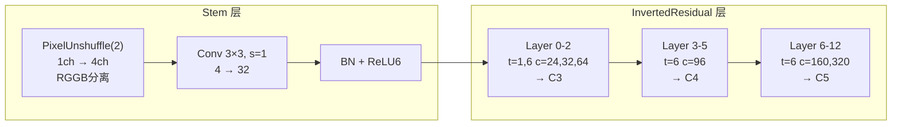
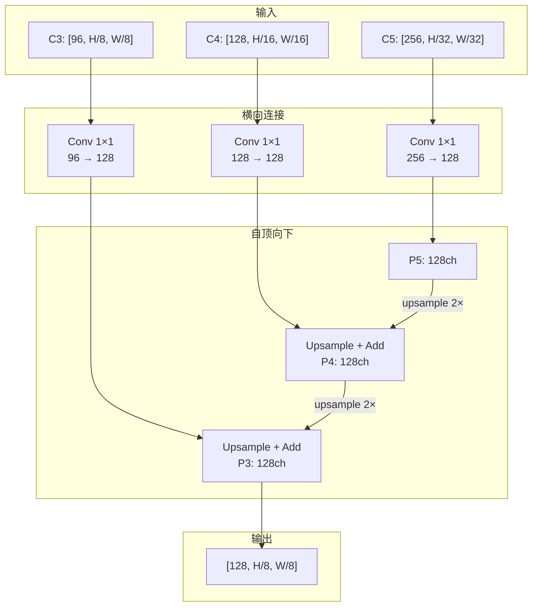
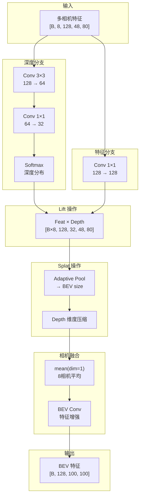
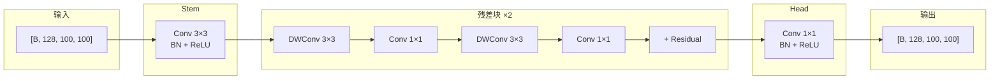
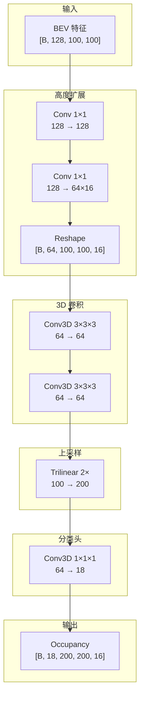

# Bayer Occupancy Network 架构文档

## 一、整体网络结构

### 1.1 网络流程图

```mermaid
flowchart TB
    subgraph Input["输入层"]
        I1["8× Bayer RAW<br/>[B, 8, 1, 384, 640]<br/>12-bit 单通道"]
    end

    subgraph Backbone["Backbone: BayerMobileNetV2"]
        B1["PixelUnshuffle(2)<br/>[B×8, 4, 192, 320]<br/>RGGB 分离"]
        B2["Stem Conv<br/>[B×8, 32, 192, 320]"]
        B3["InvRes Layers<br/>多尺度提取"]
        B4["C3: [B×8, 96, 48, 80]<br/>C4: [B×8, 128, 24, 40]<br/>C5: [B×8, 256, 12, 20]"]
    end

    subgraph Neck["Neck: LiteFPN"]
        N1["横向连接<br/>1×1 Conv 统一通道"]
        N2["自顶向下融合<br/>上采样 + 相加"]
        N3["输出特征<br/>[B×8, 128, 48, 80]"]
    end

    subgraph ViewTrans["View Transformer: LSS-Lite"]
        V1["DepthNet<br/>深度分布估计<br/>[B×8, 32, 48, 80]"]
        V2["特征提升<br/>Feat × Depth"]
        V3["BEV 池化<br/>[B, 8, 128, 100, 100]"]
        V4["多相机融合<br/>mean(dim=1)"]
        V5["BEV 特征<br/>[B, 128, 100, 100]"]
    end

    subgraph BEVEnc["BEV Encoder"]
        E1["Stem Conv<br/>[B, 128, 100, 100]"]
        E2["残差块 ×2<br/>深度可分离卷积"]
        E3["Head Conv<br/>[B, 128, 100, 100]"]
    end

    subgraph Decoder["Occ Decoder"]
        D1["Height MLP<br/>高度扩展<br/>[B, 64, 100, 100, 16]"]
        D2["3D Conv Block<br/>特征精炼"]
        D3["上采样<br/>100→200"]
        D4["分类头<br/>[B, 18, 200, 200, 16]"]
    end

    subgraph Output["输出层"]
        O1["Occupancy Logits<br/>[B, 18, 200, 200, 16]<br/>18类语义"]
    end

    I1 --> B1
    B1 --> B2
    B2 --> B3
    B3 --> B4
    B4 --> N1
    N1 --> N2
    N2 --> N3
    N3 --> V1
    V1 --> V2
    V2 --> V3
    V3 --> V4
    V4 --> V5
    V5 --> E1
    E1 --> E2
    E2 --> E3
    E3 --> D1
    D1 --> D2
    D2 --> D3
    D3 --> D4
    D4 --> O1

    style Input fill:#e1f5fe
    style Output fill:#c8e6c9
    style Backbone fill:#fff3e0
    style Neck fill:#fce4ec
    style ViewTrans fill:#f3e5f5
    style BEVEnc fill:#e8f5e9
    style Decoder fill:#fff8e1
```



### 1.2 数据流 Shape 变化

```
┌─────────────────────────────────────────────────────────────────────────────┐
│                           完整数据流                                         │
├─────────────────────────────────────────────────────────────────────────────┤
│                                                                              │
│  输入: [B, 8, 1, 384, 640]         8相机 Bayer RAW                          │
│           │                                                                  │
│           ▼ flatten(0,1)                                                     │
│        [B×8, 1, 384, 640]                                                    │
│           │                                                                  │
│           ▼ PixelUnshuffle(2)      RGGB 分离，分辨率减半                     │
│        [B×8, 4, 192, 320]                                                    │
│           │                                                                  │
│           ▼ Stem                                                             │
│        [B×8, 32, 192, 320]                                                   │
│           │                                                                  │
│           ▼ MobileNetV2 Layers                                               │
│        C3: [B×8, 96, 48, 80]       1/8 原图                                  │
│        C4: [B×8, 128, 24, 40]      1/16 原图                                 │
│        C5: [B×8, 256, 12, 20]      1/32 原图                                 │
│           │                                                                  │
│           ▼ FPN Neck                                                         │
│        [B×8, 128, 48, 80]          统一通道，最大分辨率                       │
│           │                                                                  │
│           ▼ reshape                                                          │
│        [B, 8, 128, 48, 80]         恢复相机维度                              │
│           │                                                                  │
│           ▼ View Transformer                                                 │
│        [B, 128, 100, 100]          BEV 特征                                  │
│           │                                                                  │
│           ▼ BEV Encoder                                                      │
│        [B, 128, 100, 100]          增强 BEV 特征                             │
│           │                                                                  │
│           ▼ Height Expansion                                                 │
│        [B, 64, 100, 100, 16]       2D → 3D                                   │
│           │                                                                  │
│           ▼ 3D Conv + Upsample                                               │
│        [B, 18, 200, 200, 16]       最终占用网格                              │
│                                                                              │
└─────────────────────────────────────────────────────────────────────────────┘
```

---

## 二、各子网络详细结构

### 2.1 Backbone: BayerMobileNetV2

#### 结构图



#### 结构列表

| 层名 | 输入 | 操作 | 输出 | 说明 |
|------|------|------|------|------|
| PixelUnshuffle | [B, 1, H, W] | 空间→通道重排 | [B, 4, H/2, W/2] | **核心**：RGGB 分离，避免跨颜色卷积 |
| Stem Conv | [B, 4, H/2, W/2] | Conv3×3, s=1 | [B, 32, H/2, W/2] | 初始特征提取 |
| Layer 0-2 | [B, 32, ...] | InvRes ×3 | [B, 96, H/8, W/8] | C3 输出，stride=2 在 Layer1 |
| Layer 3-5 | [B, 96, ...] | InvRes ×3 | [B, 128, H/16, W/16] | C4 输出 |
| Layer 6-12 | [B, 128, ...] | InvRes ×7 | [B, 256, H/32, W/32] | C5 输出 |

#### 设计特点

| 特点 | 说明 |
|------|------|
| **PixelUnshuffle 分离 RGGB** | 将 2×2 Bayer 单元转为 4 通道，卷积不跨颜色 |
| **Stem 不下采样** | PixelUnshuffle 已减半分辨率，Stem 保持 |
| **倒残差块** | MobileNetV2 标准结构，深度可分离卷积 |
| **多尺度输出** | C3/C4/C5 供 FPN 融合 |

---

### 2.2 Neck: LiteFPN

#### 结构图



#### 结构列表

| 层名 | 输入 | 操作 | 输出 |
|------|------|------|------|
| lateral_c5 | C5 [256, H/32, W/32] | Conv 1×1 | [128, H/32, W/32] |
| lateral_c4 | C4 [128, H/16, W/16] | Conv 1×1 | [128, H/16, W/16] |
| lateral_c3 | C3 [96, H/8, W/8] | Conv 1×1 | [128, H/8, W/8] |
| topdown_5→4 | P5 | Upsample + Add | P4 [128, H/16, W/16] |
| topdown_4→3 | P4 | Upsample + Add | P3 [128, H/8, W/8] |
| output | P3 | - | [128, 48, 80] |

#### 设计特点

| 特点 | 说明 |
|------|------|
| **轻量级** | 仅 1×1 卷积，无 3×3 平滑 |
| **统一通道** | 所有尺度统一到 128 通道 |
| **输出最大分辨率** | 使用 1/8 分辨率保留细节 |

---

### 2.3 View Transformer: LSS-Lite

#### 结构图



#### 结构列表

| 层名 | 输入 | 操作 | 输出 | 说明 |
|------|------|------|------|------|
| DepthNet | [B×8, 128, 48, 80] | Conv3×3→Conv1×1→Softmax | [B×8, 32, 48, 80] | 预测 32 个深度 bin 的概率 |
| FeatTransform | [B×8, 128, 48, 80] | Conv 1×1 | [B×8, 128, 48, 80] | 特征变换 |
| Lift | Feat, Depth | 外积 | [B×8, 128×32, 48, 80] | 特征提升到伪 3D |
| Splat | 3D Feat | AdaptivePool + Reduce | [B, 8, 128, 100, 100] | 投射到 BEV |
| Fuse | Multi-cam BEV | mean(dim=1) | [B, 128, 100, 100] | 简化融合 |
| BEVEncode | BEV | Conv 3×3 | [B, 128, 100, 100] | 空间增强 |

#### 设计特点

| 特点 | 说明 |
|------|------|
| **LSS 风格** | Lift-Splat-Shoot 简化版 |
| **软深度估计** | 32 个深度 bin，概率分布 |
| **简化几何** | ⚠️ 未使用真实相机内外参投影 |
| **均值融合** | ⚠️ 简单平均，可改进为注意力 |

---

### 2.4 BEV Encoder: LiteBEVEncoder

#### 结构图



#### 结构列表

| 层名 | 输入 | 操作 | 输出 |
|------|------|------|------|
| Stem | [B, 128, 100, 100] | Conv3×3 + BN + ReLU | [B, 128, 100, 100] |
| ResBlock ×2 | [B, 128, 100, 100] | DWConv→Conv1×1→DWConv→Conv1×1 + Skip | [B, 128, 100, 100] |
| Head | [B, 128, 100, 100] | Conv1×1 + BN + ReLU | [B, 128, 100, 100] |

#### 设计特点

| 特点 | 说明 |
|------|------|
| **深度可分离卷积** | 大幅减少参数量 |
| **残差连接** | 训练稳定性 |
| **保持分辨率** | 不改变 BEV 尺寸 |

---

### 2.5 Decoder: LiteOccDecoder

#### 结构图



#### 结构列表

| 层名 | 输入 | 操作 | 输出 | 说明 |
|------|------|------|------|------|
| Height MLP | [B, 128, 100, 100] | Conv1×1→Conv1×1 | [B, 64×16, 100, 100] | 预测每个高度层特征 |
| Reshape | [B, 1024, 100, 100] | view | [B, 64, 100, 100, 16] | 2D → 3D |
| Conv3D Block | [B, 64, 100, 100, 16] | Conv3D ×2 | [B, 64, 100, 100, 16] | 3D 特征精炼 |
| Upsample | [B, 64, 100, 100, 16] | Trilinear | [B, 64, 200, 200, 16] | 恢复空间分辨率 |
| Cls Head | [B, 64, 200, 200, 16] | Conv3D 1×1×1 | [B, 18, 200, 200, 16] | 语义分类 |

#### 设计特点

| 特点 | 说明 |
|------|------|
| **Height MLP** | 用 2D 卷积预测 Z 维度 |
| **轻量 3D Conv** | 仅 2 层 3D 卷积，减少计算 |
| **低分辨率计算** | 100×100 计算，200×200 输出 |

---

## 三、网络参数统计

### 3.1 各模块参数量

| 模块 | 参数量 | 占比 | 说明 |
|------|--------|------|------|
| **Backbone** | ~2.5M | 35% | MobileNetV2 主体 |
| **FPN** | ~0.3M | 4% | 轻量级融合 |
| **View Transformer** | ~0.5M | 7% | LSS-Lite |
| **BEV Encoder** | ~0.3M | 4% | 深度可分离卷积 |
| **Occ Decoder** | ~3.5M | 50% | 3D 卷积占主要 |
| **总计** | **~7.1M** | 100% | 轻量级设计 |

### 3.2 计算量估算 (FLOPs)

| 模块 | FLOPs | 说明 |
|------|-------|------|
| Backbone (×8 cam) | ~2.4G | 主要计算量 |
| FPN (×8 cam) | ~0.3G | 轻量 |
| View Transformer | ~0.8G | 深度估计 + 池化 |
| BEV Encoder | ~0.5G | 2D 卷积 |
| Occ Decoder | ~1.5G | 3D 卷积 |
| **总计** | **~5.5G** | 适合边缘部署 |

### 3.3 显存估算

| 配置 | Batch Size | 显存 |
|------|------------|------|
| 推理 | 1 | ~1.5 GB |
| 训练 (FP32) | 1 | ~4 GB |
| 训练 (AMP) | 2 | ~5 GB |
| 训练 (AMP) | 4 | ~8 GB |

---

## 四、设计意图与权衡

### 4.1 为什么选择这些设计？

| 设计选择 | 意图 | 权衡 |
|----------|------|------|
| **PixelUnshuffle** | 正确处理 Bayer RGGB | 分辨率减半，但信息无损 |
| **MobileNetV2** | 轻量级 Backbone | 精度略低于 ResNet |
| **LSS 简化版** | 避免 Attention 显存爆炸 | 未使用真实相机参数 |
| **均值融合** | 简单高效 | 损失空间位置信息 |
| **Height MLP** | 2D→3D 简洁实现 | 不如真 3D 表达力强 |
| **低分辨率 BEV** | 100×100 节省计算 | 上采样到 200×200 |

### 4.2 可改进方向

| 方向 | 当前 | 改进方案 | 预期收益 |
|------|------|---------|---------|
| 相机融合 | mean | 加权注意力 | +3-5% mIoU |
| 几何投影 | 无 | 使用真实内外参 | +5-10% mIoU |
| 深度监督 | 无 | LiDAR 深度监督 | +3% mIoU |
| 时序融合 | 无 | 时序 BEV 融合 | +2-3% mIoU |

---

## 五、网络配置参数

```python
# 默认配置
config = {
    # 输入
    'num_cameras': 8,
    'img_size': (384, 640),  # Bayer RAW
    
    # Backbone
    'backbone_width_mult': 1.0,
    
    # FPN
    'fpn_channels': 128,
    
    # View Transformer
    'num_depth_bins': 32,
    'd_bound': (2.0, 50.0, 1.5),  # min, max, step
    
    # BEV
    'bev_size': (100, 100),
    'x_bound': (-25.0, 25.0, 0.5),
    'y_bound': (-25.0, 25.0, 0.5),
    
    # Output
    'num_classes': 18,
    'grid_size': (200, 200, 16),
    
    # Decoder
    'hidden_channels': 64,
}
```

---

## 六、总结

### 网络优势

✅ **轻量级**：~7M 参数，~5.5G FLOPs  
✅ **Bayer 感知**：PixelUnshuffle 正确处理 RGGB  
✅ **端到端**：从 RAW 直接到 3D Occupancy  
✅ **低显存**：训练仅需 ~5GB (AMP, BS=2)  

### 网络局限

⚠️ **几何简化**：View Transformer 未使用真实相机参数  
⚠️ **融合粗糙**：多相机简单平均  
⚠️ **无时序**：单帧预测，无历史信息  

### 适用场景

- 资源受限的嵌入式部署
- 快速原型验证
- 作为更复杂模型的基线
