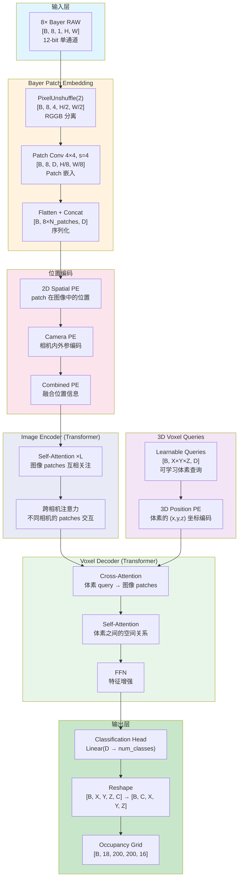
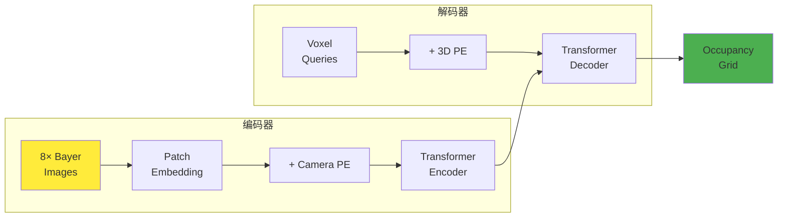
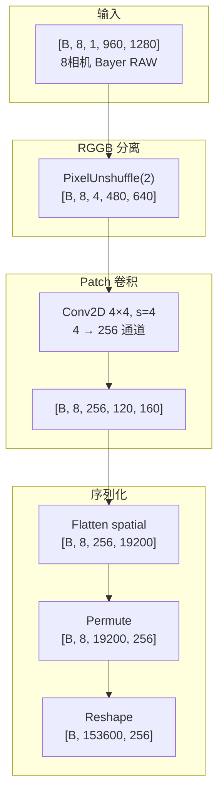
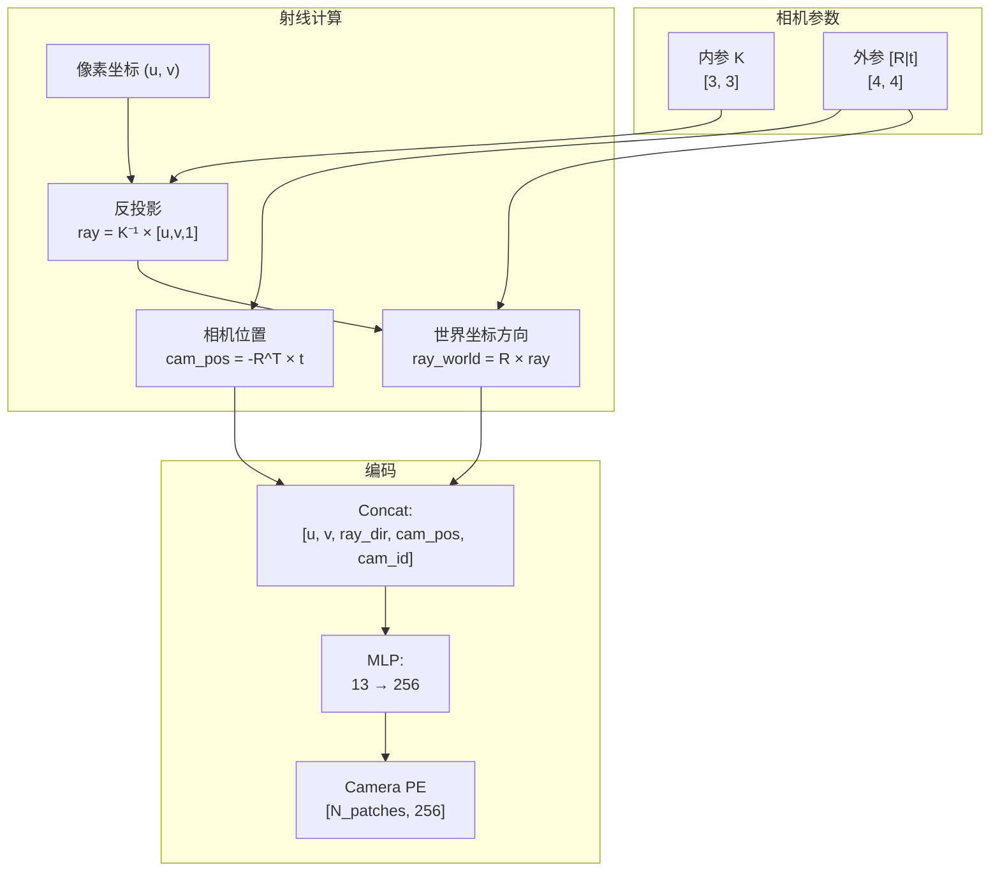
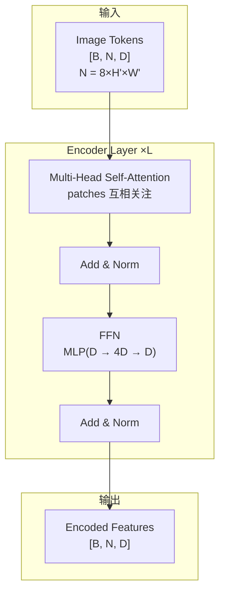
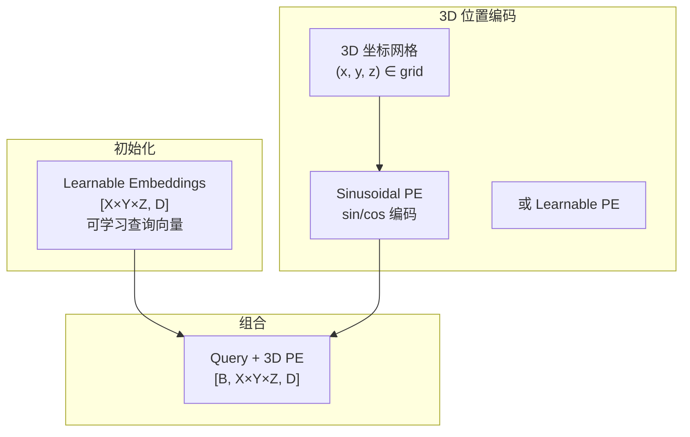
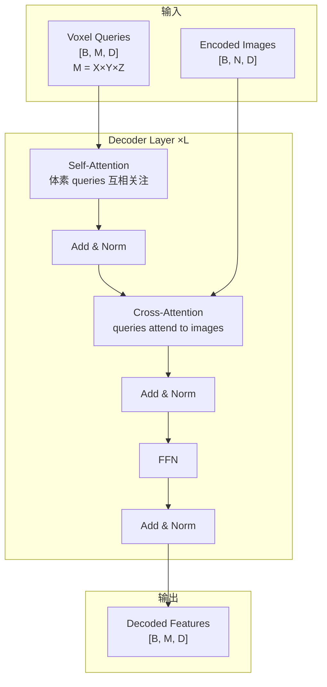
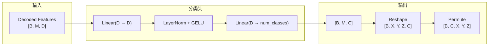

# 统一 Transformer Occupancy Network 设计文档

## 一、核心思想：图像到体素的翻译

### 1.1 翻译问题类比

```
┌─────────────────────────────────────────────────────────────────────────────┐
│                          翻译问题类比                                        │
├─────────────────────────────────────────────────────────────────────────────┤
│                                                                              │
│   机器翻译:                                                                  │
│   ┌─────────────────┐      ┌─────────────┐      ┌─────────────────┐        │
│   │ English Tokens  │ ──→  │ Transformer │ ──→  │ Chinese Tokens  │        │
│   │ "Hello World"   │      │             │      │ "你好 世界"      │        │
│   └─────────────────┘      └─────────────┘      └─────────────────┘        │
│         ↑                        ↑                      ↑                   │
│    词嵌入 + 位置编码         注意力机制            输出词汇表               │
│                                                                              │
│   ═══════════════════════════════════════════════════════════════════════   │
│                                                                              │
│   占用网络:                                                                  │
│   ┌─────────────────┐      ┌─────────────┐      ┌─────────────────┐        │
│   │ 8×Image Patches │ ──→  │ Transformer │ ──→  │ 3D Voxel Grid   │        │
│   │ (2D 像素序列)    │      │             │      │ (3D 体素序列)    │        │
│   └─────────────────┘      └─────────────┘      └─────────────────┘        │
│         ↑                        ↑                      ↑                   │
│   Patch嵌入 + 相机编码      Cross-Attention       18类语义词汇表            │
│                                                                              │
└─────────────────────────────────────────────────────────────────────────────┘
```

### 1.2 为什么这个类比成立？

| 翻译问题 | 占用网络 | 对应关系 |
|---------|---------|---------|
| 源语言词汇 | 图像像素/patches | 输入序列元素 |
| 目标语言词汇 | 体素单元 | 输出序列元素 |
| 词嵌入 | Patch Embedding | 将输入映射到特征空间 |
| 位置编码 | **相机位姿编码** | 告诉模型每个元素的位置 |
| Encoder | Image Encoder | 理解输入序列 |
| Decoder | Voxel Decoder | 生成输出序列 |
| Cross-Attention | 像素-体素注意力 | 建立输入输出的对应关系 |

### 1.3 相机参数 = 位置编码

```
┌─────────────────────────────────────────────────────────────────────────────┐
│                       相机参数作为位置编码                                    │
├─────────────────────────────────────────────────────────────────────────────┤
│                                                                              │
│   传统 Transformer 位置编码:                                                 │
│   ┌──────────────────────────────────────────────────────────┐              │
│   │  PE(pos) = sin(pos / 10000^(2i/d))  或  cos(...)         │              │
│   │  告诉模型: 这个 token 在序列中的位置是第 pos 个            │              │
│   └──────────────────────────────────────────────────────────┘              │
│                                                                              │
│   占用网络的"位置编码":                                                      │
│   ┌──────────────────────────────────────────────────────────┐              │
│   │  相机内参 K:  焦距、主点 → 像素到射线的映射               │              │
│   │  相机外参 [R|t]: 旋转、平移 → 射线在世界坐标系的方向       │              │
│   │                                                           │              │
│   │  组合起来: 每个像素 (u,v) → 世界坐标系中的一条射线        │              │
│   │  这就是该像素的"位置"！                                   │              │
│   └──────────────────────────────────────────────────────────┘              │
│                                                                              │
│   编码方式:                                                                  │
│   ┌──────────────────────────────────────────────────────────┐              │
│   │  CamPE(patch) = MLP([                                    │              │
│   │      u, v,           # 像素坐标                          │              │
│   │      ray_dir_x,      # 射线方向                          │              │
│   │      ray_dir_y,                                          │              │
│   │      ray_dir_z,                                          │              │
│   │      cam_pos_x,      # 相机位置                          │              │
│   │      cam_pos_y,                                          │              │
│   │      cam_pos_z,                                          │              │
│   │      cam_id          # 相机编号 (one-hot 或 embedding)   │              │
│   │  ])                                                      │              │
│   └──────────────────────────────────────────────────────────┘              │
│                                                                              │
└─────────────────────────────────────────────────────────────────────────────┘
```

---

## 二、网络整体架构

### 2.1 架构流程图



### 2.2 简化版架构图（核心流程）



---

## 三、各模块详细设计

### 3.1 Bayer Patch Embedding

#### 结构图



#### 结构表

| 层 | 输入 Shape | 操作 | 输出 Shape | 说明 |
|---|-----------|------|-----------|------|
| Input | - | - | [B, 8, 1, 960, 1280] | 8 相机 12-bit Bayer |
| PixelUnshuffle | [B, 8, 1, 960, 1280] | 2×2 重排 | [B, 8, 4, 480, 640] | RGGB 分离到 4 通道 |
| Patch Conv | [B, 8, 4, 480, 640] | Conv 4×4, s=4 | [B, 8, 256, 120, 160] | 每 4×4 像素 → 1 个 patch |
| Flatten | [B, 8, 256, 120, 160] | reshape | [B, 8, 19200, 256] | 每相机 19200 个 patches |
| Concat Cams | [B, 8, 19200, 256] | reshape | [B, 153600, 256] | 所有相机 patches 合并 |

#### 设计意图

```
为什么用 4×4 patch？

原始 Bayer:  [1, 960, 1280]
             ↓ PixelUnshuffle(2)
RGGB 4ch:   [4, 480, 640]
             ↓ Conv 4×4, s=4
Patches:    [256, 120, 160]

每个 patch 覆盖原图 8×8 像素区域
- 包含 2×2 个完整的 RGGB 单元
- 足够捕获局部纹理
- 序列长度可控: 120×160 = 19,200 patches/相机

总序列长度: 8 × 19,200 = 153,600
如果 D=256, 这对于 Transformer 来说太长了！

需要进一步降低：
方案 A: 更大的 patch (8×8) → 60×80 = 4,800 patches/相机 → 38,400 总
方案 B: 下采样后再 patch
方案 C: 使用分层 Transformer (Swin 风格)
```

### 3.2 Camera Position Encoding（核心创新）

#### 结构图



#### 结构表

| 组件 | 维度 | 说明 |
|-----|------|------|
| 像素坐标 | 2 | (u, v) 归一化到 [-1, 1] |
| 射线方向 | 3 | (dx, dy, dz) 单位向量 |
| 相机位置 | 3 | (cx, cy, cz) 世界坐标 |
| 相机 ID | 8 | one-hot 编码 |
| 输入总计 | 16 | 拼接所有信息 |
| MLP 输出 | D (256) | 位置编码维度 |

#### 设计意图

```
为什么需要这么复杂的位置编码？

传统 2D PE 只告诉模型: "这个 patch 在图像的 (x, y) 位置"
但这不够！因为:
- 同一个 (x, y) 在不同相机意味着完全不同的世界位置
- 广角镜头和窄角镜头的同一像素覆盖不同范围

相机 PE 告诉模型:
- "这个 patch 对应的射线指向世界坐标系的哪个方向"
- "这个相机在世界坐标系的什么位置"
- "这是哪个相机（前/后/左/右）"

这样模型才能正确地将 2D 像素关联到 3D 空间！
```

### 3.3 Transformer Encoder

#### 结构图



#### 结构表

| 层 | 输入 | 输出 | 参数 |
|---|------|------|------|
| Input | [B, N, D] | - | N=38400, D=256 |
| MHSA | [B, N, D] | [B, N, D] | heads=8, dim_head=32 |
| FFN | [B, N, D] | [B, N, D] | hidden=4D=1024 |
| Output | - | [B, N, D] | 与输入相同 |

#### 注意力优化

```
问题: N=38,400 太大，标准 attention O(N²) 不可行！

解决方案:

方案 A: 窗口注意力 (Swin Transformer 风格)
┌────────────────────────────────────────────────┐
│  每个 patch 只 attend to 局部窗口内的 patches    │
│  窗口大小: 7×7 或 8×8                           │
│  复杂度: O(N × window_size²)                   │
└────────────────────────────────────────────────┘

方案 B: 分层 attention
┌────────────────────────────────────────────────┐
│  Level 1: 相机内 attention (每相机独立)         │
│  Level 2: 相机间 attention (用下采样的特征)     │
└────────────────────────────────────────────────┘

方案 C: 可变形注意力 (Deformable Attention)
┌────────────────────────────────────────────────┐
│  每个 query 只 attend to K 个学习的参考点       │
│  K=4~8, 复杂度: O(N × K)                       │
└────────────────────────────────────────────────┘

推荐: 方案 B + C 组合
```

### 3.4 3D Voxel Queries

#### 结构图



#### 结构表

| 组件 | Shape | 说明 |
|-----|-------|------|
| Voxel Queries | [X×Y×Z, D] | 可学习参数，代表每个体素的"问题" |
| 3D Position | [X×Y×Z, 3] | 每个体素的 (x, y, z) 坐标 |
| 3D PE | [X×Y×Z, D] | 位置编码后的坐标 |
| Combined | [B, X×Y×Z, D] | 最终的体素查询 |

#### 设计意图

```
为什么用 Learnable Queries？

类比 DETR:
- DETR 用 100 个 learnable queries 来检测 100 个物体
- 每个 query "负责"检测某种类型/位置的物体

占用网络:
- 用 X×Y×Z 个 queries，每个对应一个体素
- Query 学习"如何从图像中提取该位置的信息"
- 3D PE 告诉 query "你负责的是 3D 空间的哪个位置"

Query 的含义:
"我是 (10, 20, 5) 位置的体素，请告诉我这里有什么物体"
↓ Cross-Attention
"我看到前相机的某些像素显示这里是一辆车"
```

### 3.5 Transformer Decoder

#### 结构图



#### 结构表

| 层 | Query | Key/Value | 输出 | 说明 |
|---|-------|-----------|------|------|
| Self-Attn | [B, M, D] | [B, M, D] | [B, M, D] | 体素间空间关系 |
| Cross-Attn | [B, M, D] | [B, N, D] | [B, M, D] | 从图像提取信息 |
| FFN | [B, M, D] | - | [B, M, D] | 特征增强 |

#### Cross-Attention 的几何意义

```
Cross-Attention 做了什么？

Query: 体素 (x=10, y=20, z=5) 的查询向量
Key:   所有图像 patches 的特征
Value: 所有图像 patches 的特征

Attention 权重 = softmax(Q × K^T / √d)

权重高的 patches 是:
- 包含该体素投影的 patches
- 与该体素位置语义相关的 patches

这自动学习了"哪些像素对应哪些体素"！
不需要显式的几何投影。

但！显式几何可以帮助 attention:
- 通过 position encoding 提供几何先验
- 通过 attention bias 引导关注正确的区域
```

### 3.6 Classification Head

#### 结构图



---

## 四、完整网络 Shape 流转表

### 4.1 配置参数

```python
# 输入配置
B = 2              # Batch size
N_cam = 8          # 相机数量
H, W = 960, 1280   # 原始图像尺寸
D = 256            # 特征维度

# Patch 配置
patch_size = 8     # 在 PixelUnshuffle 后的 patch 大小
# PixelUnshuffle(2) 后: 480×640
# Patch 后: 60×80 = 4,800 patches/相机
N_patches_per_cam = 4800
N_total_patches = N_cam * N_patches_per_cam  # 38,400

# 输出配置
X, Y, Z = 200, 200, 16  # 体素网格
M = X * Y * Z           # 640,000 体素
num_classes = 18        # 语义类别
```

### 4.2 完整 Shape 流转

| 阶段 | 操作 | 输入 Shape | 输出 Shape |
|------|------|-----------|-----------|
| **输入** | - | - | [B, 8, 1, 960, 1280] |
| **Bayer Embed** | PixelUnshuffle(2) | [B, 8, 1, 960, 1280] | [B, 8, 4, 480, 640] |
| | Patch Conv 8×8 | [B, 8, 4, 480, 640] | [B, 8, 256, 60, 80] |
| | Flatten | [B, 8, 256, 60, 80] | [B, 8, 4800, 256] |
| | Concat Cams | [B, 8, 4800, 256] | [B, 38400, 256] |
| **Position Enc** | Camera PE | [B, 38400, 256] | [B, 38400, 256] |
| | Add PE | [B, 38400, 256] × 2 | [B, 38400, 256] |
| **Encoder** | Transformer ×6 | [B, 38400, 256] | [B, 38400, 256] |
| **Voxel Query** | Init Queries | - | [640000, 256] |
| | 3D PE | [640000, 256] | [640000, 256] |
| | Expand Batch | [640000, 256] | [B, 640000, 256] |
| **Decoder** | Transformer ×6 | Q:[B,640000,256], KV:[B,38400,256] | [B, 640000, 256] |
| **Head** | Linear | [B, 640000, 256] | [B, 640000, 18] |
| | Reshape | [B, 640000, 18] | [B, 200, 200, 16, 18] |
| | Permute | [B, 200, 200, 16, 18] | [B, 18, 200, 200, 16] |

---

## 五、计算复杂度分析

### 5.1 问题：序列太长！

```
标准 Transformer Attention 复杂度: O(N²)

Encoder:
  N = 38,400
  N² = 1.47 × 10⁹  ← 不可行！

Decoder Cross-Attention:
  Query: M = 640,000
  Key:   N = 38,400
  M × N = 2.46 × 10¹⁰  ← 完全不可行！
```

### 5.2 解决方案

```
┌─────────────────────────────────────────────────────────────────────────────┐
│                        序列长度优化方案                                      │
├─────────────────────────────────────────────────────────────────────────────┤
│                                                                              │
│  方案 1: 更大的 Patch（推荐）                                                │
│  ──────────────────────────────────────────────────────                     │
│  Patch size: 8 → 16 (在 PixelUnshuffle 后)                                  │
│  Patches/cam: 4800 → 1200                                                   │
│  Total: 9,600 patches                                                       │
│  Encoder O(N²) = 9.2 × 10⁷ ← 可行                                           │
│                                                                              │
│  ─────────────────────────────────────────────────────────────────────────  │
│                                                                              │
│  方案 2: 降低体素分辨率 + 上采样                                             │
│  ──────────────────────────────────────────────────────                     │
│  Query 阶段: 50×50×8 = 20,000 体素                                          │
│  Cross-Attn: 20,000 × 9,600 = 1.92 × 10⁸ ← 可行                            │
│  上采样: 50×50×8 → 200×200×16                                               │
│                                                                              │
│  ─────────────────────────────────────────────────────────────────────────  │
│                                                                              │
│  方案 3: 可变形注意力 (Deformable Attention)                                │
│  ──────────────────────────────────────────────────────                     │
│  每个 Query 只 attend to K=4 个参考点                                        │
│  复杂度: O(M × K) = 640,000 × 4 = 2.56 × 10⁶ ← 非常可行                    │
│                                                                              │
│  ─────────────────────────────────────────────────────────────────────────  │
│                                                                              │
│  方案 4: 分层 Transformer                                                   │
│  ──────────────────────────────────────────────────────                     │
│  Level 1: 高分辨率特征，窗口注意力                                           │
│  Level 2: 低分辨率特征，全局注意力                                           │
│  逐层上采样解码                                                              │
│                                                                              │
└─────────────────────────────────────────────────────────────────────────────┘
```

### 5.3 推荐配置

```python
# 实用配置（平衡效率和精度）
config = {
    # Patch
    'patch_size': 16,           # 较大 patch 减少序列长度
    'embed_dim': 256,
    
    # Encoder
    'encoder_layers': 6,
    'encoder_heads': 8,
    'use_window_attn': True,    # 窗口注意力
    'window_size': 8,
    
    # Decoder
    'decoder_layers': 6,
    'decoder_heads': 8,
    'use_deformable': True,     # 可变形注意力
    'num_ref_points': 4,
    
    # Output
    'voxel_query_size': (50, 50, 8),  # 低分辨率 query
    'upsample_to': (200, 200, 16),    # 上采样到目标
}
```

---

## 六、与当前架构对比

### 6.1 架构对比

```
┌─────────────────────────────────────────────────────────────────────────────┐
│                          架构对比                                            │
├─────────────────────────────────────────────────────────────────────────────┤
│                                                                              │
│  当前架构 (多模块):                                                          │
│  ┌─────────┐   ┌─────┐   ┌─────────────┐   ┌───────────┐   ┌─────────┐     │
│  │Backbone │ → │ FPN │ → │ViewTransform│ → │BEV Encoder│ → │3D Decoder│     │
│  │MobileV2 │   │     │   │   (LSS)     │   │           │   │          │     │
│  └─────────┘   └─────┘   └─────────────┘   └───────────┘   └─────────┘     │
│       ↓           ↓            ↓                ↓              ↓            │
│    CNN 特征   多尺度融合   显式深度+投影     2D 卷积        3D 卷积         │
│                                                                              │
│  ═══════════════════════════════════════════════════════════════════════════│
│                                                                              │
│  统一 Transformer:                                                           │
│  ┌─────────────────┐   ┌─────────────────┐   ┌─────────────────────┐       │
│  │  Patch Embed    │ → │    Encoder      │ → │      Decoder        │       │
│  │  + Camera PE    │   │  (Self-Attn)    │   │ (Cross + Self-Attn) │       │
│  └─────────────────┘   └─────────────────┘   └─────────────────────┘       │
│       ↓                       ↓                       ↓                     │
│   线性嵌入+位置            全局注意力              直接生成体素             │
│                                                                              │
└─────────────────────────────────────────────────────────────────────────────┘
```

### 6.2 优劣对比

| 方面 | 当前架构 (CNN+LSS) | 统一 Transformer |
|------|-------------------|-----------------|
| **优势** | | |
| 计算效率 | ✅ CNN 高效 | ❌ Attention O(N²) |
| 几何先验 | ✅ 显式深度估计 | ⚠️ 需要学习 |
| 内存占用 | ✅ 较小 | ❌ 较大 |
| 训练难度 | ✅ 较容易 | ❌ 需要大数据 |
| **劣势** | | |
| 设计复杂度 | ❌ 多模块耦合 | ✅ 统一架构 |
| 全局建模 | ❌ 局部感受野 | ✅ 全局注意力 |
| 跨相机关联 | ❌ 简单融合 | ✅ 显式交互 |
| 端到端学习 | ❌ 分阶段 | ✅ 完全端到端 |

### 6.3 建议

```
实际选择取决于:

1. 数据量
   - 小数据集 (<50k): 用当前 CNN+LSS 架构
   - 大数据集 (>500k): 统一 Transformer 更有潜力

2. 计算资源
   - 训练: Transformer 需要更多 GPU 内存和时间
   - 推理: 优化后的 Transformer 可以很快

3. 精度要求
   - 高精度: Transformer 通常上限更高
   - 实时性: CNN 更容易部署

推荐路线:
1. 先用当前架构验证 pipeline
2. 数据充足后迁移到统一 Transformer
3. 或者混合: CNN Backbone + Transformer Decoder
```

---

## 七、实现建议

### 7.1 渐进式实现路线

```
Phase 1: 混合架构（推荐先实现）
┌────────────────────────────────────────────────────────────┐
│  保留 CNN Backbone → Transformer Decoder                   │
│  - Backbone: 当前的 BayerMobileNetV2                       │
│  - FPN: 保留                                               │
│  - Decoder: 换成 Transformer + Voxel Queries              │
└────────────────────────────────────────────────────────────┘

Phase 2: 纯 Transformer
┌────────────────────────────────────────────────────────────┐
│  - 替换 Backbone 为 Patch Embedding                        │
│  - 添加 Camera Position Encoding                           │
│  - 全 Transformer 编码解码                                 │
└────────────────────────────────────────────────────────────┘
```

### 7.2 关键实现挑战

```
1. 序列长度
   - 使用窗口注意力 / 可变形注意力
   - 或分层设计

2. 位置编码
   - 正确实现相机射线计算
   - 与 Transformer 维度匹配

3. 训练稳定性
   - LayerNorm 替代 BatchNorm
   - 预训练初始化
   - 渐进式训练

4. 内存优化
   - 梯度检查点
   - 混合精度
   - 分块注意力
```

---

## 八、总结

### 核心洞察

```
┌─────────────────────────────────────────────────────────────────────────────┐
│                                                                              │
│  多视角 2D → 3D 体素 = 序列到序列翻译                                        │
│                                                                              │
│  相机参数 = 位置编码 (告诉模型像素在 3D 空间的位置)                          │
│                                                                              │
│  Cross-Attention = 学习像素-体素对应关系                                     │
│                                                                              │
└─────────────────────────────────────────────────────────────────────────────┘
```

### 设计要点

| 组件 | 作用 | 关键设计 |
|-----|------|---------|
| Patch Embedding | 图像序列化 | PixelUnshuffle + Conv |
| Camera PE | 几何先验 | 射线方向 + 相机位置 |
| Encoder | 图像理解 | Self-Attention (窗口/分层) |
| Voxel Queries | 体素表示 | Learnable + 3D PE |
| Decoder | 体素生成 | Cross-Attention (可变形) |

### 推荐配置

```python
# 实用配置
{
    'embed_dim': 256,
    'patch_size': 16,           # 控制序列长度
    'encoder_layers': 6,
    'decoder_layers': 6,
    'use_deformable_attn': True,
    'voxel_query_size': (50, 50, 8),
    'output_size': (200, 200, 16),
}

# 预计参数: ~30M
# 预计显存: ~8GB (BS=2, AMP)
```