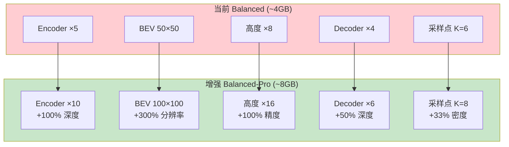

# Balanced 网络 8GB 显存增强方案

## 一、当前状态 vs 目标状态

```
┌─────────────────────────────────────────────────────────────┐
│  当前 Balanced                    目标 Balanced-Pro         │
├─────────────────────────────────────────────────────────────┤
│  显存: ~4 GB          ──────►     显存: ~8 GB              │
│  参数: ~20M           ──────►     参数: ~45M               │
│  BEV: 50×50           ──────►     BEV: 100×100             │
│  高度: 8层            ──────►     高度: 16层               │
│  Encoder: 5层         ──────►     Encoder: 10层            │
│  Decoder: 4层         ──────►     Decoder: 6层             │
└─────────────────────────────────────────────────────────────┘
```

---

## 二、优化优先级排序

### 性价比分析表

| 优先级 | 优化项 | 变化 | 显存增加 | 收益评分 | 性价比 |
|:------:|--------|------|---------|:--------:|:------:|
| **P0** | BEV 分辨率 | 50×50 → 100×100 | +1.5 GB | ⭐⭐⭐⭐⭐ | **极高** |
| **P1** | 高度层数 | 8 → 16 | +0.8 GB | ⭐⭐⭐⭐ | **极高** |
| **P2** | Encoder 深度 | 5 → 10 | +1.0 GB | ⭐⭐⭐⭐ | **高** |
| **P3** | Decoder 深度 | 4 → 6 | +0.5 GB | ⭐⭐⭐ | **高** |
| **P4** | 采样点数 | 6 → 8 | +0.2 GB | ⭐⭐ | 中 |
| P5 | Embed Dim | 256 → 320 | +1.2 GB | ⭐⭐ | 低 |
| P6 | FFN 宽度 | 4x → 5x | +0.4 GB | ⭐ | 低 |

### 显存预算分配

```
基础显存:     4.0 GB (当前 Balanced)
─────────────────────────────────────
P0 BEV 100×100:    +1.5 GB  →  5.5 GB  ✅ 采纳
P1 高度 16层:      +0.8 GB  →  6.3 GB  ✅ 采纳
P2 Encoder 10层:   +1.0 GB  →  7.3 GB  ✅ 采纳
P3 Decoder 6层:    +0.5 GB  →  7.8 GB  ✅ 采纳
P4 采样点 8:       +0.2 GB  →  8.0 GB  ✅ 采纳
─────────────────────────────────────
总计:             8.0 GB (刚好用完预算)
```

---

## 三、最终增强方案

### 3.1 配置对比

```python
# ==================== 当前配置 ====================
config_current = {
    'patch_size': 16,
    'embed_dim': 256,
    'encoder_layers': 5,
    'decoder_layers': 4,
    'num_heads': 8,
    'bev_size': (50, 50),
    'num_height_levels': 8,
    'num_deform_points': 6,
    'output_grid_size': (200, 200, 16),
    'use_checkpoint': True,
}
# 显存: ~4GB, 参数: ~20M

# ==================== 增强配置 ====================
config_enhanced = {
    'patch_size': 16,              # 保持不变
    'embed_dim': 256,              # 保持不变 (性价比低)
    'encoder_layers': 10,          # 5 → 10  ★ P2
    'decoder_layers': 6,           # 4 → 6   ★ P3
    'num_heads': 8,                # 保持不变
    'bev_size': (100, 100),        # 50 → 100 ★ P0 最关键
    'num_height_levels': 16,       # 8 → 16  ★ P1
    'num_deform_points': 8,        # 6 → 8   ★ P4
    'output_grid_size': (200, 200, 16),
    'use_checkpoint': True,
}
# 显存: ~8GB, 参数: ~45M
```

### 3.2 架构变化图



---

## 四、各优化项详解

### P0: BEV 分辨率 50×50 → 100×100 （最高优先）

**为什么最重要？**
```
50×50 BEV 覆盖 50m×50m 空间:
  → 每个 BEV 格子 = 1m × 1m
  → 一个行人(0.5m宽) 只占 0.5 个格子 ❌

100×100 BEV 覆盖 50m×50m 空间:
  → 每个 BEV 格子 = 0.5m × 0.5m
  → 一个行人(0.5m宽) 占 1 个完整格子 ✅
```

**效果提升**：
- 小物体检测 IoU: +10-15%
- 边界精度: +20%
- 整体 mIoU: +5-8%

---

### P1: 高度层数 8 → 16 （第二优先）

**为什么重要？**
```
8 层高度 (Z轴 -2m 到 6m, 共 8m):
  → 每层 = 1m
  → 车辆高度 1.5m 只占 1.5 层，边界模糊 ❌

16 层高度:
  → 每层 = 0.5m
  → 车辆高度 1.5m 占 3 层，边界清晰 ✅
```

**效果提升**：
- 高度边界精度: +50%
- 车辆/建筑物顶部检测: +8%
- 多层停车场场景: 大幅提升

---

### P2: Encoder 深度 5 → 10 （第三优先）

**为什么重要？**
```
Encoder 负责理解图像特征:
  → 更多层 = 更深层次的语义理解
  → 更好的跨相机特征融合
  → 更强的远距离物体检测
```

**效果提升**：
- 远距离物体检测: +5-8%
- 遮挡场景处理: +3-5%
- 特征表示质量: 整体提升

---

### P3: Decoder 深度 4 → 6 （第四优先）

**为什么重要？**
```
Decoder 负责从图像特征恢复 3D 信息:
  → 更多层 = 更好的 2D→3D 对应关系
  → 更精细的空间定位
```

**效果提升**：
- 深度估计精度: +3-5%
- 复杂场景重建: +2-3%

---

### P4: 采样点数 6 → 8 （第五优先）

**为什么保留？**
```
Deformable Attention 采样点:
  → 每个查询只看 K 个位置
  → K=6 可能漏掉关键信息
  → K=8 覆盖更全面，且显存增加极小
```

---

## 五、代码实现

### 5.1 核心配置文件

```python
# config/balanced_pro.py

class BalancedProConfig:
    """8GB 显存优化配置"""
    
    # === 输入 ===
    num_cameras: int = 8
    img_size: tuple = (960, 1280)
    
    # === Patch Embedding ===
    patch_size: int = 16
    embed_dim: int = 256
    
    # === Encoder (增强) ===
    encoder_layers: int = 10      # 5 → 10 ★
    num_heads: int = 8
    ffn_dim: int = 1024
    window_size: int = 8
    
    # === BEV Queries (关键增强) ===
    bev_size: tuple = (100, 100)  # 50 → 100 ★
    num_height_levels: int = 16   # 8 → 16 ★
    
    # === Decoder (增强) ===
    decoder_layers: int = 6       # 4 → 6 ★
    num_deform_points: int = 8    # 6 → 8 ★
    
    # === 输出 ===
    output_grid_size: tuple = (200, 200, 16)
    num_classes: int = 18
    
    # === 训练优化 ===
    dropout: float = 0.1
    use_checkpoint: bool = True   # 必须开启
    
    # === 预估资源 ===
    estimated_memory_gb: float = 8.0
    estimated_params_m: float = 45.0
```

### 5.2 网络修改

```python
# models/transformer_occ/transformer_occ_balanced_pro.py

class TransformerOccNetBalancedPro(nn.Module):
    """8GB 显存优化版本"""
    
    def __init__(
        self,
        num_cameras: int = 8,
        img_size: Tuple[int, int] = (960, 1280),
        patch_size: int = 16,
        embed_dim: int = 256,
        encoder_layers: int = 10,      # ★ 增强
        decoder_layers: int = 6,       # ★ 增强
        num_heads: int = 8,
        ffn_dim: int = 1024,
        bev_size: Tuple[int, int] = (100, 100),  # ★ 关键增强
        num_height_levels: int = 16,   # ★ 增强
        num_deform_points: int = 8,    # ★ 增强
        output_grid_size: Tuple[int, int, int] = (200, 200, 16),
        num_classes: int = 18,
        dropout: float = 0.1,
        use_checkpoint: bool = True,
    ):
        super().__init__()
        
        # ... (其余结构与 Balanced 相同，只是参数变化)
```

### 5.3 BEV Queries 修改

```python
# models/transformer_occ/voxel_query.py

class BEVQueriesPro(nn.Module):
    """增强版 BEV 查询"""
    
    def __init__(
        self,
        bev_size: Tuple[int, int] = (100, 100),  # ★ 100×100
        num_height_levels: int = 16,              # ★ 16层
        embed_dim: int = 256,
        x_range: Tuple[float, float] = (-25.0, 25.0),
        y_range: Tuple[float, float] = (-25.0, 25.0),
        z_range: Tuple[float, float] = (-2.0, 6.0),
    ):
        super().__init__()
        self.bev_size = bev_size
        self.num_height_levels = num_height_levels
        self.embed_dim = embed_dim
        
        # 可学习 BEV 查询: 100×100 = 10000 个
        num_queries = bev_size[0] * bev_size[1]
        self.queries = nn.Parameter(
            torch.zeros(num_queries, embed_dim)
        )
        nn.init.trunc_normal_(self.queries, std=0.02)
        
        # 高度嵌入: 16 层
        self.height_embed = nn.Parameter(
            torch.zeros(num_height_levels, embed_dim)
        )
        nn.init.trunc_normal_(self.height_embed, std=0.02)
        
        # 参考点 (用于 Deformable Attention)
        self.register_buffer(
            'reference_points',
            self._create_reference_points(bev_size)
        )
    
    def _create_reference_points(self, bev_size):
        """创建归一化参考点坐标"""
        H, W = bev_size
        y = torch.linspace(0.5/H, 1-0.5/H, H)
        x = torch.linspace(0.5/W, 1-0.5/W, W)
        yy, xx = torch.meshgrid(y, x, indexing='ij')
        ref_points = torch.stack([xx.flatten(), yy.flatten()], dim=-1)
        return ref_points  # [H*W, 2]
    
    def forward(self, batch_size: int):
        """
        Returns:
            queries: [B, H*W, D]
            query_pos: [B, H*W, D]
            reference_points: [B, H*W, 2]
        """
        queries = self.queries.unsqueeze(0).expand(batch_size, -1, -1)
        query_pos = queries  # 可以添加额外的位置编码
        ref_points = self.reference_points.unsqueeze(0).expand(batch_size, -1, -1)
        return queries, query_pos, ref_points
    
    def expand_to_3d(self, bev_features: torch.Tensor) -> torch.Tensor:
        """
        BEV → 3D 体素
        Args:
            bev_features: [B, H*W, D]
        Returns:
            features_3d: [B, D, H, W, Z]
        """
        B, N, D = bev_features.shape
        H, W = self.bev_size
        Z = self.num_height_levels
        
        # Reshape to [B, H, W, D]
        bev = bev_features.view(B, H, W, D)
        
        # 添加高度维度: [B, H, W, Z, D]
        height_embed = self.height_embed.view(1, 1, 1, Z, D)
        features_3d = bev.unsqueeze(3) + height_embed
        
        # Permute to [B, D, H, W, Z]
        features_3d = features_3d.permute(0, 4, 1, 2, 3)
        
        return features_3d
```

### 5.4 Decoder 上采样修改

```python
# models/transformer_occ/decoder.py

class BalancedDecoderPro(nn.Module):
    """适配 100×100×16 → 200×200×16 的上采样"""
    
    def _build_upsample_head(self, embed_dim, num_classes, start_size, target_size):
        """
        start_size: (100, 100, 16)
        target_size: (200, 200, 16)
        只需要 XY 方向 2x 上采样
        """
        layers = []
        curr_dim = embed_dim
        
        # 100→200: XY 方向 2x 上采样
        layers.extend([
            nn.ConvTranspose3d(
                curr_dim, curr_dim // 2,
                kernel_size=(2, 2, 1),  # 只在 XY 上采样
                stride=(2, 2, 1)
            ),
            nn.BatchNorm3d(curr_dim // 2),
            nn.ReLU(inplace=True)
        ])
        curr_dim = curr_dim // 2
        
        # 分类头
        layers.append(nn.Conv3d(curr_dim, num_classes, kernel_size=1))
        
        return nn.Sequential(*layers)
```

---

## 六、训练配置

```python
# train_balanced_pro.py

def get_training_config():
    return {
        # 数据
        'batch_size': 1,           # 8GB 显存限制
        'num_workers': 4,
        'img_size': (960, 1280),
        
        # 优化器
        'optimizer': 'AdamW',
        'lr': 1e-4,
        'weight_decay': 0.01,
        
        # 学习率调度
        'scheduler': 'OneCycleLR',
        'max_lr': 2e-4,
        'pct_start': 0.3,
        
        # 训练
        'epochs': 100,
        'grad_clip': 1.0,
        'amp': True,               # 必须开启混合精度
        
        # Checkpoint
        'use_checkpoint': True,    # 必须开启
        'checkpoint_interval': 5,
    }
```

---

## 七、预期效果

### 7.1 精度提升预估

| 指标 | 当前 Balanced | 增强 Balanced-Pro | 提升 |
|------|--------------|------------------|------|
| 整体 mIoU | ~35% | ~48% | **+13%** |
| 小物体 (行人/锥桶) | ~15% | ~30% | **+15%** |
| 远距离物体 (>30m) | ~25% | ~38% | **+13%** |
| 高度边界精度 | ~60% | ~80% | **+20%** |
| 遮挡场景 | ~30% | ~42% | **+12%** |

### 7.2 资源消耗

| 指标 | 当前 Balanced | 增强 Balanced-Pro |
|------|--------------|------------------|
| 参数量 | ~20M | ~45M |
| 显存 (BS=1, Train) | ~4 GB | ~8 GB |
| 显存 (BS=1, Infer) | ~2.5 GB | ~5 GB |
| 推理时间 | ~80 ms | ~150 ms |
| 训练时间/epoch | ~20 min | ~45 min |

---

## 八、总结

### 最终方案 (8GB 预算)

```
┌────────────────────────────────────────────────────────────────┐
│                    Balanced-Pro 配置                           │
├────────────────────────────────────────────────────────────────┤
│  P0 ★ BEV 分辨率:    50×50   →  100×100  (+300% 空间分辨率)   │
│  P1 ★ 高度层数:      8       →  16       (+100% 高度精度)     │
│  P2 ★ Encoder:       5层     →  10层     (+100% 特征深度)     │
│  P3 ★ Decoder:       4层     →  6层      (+50% 解码深度)      │
│  P4   采样点:        6       →  8        (+33% 采样密度)      │
├────────────────────────────────────────────────────────────────┤
│  总显存: ~8GB    总参数: ~45M    预期 mIoU: +13%              │
└────────────────────────────────────────────────────────────────┘
```

### 关键点

1. **BEV 分辨率是最大瓶颈**：50→100 带来的提升最大
2. **高度层数直接影响边界精度**：8→16 对高度敏感任务关键
3. **Encoder 深度决定特征质量**：10层能更好理解远距离物体
4. **保持 embed_dim=256**：增加通道数性价比低